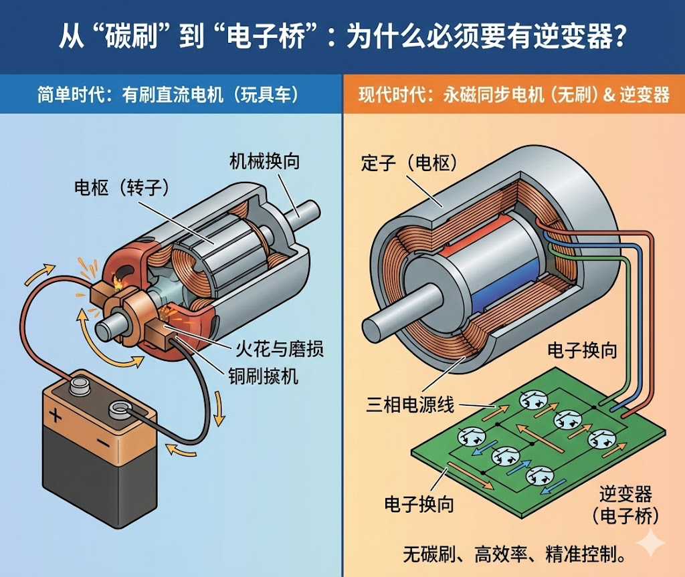
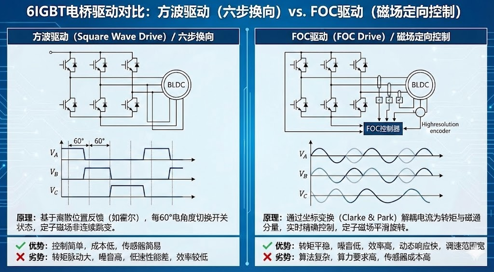
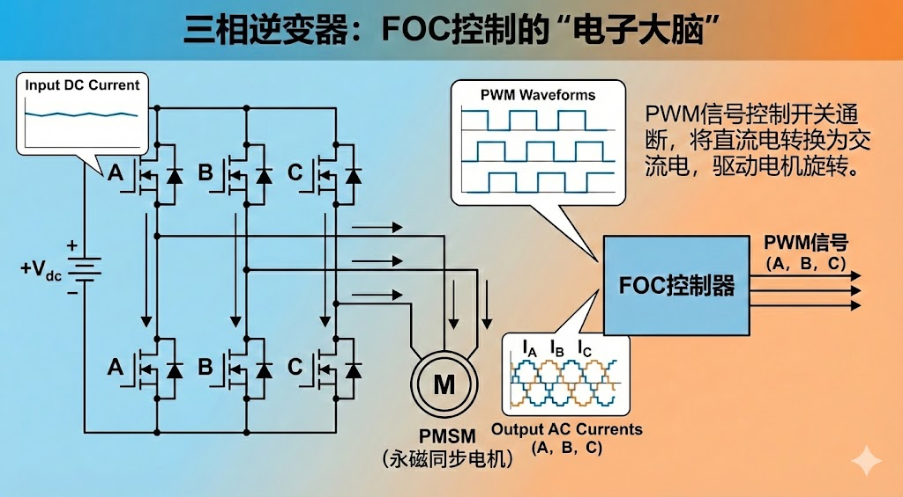
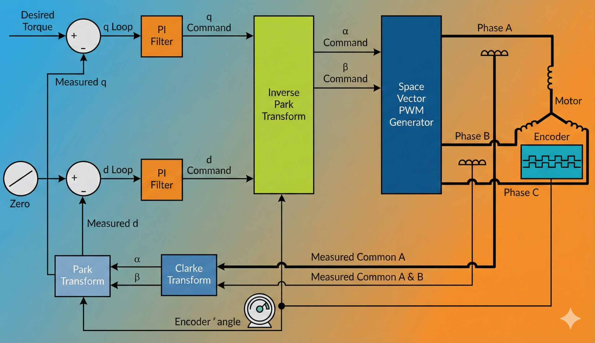
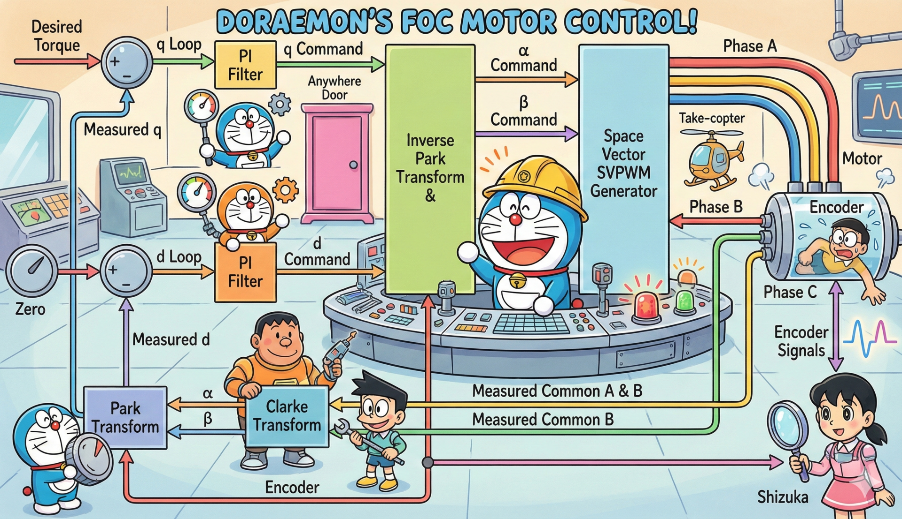
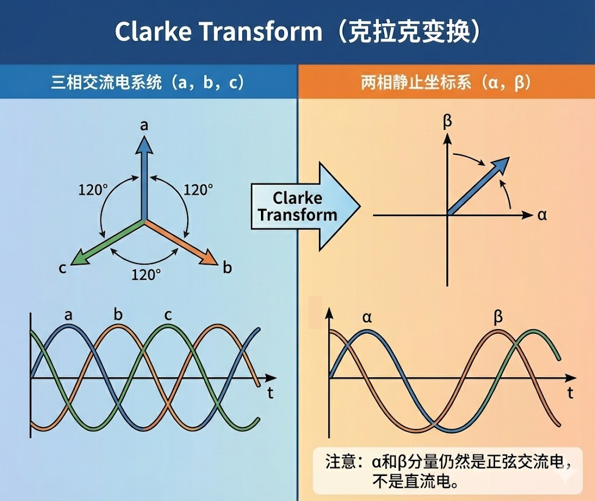
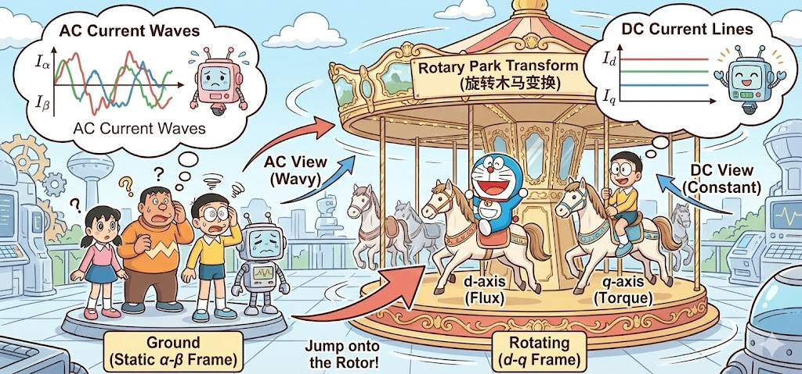
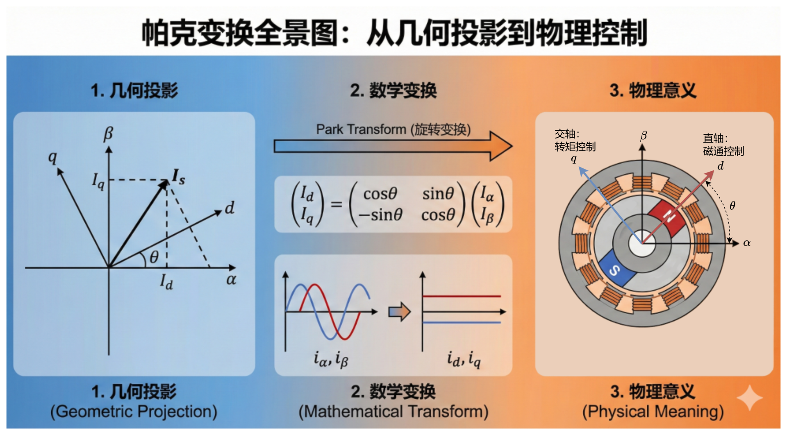

# FOC 就是把交流当直流使？老列带你捅破这层窗户纸

你好！我是**老列**。👋

咱们上一篇聊了那些高大上的航空电机硬件设计，算是把“肉体”构造摸了一遍（筋骨还放在后头吧）。今天，咱们得给这具钢铁躯壳注入“灵魂”——**FOC（磁场定向控制）**。⚡

说实话，当年（前两天）我刚接触 FOC 的时候，也被满屏的坐标变换、SVPWM、PI 参数整定搞得头大。全是英文缩写和数学公式，看着就想合上书去睡大觉。但没办法，想让电机转得顺滑、安静、力大无穷，这一关必须过。

最近我正打算系统地重修一遍 FOC，今天这一篇，就是我整理出来的**“FOC 扫盲路线图”**，咱们不做师生，就是技术搭子，一起把这块硬骨头啃下来。🤝

下面是**FOC 笔记的第一篇**，请查收！📄

------

## 【老列 FOC 笔记 01】：初识FOC（Field-Oriented Control）

### 👨‍🔧 序言：为什么我们都在谈论 FOC？

兄弟们，咱们之前看电机设计的报告时，核心就在于如何把复杂的交流电转化成可控的直流分量。这其实就是 FOC 的核心奥义：**把交流电机当成直流电机来开。**

如果你只懂简单的六步换相（方波驱动），那你的电机就像个只会猛冲猛打的莽夫，噪音大、低速抖动、效率低。而学会了 FOC，你的电机就是打太极的宗师。

不过，在钻进复杂的算法之前，有一个最基础的问题咱们得先扯明白——**电机是怎么转起来的？**

### 🔄 从“碳刷”到“电桥”：为什么必须要有逆变器？

咱们小时候玩的5️⃣块钱四驱车，里面那个马达就是有刷直流电机，通上电池就能转，换上10块的银超霸，速度还能直接起飞。那是因为它自带了一个物理外挂——**直流换向器 和 碳刷**。

你看，转子在转，为了保证受力方向不变，每转半圈，碳刷就会物理接触到换向器的不同触点，强行把电流方向掉个头。虽然简单，但这玩意儿会有火花、会磨损，还有那滋滋滋的噪音。⚙️

（图片仅供示意，细节之处不足还请见谅）

现在的永磁同步电机（PMSM）把这个物理结构扔了，转子上只有磁铁，没有线圈，也不通电。定子上的线圈是固定的。想要让转子跟着转，我们就得在定子上产生一个**旋转的磁场**。

电池给的是直流电，怎么产生旋转磁场？这时候就需要**逆变器（Inverter）**出场了。

把逆变器想象成一个**“电子换向器”**。它用 6 个开关管（MOSFET 或 IGBT）搭成桥，通过极其快速的开关动作，把直流电“切”成三相交流电。它不仅能控制电流的方向，还能通过开关时间的微操，控制电流的大小。最终都要落实到指挥这 6 个开关怎么“跳舞”上。💃

通过电桥进行电子换向，就可以让电机连续旋转，那为什么还要使用FOC呢？

直观对比：

- **方波驱动（左图）：** 它的逻辑是每隔 $$ 60^\circ$$ 电角度才切换一次开关状态。你可以把它想象成一个人在走路，每走一步都要停顿一下、调整方向，再跨出下一步。定子磁场是**离散跳变**的。

- **FOC 驱动（右图）：** 通过坐标变换，它产生的是平滑连续的**正弦波**。磁场在空间中是平滑旋转的，就像行云流水般的滑行。

  对，你没看错，BLDC也可以使用FOC去控制，特性是能优化一些的，现在主流BLDC也都用FOC了。

总结一下

| **维度**   | **方波驱动 (Square Wave)**      | **FOC 驱动 (Vector Control)**      | **为什么 FOC 更好？**       |
| -------- | --------------------------- | -------------------------------- | --------------------- |
| **转矩脉动** | **大**。换向瞬间电流会有大波动。          | **极小**。电流矢量始终最优。                 | 减少机械振动，延长轴承和减速器寿命。    |
| **噪音表现** | **高**。由于电流突变，气隙磁场会引起高频电磁噪音。 | **低**。运行极其安静。                    | 在乘用车或办公室环境下，静音是刚需。    |
| **控制精度** | 离散控制，低速时容易顿挫。               | 精确解耦，低速性能极佳。                     | 能够实现极低转速下的平稳控制和位置锁定。  |
| **效率**   | 较低（因为磁场方向不总是垂直）。            | **高**。始终保持定子与转子磁场 $90^\circ$ 正交。 | 同样一度电，FOC 能跑得更远或推力更大。 |

FOC的代价是啥呢？

- **硬件贵**：需要高分辨率编码器（为了知道精准位置）和更高算力的芯片保证实时性。

- **算法难**：需要处理复数运算和实时坐标变换以及无传感器的位置观测（这儿才是很多应用见真章的地方🚩）。

### 📚 第一关：啃下这些“洋文”关键词

既然决定了要一起入门 FOC，我发现第一步不是去抄代码，而是得先搞懂外网文献里那几个核心概念到底是啥意思。老列我帮大家把这几个拦路虎翻译成人话，咱们先混个脸熟：

#### 1. Three-Phase Inverter (三相逆变器)

这就是前面说的“电子换向器”。通常是三个桥臂，每个桥臂有两个开关。FOC 的本质，就是给这三个桥臂下达指令：上管开还是下管开？开多久？

#### 2. FOC架构

此处加个私货，测试一下最近新养🦞的skill

#### 2. Clarke Transform (克拉克变换)

我们的电机是三相电（a,b,c），这三根线互成 120 度，互相拉扯，分析起来太麻烦。Clarke 变换就是把这三个人打架，简化成两个人在平面直角坐标系里打架——也就是 α−β 坐标系。 **注意：** 此时这两个分量虽然只有两个了，但它们还是**正弦波**，还是在变化的交流电。

#### 3. Park Transform (帕克变换) [重点！]

这是 FOC 的灵魂一刀！即使变成了 $α$−$β$，它是静止坐标系，电流波形还是在正弦波动，控制起来PID根本跟不上 Park 变换做了一件极其天才的事：**它跳到了旋转的转子上看世界！** 想象一下，旋转木马（转子）在转，如果你站在地上看，木马是忽远忽近的（交流电）；但如果你跳上木马（旋转坐标系 d−q），你会发现木马相对于你是静止不动的（直流电）！ 通过这一步，复杂的交流电机控制，瞬间变成了简单的**直流电机控制**。$I_d$ 和 $I_q$成了两个常数，咱们终于可以用简单的 PI 控制器来搞定它们了。

好吧，下面这个更严谨一些😄

#### 4. SVPWM (空间矢量脉宽调制)

咱们算出了想要的电压矢量，但逆变器只有 8 种固定的开关状态（全开、全关、或者各种组合）。SVPWM 就是一种高超的“凑数”技巧。 比如我想去东北方向（矢量），但我只有向东（矢量 A）和向北（矢量 B）的手段。那我就先向东走 3 步，再向北走 2 步，快速交替，在宏观上看起来就像是斜着走过去了。SVPWM 就是让电压的利用率更高，让电机转得更圆。

### 💻 神兵利器：老列的“FOC 在线演武场”

我知道，光看这些文字解释，脑子里还是很难构建出动态图像。尤其是那个 Park 变换，到底是怎么从正弦波变直线的？

为了辅助咱们一起学习，老列我最近手搓了一个**可视化网站**。这里没有枯燥的说教，只有所见即所得的波形和算法逻辑。

👉 **传送门：[Foc-Tutor可视化网站](https://foc-tutor.tolshao.xyz/)**

在这个网站里，咱们可以：

- **拖拽坐标系**：亲眼看着 abc 三相电流怎么合成一个旋转的矢量。
- **模拟 SVPWM**：别去死记硬背扇区公式了，看图一眼就懂马鞍波是怎么生成的。
- **在线调参**：调节d、q轴电流，转速、转子角度，观察abc 三相电流变化

以后的每一篇笔记，我都会结合这个网站上的模块来记录我的理解。

### 📝 后续计划：咱们这趟车开往哪里？

老列我也是在摸索中前进，目前的想法是把这个系列做得尽量轻松点，咱们一步一个脚印：

- **第一阶段：搞定数学与直觉**
  - 重点把坐标变换吃透，利用网站把那些旋转的矢量印在脑子里。
- **第二阶段：闭环控制的艺术**
  - 电流环是怎么工作的？Id 和 Iq 到底该给多少？（剧透：Iq 负责干活，Id 负责发热或者在大神手里负责“弱磁”）。
- **第三阶段：进阶与实战**
  - 怎么让电机转得更稳？没有传感器的无感控制（Sensorless）又是啥黑科技？

------

### 💬 老列碎碎念

搞机电的，千万别被那一堆三角函数吓倒。咱们把它拆解开来，无非就是几何问题。

兄弟们先把我的网站收藏起来，去上面乱点一通，找找感觉。下一篇，咱们正式开搞**“坐标变换”**，我保证，不讲复杂的公式推导，咱们只讲物理直觉！

**评论区留个言**：你去网站上体验了没？对于 FOC，你觉得最难理解的一个点是啥？咱们下期重点讨论！🤖⚡

如果你觉得有收获，请点个“在看”，转发给你的工头朋友吧！🚀✨

  <strong>如果觉得这篇文章对你有帮助，</strong>
   
  <strong>别忘了点赞、在看、分享三连哦！</strong>
   
   
  👇👇👇

---

> 推荐朋友关注公众号“探物及理”，谢谢各位。
>
> 
