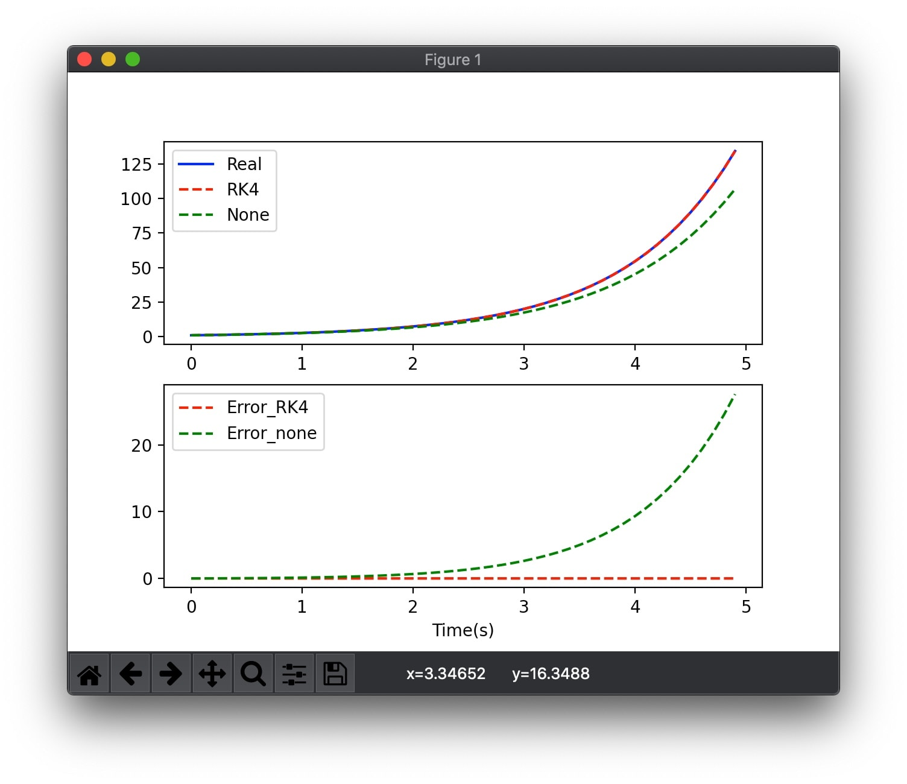
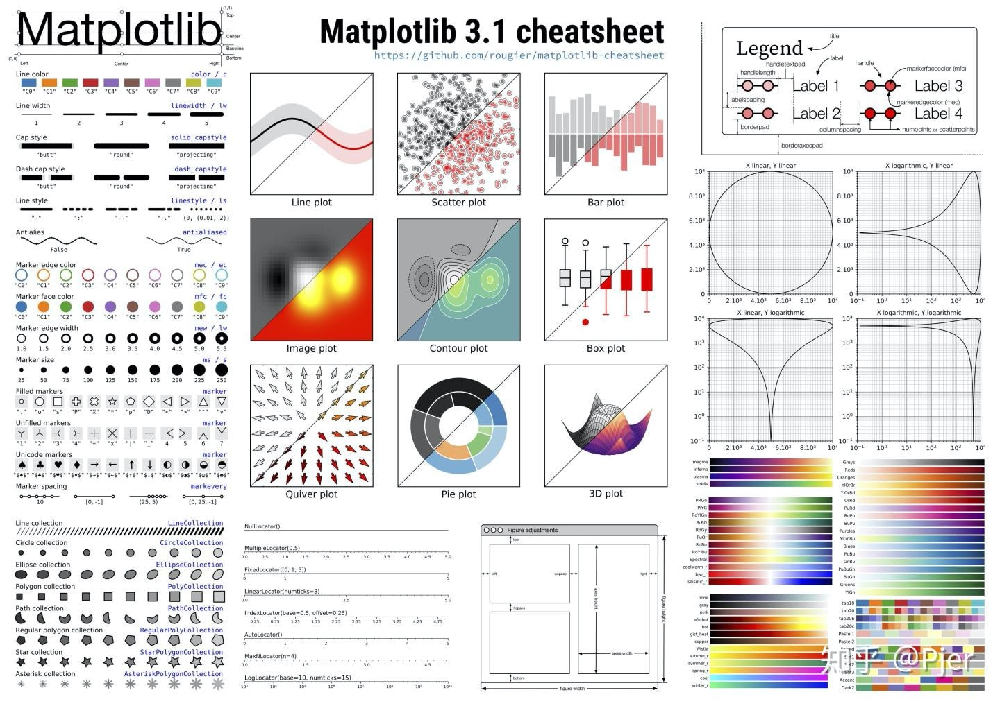

一年级的时候搬砖搬多了，数分课也没好好上，回头一看，这么简单的东西，当时竟然整的稀里糊涂的。

# 为什么要用RK4
先po一张图，直观感受一下仿真的误差。



对于给定线性常微分方程
$$
\dot x = x
$$
易得，其解是
$$
x(t) = Ce^t
$$
RK4是龙格库塔法曲线，None是一阶解法$x(t+dt) = x(t)+\dot x dt$
可以看到，线性常微分方程误差尚且如此之大，那么推广到非线性微分方程，像这种形式
$$
\dot x = f(x,t) = tx^2 - \frac{x}{t}...
$$
那肯定误差直接起飞了。解析解求起来也挺麻烦，这里就不再引入分析了。

接下来把定义回顾一下，贴一下代码，有需自取，希望对大家有所帮助。
# 定义回顾
数值分析中，龙格－库塔法（Runge-Kutta methods）是用于非线性常微分方程的解的重要的一类隐式或显式迭代法。这些技术由数学家卡尔·龙格和马丁·威尔海姆·库塔于1900年左右发明。该方法主要是在已知方程导数和初值信息，利用计算机仿真时应用，省去求解微分方程的复杂过程。

令初值问题表述如下。
$$
y' = f(t,y), y(t_0) = y_0
$$
则，对于该问题的RK4由如下方程给出：
$$
y_{n+1}=y_{n}+\ frac{h}{6}\left(k_{1}+2 k_{2}+2 k_{3}+k_{4}\right) \\
$$
其中
$$
\begin{matrix}
k_{1}=f\left(t_{n}, y_{n}\right) \\ 
k_{2}=f\left(t_{n}+\frac{h}{2}, y_{n}+\frac{h}{2} k_{1}\right) \\
k_{3}=f\left(t_{n}+\frac{h}{2}, y_{n}+\frac{h}{2} k_{2}\right) \\
k_{4}=f\left(t_{n}+h, y_{n}+h k_{3}\right)\end{matrix}
$$

式中，$h$为仿真步长，满足$h<\epsilon_1 \rightarrow error<\epsilon_2$

# 代码实现

```python
import numpy as np
import matplotlib.pyplot as plt
import sympy as sy

# 这里介绍一个符号运算的方法，可以用来求解方程什么的
def diff_eq(t,x):
	return sy.diff(x(t),t,1) - x(t)
	
t = sy.symbols('t')
x = sy.Function('x')
sy.pprint(sy.dsolve(diff_eq(t,x),x(t)))

def dot_x(t,x):
	return x

def rk4(f,t,x,h):
	k1 = f(t,x);
	k2 = f(t+0.5*h,x + 0.5*h*k1)
	k3 = f(t+0.5*h,x + 0.5*h*k2)
	k4 = f(t+h,x + h*k3)
	return h/6*(k1+2*k2+2*k3+k4)

t_list = np.arange(0,5,0.1);
#print(t)
x1_list = np.exp(t_list)
x2_list = []
x3_list = []
h = 0.1
x2 = 1;
x3 = 1;

for t in t_list:
#	print(t,idx)
	x2_list.append(x2)
	x3_list.append(x3)
	x2 = x2 + rk4(dot_x,t, x2, h)
	x3 = x3 + dot_x(t,x3) * h				
error_2 = x1_list - x2_list
error_3 = x1_list - x3_list

plt.figure()
plt.subplot(2,1,1)
plt.plot(t_list,x1_list, 'b-',label='Real')
plt.plot(t_list,x2_list,'r--', label = 'RK4')
plt.plot(t_list,x3_list,'g--', label = 'None')
plt.legend()

plt.subplot(2,1,2)
plt.plot(t_list,error_2, 'r--',label='Error_RK4')
plt.plot(t_list,error_3, 'g--',label='Error_none')
plt.legend()
plt.xlabel('Time(s)')
plt.show()
```

# 闲话
这里推荐一个提高效率的工具Matplotlib cheat sheet

对于一个经常画图的科研狗来说，这张图真是太太太太有必要了，因为时常遇到以下场景，不记得colormap名字，打开文档查一番，不记得线宽关键词，打开文档查一番，不记得marker名字，打开文档查一番。。。。。等等等等


所以，有了这张图，在平常画图的时候中遇到的95%需要查文档的问题都可以在这张图中找到答案。

===
这个速查表，可以关注微信公众号“探物及理”后台回复“python画图”领取。

===
