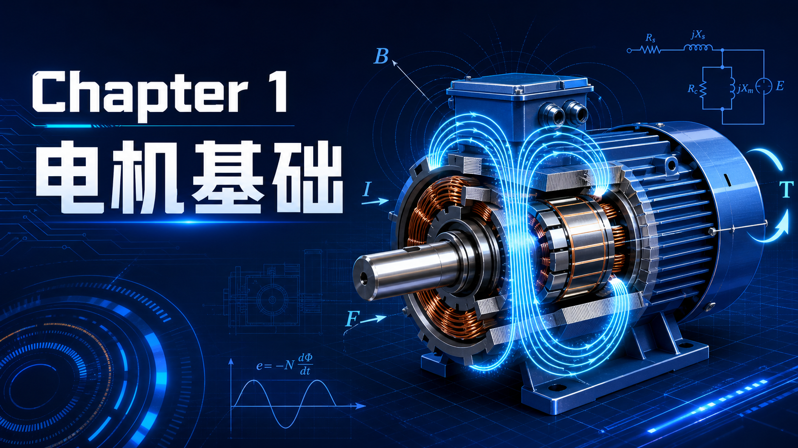

你好！我是老列。👋

电钻空转时，刚启动会猛吸一口电；转起来以后，电流又自己降下去。你把钻头压进木板，它不需要谁去通知，电流却会马上升高、扭矩跟着上来。这个看似“聪明”的过程，电机里没有控制器也能发生。

今天就从一根通电导线开始，把电机最底层的逻辑捋顺：**磁场怎样变成力，力怎样变成转矩，运动又为什么会反过来限制电流。**后面不论遇到直流机、异步机、永磁同步机，还是变频器和 FOC，基本都逃不开这套账。

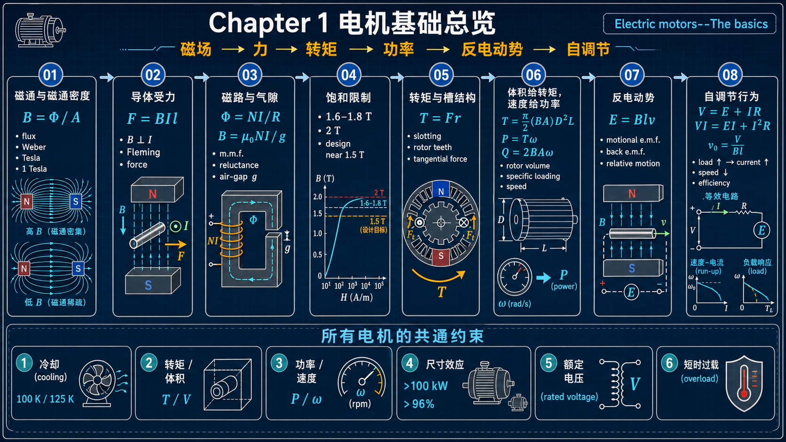

> 先带走三句话：
>
> 1. 电机转矩的核心是 `F = BIl`：磁密、有效导体长度和电流缺一不可。
> 2. 电机的体积主要由“要多大转矩”决定；同样体积想要更大功率，最直接的手段是提高转速。
> 3. 电机并不是凭空“按需取电”：转速产生的反电势构成天然负反馈，负载一来、速度微降，电流便自然增加。

---

先别急着背公式。整章其实只在回答一件事：人类怎样把一根导线上原本很微弱的电磁力，放大成能拧动机床、牵引车辆的转矩？答案不是某个神奇零件，而是一条连续的放大链：**把磁场做强 → 把更多导体放进磁场 → 让所有导体的力朝同一方向拧 → 用反电势自动管理能量流。**

## 1.1 电机不是“吃电就转”的黑箱

绝大多数电机都有旋转轴，线性电机看起来不同，实质上也在做同一件事：把电能转换成机械能。其核心材料并不神秘——铜导体、磁性钢、绝缘系统——但它们的组合方式非常讲究。

理解电机时，建议把功能先拆成两部分：

- **励磁**：建立磁场，可由永磁体或励磁绕组完成；
- **能量转换**：让处在磁场中的载流导体受力，并把力传到转子与轴上。

励磁是必要条件，却不是连续输出机械能的“燃料”。机械输出能量来自给有效导体供电的电源。这个区分，是后面理解反电势、效率和发电状态的钥匙。

## 1.2 怎样产生旋转：先从一根导线的横向受力说起

通电导线放进磁场，会受到与电流、磁场都垂直的力。单根导线的作用通常很弱，真正的电机通过三件事把它放大：做出很高的气隙磁密、塞进尽可能多的有效导体、让导体在温升允许范围内通过尽可能大的电流。

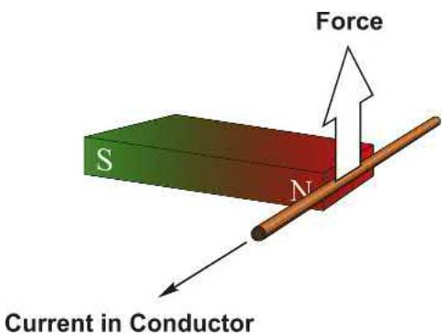

### 1.2.1 磁场与磁通：磁力线是一种“地图”

永磁体周围的磁力线，表示小磁针会对准的方向。约定上，磁体外部的磁通方向由 N 极指向 S 极；但磁通线并非从某处凭空开始、到某处消失，而是总会闭合成回路。

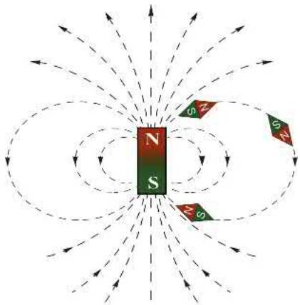

### 1.2.2 磁通密度：同样的磁通，挤得越紧越有劲

磁通量记为 $\Phi$，截面积记为 $A$，磁通密度为：

$$
B=\frac{\Phi}{A}\tag{1.1}
$$

单位是特斯拉（T）。它是一个有方向的量；在电机推导中，方向由结构已经确定，常直接讨论数值大小。磁通在截面更小处被“挤压”，$B$ 就更大；因此铁心局部变窄时很容易出现饱和。

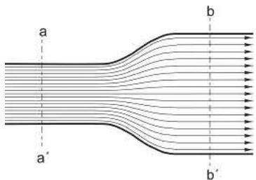

1 kW 电机的总磁通可能只有几十毫韦伯，但气隙面积也小，所以各类常规电机的气隙磁密往往都在约 1 T 的量级。

这几个数量级放在一起，能更直观地感受到电机为什么“有劲”：

| 场景 | 典型磁通密度 $B$ |
| --- | --- |
| 地磁场 | 约 $5\times10^{-5}$ T |
| 小型永磁体表面附近 | 约 0.1 T |
| 普通电机气隙 | 约 0.5–1.0 T |
| 超导科研磁体 | 可超过 10 T |

电机气隙里的磁场，并不是“普通磁铁那点力”，而是比地磁场强上万倍的工作场。高磁密是能输出大转矩的第一块基石，但它也会把铁心推向饱和边缘——这就是后面磁路设计要精打细算的原因。

### 1.2.3 导线受力：左手定方向，$BIl$ 定大小

用弗莱明左手定则：食指指磁场方向 $B$，中指指电流方向 $I$，拇指便是力（运动趋势）方向。反转磁场或反转电流中的任意一个，力都会反向；两者同时反转，力方向不变。

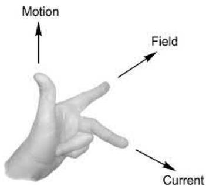

当导线与磁场垂直时：

$$
F=BIl\tag{1.2}
$$

其中 $F$ 的单位为 N，$B$ 为 T，$I$ 为 A，$l$ 为处在有效磁场中的导体长度（m）。方向不垂直，受力会减小；平行时为零。普通条形磁铁端部的磁密约 0.1 T，一根 1 A 导线每米受力仅约 0.1 N，这就是为什么电机必须依赖精心设计的磁路和大量导体。

## 1.3 磁路：为什么电机里离不开硅钢和气隙

孤立直导线的磁场绕导线发散；去、回两根平行导线之间，磁场会叠加；多匝线圈则能把磁场进一步集中。可是仅靠空气中的线圈，磁密仍不足以做好电机。

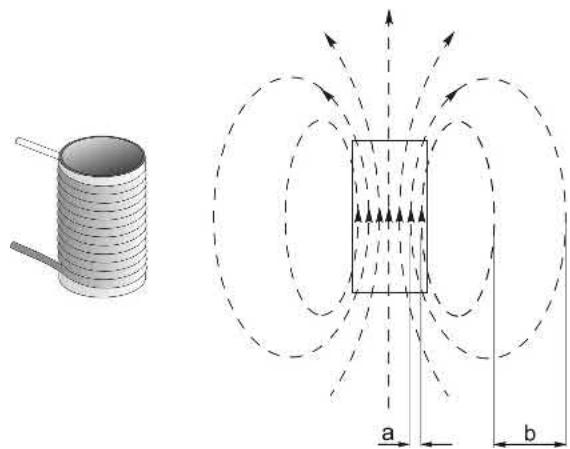

### 1.3.1 磁动势：匝数和电流的乘积

线圈建立磁通的能力称为**磁动势**（m.m.f.）：

$$
\mathrm{m.m.f.}=NI
$$

单位是安匝。少匝粗线大电流、或多匝细线小电流，只要 $NI$ 相同，磁动势相同。多层绕组的外层也不会“失效”；只是绕得紧凑能减小电阻、改善散热。

### 1.3.2 电路类比：磁通也遵从“欧姆定律”

电路里有 $I=V/R$；磁路中有完全对应的关系：

$$
\Phi=\frac{NI}{\mathcal{R}}\tag{1.4}
$$

$\mathcal{R}$ 是磁阻。磁阻小，给定安匝下的磁通就大。磁性钢的磁阻远低于空气，所以电机用铁心把磁通“导”到需要的位置。

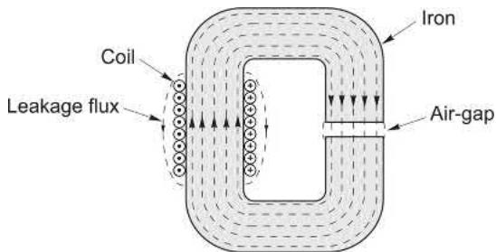

把这件事想成修路会更好记：空气像一大片泥地，磁通当然能走，但会四散、阻力又大；硅钢铁心则像给磁通铺好的高速公路，既让它更容易走，也规定它要往哪里走。电机里那一叠叠硅钢片并非单纯的承力骨架，而是磁场的“路网”；叠片还能抑制涡流损耗，避免铁心本身变成发热体。

### 1.3.3 气隙：最不情愿、却必须留下的地方

导体必须相对磁场运动，转子和定子之间自然要留机械间隙。空气的磁导率极低：相同长度、相同截面的空气磁阻通常约为铁的千倍，因此很短的气隙反而主导了整个磁路的磁阻。

气隙小，磁通大、转矩能力强；但也必须给制造误差、轴承跳动、热膨胀和安全机械间隙留空间。这正是电机设计中典型的多目标折中。

所以气隙是电机的**必要之恶**：从磁路角度，它越小越好；从机械角度，它又绝不能小到擦碰。实际运行中若转子偏心，较小一侧气隙会吸引更多磁通，进一步放大单边磁拉力，最后表现为噪声、振动和轴承磨损。

### 1.3.4 气隙磁密：安匝与气隙长度的硬约束

忽略铁心磁阻时，长度为 $g$、截面积为 $A$ 的气隙磁阻为：

$$
\mathcal{R}_g=\frac{g}{A\mu_0}\tag{1.5}
$$

由此可得：

$$
\Phi=\frac{NIA\mu_0}{g},\qquad B=\frac{\mu_0NI}{g}\tag{1.6–1.7}
$$

其中 $\mu_0=4\pi\times10^{-7}\ \mathrm{H/m}$。这组式子非常值得形成直觉：**气隙翻倍，磁阻翻倍，磁密减半；安匝翻倍，磁密翻倍。**例如 250 匝、2 A、1 mm 气隙时，$B\approx0.63$ T。截面积改变会改变总磁通，却不会直接改变上述理想气隙磁密。

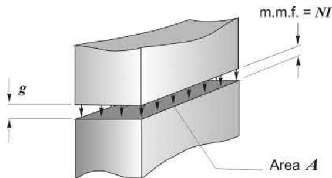

### 1.3.5 饱和：铁不是无限畅通的“磁导线”

当铁心磁密低于约 1.6–1.8 T 时，铁的磁阻相对气隙很小；继续提高磁密，铁心磁阻会陡增，最后磁密接近约 2 T 时几乎不再按比例增加——这就是饱和。工程上常把铁心工作磁密控制在约 1.5 T 以下，以免大量安匝白白耗在铁心里。

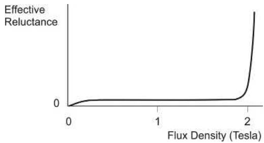

**这条曲线应该怎样读？**横轴可以理解为铁心中的磁通密度 $B$，纵轴表示铁的**有效磁阻**。在曲线左侧的正常工作区，铁的磁阻很低，且远小于气隙磁阻：此时大部分磁动势 $NI$ 都“花”在跨越气隙上，增加励磁能够较有效地提高气隙磁通。

当磁密逼近材料的饱和区，曲线开始明显上翘。它表达的不是“磁通突然停止”，而是：**铁心不再像理想的低磁阻通道**。继续增加安匝时，越来越多的磁动势被消耗在驱动磁通穿过铁心本身，能分配给气隙的份额变少。因此，励磁电流已经增加很多，气隙磁密和可获得转矩却只增加一点。

从曲线往工程现场翻译，就是下面这条因果链：

> 齿或轭部截面积太小 → 局部 $B$ 被挤高 → 铁心磁阻陡升 → 励磁电流/无功电流增加、损耗与温升上升 → 转矩增益变差。

所以“磁饱和”并不是一个只有设计师才要关心的名词。它会让电机在大电流区表现出更差的电流利用率，也会使控制模型的磁链参数不再恒定。实际设计会把齿部、轭部等最窄截面的磁密留在合理裕量内；本章的近似经验是通常不超过约 $1.5\ \mathrm{T}$，具体限值仍取决于硅钢牌号、损耗目标和冷却条件。

### 1.3.6 从 C 形铁心到真实电机

把 C 形铁心的一处气隙拆成对称的两处，线圈也分开；再把磁通分成两条并联支路，最后将极面弯成圆弧，就得到传统直流电机的磁路雏形。几何变复杂了，但前面的磁路规律没有变：磁通仍尽量走铁，关键压降仍主要落在气隙。

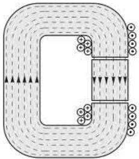

## 1.4 转矩生产：让所有导线的力朝一个方向拧

在 N 极下和 S 极下，把转子导体电流安排为相反方向，导体受到的切向力会同向贡献，于是形成转矩。这里的“换向”正是各种电机在结构或控制上必须完成的事。

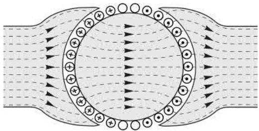

要点也有三条：

- 转子电流自身会改变原有磁场（直流机中称电枢反应），但多数情况下仍可用原有气隙磁场计算基本受力；
- 转子得到转矩，定子必受大小相等、方向相反的反作用转矩，所以电机需要牢靠安装；
- 气隙中还存在很大的径向吸力。1 T 左右磁密的极面吸力可达约 $40\ \mathrm{N/cm^2}$，它不输出转矩，却会在偏心时引发单边磁拉力、噪声和轴承磨损。

有些磁阻类电机还会利用铁心趋向低磁阻位置的切向力产生转矩；但对绝大多数机器，$BIl$ 仍是理解转矩的通用入口。

### 1.4.1 转矩的大小

所有导体切向力相加为 $F$，作用半径为 $r$：

$$
T=Fr\tag{1.8}
$$

所以提高磁密、有效导体数、电流、有效长度或半径，都有助于提高转矩；代价则分别落在饱和、温升、材料、体积和机械强度上。

### 1.4.2 槽的妙处：导体躲进槽里，力为什么没少？

早期电机把导体绑在转子表面，气隙至少得容纳导线直径，磁阻很大。将导体沉入槽内，可以显著缩小气隙，又能让齿承受并传递切向力。虽然大部分磁通改走低磁阻的齿，实验和理论都表明：只要转子表面平均磁密相同，总转矩并不会因此消失——主要切向力转而作用在齿侧。

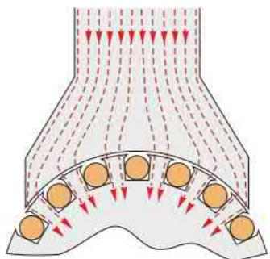

这件事最反直觉的地方在于：磁通确实更愿意走铁齿，槽内漏磁密也确实较低；但只要转子表面的**平均气隙磁密**相同，宏观转矩并没有少。可以把它理解为：开槽后，电磁切向力的主要承力位置从导体本身“转移”到齿侧，结局仍然是把同样的转矩传给转子铁心和轴。工程实践先证明它有效，理论后来才把这笔力的账算清。

槽也不是越大越好。铜的实用电流密度通常约 $2\text{–}8\ \mathrm{A/mm^2}$，想塞更多铜会加宽槽、压窄齿，齿又会饱和；槽过深还会削弱转子轭部。槽口还会增加风摩与噪声，常靠槽楔等方式让表面更平滑。

## 1.5 转矩、体积与速度：选电机时最该有的尺度感

气隙区域必须同时容纳“径向磁通”和“轴向电流”。设计师习惯用两项比负荷概括这种能力：

### 1.5.1 比磁负荷与比电负荷

- **比磁负荷 $\overline B$**：把转子表面想成光滑圆柱后得到的平均径向磁密；主要受铁心饱和限制。
- **比电负荷 $\overline A$**：单位圆周长度上的轴向电流。例如 10 cm 宽度内有 5 个槽、每槽 40 A，则 $\overline A=5\times40/0.1=2000\ \mathrm{A/m}$；主要受铜耗和冷却限制。

想增大槽放更多铜，往往会挤占齿部、降低可用磁负荷。除非采用特殊冷却，同一尺寸的异步机、直流机等，其两种比负荷往往处在相近范围，因此它们可提供的转矩也不会脱离常识地悬殊。

### 1.5.2 转矩与转子体积

两种比负荷的乘积 $\overline B\overline A$，就是转子表面的平均切向电磁应力。直径 $D$、有效长度 $L$ 的转子：

$$
T=\frac{\pi}{2}(\overline B\overline A)D^2L\tag{1.9}
$$

$D^2L$ 与转子体积成正比。这给出一个非常有用的选型判断：**冷却相近时，额定转矩与电机体积大致成正比。**长而细、短而粗可以各有取舍，但在体积与比负荷既定时，转矩基本已经定了。

### 1.5.3 输出功率：速度为什么如此重要

线性系统里 $P=Fv$；转动系统中，转过角度 $\theta$ 所做的功为 $W=T\theta$，因此：

$$
P=T\omega\tag{1.12}
$$

代入上式：

$$
P=\frac{\pi}{2}(\overline B\overline A)D^2L\omega\tag{1.13}
$$

在同样电机体积和相同比负荷下，提高转速就能同比提高功率。这便解释了电动工具与牵引驱动为何偏爱高速小电机配减速机构：比直接驱动的低速大电机更小、更轻、通常也更便宜。

举个量级感很强的例子：同样输出 10 kW，约 1000 r/min 时需要约 95 N·m；若提升到 10 000 r/min，只需约 9.5 N·m。后者可以用更小的电机，再借减速机构换回低速大转矩。直驱当然并非错误——极低噪声、免维护或不希望有齿隙的场合常会选择它——只是必须接受更大体积和成本。

### 1.5.4 功率密度：高速的价值与代价

单位转子体积的输出功率为：

$$
Q=2\overline B\overline A\omega\tag{1.14}
$$

这条式子几乎把“高功率密度电机为什么难”说透了：若材料与冷却不变，要榨出更高功率密度，就得提高速度。代价是机械应力、铁耗、风摩、噪声，以及减速机构的可靠性问题。比如吊扇等极重视安静的场景，宁愿采用更大体积的低速直驱。

## 1.6 能量转换与运动电动势：电机自调节的根源

为了把“电能怎么变成机械能”看得最清楚，可以想象一个直线电机：一根长度 $l$、电阻 $R$ 的导体，在均匀磁场 $B$ 中以速度 $v$ 横向移动，并通过绳子提升重物。

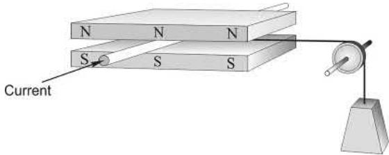

### 1.6.1 静止时：只有发热，没有机械输出

导体不动时，永磁体只负责建立磁场，不持续提供能量。外加电压为 $V_1=IR$，输入功率全变成铜耗 $I^2R$。如果它静止却拉住重物，力平衡要求：

$$
mg=BIl,\qquad I=\frac{mg}{Bl}\tag{1.16}
$$

这已经说明了一个事实：稳态电流由机械负载决定。

### 1.6.2 匀速运动时：反电势出现，能量去往负载

导体切割磁通时产生运动电动势：

$$
E=Blv\tag{1.17}
$$

它的方向总是反对外加电压，因此端电压方程为：

$$
V=E+IR\tag{1.19}
$$

乘以电流可得功率守恒：

$$
VI=EI+I^2R\tag{1.20}
$$

其中 $EI$ 正是机械输出功率（也等于 $Fv$）。这不是近似的“能量说辞”，而是电路中反电势元件的精确功率账。

## 1.7 等效电路：一个电阻加一个反电势源，就够了

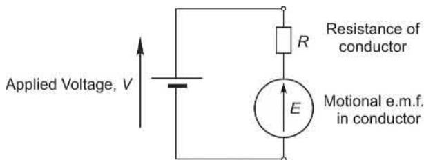

把原始电机看成串联的电阻 $R$ 与反电势源 $E$，便得到：

$$
I=\frac{V-E}{R}\tag{1.21}
$$

这张图解释了电机的“聪明”：速度越高，$E$ 越高，电流越小；负载加重使速度下降，$E$ 下降，电流自然增大，电磁力又增加，直至与负载平衡。

### 1.7.1 电动与发电：同一台机器的两个方向

当 $V>E$，电流由电源流入机器，电机输出机械能；当外力把导体推得足够快、使 $E>V$，电流反向流回电源，机器便发电。电机与发电机不是两种本质不同的设备，而是同一能量转换器在不同功率流向下的工作状态。

把这句话放回现场就很好理解：车辆减速、吊钩下放或风机被外力拖动时，只要控制与供电侧给能量留了去处，原来的“电机”就会变成发电机。再生制动并不是额外安装一台发电机，而是同一台机器把功率流反过来。

## 1.8 恒压运行：为什么轻载转得快，带载只会略微掉速

### 1.8.1 无机械负载时

刚接通电压时，导体尚未运动，$E=0$，电流 $V/R$ 很大，因而产生最大加速力。速度升高后，反电势抬升、电流与加速力下降；直到 $E$ 接近 $V$，电流接近零，达到空载稳速。

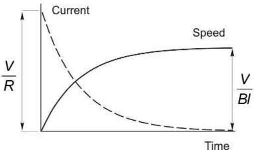

弱磁时，同样电压下终极速度更高，但初始加速度更小；这就是**弱磁升速**的本质，绝非免费获得更大功率。

### 1.8.2 有机械负载时

负载突然加上，导体先略减速，$E$ 变小，于是 $(V-E)/R$ 变大，电流、力和转矩随之增加。最终在较低一点的转速上建立新平衡。电阻越小，维持速度越“硬”；磁密越弱，要得到同一力就需更大电流，速度下垂也更严重。

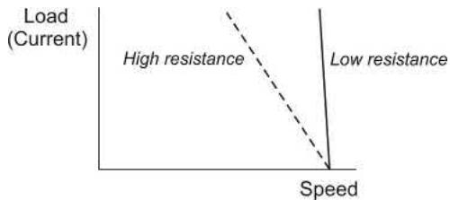

若磁通减半，为得到同一力电流需翻倍；反电势还因磁通减半而变小，速度跌落会变得约四倍。弱磁换来的是更高速度范围，牺牲的是可用转矩和调速刚度。

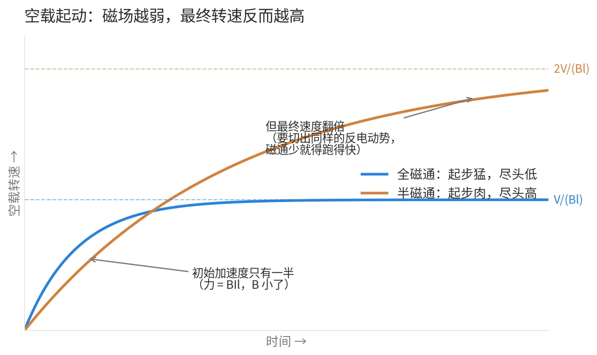

### 1.8.3 $V$、$E$ 与效率：有用电压要占大头

高效率意味着 $I^2R$ 相对于 $EI$ 很小，即 $IR\ll E$。例如 $R=0.5\ \Omega$、$I=4$ A、$E=8$ V 时，$V=10$ V，输入 40 W，机械输出 32 W，效率 80%。若负载力不变、供电升至 20 V，则 $E=18$ V，铜耗仍是 8 W，而机械输出变为 72 W，效率提高到 90%。

所以在允许范围内，高速和低电阻对效率极为有利。大型电机的电阻压降只占端电压的 1–2%，效率可很高；极微型电机的电阻压降占比大，效率则天然差得多。

### 1.8.4 原始模型的结论

把这节的公式压缩成两行：

$$
F=BIl,\qquad E=Blv\tag{1.24–1.25}
$$

前者说电流如何变成力，后者说运动如何变成反电势。直流机的空载速度主要由电压决定、稳态电流主要由机械负载决定；交流电机的具体形式不同，但同样能找到对应的关系。

## 1.9 所有电机共有的工程约束

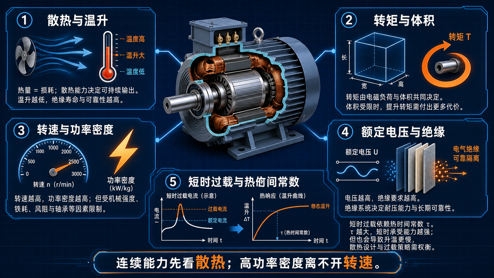

最后不讲某一类电机，只讲所有电机都躲不开的“底层规则”。它们是看铭牌、比较方案、识别夸张宣传时最好用的尺子。

### 1.9.1 工作温度与冷却

给定体积下，允许输出首先由散热决定。电流提高会提高铜耗与温升；F 级绝缘典型允许温升约 100 K，H 级约 125 K。更高等级绝缘或更强冷却都能提高连续输出；同一电机，通风冷却的连续功率可能约为全封闭形式的两倍。

### 1.9.2 单位体积转矩

冷却条件相近时，额定转矩大致与转子体积、进而与整机体积成正比。直径和长度相仿的普通电机，合理预期其转矩也大致相仿；“体积小一半、连续转矩大数倍”的说法必须追问冷却、材料和工况。

### 1.9.3 单位体积功率与效率：再强调一次速度

单位体积功率与速度成正比。低速直驱电机通常大而贵，高速电机加减速机构通常更紧凑；但在高功率、低维护或极静音场景，齿轮箱的效率、可靠性和噪声也可能让直驱重新胜出。相同转矩下，速度提高时输出功率增加通常快于损耗，效率往往也更高。

### 1.9.4 尺寸效应

大电机的单位体积转矩通常更高、效率也更高。小电机受导体电阻比例更大的限制；极小电机效率甚至可低到约 1%，而百千瓦以上的大电机效率常超过 96%。

### 1.9.5 额定电压

电机可以绕成不同电压版本。理论上，200 V、10 A 绕组改为 100 V、20 A：匝数减半、导线截面积加倍，安匝和有效材料大致不变，性能也近似不变。现实中高电压需要更厚的绝缘和更大爬电距离，所以不能无限推高电压而不改变结构。

### 1.9.6 短时过载

连续电流受温升限制，短时电流却可以显著更高，因为热量来不及把绕组加热到危险温度。允许过载的幅度和时间，取决于热时间常数与此前负载历史：小电机可只有几秒，大电机可能是数十分钟甚至数小时。实际产品常用热敏电阻等温度保护，而不是只依赖一条理想的负载曲线。

---

## 写在最后：把一章内容收束成一张“工程判断表”

| 你看到的现象 | 先想起的规律 | 工程含义 |
| --- | --- | --- |
| 电机加负载后电流上升 | $I=(V-E)/R$，速度略降使反电势下降 | 电机存在天然负反馈 |
| 想提高连续转矩 | $T\propto\overline B\overline A D^2L$ | 先看体积、冷却和饱和 |
| 想把同功率电机做小 | $P=T\omega$ | 优先提高转速，再处理减速与噪声 |
| 想缩小气隙 | $B\propto NI/g$ | 性能会提升，但机械公差与偏心风险也会上升 |
| 宣称高功率密度 | $Q=2\overline B\overline A\omega$ | 追问速度、冷却和短时/连续工况 |

这一章真正要建立的不是公式记忆，而是因果链：**磁路提供 $B$，电流提供 $I$，两者在几何结构中给出力与转矩；运动反过来产生 $E$，再把电流和功率流“管”起来。**

下一章，我们会把目光移到电机外面的那套“电子换向器”——功率电子变换器。届时你会看到，变频器并不是另一个孤立的系统，它正是在端电压 $V$ 上动手脚，从而控制这章已经建立的电磁过程。

---

如果你觉得这篇文章有帮助，欢迎点个“在看”，也转给正准备学电机的朋友。⚡

  <strong>如果觉得这篇文章对你有帮助，</strong>
   
  <strong>别忘了点赞、在看、分享三连哦！</strong>
   
   
  👇👇👇

---

> 推荐朋友关注公众号"探物及理"，谢谢各位。
>
> 

---
