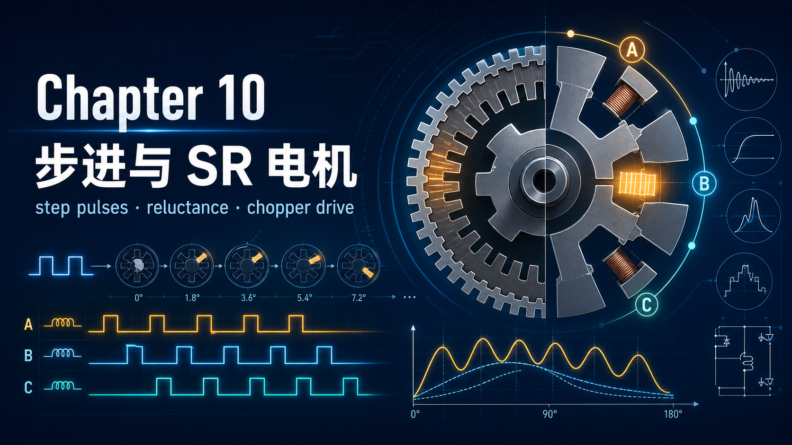
你好，我是老列 👋

上一篇 [9-新能源车为啥清一色永磁？老列细数同步电机家族的看家本领](https://app.notion.com/p/9-0fadbd3edf594ba5bb458d316c68a166?pvs=21) 里的磁阻电机，转子有凸极、定子是光滑内壁——叫“单凸极”。今天这两位主角更激进：**定子转子都长凸极（双凸极）**，磁场焦点更锐，“想对齐”的劲儿更大。一位是**步进电机**——不装任何传感器就能精确定位的数字化老前辈；一位是**开关磁阻电机（SR）**——结构简单到丧心病狂却能吃苦耐劳的狠角色。

顺便说个历史包袆：双凸极电机十九世纪就被盯上了，卡在“绕组得按顺序快速切换”这一步——机械开关干不动这活。直到上世纪六七十年代功率半导体登场，这两位才重新出山。

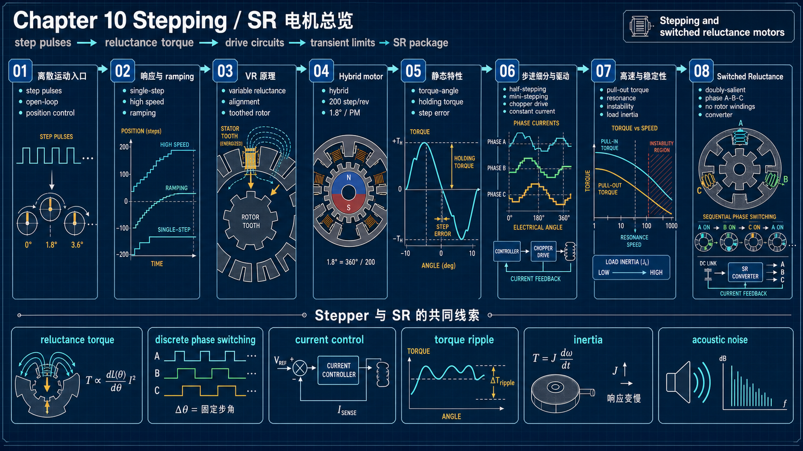

---

## 【老列 驱动导论笔记 10】：步进电机与开关磁阻驱动

### 👣 步进电机：一个脉冲，一步，概不赖账

步进电机的全部魅力就一句话：**每收到一个脉冲，轴就转过一个固定角度**。发 1000 个脉冲，它就走 1000 步，不多不少——于是**不装编码器也能做位置控制**（开环），脉冲数定位置，脉冲频率定转速，天生和数字电路投缘。打印机走纸、光学设备调焦、小型数控滑台，全是它的地盘。

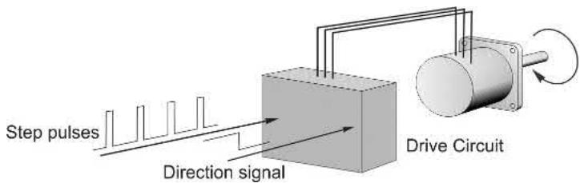

别被“步”字骗了：单步常在几毫秒内完成，高速时几千步每秒（slewing），轴转起来相当平滑，但**脉冲与步数的一一对应一直保持**。另外它天生耐堆转：设计上就允许长期通额定电流静止保持，堵转不怕烧。

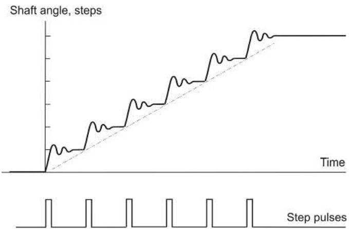

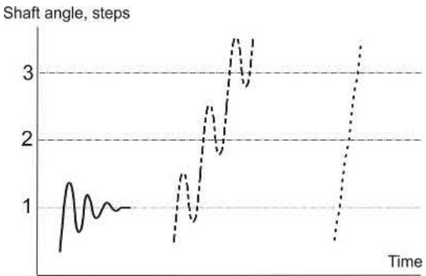

### ⚙️ 两大门派：VR 与混合式

**VR（可变磁阻）型**：大步距角（15°/30°/45°）的首选。看 30°/步的经典教学机：定子 6 极 3 相，转子 4 齿。通 A 相，转子齿被吸到 A 极对齐；断 A 通 B，另一对齿被吸向 B——转子顺时针走 30°。按 ABCA 循环就连续转，换成 ACBA 就反转。注意两个小彩蛋：电流方向无所谓（磁阻转矩不认极性）；定子磁场轴每步逆时针跳 60°，转子却顺时针走——**双凸极机器里转子常常逆着磁场的“步点”走**，第一次看都觉得魔幻。

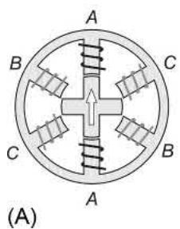

**混合式**：小步距角之王，工业标配 1.8°（200 步/转）。定子 8 个主极每极 5 齿；转子两个 50 齿端盖夹一块**轴向磁化的永磁体**，两端齿错开半个齿距——所以叫“混合”：磁阻 + 永磁合作。步距角公式统一为：

$\text{步距角} = \frac{360°}{\text{转子齿数} \times \text{定子相数}}$

50 齿 × 4 相 = 1.8°。混合式还送一个实用小福利：断电后永磁体留下微弱的 **detent 定位转矩**，手感一格一格的，能防止停机时被碰一下就丢位。另外记住：**混合式转子别随便拔出来**，磁钢是装机后充磁的，拔一次磁通掉 5～10%。

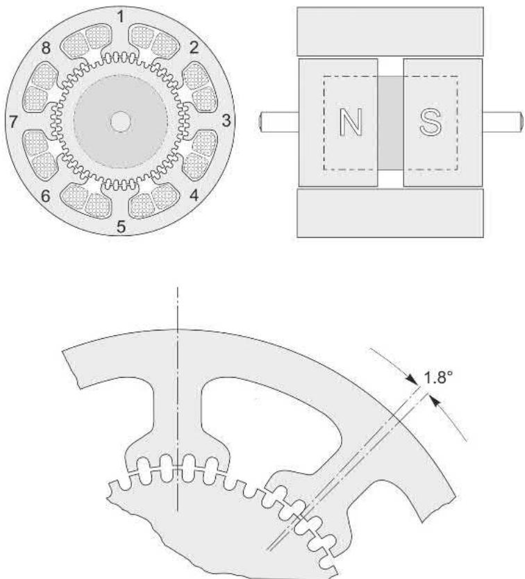

### 📐 静态特性：保持转矩、位置误差、半步与细分

- **保持转矩（holding torque）**：静态转矩-位移曲线的峰值，选型时仅次于步距角的参数，“1 N·m 的电机”指的就是它；
- **步位误差**：带负载时转子停在“电磁弹簧”被拉伸的平衡点上，对不止真零位——曲线越陡误差越小，有时得为了陡度而选更大的电机；
- **半步与细分**：单相/双相交替通电，步距角减半；再把两相电流按比例配，平衡点可以落在两步之间任意位置——这就是**细分驱动**，工程上有做到每转两万细分的。代价是电流必须闭环精控，否则细分位置漂移。

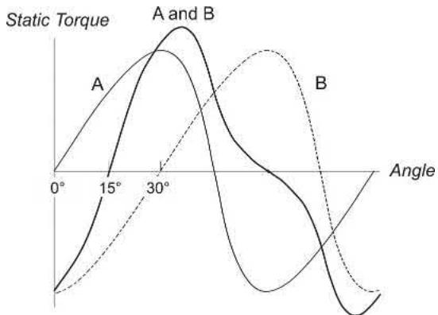

### 🎯 理想驱动下的极限：牵出转矩

先立个标杆：假设驱动无所不能，能给绕组灌**完美矩形电流**——瞬间建立、恒定保持、瞬间归零。驱动分两级：**译码器**把脉冲翻译成各相的开/关命令，**功率级**负责灌电流：

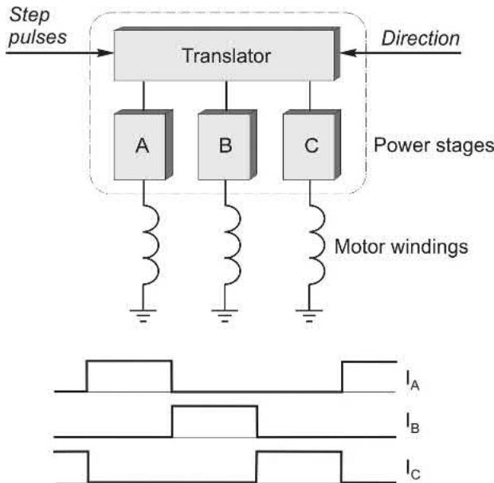

匀速旋转时转子平均滞后于逐步前进的磁场轴，滞后越多平均转矩越大——但和所有同步机一样有上限：滞后过头转矩掉头，电机失步。这个上限叫**牵出转矩（pull-out）**。理想恒流驱动下它与步频无关，转矩-速度图是一块平顶的矩形运行区：

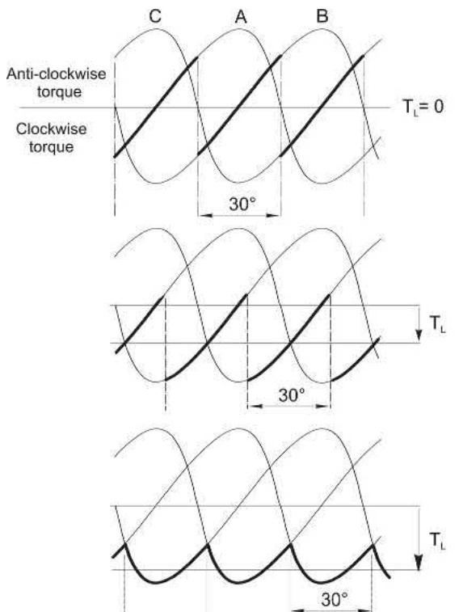

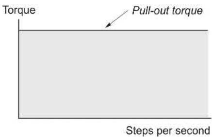

现实中绕组电感让完美矩形电流成为奢望——这正是下一节三代驱动电路要拼命逼近的目标。

### 🔋 性能不在电机，在驱动：三代驱动电路

新手最容易惊讶的事实：**同一台步进电机，换个驱动器，转矩-速度曲线能差出十倍**。症结在绕组电感：电流想瞬间建立瞬间消失，电感偏不让。

1. **恒压驱动**：最便宜，低速尚可，频率一高电流还没爬到额定就被关断，转矩断崖式下跌；
2. **R/L 强迫驱动**：加高电压 + 串强迫电阻，电流上升快了 5～10 倍，代价是电阻上白白烧掉大把功率；
3. **斩波恒流驱动**：高压电源 + 滞环斩波把电流按在额定值，关断时能量回馈电源——最接近理想矩形波，**如今的标配**。（VR 机单极性电流即可；混合式要正负电流，每相配一个 H 桥做双极性驱动。）

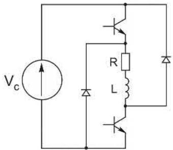

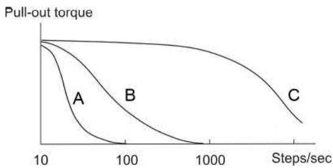

### ⚠️ 开环的代价：失步、共振与加减速曲线

开环的命门也很直白：**一旦丢步，计数器里的“位置”就全是自欺欺人**。三个雷区：

- **起停太猛**：从静止直接给 2000 步/秒，转子根本追不上；高速中突然停脉冲，惯量冲过头——都得用**梯形加减速曲线（ramping）**伺候；
- **负载超牵出转矩**：失步堆转，同步机的老毛病；
- **共振**：步进频率碰上单步振荡的固有频率，转矩曲线上出现坔陷（dips）；中高速还可能正反馈失稳，甚至“热天掉坑冷天没事”——对策是加惯性阻尼器，或者干脆加速冲过坔陷区。

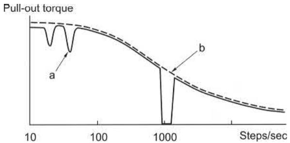

还有两个数字要分清：**牵入（pull-in）**与**牵出（pull-out）**。牵入率是从静止直接锁上脉冲串不丢步的最高步频，受负载转矩**和惯量**双重压制；牵出率只看转矩，与惯量无关。厂家曲线长这样——同一负载下能跑的速度远高于能起的速度，这就是为什么要 ramping：

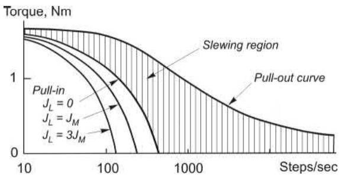

单步振荡的固有频率也能自己估：ωn² = 步位附近转矩-角度曲线的斜率 ÷ 总惯量。VR 机阻尼比可低至 0.1，混合式约 0.3～0.4，要快速稳定就得加机械阻尼器，或用“电子阻尼”——提前回通上一相精准刹车，但它对负载变化极其敏感，负载一飘就失灵。

真要既要极限加速又要万无一失？装编码器做闭环，由转子位置触发每一步——但那就和上一章的自同步驱动没两样了，步进电机的成本优势也就淡了。

### 🛡️ 开关磁阻电机：双凸极的功率放大版

把步进电机放大到几十千瓦、再把“开环逐步”改成“位置传感器定节拍的自同步连续旋转”，就是 **SR 电机**。典型 12/8 极三相结构：定子 12 个凸极绕集中线圈，转子 8 个凸极**既无绕组也无磁钢**——皱实得能当锤头使，高温、高速、脏环境都不怕。

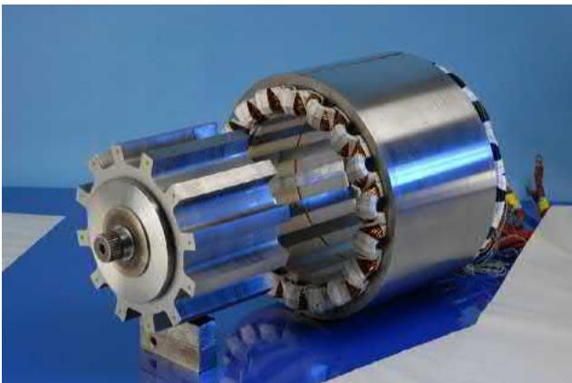

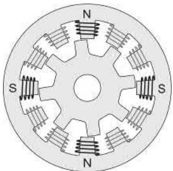

几个工程要点：

1. **单极性供电**：磁阻转矩不认电流方向，每个开关管永远串着绕组——**从电路结构上消灭了直通短路风险**，不用留死区时间；
2. **高度饱和设计**：磁路故意干到深度饱和才能高效能量转换——代价是**没有简洁的等效电路**，设计靠有限元，控制靠“电流-磁链-位置-转矩”数字地图查表，电机和驱动必须成套设计成套卖；
3. **运行特性**：低速斩波恒流，中高速“单脉冲”模式（开头全正压、结尾全负压，磁链三角波）；基速以下恒转矩、以上恒功率——和其他调速驱动一个套路；四象限没问题；
4. **看家本领与短板**：零速/极低速大转矩的持续运行效率优于大多数对手；短板是低速转矩纹波和噪声要花功夫压，而且市场被永磁和感应+好算法两面夹击，始终没成主流——但在矿用、家电压缩机、高温高速等特定场合里它就是那把最顺手的锤子。

### 📜 老列的五条铁律

| # | 铁律 | 一句话解释 |
| --- | --- | --- |
| 1 | 一脉冲一步，开环定位 | 脉冲数定位置、频率定转速，不装编码器也能干位置控制 |
| 2 | 步距角 = 360°/(齿数×相数) | 想要小步距就得多齿，1.8° = 50 齿 × 4 相 |
| 3 | 性能看驱动，不看铭牌 | 同一台电机，恒压/强迫/斩波驱动的曲线差出十倍 |
| 4 | 开环的命门是丢步 | 起停要 ramping、避共振坔陷，丢一步全盘计数作废 |
| 5 | SR = 皱实换精致 | 转子无绕组无磁钢，低速大转矩高效；代价是纹波噪声和成套定制 |

### 🧮 思考题（对应原书 10.9）

1. 为什么“双相通电”模式下的步位不如“单相通电”定义得准？
2. 什么是 detent（定位）转矩？哪类电机才有？
3. “保持转矩”指的是什么？
4. 三相 VR 步进电机静态转矩曲线近似正弦，额定电流下峰值 0.8 N·m。带 0.25 N·m 稳定负载时，步位误差是多少？
5. 接上题：恒流驱动下的低速牵出转矩约是多少？
6. 某 1.8° 混合式电机步位附近转矩-角度斜率为 2 N·m/度，总惯量 1.8×10⁻³ kg·m²，估算单步后的振荡频率。
7. 求步距角：(a) 三相 VR，定子 12 齿、转子 8 齿；(b) 四相单极性混合式，转子 50 齿。
8. 拿到一台无铭牌步进电机，做什么简单试验能判断它是 VR 型还是混合式？
9. 把 1.8° 混合式的两相分别接 60Hz 工频（其中一相移相 90°），电机会跑多快？
10. 碎碎念里那位科学家的 40cm 铝指针为什么每步狂摆近两秒才停？（提示：惯量与固有频率、阻尼比）

### 📝 后续计划

电机家族到这里全部亮相完毕。【笔记 11】是本系列的收官之作：**驱动选型**——功率、转速、转矩、负载特性、工作制、防护等级……把前面十篇的家当“变现”成一张能直接上手的选型地图。敬请期待。

---

教材里有个段子老列看一次笑一次：一位实验室科学家听说步进电机几毫秒就能走完一步，兴冲冲地在 4 厘米的小电机轴上装了根 40 厘米长的铝指针做显示盘，结果每走一步指针狂摆两秒才停。他忘了惯量：单步响应是个二阶振荡系统，阻尼比低到 0.1，长杆子的惯量一上，固有频率直接拖进泥地。**数据手册上的漂亮指标，从来都默认“合理的负载”——把自己的负载惯量算清楚，是选步进电机的第一课。**

你调试步进电机时碰过莫名其妙的共振坔陷吗？最后是加阻尼器解决的还是改曲线冲过去的？评论区聊聊。

  <strong>觉得有收获的话，老规矩，</strong> 
  <strong>点赞、在看、转发三连伺候，老列给你比个心。</strong>  
  👇👇👇

---

> 推荐关注公众号「探物及理」，探万物之然，及万理之源。
>
> 
