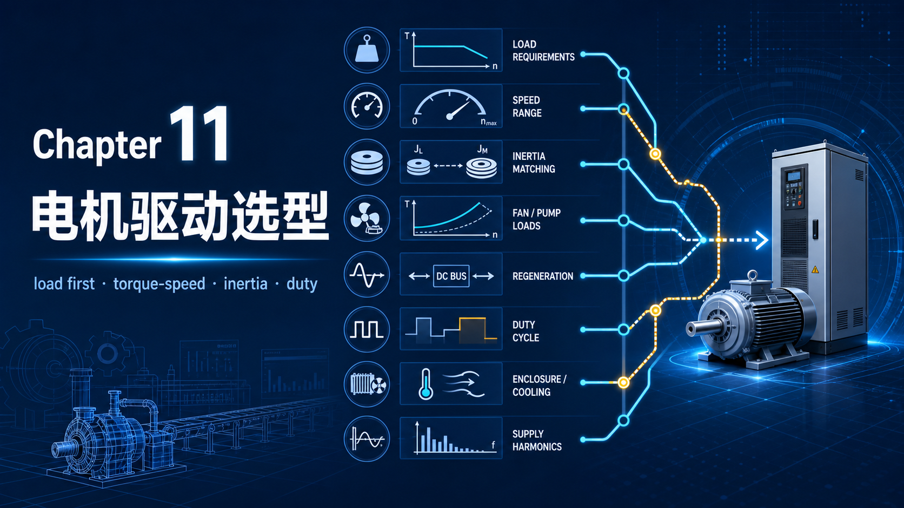
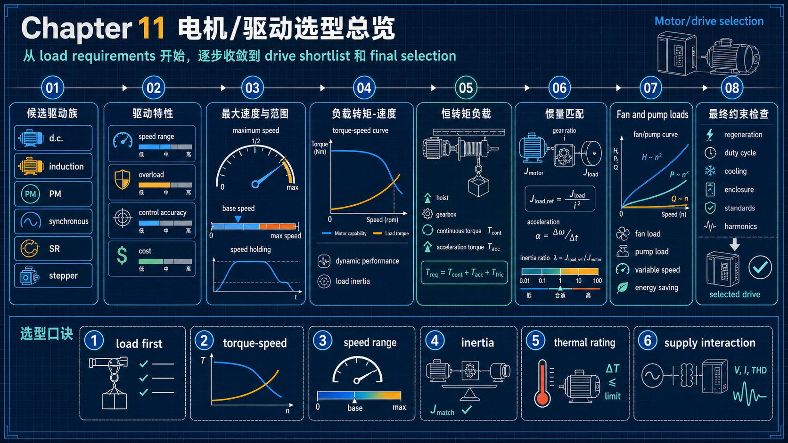
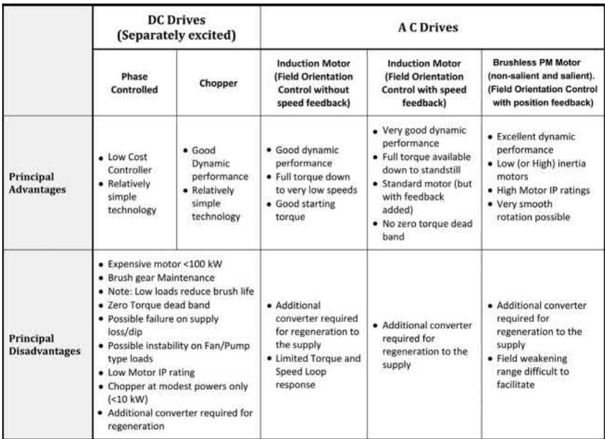
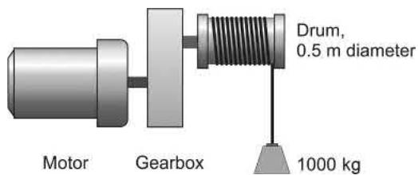
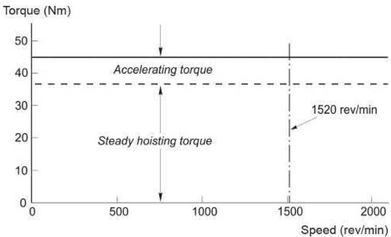
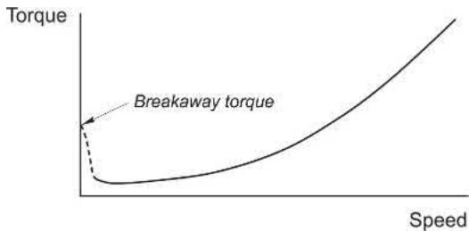

你好，我是老列 👋

从直流机到 [10-不装传感器也敢精确定位？老列拆解步进电机与开关磁阻的看家绝活](https://app.notion.com/p/10-d1a6e675c2254098ba82a01a6cf8c468?pvs=21)，电机家族已经全部亮相。今天是本系列的收官之作：**把十篇的家当变现成一张选型地图**。先泼一盆冷水：选型这事**没有铁律可依**——各类电机的能力圈大量重叠，同一个活往往三四种方案都能干。真正拉开差距的，是你把自己的**需求规格书**写得有多诚实：转矩-转速曲线、动态性能、负载惯量、工作制、环境、要不要回馈——用户最容易栗在这一步，而不是栗在选哪家的变频器。

---

## 【老列 驱动导论笔记 11】：电机与驱动选型

### 🗂️ 先盘店底：各路驱动的势力范围

| 驱动类型 | 典型功率段 | 典型最高转速 | 市场地位一句话 |
| --- | --- | --- | --- |
| 直流驱动（晶闸管/斩波） | 10 W～5 MW | 功率×转速 ≤ 约 3×10⁶ kW·rev/min | 存量市场为主：旧机改造、极简单场合、部分大功率 |
| 感应电机 + PWM 变频 | 到 3 MW（400/690V），中压可 ≥10 MW | 可达 40000 rpm 以上 | 工业主力，用量最大的驱动 |
| 无刷永磁（含 PM/Rel） | 10 W～500 kW（定制可更高） | 可达 70000 rpm 以上 | 高性能伺服首选；凸极型在车用市场高速增长 |
| 励磁同步机 | 2～20 MW+（中压） | 可达 10000 rpm | 巨型压缩机等少数重型场合 |
| 周波变流器（cycloconverter） | 500 kW～10 MW+ | 低于 30 Hz | 极低速极大功率（球磨机、矿井提升）的不二之选 |
| SR / 步进 / 软启动 | 1 kW～1 MW / 10 W～5 kW / 1 kW～1 MW | — | 各自的 niche：大启动转矩 / 开环定位 / 只管启动 |

再记几个拉开档次的硬指标（典型工业产品）：速度环响应——晶闸管直流 10Hz，无感矢控感应 50Hz，有感 150Hz，永磁伺服 ≥150Hz；稳速精度——从无感的 0.1% 到永磁带编码器的 0.0005%；制动能力——感应 150%，永磁 200% 以上；零速满转矩——无感感应做不到（约 2% 基速起），有感感应和永磁都行。

### 🏃 转速范围的两个常识和一个坑

- 大多数电机的甙蜜区在基速 1500～3000 rpm：功率密度和机械传动都舒服。**要低速，首选齿轮箱减速**，而不是买台大个头的低速电机（第一篇的老结论：同功率下转速越低体积越大）；
- 风机水泵类宽调速用标准感应电机+变频器即可；恒转矩负载要全速域运行，得盯住低速散热（第七篇的老坑）；
- **稳速精度的文字游戏**：指标按“基速的百分比”给出。0.2% 精度、基速 2000 rpm 的驱动，设定 100 rpm 时实际转速在 96～104 rpm 之间**仍然算达标**——低速精度要求高的场合，合同里请把转速点写死。

### 🏗️ 负载定义一切：把吐车例子走一遍

负载分两大类：**恒转矩型**（吐车、提升机、传送带）和**风机泵型**（T ∝ n²，P ∝ n³）。用教材的卷扬机例子把选型算流程走一遍，这是全书最值得抄进笔记本的一页：

1. **稳态转矩**：卷筒直径 0.5m，满载 1000kg → 缆绳张力 9810N × 半径 0.25m ≈ 2500 N·m；提升速度 0.5m/s 对应卷筒 19 rpm，配 80:1 减速箱 → 电机侧 1520 rpm，转矩除以 80 得 31 N·m，再加 20% 齿轮箱摩擦 → **37 N·m**；
2. **功率**：37 × 1520 × 2π/60 ≈ **5.9 kW**（用“负载侧 F×v = 4.9kW”交叉验算，差的 20% 正是齿轮箱损耗——**两头算一遍是好习惯**）；
3. **加速转矩**：惯量全部折算到电机轴——齿轮箱后的惯量除以 n²：吊载 1000kg 在卷筒上是 mr² = 62.5 kg·m²，折到电机侧只剩 0.01；加电机本体 0.02 和卷筒齿轮箱折算 0.02，共 **0.05 kg·m²**。1 秒内到全速 → 角加速度 160 rad/s² → 加速转矩 T = Jα = **8 N·m**；
4. **峰值需求**：37 + 8 = 45 N·m，全速域可用——但这是短时需求，落在 5.9kW 驱动的短时过载能力内，不必按 45 N·m 买大一号；
5. **别忘了下放**：重载下放时转矩方向不变、转速反向——进入第四象限，电机在发电。**吊车类负载必须选能持续回馈（或带大刹车电阻）的驱动**，这一条漏了就是事故。
6. **储能大小也要算一笔**：这台吊车全速动能 ½Jω² ≈ 633 焦——大约只有烧开一杯咖啡水所需能量的 1%，刹车电阻绰绰有余；但大惯量、高转速的场合（比如大锯机、离心机）动能会大到必须回馈电网——先算动能，再定“电阻散热还是回馈前端”。

风机泵型负载则友好得多：半速时功率只要大约 12%（恒转矩负载要 50%），标准感应电机+无感变频器闭着眼啺。唯一要注意低速段的**静摩擦/破壁转矩**，真实曲线不是纯二次方：

### ⚖️ 惯量匹配：加速最快的齿轮比

定位类应用（机床、分拣）里惯量主宰一切，齿轮比怎么选？结论优雅：**负载折算惯量 = 电机自身惯量时，负载加速度最大**——和电路里“负载电阻等于内阻时取最大功率”异曲同工。这也解释了为啥伺服电机厂家每个机座都备着高低两种惯量的转子。但记住：惯量匹配只保加速度最大，常和最高速要求打架，打架时一般速度优先。

### 🔥 工作制与额定：rms 功率法

电机的终极约束永远是温升，而损耗近似正比于功率平方，所以周期性负载按 **rms 功率**选机：例如“4kW 跑 2 分钟 → 空转 2 分钟 → 2kW 跑 2 分钟 → 空转 2 分钟”循环，平均功率 1.5kW，功率平方的均值 5 kW²，rms = √5 ≈ **2.24 kW**——按 2.24kW 连续额定选机即可，但要校核 4kW 段的 178% 转矩在过载能力内。两个附注：前提是电机热时间常数（大机上小时、中机十几分钟）远长于负载周期；而**变频器里功率器件的热时间常数是秒级**，短时峰值要单独报给驱动厂家。正式场合把转矩/转速-时间曲线画成图写进技术协议，IEC 60034-1 的 S1～S8 工作制分类拿来对号入座。

### 🌧️ 最后四道把关：防护、回馈、谐波、尺寸

1. **防护与冷却**：IP 两位数字，前防固体后防水。常规配置：直流机 IP21/23，感应机 IP44/54（美系叫 TEFC），永磁伺服 IP65/66（食品冲洗级）；
2. **回馈**：所有电机天生会发电，但基础款变频器不会。先问自己“真需要吗？”——非回馈驱动的降速只能靠滑行，响应天生不对称；能量小用刹车电阻，能量大才上回馈前端（第七篇老话重提）；
3. **谐波**：变频器多了，供电部门的谐波限值就找上门。滤波器设计需要电网阻抗参数，弄不好还会谐振——**把这个责任写进合同丢给驱动供应商**（谐波电流测量本身也有讲究，IEC 61000-4-7 是现成的依据）；
4. **尺寸与安装标准**：感应机、直流机的机座号、轴径、中心高、接线盒方位标准化很好，坏了随便换；永磁伺服恰恰**标准化很差**——同功率各家尺寸五花八门，选型锁定前把安装接口画进图纸。教材还打趣：正是没有标准束缚，永磁电机的创新反而更快，而感应电机被自己的成功“标准化”捆住了手脚。

### 📜 老列的五条铁律（选型版）

| # | 铁律 | 一句话解释 |
| --- | --- | --- |
| 1 | 规格书比品牌重要 | 转矩曲线、惯量、工作制、环境、回馈需求，写诚实了选型自然浮现 |
| 2 | 稳态+动态两本账分开算 | 稳态转矩定额定功率，Jα 定峰值转矩，峰值走过载能力 |
| 3 | 惯量都折到电机轴再说话 | 齿轮箱后惯量除以 n²；惯量匹配加速最快，但常要给最高速让路 |
| 4 | 周期负载按 rms 功率选机 | 额定看温升，温升看损耗平方均值；变频器的秒级热常数另算 |
| 5 | 回馈、防护、谐波前置确认 | 吊车必须回馈，环境定 IP，谐波责任写进合同 |

### 🧮 思考题（对应原书 11.6）

1. 某 1500 rpm 驱动稳速精度标 0.5%（按基速计）。速度给定 75 rpm 时，实际转速允许落在哪个区间还算达标？
2. 伺服电机经同步带驱动惯性负载：电机侧 12 齿带轮，电机+带轮惯量 0.001 kg·m²，负载（含带轮）0.009 kg·m²。负载带轮取多少齿时加速度最大？
3. 设温升按指数曲线、终值正比于损耗、损耗正比于功率平方：热时间常数 30 分钟的电机冷态启动、过载 60% 运行，能撑多久？
4. 某数控主轴最高 10000 rpm、全速域满转矩、峰值约 1.2kW，想用直驱电机——有哪些选项？还需要补充什么信息才能定方案？
5. 把原来工频直挂的吊车感应电机改成变频调速，若要长时间低速运行，应预防什么问题？
6. 列举两个不适合用有刷直流电机的调速场合，并各给一个替代方案。
7. 标准感应电机能短时输出两倍满载转矩，标准变频器却只能到额定输出——这个差别从哪来？
8. 水泵负载：约 1400 rpm 下 60 N·m 跑 1 分钟，再空转 5 分钟，循环往复。从 2.2/3/4/5.5/7.5/11/15kW 系列（满载转差约 5%，牵出转矩 200%）里选极数和功率，并估算带泵时的运行转速。
9. 50kW、基速 1200 rpm 的锯机驱动：从静止到 1180 rpm 匀加速用时 4 秒。估算电机+锯的总惯量与全速动能，并与前 4 秒输入的能量对比（说明你的假设）。
10. 接上题：空载全速断电后转速近似线性下降，20 秒掉到 90% 基速。估算摩擦转矩占满载转矩的百分比，并说明这个结果如何佐证上题的近似。

### 📝 后续计划

【老列 驱动导论笔记】到这里**正式收官**。十一篇走下来：从磁路基本功到直流双环，从旋转磁场到 V/f 与 FOC，从永磁家族到步进与 SR，最后落在选型地图上。建议的复习路径：把每篇的“五条铁律”连起来读一遍，五十五条铁律就是这门课的骨架。后面若有番外（延伸书单、工程案例复盘），老列会以号外形式加餐。

---

收官之夜，讲个真事。老列见过一个项目，用户招标文件只写了一句“需变频调速，功率 55kW”。中标的供应商按风机泵负载报了基础款，结果现场是个频繁正反转的卷扬机——没回馈、没刹车电阻、没零速满转矩，设备到场才发现全得推倒重来，工期赔进去小半年。**选型的钱从来不是花在设备上，是花在把需求想清楚上。**这个系列十一篇，其实就是带你把“想清楚”需要的家当一件件备齐。

陈词滥调一回：感谢一路追到这里的你。哪一篇对你帮助最大？还想看老列拆哪本书？评论区聊聊。

  <strong>老规矩最后一次，</strong> 
  <strong>点赞、在看、转发三连伺候，老列给你比个大大的心。</strong>  
  👇👇👇

---

> 推荐关注公众号「探物及理」，探万物之然，及万理之源。
>
> 
