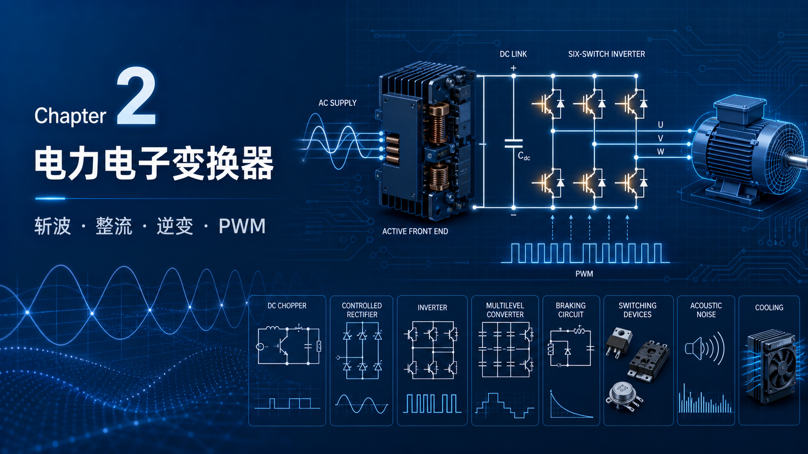

你好！我是老列。👋

上一章说，电机的转矩离不开电流，速度又绕不开端电压和反电势。可现实的电源并不配合：电网给你的是固定频率、固定电压的交流，电池给你的是固定电压的直流；电机却要在每一个时刻拿到“此刻刚好合适”的电压、电流、频率，甚至还要能把能量送回去。

这中间干活的，就是**功率电子变换器**。

如果把电机比作一匹力气很大的马，变换器就是它的**油门 + 方向盘 + 刹车**：油门决定给多少电压和电流，方向盘安排三相磁场往哪边转，刹车则决定减速时那股能量是烧掉还是送回电网。

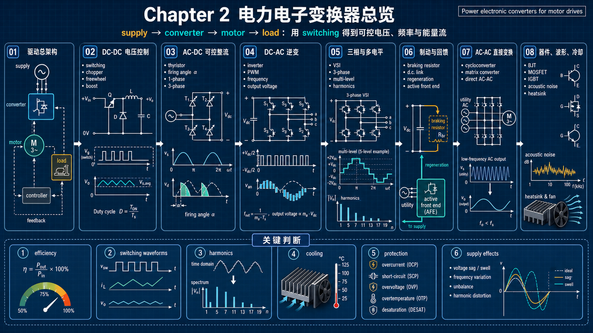

> 本章先给结论：功率变换器的秘诀不是把电“慢慢调小”，而是让器件尽量只处于“完全导通”和“完全关断”两种状态，再用高速开关的时间比例合成目标电压。高效率来自开关；纹波、谐波、噪声和散热，代价也随之而来。

---

## 2.1 为什么电机离不开功率变换器

变换器可以从直流源或 50/60 Hz 电网取能，向电机交付直流或交流输出。它不是某一种固定电路，而是一套通用能力：

- **直流变直流**：调节电枢或电池侧电压；
- **交流变直流**：可控整流，为直流机或直流母线供电；
- **直流变交流**：逆变，合成可变频、可变压的三相输出；
- **交流直接变交流**：在特定大功率或特殊场景下省去直流母线。

功率器件持续进步——开关更快、导通损耗更低、耐压耐温更高——但“怎样安排能量路径”的拓扑逻辑并没有改变。别把某个电路与某一种器件硬绑定：同一拓扑常可用不同器件实现，取决于功率、耐压、开关频率和成本。

先把四类能量变换记成一张表，后面的电路都只是它的具体实现：

| 能量变换 | 输入 → 输出 | 典型用途 | 读这一章要抓住的动作 |
| --- | --- | --- | --- |
| 整流 | AC → DC | 直流驱动、变频器直流母线 | 选择何时从交流源取能 |
| 斩波 | DC → DC | 电池调速、直流母线调压 | 用占空比控制平均直流电压 |
| 逆变 | DC → AC | 交流电机、UPS | 用桥臂合成频率与幅值可调的交流 |
| 直接 AC-AC | AC → AC | 超大功率低速、特种集成驱动 | 直接拼接输入交流的瞬时电压 |

### 2.1.1 一套完整驱动，谁在管什么？

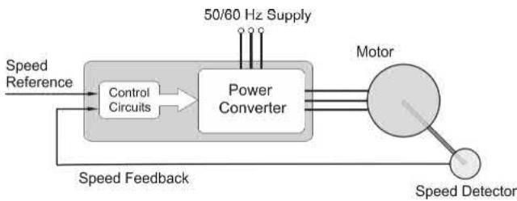

图中可以把系统拆成两层：

- **功率级**：整流器、直流母线、逆变桥等，大电流从这里流过；
- **控制级**：接收速度、转矩或位置给定，采样电流/电压/速度，输出很小的门极或触发信号。

电流反馈几乎是所有驱动的标配：它既用于快速过流保护，也直接对应电机转矩。速度反馈则不一定需要真实测速机；许多中低端驱动会结合电压、电流、频率和电机模型估算速度。

还有一个经常被忽略的事实：变换器储能通常很少。电机突然要更多功率，供电侧也会几乎立刻看到更大的取电电流；供电阻抗会造成电压暂降，单相电网在电压过零瞬间甚至无法立即提供功率。直流母线电容、平波电感能缓冲很短的瞬态，却不能把电网和负载彻底隔开。

## 2.2 直流变直流：可调直流电压从哪里来

从电池或直流母线给直流电机调速，最直观的需求是改变平均电压。问题在于：怎样调才不把能量烧成热？

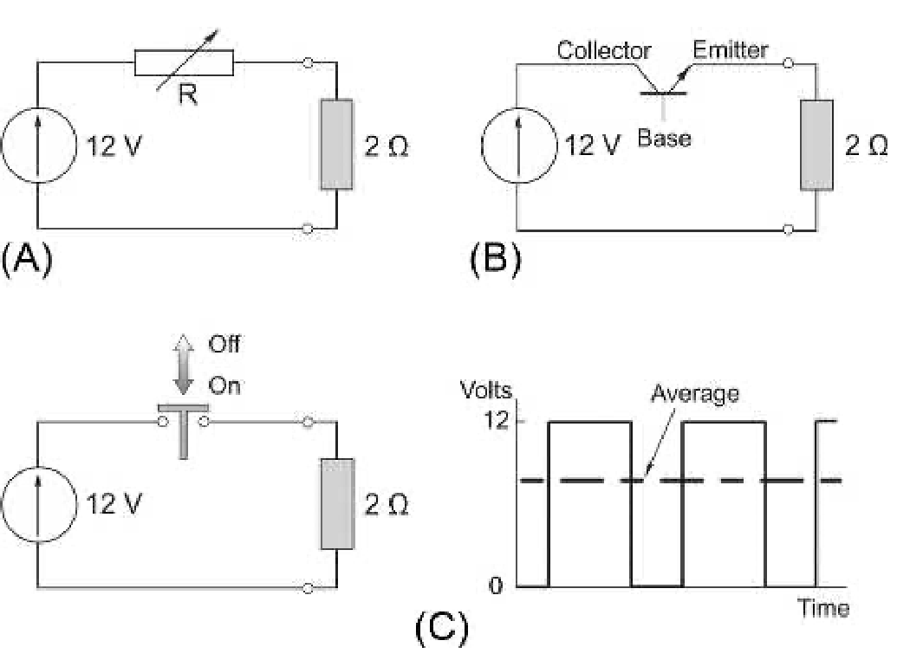

以 12 V 电源、2 Ω 电阻负载为例，若想把负载电压降到 6 V：串联电阻方案中电流为 3 A，负载得到 18 W，串联电阻同样烧掉 18 W，效率仅 50%。电压越低，效率越差。

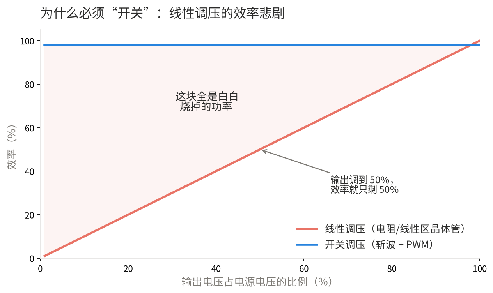

这也是功率电子为什么不愿让晶体管长期处于“半开半闭”的原因：只要它同时承受明显电压和电流，它本质上就是一只昂贵的电阻。效率问题不是控制算法能补救的，而是能量守恒在记账。

### 2.2.1 开关控制：别让器件停在最难受的位置

线性晶体管看似可以替代可变电阻，但晶体管工作在线性区时，同样承受大电压和大电流，耗散巨大。高效功率电子的策略恰好相反：

- **导通时**：器件压降很小，电流可流过；
- **关断时**：器件电流近零，承受电压也几乎不耗功；
- **切换瞬间**：同时存在电压和电流，仍有损耗，因此切换要足够快、频率也不能无限提高。

让开关以固定频率反复通断，改变每周期导通时间 $t_{on}$ 占周期 $T$ 的比例 $D=t_{on}/T$，便能将平均输出从 0 连续调到输入电压。这就是 PWM（脉宽调制）。

### 2.2.2 晶体管斩波器：直流被“切碎”后为何还能可控

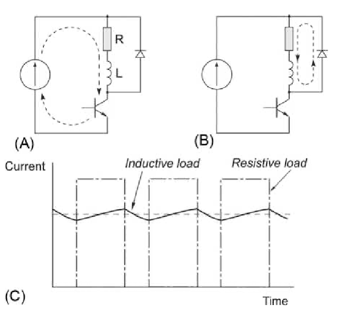

对理想降压斩波器、平滑电流负载，平均输出近似为：

$$
V_o=D V_{dc}
$$

占空比 50% 时，12 V 电源可得到约 6 V 平均输出。开关完全导通或关断时损耗低，所以效率远高于线性调压。对电机这样的感性负载，绕组电感会让电流比电压平滑得多，电机主要“感受”平均电压与平均电流，而不是每一个高频脉冲。

这里有一个特别适合建立直觉的“双重缓冲”：绕组电感以 $L/R$ 时间常数限制电流纹波，转子惯量又把残余转矩纹波进一步滤成平稳转速。因此 PWM 输出在示波器上是一排脉冲，轴端却可以转得很平顺。它并不意味着纹波完全不存在——开关频率过低时仍会带来电流脉动、噪声和附加发热——但解释了为什么“切碎的直流”能被电机高效利用。

### 2.2.3 感性负载与过压保护：续流二极管不是可有可无的配角

电感的基本脾气是：**电流不能瞬间改变**。当斩波器主开关关断时，电机电感仍试图维持原方向电流；若不给它通路，电感会把端电压猛然抬高，直到击穿器件或形成其他放电路径。

续流二极管给这股电流提供低压回路，主开关关断后，电流在绕组和二极管之间“自由续流”。二极管的核心作用不是消耗电感储能，而是让电感电流在安全电压下延续；能量会在电机电阻、反电势或后续开关周期中逐步流动。吸收网络、钳位和合理布局用于进一步限制过冲与振铃。

### 2.2.4 升压变换器：为什么关断后电压反而更高

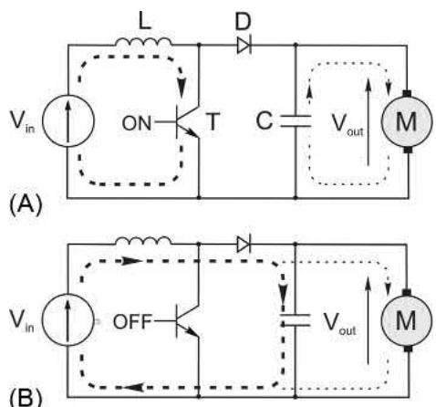

主开关导通时，电感从输入吸能；关断时，电感电压极性翻转，与输入电压串联，经二极管向输出送能，因此输出可高于输入。升压变换器适合把低压电池抬升到高压直流母线，但它不凭空制造功率：输出功率受输入电流、开关和电感额定值严格限制。

## 2.3 交流变直流：可控整流如何改变平均直流电压

二极管整流桥只能被动地把交流“翻正”；想调节平均直流输出，就需要可控硅等能选择导通时刻的器件。

### 2.3.1 可控硅：能开、却不能随意关

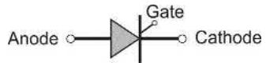

可控硅由阳极、阴极和门极组成。阳极为正且给门极一个触发脉冲后，它会锁定导通；门极信号撤掉也不会关断，通常要等主电流自然降到保持电流以下。这个特性非常适合依赖交流过零换相的相控整流，却不适合直接构成需要随时开关的 PWM 逆变器。

### 2.3.2 单脉波整流：从一个脉冲理解触发角

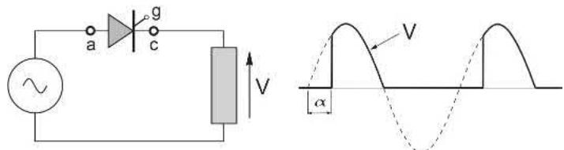

设电源电压过零后延迟 $\alpha$ 再触发：$\alpha$ 越大，导通区越短，负载得到的平均电压越低。单脉波纹波很大，工程上主要用于理解“触发角控制”而非大功率电机驱动。

### 2.3.3 单相全控桥：阻性负载与电机负载不是一回事

全控桥在每半周由一对可控硅导通，输出成为全波脉动直流。

#### 阻性负载

阻性负载电流与电压同相：触发前电流为零，触发后立刻随电压变化，电源过零时自然结束。$\alpha=45^\circ$ 时输出平均值为正；$\alpha=135^\circ$ 时，虽然可以触发，阻性负载却不能维持跨越负半周的电流，不能简单理解为“开始向电网回馈”。

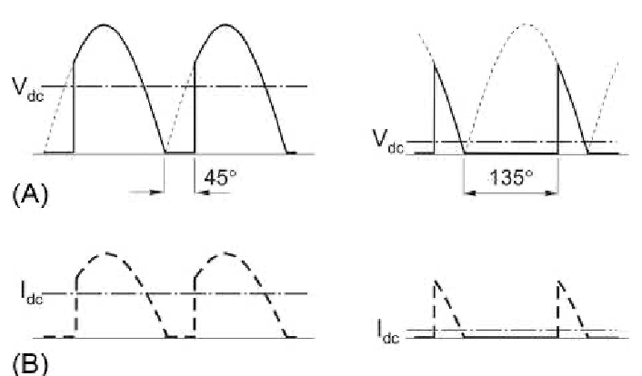

#### 感性（电机）负载

电机电枢含有显著电感和反电势，电流可近似连续。新的可控硅对被触发后，电流从原来的一对器件换到新的一对；因为电流不断，输出电压波形可以延续到电网电压为负的区间。此时平均电压由触发角连续控制：小于 $90^\circ$ 时通常整流供能，接近 $90^\circ$ 平均值为零，大于 $90^\circ$ 且直流侧有足够反电势时可进入逆变/回馈。

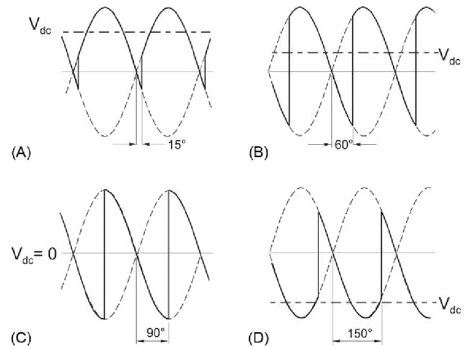

### 2.3.4 三相全控桥：工业直流驱动的经典供电方式

三相全控桥有六个可控硅，每 $60^\circ$ 电角度换相一次。相比单相，全桥输出纹波更小、平均电压更高、功率能力更大。任一时刻由上桥臂一个器件和下桥臂一个器件导通，负载接到当时最合适的两相线电压上。

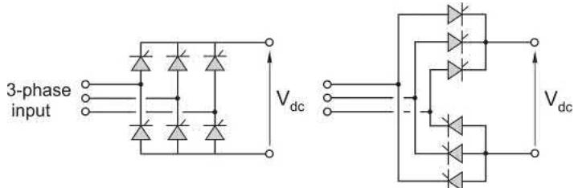

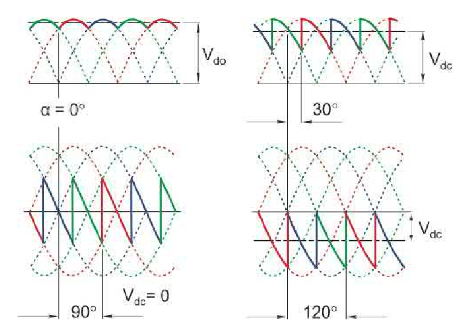

### 2.3.5 输出电压范围与 2.3.6 触发电路

理想、连续电流条件下，平均直流电压与 $\cos\alpha$ 成正比。实际范围还会被电源电感造成的换相重叠、器件压降和安全换相裕量压缩。触发电路必须与电网相位同步，并按正确顺序向六个器件提供足够可靠的门极脉冲；少一个脉冲或相序错误，都可能变成严重故障。

## 2.4 直流变交流：逆变器怎样“画出”交流

### 2.4.1 单相逆变器：桥臂轮流接通正、负母线

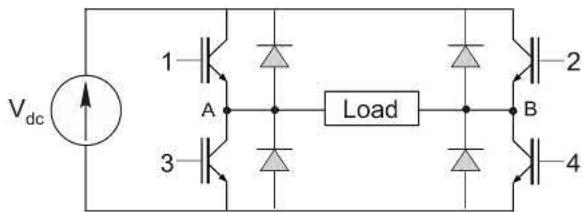

单相 H 桥用四个可控开关把负载两端交替接到直流母线正、负极，从而合成正、负电压。对纯电阻负载，电流跟随方波电压；对电机这种感性负载，电流更平滑、滞后，并在器件关断时经反并联二极管续流。

方波包含丰富低次谐波，电机虽然会因自身电感滤掉一部分电流谐波，仍会带来附加损耗、转矩脉动和噪声。因此现代驱动通常不满足于“能反向”，还要控制波形质量。

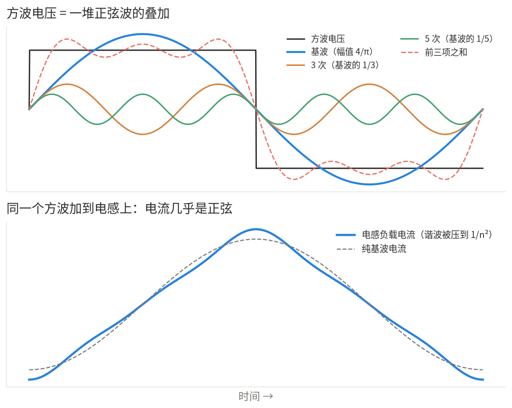

从频域看，方波由基波和一串奇次谐波叠加而成；而电感的感抗 $X_L=2\pi fL$ 与频率成正比。谐波次数越高，看到的阻抗越大，形成的电流越小。PWM 的进一步价值就在于：它把主要谐波推到远高于基波的开关频率附近，让电机漏感更容易把它们滤掉。

### 2.4.2 输出电压控制：PWM 的四种状态

PWM 在一个开关周期里，用高频脉冲的面积逼近低频正弦参考。对单相桥，常把开关过程分为 A–D 四种模式：

- **Mode A**：一对对角开关导通，负载看到正直流母线电压；
- **Mode B**：另一对对角开关导通，负载看到负直流母线电压；
- **Mode C**：两端被钳到同一母线，负载电压为零，感性电流续流；
- **Mode D**：另一种零电压/续流状态，同样用于安排电流路径和开关损耗。

改变正、负和零矢量在周期中的停留时间，便可同时控制基波幅值和频率。PWM 的关键价值是把大部分谐波移到较高频段，交给电机漏感和滤波网络处理；代价是开关次数增加、开关损耗上升。

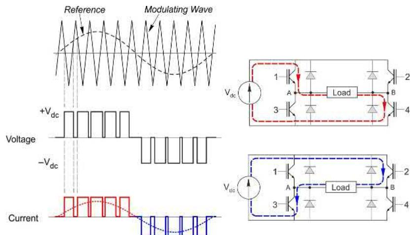

### 2.4.3 三相逆变器：给旋转磁场供电的标准答案

三条桥臂分别驱动 A、B、C 三相，每条桥臂上下管必须互锁并留出死区，防止直流母线短路。三相开关状态组合形成不同空间电压矢量；用正弦 PWM 或空间矢量 PWM 安排它们，便能得到幅值、频率可调的近似正弦三相电压。

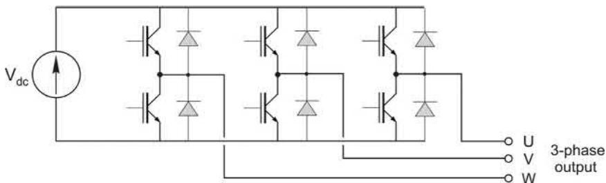

### 2.4.4 多电平逆变器：用更多台阶换更好的波形

两电平逆变器的相电压只有少数几个电平。到了兆瓦级、数千伏级的中高压场合，问题会突然变得很现实：单个开关管的耐压不够，直接把器件串联又会遇到**动态分压不均**——开关特性哪怕只差一点，瞬态电压就可能集中压在最慢关断的那一只器件上。

工程师的解法很有意思：不再让一只开关管硬扛全部母线电压，而是用电容或独立直流源把母线分成多个等级，让器件“各守一层楼”。输出时不再从 $+V_{dc}/2$ 一步跳到 $-V_{dc}/2$，而是经过多个中间电平，像下台阶一样逐级逼近正弦——这就是多电平逆变器。

它带来的收益不止是耐压分摊：

- **每只器件承受的电压更低**，可用较成熟的器件组合实现更高系统电压；
- **电压台阶更细**，输出基波更接近正弦、谐波更低；
- **$dv/dt$ 更温和**，对电机绕组绝缘、长电缆反射电压和轴承电流都更友好；
- 在相同波形质量要求下，可降低开关频率，进而减少开关损耗。

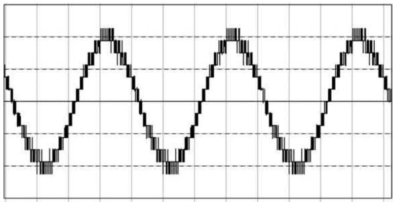

当然，台阶不是白送的。电平数越多，器件、驱动电源和采样保护越多；直流母线各电容的电压必须维持均衡，故障状态的旁路与保护逻辑也更复杂。因此多电平不是低压小功率场合的默认答案，却是中高压大功率驱动中非常重要的“搭台阶”哲学。

### 2.4.5 制动：再生能量往哪里去？

减速或下放负载时，电机转为发电机，能量回灌直流母线，使母线电压上升。若前端是普通二极管桥，能量无法回电网，常用制动斩波器把多余能量导向制动电阻；若不及时处理，母线过压会迫使驱动跳闸。

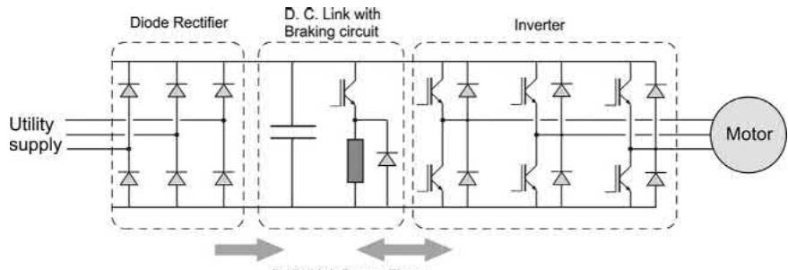

### 2.4.6 有源前端：让能量可控地回到电网

有源前端（AFE）以可控开关替代二极管前端，可双向控制能量流：驱动时从电网整流，制动时向电网回馈。它还能使网侧电流更接近正弦并改善功率因数，但控制、滤波与成本更高，适用于频繁再生或大功率场合。

## 2.5 交流直接变交流：不用直流母线的两条路线

### 2.5.1 交交变频器

交交变频器用两组反并联相控桥直接从工频电网拼出低频交流。它适合极低输出频率、很大功率的场合，例如大型磨机或船舶推进；输出频率通常低于输入频率的较小比例，谐波与供电侧影响也比较突出。

### 2.5.2 矩阵变换器

矩阵变换器用双向开关矩阵把任意输入相在合适时刻接到输出相，直接合成所需三相电压。没有大直流母线电容是其特色，但开关必须能安全双向导通/关断，调制复杂，且最大输出电压约受限于输入的 86%，因此应用多集中于特定场景。

## 2.6 逆变器开关器件：三种常见名字到底差在哪

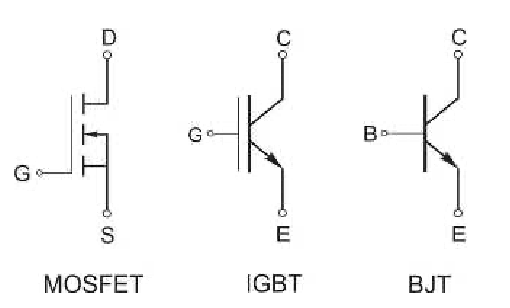

### 2.6.1 BJT

双极型晶体管用基极电流控制集电极电流。导通压降低、主回路损耗可以较小，但维持驱动需要持续基极功率，驱动麻烦，如今在新型驱动中已大多被后两者取代。

### 2.6.2 MOSFET

MOSFET 由栅源电压控制，栅极电容充完后维持功率很小，开关很快，适合低中压高频场景。其导通损耗表现为 $R_{DS(on)}$，耐压升高时电阻往往不利，因此并非所有功率段都占优。

### 2.6.3 IGBT

IGBT 把 MOSFET 易驱动的栅极和 BJT 较低导通损耗的优点结合起来，长期主导中压、中大功率变频器。今天的 SiC、GaN 等宽禁带器件能进一步提高开关频率和耐温能力，但“导通损耗—开关损耗—散热—成本”的选择题依旧存在。

几种开关器件都有自己的舒适区，可不能乱用。把它们放到工程语境中看会更清楚：

| 器件 | 驱动方式 | 强项 | 常见舒适区 |
| --- | --- | --- | --- |
| 可控硅（SCR） | 门极触发、自然关断 | 耐压大、适合工频换相 | 相控整流、大功率工频变换 |
| BJT | 电流驱动 | 导通压降低 | 早期中小功率开关 |
| MOSFET | 电压驱动 | 速度快、适合高频 | 低中压、高开关频率 |
| IGBT | 电压驱动 | 耐压/电流/损耗均衡 | 工业变频器的主力功率段 |
| SiC / GaN | 电压驱动 | 高频、高温、低开关损耗 | 高功率密度、车载与高频场景 |

*选器件不是选“最先进”，而是在母线电压、电流、开关频率、冷却和成本几条约束下选最合适。*

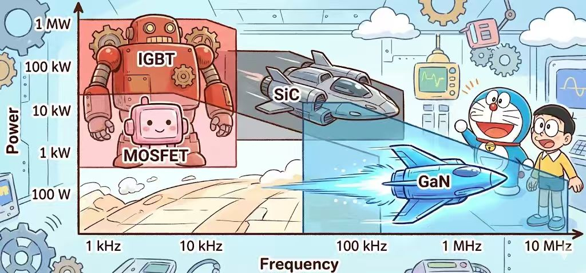

## 2.7 真实波形、噪声与散热：示波器上不会只有教科书方波

实际开关边沿会和寄生电感、电容共同形成振铃；吸收回路、母排布局和栅极驱动用于限制它，但完全消除通常不经济。开关频率及其谐波会带来可闻啸叫；把频率抬出听觉范围能降低听感，却会增加开关损耗，因此是典型取舍。

把这笔取舍说得更直白一点：开关频率低时，电流纹波大、低频电磁噪声更明显；频率高时，电流更平滑、声音更容易避开可听范围，但每秒要经历更多“电压和电流重叠”的切换，器件发热更严重。载波频率设置从来不是越高越好，而是在噪声、效率、EMC、器件能力和散热余量之间找平衡。

### 2.7.1 热阻：结温是最后的红线

半导体的热从结区流到壳体、散热器，再流向环境。总热阻以 $^\circ\mathrm{C/W}$ 表示：每耗散 1 W，结温相对环境上升多少度。稳态近似为：

$$
T_j=T_a+P_{loss}R_{\theta ja}
$$

器件厂家主要决定结—壳热阻；驱动设计者则要处理壳—散热器界面与散热器—空气的热阻。导热脂、平整压紧面、绝缘垫片都会改变结果；液冷在车载等已有冷却回路的场景中也很常见。

### 2.7.2 散热器与强迫风冷：风量不是越大越划算

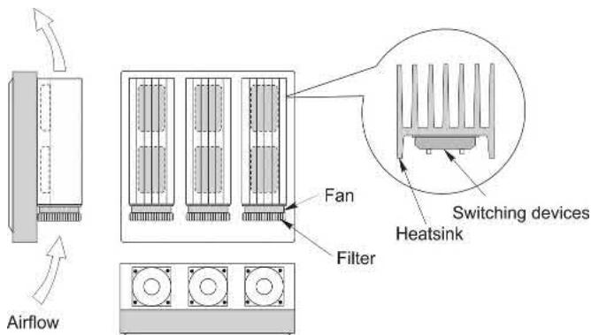

翅片增大表面积，垂直安装利于自然对流；强迫风冷可大幅降低热阻，例如适度风速就可能使热阻约减半。但继续加大风速会有边际收益递减，同时增加风扇噪声、耗电和可靠性负担。高压器件的安装面还可能带电，绝缘与热阻之间也需要权衡；集成功率模块用电气隔离底板能简化这一问题。

---

## 写在最后：把这一章变成一张脑内地图

功率变换器的所有花样，归根结底都在回答三个问题：

1. **能量从哪来、到哪去？**——整流、逆变、制动和回馈决定方向；
2. **电压和电流怎么被调到目标值？**——触发角或 PWM 的时间比例决定平均效果；
3. **代价由谁承担？**——电机承担谐波与噪声，电网承担谐波与无功，功率器件和散热系统承担损耗与热。

### 老列的五条铁律

| 铁律 | 留在脑子里的版本 |
| --- | --- |
| 高效变换，必靠开关 | 半开半闭就是电阻，是电阻就必然发热。 |
| 电流通常比电压平滑 | 电感拒绝电流突变，绕组和惯量都在替 PWM “减震”。 |
| 电感需要出路 | 开关一关，续流二极管/续流通道就是器件的保命线。 |
| 开关频率是双刃剑 | 高频改善波形与听感，也增加开关损耗和热。 |
| 散热是半条命 | 结温超限一次，就可能带来不可逆的器件损伤。 |

下一章我们回到直流电机本体。你会发现，变换器所做的一切，最终都是为了更精确地操纵那条最朴素的因果链：**电流给转矩，电压给速度。**

如果你觉得有收获，请点个“在看”，转发给正在学驱动的朋友吧！⚡

  <strong>如果觉得这篇文章对你有帮助，</strong> 
  <strong>别忘了点赞、在看、分享三连哦！</strong>  
  👇👇👇

---

> 推荐朋友关注公众号“探物及理”，谢谢各位。
>
> 
