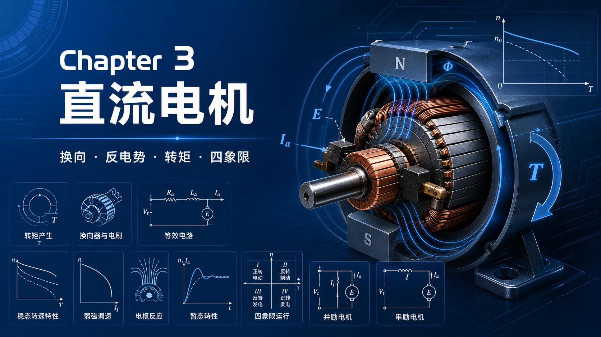

你好，我是老列 👋

上一篇 [变频器到底在忙什么？从一只开关管看懂电机驱动的功率电子底座](https://mp.weixin.qq.com/s/9rNjg2KROGyYP8eeAtYjAg) 里，咱们把电机的"管家"——电力电子变换器拆了个底朝天，知道了"开关"才是调压调频的正道。这一篇，轮到第一位主角登场：**有刷直流电机**。

肯定有同学抬杠："都 2026 年了，工业界都在卷永磁同步和 SiC，你还讲带碳刷的老古董？"老列的回答是：**恰恰因为它简单透明，它才是理解一切电机驱动的"标准答案"**。往后讲矢量控制你就会发现——FOC 折腾了半天坐标变换，目的就一个：把交流电机"伪装"成今天这台直流电机来控制。

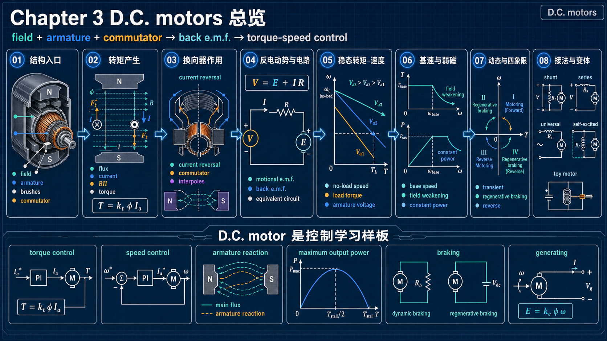

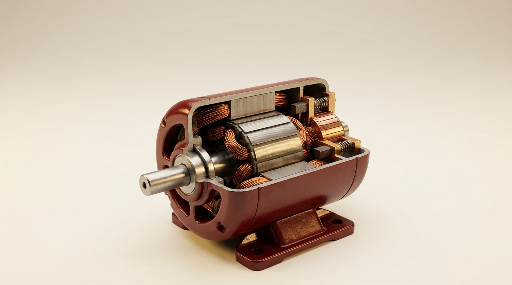

---

## 【老列 驱动导论笔记 03】：直流电机——两个公式打天下的"老师傅"

### 🔧 序言：先学"过气"的它，是走捷径

直流电机的美，在于它的**因果链条短得惊人**：电压定转速、电流定转矩，两个线性公式就能把稳态、动态、制动、弱磁全讲明白。别的电机学起来像解方程组，它像做口算。把这台"老师傅"吃透了，后面九章全是它的变奏曲。

### 🧲 拆开看：定子搭台，电枢唱戏

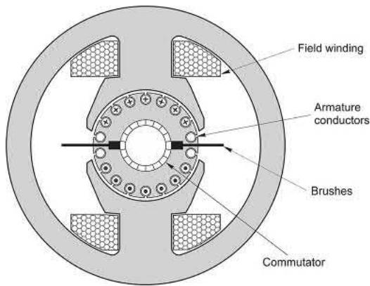

结构上就两大件：

- **定子（搭台的）**：励磁绕组（端子 E1/E2）或者干脆一块永磁体，负责提供一个**恒定磁场**。小功率用铁氧体永磁，高档货用钕铁硼；
- **转子（唱戏的，行话叫"电枢"，端子 A1/A2）**：槽里嵌满导体，尾部接一圈铜片——**换向器**，再由**碳刷**把电流从静止世界送进旋转世界。

顺便说两个工程冷知识：电刷上有 0.5~1V 的固定压降，所以直流电机**做不了太低的电压**（一般 6V 起步）；换向器片间绝缘又限制了上限（约 700V）。转速嘛，大电机一般不超过 3000 rpm，小玩具电机倒是能飙到 12000 rpm。

另外补一个容易忽略的细节：转子铁芯不是整块钢，而是一片片不到 1mm、彼此绝缘的**叠片**压出来的——铁芯跟着导体一起切割磁场，也会感应电动势，不叠片的话涡流在里面横冲直撞，白白发热不说，还倒拖一把制动转矩。所以

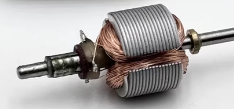

### 🔄 换向器：装在转子上的"机械整流器"

先看一张关键图——不管转子转到什么角度，电流的"花样"始终不变：

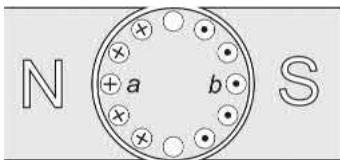

N 极下的导体，电流**永远**朝纸面里；S 极下的**永远**朝外。这样每根导体受的力才能始终往同一个方向拧，转矩才不打架。

可导体是跟着转子转的呀，从 N 极下转到 S 极下，电流方向就必须翻面。谁来翻？就是换向器：

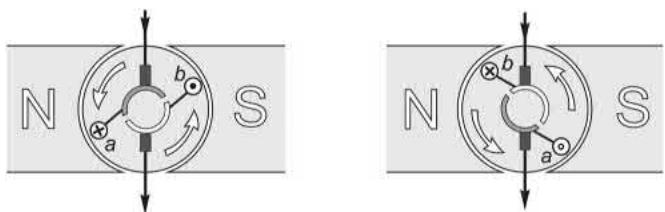

导体 a、b 每越过一次磁极中性面，换向器就把它们的电流"啪"地反一次向。**外面喂的是直流，转子里流的其实是交流**——这就是一台用铜片和碳刷做的"机械逆变器"。上一篇里咱们用 IGBT 干的活儿，人家一百多年前就用机械结构实现了。代价也明摆着：火花、磨损、定期换碳刷。

火花是哪来的？电枢线圈有**电感**，电流"翻面"翻不利索——电刷都滑离铜片了，电流还没反转完，剩下的磁能只好在电刷后沿拉个火花收场。小电机忍忍就算了；中大型绕组励磁电机会在主磁极之间加装几个小极，行话叫**换向极**：它的线圈用粗导线直接串在电枢回路里，磁通严格跟着电枢电流走，恰好在正在换向的线圈里感应出一个"助推"电动势，催着电流赶紧翻面，火花自然就小。永磁电机因为转子线圈附近没有定子铁，电感本来就小，一般不用装。

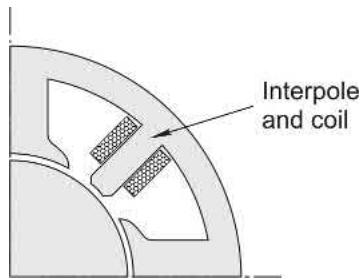

### 📐 两个公式打天下

直流电机的全部"内功心法"就两句：

> $T = kI$（转矩 = 常数 $\times$ 电枢电流）　　$E = k\omega$（反电动势 = 常数 $\times$ 转速）
> 

更妙的是，在 SI 单位制下，这两个 $k$ 是**同一个数**：转矩常数（$\mathrm{N\cdot m/A}$）和电势常数（$\mathrm{V\cdot s/rad}$）严格相等。一台电机，一个 $k$，全说清了。

再配一张等效电路：$V = E + IR$（稳态时电感不掺和）。供电电压 $V$ 减去反电动势 $E$，余量除以电阻 $R$ 就是电流。所以老列常说：**想知道直流电机在干嘛，盯住 $V$ 和 $E$ 的差值就够了**。

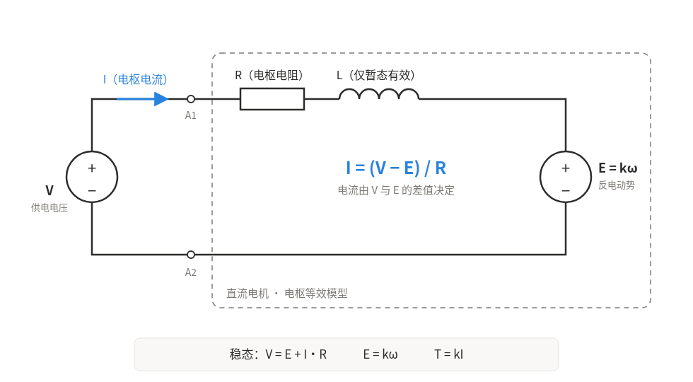

### ⚖️ 转速为啥"认"电压？算一笔账

拿书里那台经典机器开刀：$500\,\mathrm{V}$、$9.1\,\mathrm{kW}$、额定电流 $20\,\mathrm{A}$、电枢电阻 $1\,\Omega$ 的永磁直流电机。

- **空载**：只需 $0.8\,\mathrm{A}$ 克服摩擦，$E \approx 500 - 0.8 \times 1 \approx 499\,\mathrm{V}$，转速 $1040\,\mathrm{rpm}$；
- **满载**：$20\,\mathrm{A}$ 全上，$E = 500 - 20 \times 1 = 480\,\mathrm{V}$，转速 $1000\,\mathrm{rpm}$。

从空载到满载，转速只掉了 **4%**！这就是直流电机天生的"硬"机械特性：转速基本由电压定，负载来了它自己多吃电流扛住，速度几乎不弯腰。改变电枢电压，特性曲线整体平移：

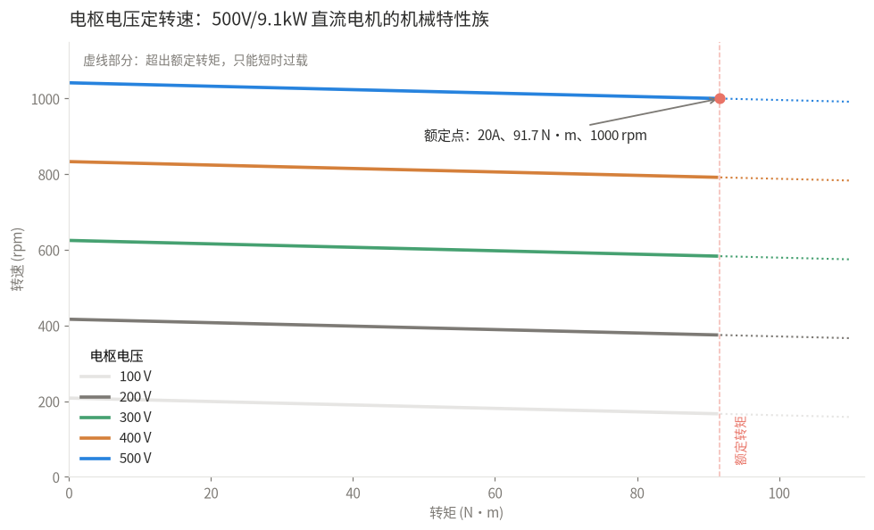

不同电枢电压下的机械特性族：电压定转速，负载定转矩

电机的曲线族有了，可带上负载后，转速到底停在哪一点？这就得请出另一位当事人——**负载特性**。负载也有自己的转矩-转速曲线：卷扬机吊着恒定重物，转矩不随转速变；风机水泵则大致按转速的平方往上爬。把电机曲线和负载曲线画进同一张图（原书 Fig 3.8 的画法），**交点 $X$ 就是稳态工作点**——在 $X$ 处电机转矩恰好等于负载转矩，不多不少，转速稳住：

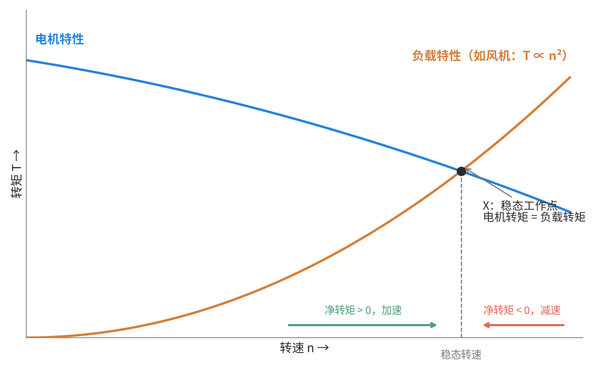

带载特性：电机曲线与负载曲线的交点 $X$ 就是稳态工作点（参考原书 Fig 3.8）

更妙的是，这个交点**天生稳定**：转速低于 $X$，电机转矩大于负载转矩，净转矩为正，往上加速；转速高于 $X$，负载反超，净转矩为负，往下减速——受了扰动它也会自己溜回 $X$。所以带载转速是两条曲线"商量"出来的：**电压决定电机那条线摆在哪，负载决定最终停在线上的哪一点**。回到咱这台机器：$500\,\mathrm{V}$ 那条"硬"线配上满载负载，$X$ 就落在 $1000\,\mathrm{rpm}$、$20\,\mathrm{A}$ 上——正是上面满载算出的那组数。

功率账也顺手算了：输入 $500\,\mathrm{V} \times 20\,\mathrm{A} = 10\,\mathrm{kW}$，铜损 $I^2R = 400\,\mathrm{W}$，剩下 $9.6\,\mathrm{kW}$ 全部经气隙变成机械功率——满载效率 $96\%$，链条干净得让人感动。

### 🚀 基速之上：弱磁换高速

电压加到额定就到了**基速**，还想更快怎么办？把励磁电流调小，**磁通减半，转速翻倍**——代价是同样 $20\,\mathrm{A}$ 电流下转矩也减半，功率维持不变。这就是**恒转矩区 + 恒功率区**的经典分段（弱磁一般最多冲到基速的 $3\sim4$ 倍，再高换向就顶不住了）：

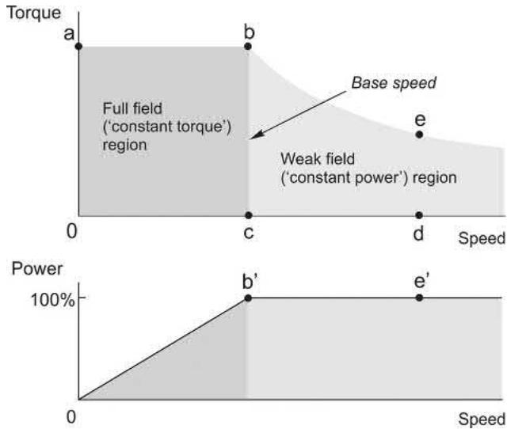

记住这张图，后面变频器驱动异步电机、永磁电机，画出来还是这个形状——**这是所有调速系统的"户型图"**。

### 🧭 电枢反应：不请自来的"弱磁"

弱磁是咱主动调的，还有一种"被动弱磁"叫**电枢反应**——电枢电流自己也产磁势，方向沿电刷轴线，跟主磁场恰好正交。铁芯不饱和时它无伤大雅：磁极一侧磁密加强、另一侧削弱，平均磁通不变。可实际铁芯多半已经踩进饱和区——**加强的那侧加不上去，削弱的那侧照削不误**，净效果就是主磁通缩水。

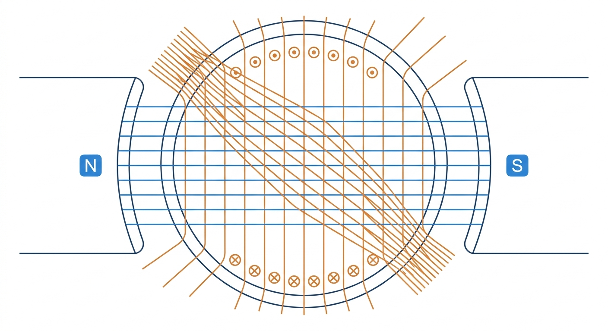

电枢反应示意：主磁场（蓝）沿磁极轴线，电枢磁势（橙）沿电刷轴线与之正交，合成磁场向磁极一侧偏斜

于是出现一个别扭现象：负载加重 → 电流变大 → 磁通反而变弱 → 转速不降反升。算不上真失稳，但谁也不喜欢。小电机可以无视；大电机会在磁极面上开槽，嵌一套与电枢串联的**补偿绕组**，用反向磁势把电枢反应顶回去。

### 🏔️ 极限一问：一台电机最多能榨出多少功率？

先不管发热，输出功率有没有理论上限？有。把电枢电阻 $R$ 当成"源内阻"，套最大功率传输定理：$E = V/2$（即转速为空载转速的一半）时输出最大，此时

$$
P_{\max} = \frac{V^2}{4R}
$$

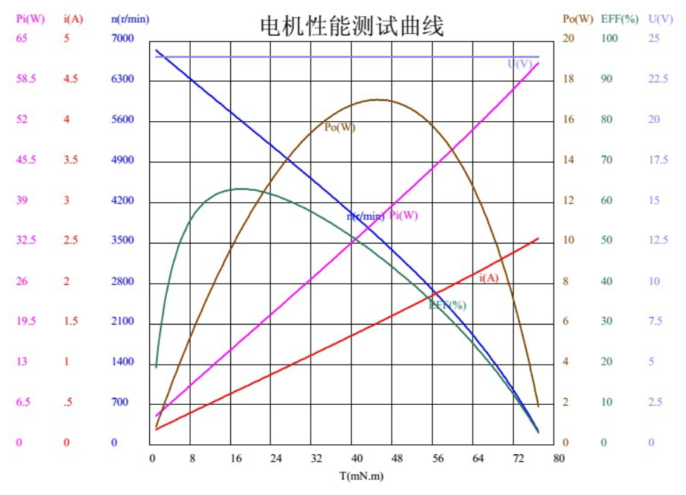

上限只认电压和电阻两个参数。而且此时理论效率恰好 50%，另一半功率全在电阻上变热。所以这个极限只对小玩具电机有现实意义，对工业电机纯属学术八卦：**真正的边界永远是发热**。50%效率还是太低了，正常额定转速会偏向空载转速（让反电动势吃掉大部分供电电压，减小电枢内阻发热）。

### ⚠️ 千万别直接上电：25 倍电流警告

静止时 $\omega = 0$，所以 $E = 0$。这时候要是直接把 $500\,\mathrm{V}$ 怼上去：$I = 500 / 1 = 500\,\mathrm{A}$，**额定的 $25$ 倍**！电机、电刷、供电全遭殃。

来，把这笔账用公式算透。等效电路里只有三个角色：电源电压 $V$、电枢电阻 $R$、反电动势 $E$，电流由欧姆定律一锤定音：

$$
I = \frac{V - E}{R} = \frac{V - k\omega}{R}
$$

分母 $R$ 是死的（$1\,\Omega$），真正决定电流的是分子 $V - E$。两种状态一对比，问题立刻现形：

| 状态 | 转速 $\omega$ | 反电动势 $E = k\omega$ | 电压余量 $V - E$ | 电流 $I = (V - E)/R$ |
| --- | --- | --- | --- | --- |
| 额定运行 | $1000\,\mathrm{rpm}$ | $480\,\mathrm{V}$ | $20\,\mathrm{V}$ | $20\,\mathrm{A}$ ✅ |
| 静止直接上电 | $0$ | $0\,\mathrm{V}$ | $500\,\mathrm{V}$ | **$500\,\mathrm{A}$，额定的 $25$ 倍** ⚠️ |

有同学会问："电枢不是有电感吗？总能挡一下吧？"能挡，但只挡**几毫秒**——电枢电磁时间常数 $\tau_a = L/R$ 是毫秒级，而转子加速建立反电动势靠的是机电时间常数 $\tau_m$（百毫秒级）。**电流爬升比转速快两个数量级**，等 $E$ 建立起来，电枢早烧了。

再从反馈的角度看一遍，你会发现 $E$ 其实是电机**自带的负反馈保护**：

正常运行时这条环路优雅得很：负载重了 → 转速略降 → $E$ 略降 → 电流自动多吃一点扛住。可**静止时 $\omega = 0$，环路里的"刹车片" $E$ 根本不存在**，电流失去唯一的软约束，只剩 $1\,\Omega$ 电阻硬扛 $500\,\mathrm{V}$。这就是 $25$ 倍电流的本质：**不是电机出了故障，而是它的自我保护还没上线**。

后果也顺手算清楚：电流 $25$ 倍 → 转矩冲击 $25$ 倍（$T = kI$），直接砸在轴和联轴器上；铜损 $I^2R$ 冲到 **$625$ 倍**，绕组温升瞬间失控；换向器片间电流密度暴增，火花直接拉弧。三重打击，一样都躲不掉。

所以实际的直流驱动器必须带**闭环电流限幅**（一般允许 $1.5$ 倍额定跑 $60\,\mathrm{s}$），从零开始把电压慢慢抬上去，始终让 $V$ 只比 $E$ 高出"一个合理电流"的量。这里也埋着两个时间常数的伏笔——下一节马上展开。

### ⏱️ 瞬态特性：快慢两条命，各管一段

为什么电流和转速都不能"突变"？电感里存着磁能，惯量里存着动能，突变意味着无穷大功率——物理不答应。所以突加一个电压阶跃后，电机走的是标准的**一阶指数过渡过程**（忽略电枢电感时）：

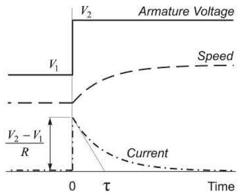

看图说话：电压一加上去，电流立刻跳升（$V - E$ 突然拉大），转矩上来，转速开始爬；转速爬升 → $E$ 跟着涨 → 电流逐渐回落。加速度越收越小，转速**平滑逼近**新稳态——一阶系统，无超调、不振荡，$4\sim5$ 个时间常数基本到位。把电流的初始斜率延长，恰好在 $t = \tau$ 处触底，这就是时间常数的几何意义。

两个时间常数分工明确：

- **机电时间常数 $\tau = RJ/k^2$（百毫秒级）**：管转速怎么稳到新值，用户体感全在它。惯量翻倍，过渡时间翻倍；$R$ 越小、$k$ 越大，响应越快；
- **电枢时间常数 $\tau_a = L/R$（毫秒级）**：管电流建立的快慢。把转子堵住突加电压，电流就按 $\tau_a$ 指数爬向 $V/R$。

严格说系统是二阶的，但 $\tau_a$ 比 $\tau$ 小两个数量级，工程上干脆**解耦**处理：电流环按毫秒级整定，速度环按百毫秒级整定——下一篇双闭环调速的地基就是这句话。最后替电感说句公道话：变换器喂进来的电压毛毛糙糙（斩波、整流全是脉动），全靠电枢电感把电流波形滤得平平整整——**平时嫌它拖慢换向拉火花，关键时刻它是台免费的滤波器**。

### 🔁 刹车也能赚电费：四象限运行

最精彩的来了。电动还是发电，就看 $V$ 和 $E$ 谁高：

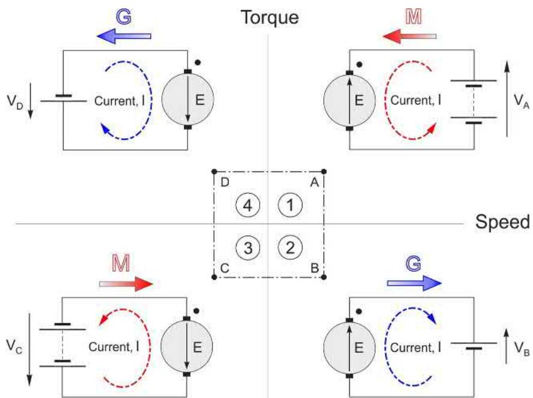

- $V$ 比 $E$ 高一点 → 电流正向，**电动**（第一象限）；
- $V$ 比 $E$ 低一点 → 电流反向，动能倒灌回电源，**再生制动**（第二象限）；
- 两种状态之间，电压只差 $2IR$——对这台机器就是 $40\,\mathrm{V}$，不到额定电压的一成！

所以从满速正转到满速反转，高明的做法是全程把电流钳在 $-100\%$：先匀减速把动能还给电网，过零后无缝进入反向加速。整个过程 $V$ 只是贴着 $E$ 走：减速段比 $E$ 低一个 $IR$，反向加速段又比 $E$ 高一个 $IR$（原书为了看得清把差值画得很夸张，大电机满速时其实只差 $1\sim2\%$）：

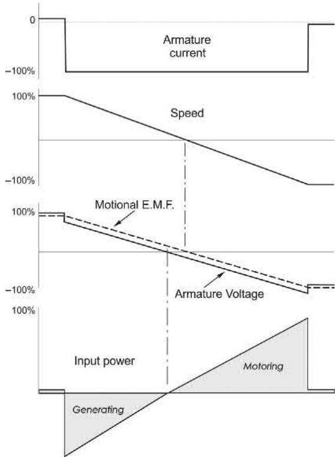

图中最下方的功率曲线还藏着一笔账：减速段的阴影面积是回馈给电网的动能，反向加速段的阴影面积是重新存进转子的动能——对轧机这类大惯量传动，这笔回收相当可观。

没有回馈条件的场合，也可以把电枢甩到一个电阻上做**动态制动**——能量变热耗掉，效果糙点但胜在简单。

### 🧰 家族番外：并励、串励和你家电钻

- **并励电机**：励磁并在电枢上，天生恒速。有个反直觉的彩蛋：电源电压减半，磁通和 E 同步减半，**转速几乎不变**；
- **串励电机**：励磁串在主回路里，转矩 $\propto (V/n)^2$，低速大力气。但它**没有空载转速**——大串励电机绝对不能脱开负载空转，会飞车解体；
- **通用电机**：串励的交直流两栖版本，8000~12000 rpm，一公斤能出一千瓦——你家电钻、料理机里躺的就是它，配个双向晶闸管就能调速。

### 🔋 荒郊野外怎么发电？"鸡生蛋"的自励

直流机天生可逆，拖着转就能发电。永磁机没悬念，一转就有电压。可并励机有个"鸡生蛋"死结：发电要磁通，磁通要励磁电流，励磁电流又得靠发出来的电——谁先来？

答案是**剩磁**。上次停机时铁芯里总留着一点磁，转起来先发出几伏小电压，喂给并在电枢上的励磁绕组，产生一点励磁电流，磁通增强、电压更高——正反馈滚雪球。会不会滚到失控？不会，**铁芯饱和会自动踩刹车**：电压最终稳定在"励磁电阻线"与"磁化曲线"的交点上。两个经典翻车点：励磁回路电阻调得太大，电阻线压不到磁化曲线，起不了励；励磁绕组接反了，发出来的小电流反把剩磁抹掉，也起不了励。

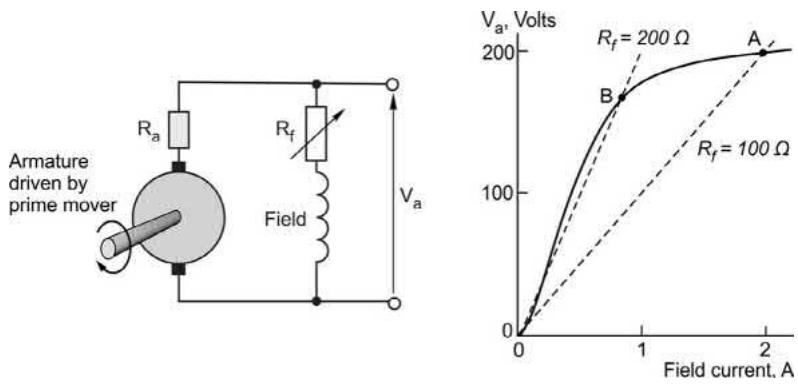

### 🚗 拆台童年回忆：四驱车里的 130 马达

最后拆一台情怀机。玩具电机的设计哲学就一个字：**省**。定子是两片铁氧体磁瓦加一圈钢壳背铁；转子只有 3 个大凸极、3 个多匝线圈；换向器就 3 片铜片——结构简单到令人发指，但便宜大碗。

你看碳刷也是用上了，高导电、低摩擦，转速又高又耐用。

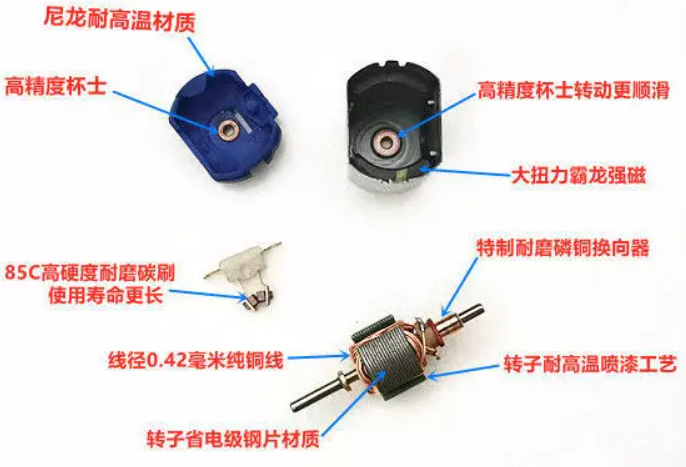

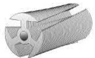

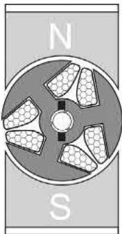

3 个大凸极有个副作用：不通电时磁钢也会把凸极"吸"到对齐位置，转起来一格一格发涩（定位转矩）。厂家的对策是把转子叠片**扭出一个斜角**再绕线，把顿感抹平。还有个隐藏彩蛋：3 极转子看着像三相，磁化模式其实始终是**两极**——某个瞬间一个强 N 极，另外两个弱 S 极合伙当一个强 S 极使。转矩波动确实不小，可人家转速几千上万转，惯量一滤，啥也感觉不出来。便宜、能转、够用——这是工程的另一种优雅。

### 📜 老列的五条铁律

| # | 铁律 | 一句话解释 |
| --- | --- | --- |
| 1 | $T = kI$，$E = k\omega$ | 一个 $k$ 走天下，转矩认电流，电势认转速 |
| 2 | 电压定转速，负载定转矩 | 稳态特性"硬"，满载转速才掉 4% |
| 3 | 电流看 $V$ 与 $E$ 的差值 | 静止时 $E = 0$，直接上电 = $25$ 倍电流事故 |
| 4 | 基速以下恒转矩，以上弱磁恒功率 | 所有调速系统共用的"户型图" |
| 5 | 电动与发电只差 $2IR$ | 刹车回馈电网，四象限运行的底气 |

### 🎯 课后三问

先别划走，检验一下这章有没有白读（点开看答案）：

- 1. 空载转速由什么决定？
  
    电枢电压。磁通一定时空载电流近似为零，$E \approx V$，而 $E = k\omega$，所以 $n \propto V$。
  
- 2. 负载加重时，电机凭什么"知道"要多吃电流？
  
    负载把转速拖低 → $E = k\omega$ 下降 → $V - E$ 拉大 → $I = (V - E)/R$ 自动增大，直到 $T = kI$ 重新扛平负载转矩，在新工作点稳住。稳态电流由负载转矩决定，不由电机自己说了算。
  
- 3. 大电机为什么不能直接全压起动？弱磁升速的代价又是什么？
  
    静止时 $E = 0$，全压下电流 $= V/R$，可达额定的几十倍（本文机器是 $25$ 倍），必须限流软起。弱磁升速的代价：同样电流下转矩按磁通缩水，只能在恒功率区运行，一般最多冲到基速的 $3\sim4$ 倍。
  

### 📝 后续计划

电机本体讲完了，下一篇【笔记 04】咱们给它配上大脑：**直流调速系统**——电流环、速度环怎么套，晶闸管整流和斩波器怎么喂饱它，闭环之后那条"硬"特性还能再硬多少。敬请期待。

---

### 💬 老列碎碎念

写这一章的时候老列一直在感慨：换向器这东西，用纯机械结构解决了"旋转世界里的电流方向"问题，优雅了一百多年，最后败给了功率半导体。但它留下的控制思想——**磁场恒定、电流定转矩、电压定转速**——至今仍是所有高性能驱动的精神图腾。

你拆过的第一台电机是什么？是四驱车里的 130 马达，还是电钻里的通用电机？评论区聊聊。觉得有收获的话，老规矩，**点赞、在看、转发**三连伺候，老列给你比个心。

  <strong>如果觉得这篇文章对你有帮助，</strong> 
  <strong>别忘了点赞、在看、分享三连哦！</strong>  
  👇👇👇

---

> 推荐朋友关注公众号“探物及理”，探万物之然，及万理之源。
>
> 
