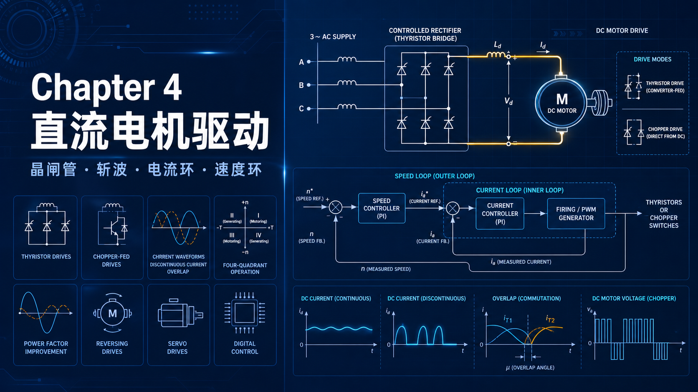

你好，我是老列 👋

上一篇 [3-都2026了还讲碳刷电机？老列说：不懂它，你连FOC的门都摸不着](https://app.notion.com/p/3-2026-FOC-4afd1605005e40b9bfaa358b50550383?pvs=21) 里，咱们把直流电机本体吃透了：两个公式、一个等效电路，外加"盯住 V 和 E 的差值"这句心法。但光有肌肉没有大脑，那叫裸奔。今天咱们就把完整的**直流调速系统**拆开看看——看完你会发现，工业调速柜里攒了几十年的家底，其实就两个环。

更重要的是：后面所有交流驱动——变频器、伺服、FOC——的控制骨架，全是今天这套架构的"致敬之作"。把它弄懂，后面九章都是熟人。

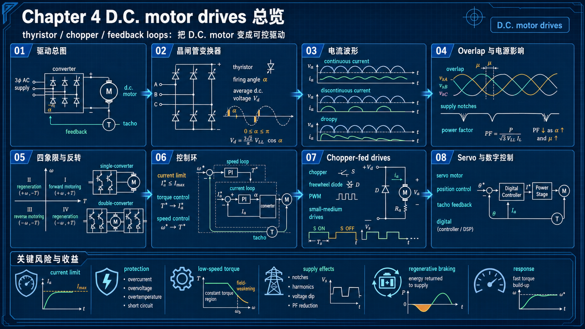

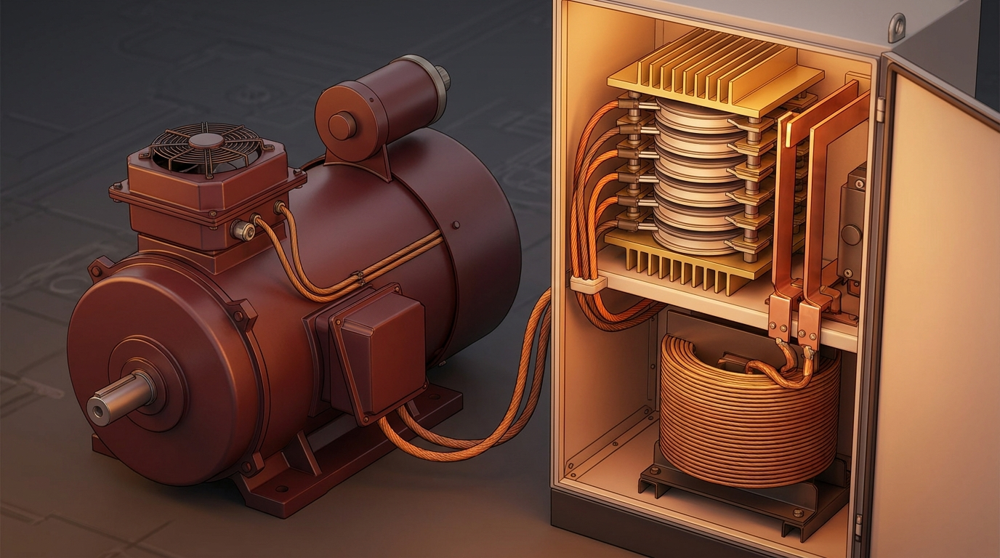

---

## 【老列 驱动导论笔记 04】：直流调速系统——电流环护身，速度环掌舵

### 🔧 序言：它退位了，但没退场

上世纪 60 年代以前，想要可调直流电压，得用交流电机拖着直流发电机发电（Ward-Leonard 机组，三台旋转电机伺候一个转速），50 年代还短暂流行过栅控汞弧整流器。晶闸管一出场，效率 95% 以上、体积小、响应快，直接把它们统统扫进博物馆。当然整流供电也不是白拿的，先记三笔账：**波形不是纯直流、变流器过载能力有限、单台变换器天生不会再生制动**——这三笔账后面都会一一算到。而如今直流驱动自己也退居二线了，为啥还要学？两个理由：

1. **它的控制结构被后来者原样抄走**——学会它，等于拿到所有驱动的通关钥匙；
2. 恒磁通下它是**线性系统**，稳态动态都能算得清清楚楚——后面的异步电机可就没这么好说话了，人们的对策恰恰是"把它控制得像直流电机"。

### 🏗️ 系统长啥样：一张图就是全部家当

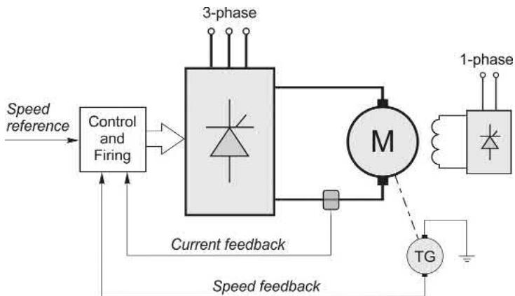

主回路是咱第二篇讲过的**六晶闸管全控桥**，把三相交流整成可调直流喂给电枢（几 kW 以下的小电机用单相也行，大电机必须三相——波形平滑得多）；励磁另配一个小整流器（功率小、电感大，单相就够）。控制板监视两个量：**电流和转速**，然后算出触发角 α。速度给定早年是 0～10V 的电位器电压，如今基本都是数字量。

两个工程细节顺带提一嘴：整流出来的"直流"带着波纹，磁极和机座必须**叠片结构**，老式实心磁极电机接晶闸管电源会出乱子；另外调速电机标配一个**独立小风机**常年吼着——不然低速满转矩时自带风扇不转，电机得热成烤箱（封面图里电机头顶那个小盒子就是它）。

功率、控制、保护电路合在一起就叫**变流器**：100W 到几百 kW 都是货架上的标准模块，再大才需要定制——这也是直流调速当年横扫工业界的底气。

### 🌊 波形丑没关系：两位"滤波侠"在站岗

整流出来的电压波形拿出来能吓人一跳，凭啥直流电机吃得消？因为有两位天然"滤波侠"：

- **电枢电感**：对纹波电压呈高阻抗，把电流波形熨得比电压平滑得多——转矩脉动远比想象小；
- **转子惯量**：100Hz（三相 300Hz）的转矩抖动，大惯量根本懒得理，转速纹丝不动。

看原书这组波形（单相全控桥、触发角 60°）：

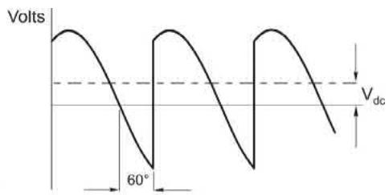

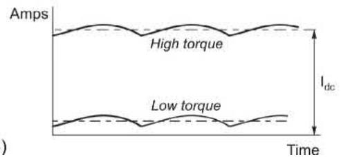

图 4.3B 藏着两条关键结论：**平均电流由负载决定，纹波与负载无关**；而且只要电流一直不断流（行话叫**连续电流**），变流器的平均输出电压就只由触发角决定、与负载无关——转速也就稳稳捏在控制器手里。这是整套调速逻辑的地基。

于是稳态下依旧是熟悉的 **Vdc = E + IdcR**，和纯直流供电一模一样——调触发角就是调转速。要是想用电容把波形滤平再喂给电机？这个功率等级的电容贵到能把项目预算吃空，幸好根本不需要。滤波的条件也很实在：电枢时间常数要比脉冲周期长（两脉冲是半个工频周期，六脉冲只有六分之一），六脉冲驱动几乎天然满足，代价只是 I²R 损耗比纯直流略高一点。

### 📉 轻载陷阱：断续电流的"跳水"特性

负载轻到一定程度，电流纹波的谷底碰到零线，就进入了**断续电流**区——每个脉冲之间电机"自由落体"一段，端电压回到反电动势 E：

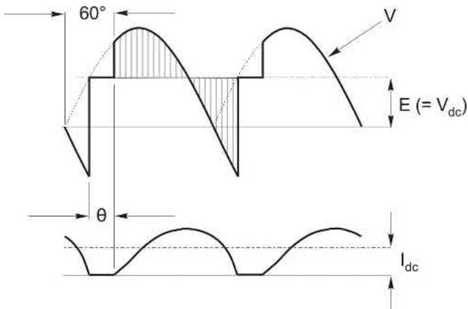

电流的形状用一个式子就能看透（电阻忽略不计）：

$$
\frac{di}{dt} = \frac{1}{L}(V - E)
$$

V 高于 E 电流爬坡，V 低于 E 电流滑坡——图 4.4 里的阴影面积就是电流的"油门"和"刹车"。麻烦在于：同一个触发角，断续区的平均电压反而更高，转速跟着更高；想多输出点电流，只能靠转速（E）跌下来换。后果很难看：

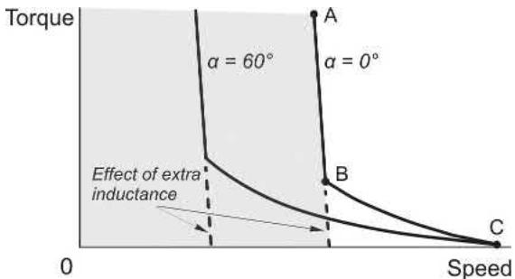

连续区（A→B）特性又平又硬，一进断续区（B→C）特性立马"跳水"：轻载时转速飙到反电动势等于电源峰值电压的高度，加点负载又哗啦啦掉下来。断续在小电机（电感小）+ 两脉冲桥 + 轻载时最容易碰上。对策三个：**串平波电抗、换三相桥、交给闭环兜底**——闭环一接手，自动调触发角，用户根本察觉不到这段"黑历史"。

### 🤝 换相重叠：藏在电网里的"隐形电阻"

前面一直把变流器当理想电压源，实际上交流电网有阻抗（主要是变压器漏抗）。它带来一个现象叫**换相重叠**：电流从一只晶闸管交接到下一只时不是瞬间完成，交接瞬间两管同时导通（别慌，不在同一桥臂，不会短路直流侧），这期间输出电压是两相电压的平均值，波形上被啃出一个小缺口：

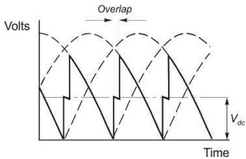

奇妙的是，这段感性漏抗折算到直流侧竟表现成一个**等效电阻**：压降与电枢电流成正比，串在电枢回路里，让每条特性曲线都更"软"一点。好在闭环会自动补偿，用户照样无感。留个工程口诀：50/60Hz 电网上重叠超过 1ms，说明电网太弱、或者变流器对这个电网来说选大了。

### 🔁 要倒车怎么办：晶闸管的"单行道"难题

直流电机天生四象限——转矩、转速正负随意组合，电动、回馈制动来去自如：

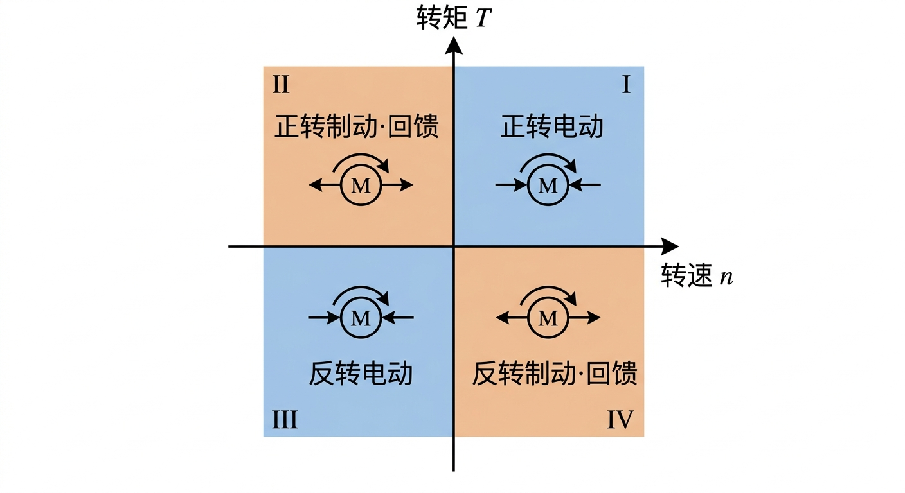

四象限运行：转矩 × 转速的正负组合，决定功率是流入电机还是回馈电网

但晶闸管只能单向导通——电流是条"单行道"。好在全控桥的**电压**可正可负：α 小于 90° 是整流，α 超过 90° 就进入**逆变**，能量回馈电网。所以单台全控桥天生具备两象限潜力：

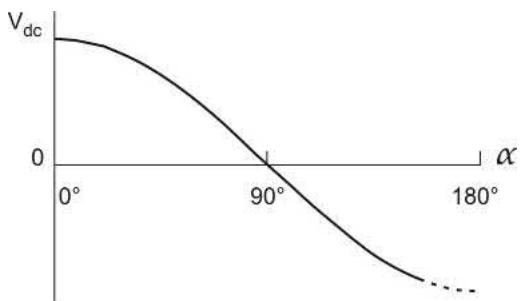

两个工程惯例：额定直流电压一般对应 α ≈ 20°，留点裕量——电网电压万一跌了还能往回补；逆变侧最大负压也不敢用满，得给晶闸管换相留余量（图 4.7 里的虚线）。要真跑满四象限，工程上有两条路：

**路线一：单变换器 + 接触器换接电枢**。看三步走——用户只需要把速度给定从正满速拨到负满速，剩下的驱动器自己演完：

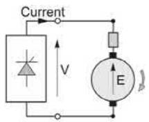

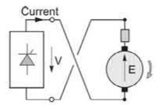

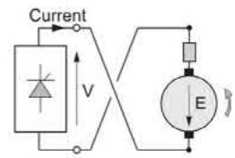

减速全程电流环恒流压阵，V 跟着 E 一路下调。便宜是真便宜，慢也是真慢：接触器换向要 **200～400ms 的零转矩死区**；改换励磁的方案更是要好几秒（励磁时间常数太大），只适合不赶时间的场合。

**路线二：双变换器反并联**。一套管正电流、一套管负电流：

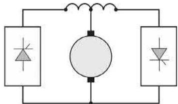

多数场合两套轮流上岗：撤触发脉冲、等零电流检测确认电流过零，再切另一套，换桥死区只有 **10ms** 左右。要是两套同时带电压运行，中间还得加环流电抗器压住两桥瞬时电压差造成的纹波环流。选型口诀：单象限最便宜，要回馈加接触器，要快加双变换器——每升一级预算跟着升一级。

### 🧾 功率因数：晶闸管的"原罪"

相控整流有个天生的毛病：**功率因数差**。电流波形滞后电压 α 角，还近似方波（谐波大礼包）：

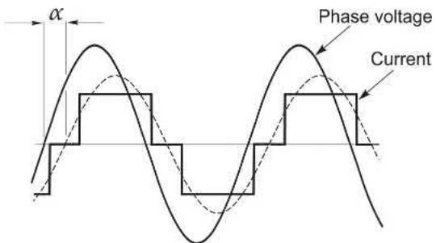

低速（低电枢电压）时 α 大，功率因数惨不忍睹；满速满载也到不了 1；更气人的是不管整流还是逆变，它永远**滞后**，没得商量。大功率用户得自备无功补偿，谐波超了法规红线还得上滤波器。另外换相重叠每次都把电网瞬间短路一下，线电压上会留下"刻痕"：

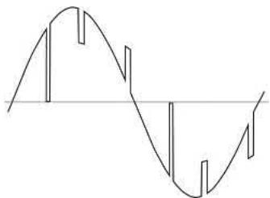

硬电网上没人察觉，弱电网配大驱动就会祸害左邻右舍。这也是它后来被 PWM 方案逐步取代的重要原因之一。

### 🎛️ 双环控制：电流环护身，速度环掌舵

重头戏来了。从 0.5kW 到几 MW，直流驱动清一色都是这套**双环结构**：

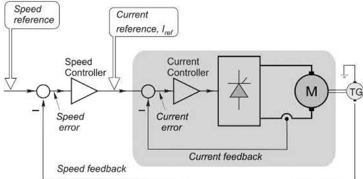

- **内环（电流环）**：让实际电流紧追电流给定值 Iref。它快（毫秒级，对应上篇的 τa = L/R），而且是**保护神**：只要它在，电流永远超不过给定值；
- **外环（速度环）**：把转速误差放大后，输出当作电流环的给定。它慢（百毫秒级，对应 τm = RJ/k²），负责把转速稳稳押在设定值上。

电流反馈取自直流电流互感器（或交流侧互感器 + 整流），电流调节器用 **PI**——稳态时实际电流和给定分毫不差；面板上那个"电流稳定度"旋钮，就是给你微调这个环的动态响应用的。整套系统的性能上限，很大程度取决于反馈质量——所以正经驱动里一只高品质测速机的价钱能占掉总成本一大块。

精髓在于一个**限幅箱子**：速度环输出被限幅在额定电流对应的值。速度误差再大——哪怕直接给个满速阶跃指令——电流也只会被钳在 100%：

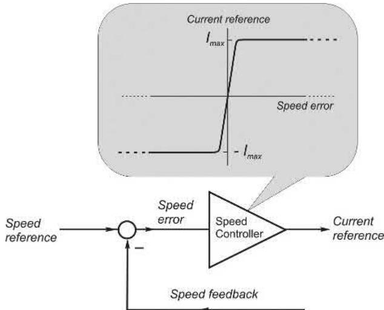

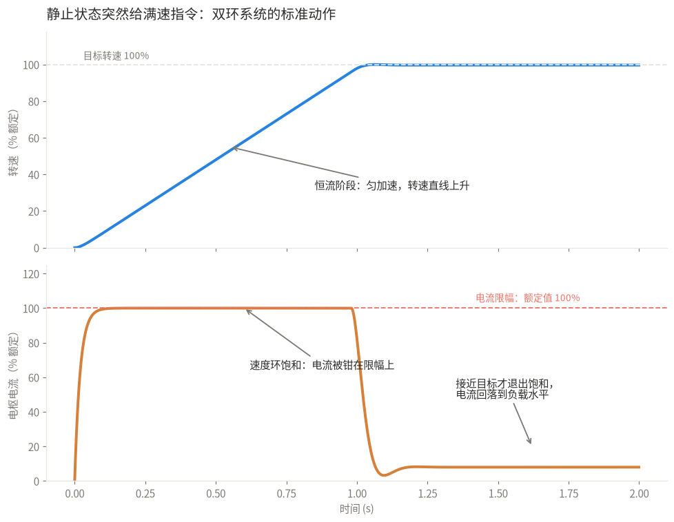

阶跃满速指令下的双环动作：恒流加速，临近目标才退出饱和

还记得上篇那个"25 倍启动电流"的恐吓吗？有了电流环，启动就变成了教科书级的优雅动作：全程额定电流匀加速，电压自动跟着 E 涨。要是负载卡死、E 瞬间崩掉？电流环马上把电压拉到贴地，电流稳稳扛在限幅上——**这是所有驱动器最重要的保护机制，没有之一**。（有的驱动还带"两段电流限幅"：允许电流给定飙到 150%～200% 撑几秒，专治静摩擦大的负载起步。）

### 🎯 只要转矩不要速度：把外环拆了就是转矩控制

收放卷、拉丝这类要**恒张力**的场合，干脆把速度环拆掉，电流给定直接喂给电流环——因为恒磁通下**转矩正比于电流**，电流环就是现成的转矩环（要补加速转矩的话，再叠一个"惯量补偿"信号）。设 50% 转矩给定，电机就顶着 50% 额定电流恒转矩加速，直到负载转矩和它打平才稳住；真空载的话，会一路加速到变换器电压顶格、维持不住设定电流为止（略高于正常满速）。前提是磁通真恒定：所以除了小驱动，励磁一律用带电流反馈的晶闸管整流器供电——绕组温度漂移、电网波动全都自动补掉。

### 💪 PI 的底气：突加满载只抖一下

速度控制器如果只有 P（比例）项，稳态时必须留一点误差才能维持电流给定——目标 1000 转，实际永远 990 转，强迫症接受不了（把增益开大点？小心振荡）。加上 I（积分）项就优雅了：积分器能在输入为零时维持输出，把稳态误差一分不差地抹平：

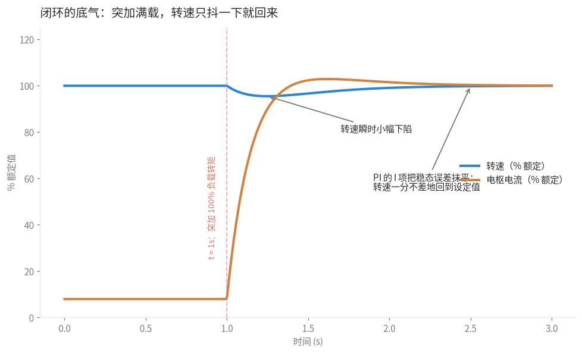

突加 100% 负载：转速小幅下陷后精确回到设定值

设定值兜得住的范围是"电流限幅以内"：负载再往上加，电流环不放行，转速才会掉；反过来负载想把转速拖高？电流自动反向，电机变刹车、能量回馈电网（前提是四象限硬件在位）。两条调参心得：**可逆驱动更容易调出好动态**——超调了能立刻上负转矩刹一把，不可逆驱动只能把电流降到零干等自然减速，所以调参必须避免超调；高性能场合再加 D 项（PID），给阶跃指令一脚"预判油门"。

顺带讲个事故场景吓你一下：要是测速机的反馈线被不小心扯掉，速度环看到的"转速"永远是零，于是拼命加速——飞车！所以正经驱动都有断线检测，或者自动切到电枢电压反馈兜底。

### 🗺️ 运行区域：基速以下拼转矩，基速以上拼功率

把前面所有本事摊开在转矩-转速平面上：基速以下调电枢电压，额定转矩随叫随到——**恒转矩区**；基速以上开始**弱磁**（驱动器自动联动：电枢电压到 95% 左右后，再要升速就一边升电压一边降励磁，电压到 100% 时励磁恰好降到最低安全值），最大转矩随转速反比缩水——**恒功率区**：

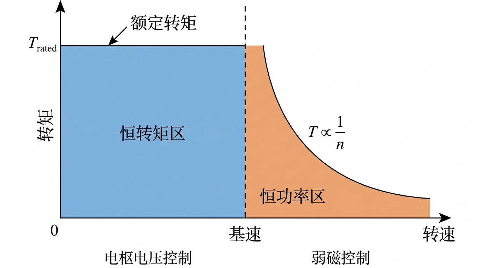

运行区域：基速以下恒转矩（调压），基速以上恒功率（弱磁），T ∝ 1/n

配了四象限硬件的话，把这张图往另外三个象限一镜像，就是完整的运行地图。

### 💰 丐版方案：没有测速机的日子

低成本小驱动有两招省钱：

- **电枢电压当"伪测速"**（省掉测速机）：空载转速正比于电枢电压，凑合当反馈；带载后 IR 压降让转速往下掉，就再加一个 **IR 补偿**——按电流比例把电压抬一点找回来。补偿是糙的：电阻随温度漂、动态也跟不上，但便宜够用；
- **连电流环也省了**：只留一个越限才动作的"电流限幅"，平时靠给定斜坡电路压住电流上升率。这种丐版只适合最温和的场合，稍微折腾一点就跳闸给你看。

### 🔋 电池供电的场合：把整流桥换成斩波器

叉车、地铁这类直流母线场合，晶闸管桥换成第二篇讲的**斩波器**（Buck 降压、Boost 升压）。单管斩波只能一象限电动；要回馈、要可逆就得加管子加钱，思想和前面的双变换器一脉相承。和相控整流的本质区别：整流桥里电机电流始终流经电网，斩波器里电机电流只在开关导通期间才从电源抽取。看波形：

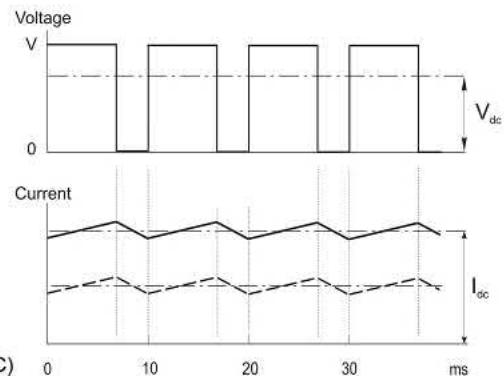

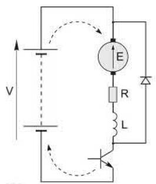

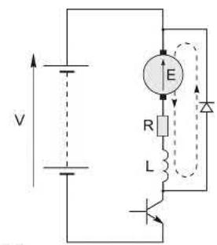

平均电压由占空比 k（导通时间占整个周期的比例）说了算：

$$
V_{dc} = kV
$$

调速就是调 k。几个熟悉的结论原样成立：**纹波只和电感、开关频率有关，与负载无关**；实际斩波频率远比图里示意的 100Hz 高，电流纹波反而比相控整流还小。再算笔功率账：电池只在导通期出力，平均电池电流是 kIdc，输入功率 = V·(kIdc) = 输出功率 (kV)·Idc——理想斩波器零损耗，高压小电流进、低压大电流出，活脱脱一个"直流变压器"。开环时轻载高速照样有断续电流的"跳水"病，药方也一样：加电感、提频率、闭环兜底。控制架构照搬双环，只是执行机构从触发角换成了占空比。

### 🤖 番外：伺服小世界

需要猛加猛减猛定位的场合，有专门的**伺服直流电机**。它是"暴力特化型"：间歇电流（转矩）可以做到连续额定值的好几倍；电机小、电枢电阻偏大，堵转电流不过额定几倍，放大器索性按堵转电流选型——满压起动、满速反接都算日常操作（这俩动作放到大电机身上想都别想）。伺服驱动多以模块形式出售：高性能永磁电机 + 内置测速机 + 斩波放大器，功率从几瓦到 2～5kW。为了压转动惯量，设计师干脆让磁路不转、只转导体：

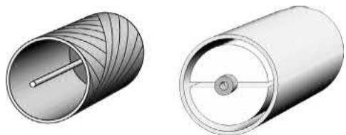

无铁转子直径一厘米上下，就是相机、读卡器、医疗仪器里的"微电机"；**印刷电枢**则是盘式结构，磁通轴向、电流径向，上百根"辐条"导体让低速转矩极其细腻，惯量小、电感小、又短又扁，机床和盘式驱动器爱用。也有反着来的流派：追求极致平稳的机床主轴，故意把惯量做大当飞轮使——转速纹波会直接刻在工件表面上。

位置控制就是在双环外面再套一层**位置环**：

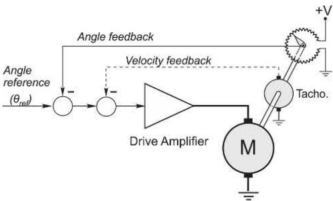

到位后误差归零、电机断力，谁敢掰动输出轴，恢复转矩立刻顶回来。但光靠位置反馈，想快就得加增益，增益一高就振荡；加上测速反馈做阻尼（本质是"输出微分"反馈），立竿见影：

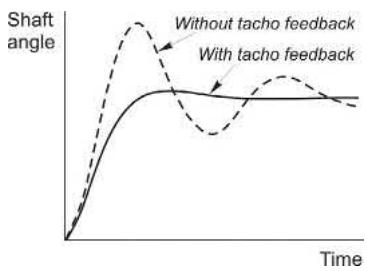

如今数字位置控制是主流（编码器一个器件同时给位置和速度），"控制器一张卡"是货架商品，无刷电机（第 9 章见）配合居多。伺服市场从直流转向交流永磁/异步的浪潮比工业驱动还猛，直流伺服只守着一些利基阵地了。

### 💻 数字时代：换汤不换药

如今的驱动清一色数字控制，但控制骨架和模拟版一字不差——**先弄懂模拟版，数字版免费送**。数字化送的是一堆锦上添花：编码器脉冲 + 锁相环做速度反馈，无漂移、抗噪声，多台电机严格同速不在话下（锁相环还顺手解决了电网波形噪声干扰触发同步的问题）；参数可编程（升降速斜坡、上下限速）、自整定、丰富的通讯接口直接挂进工业自动化系统；再加用户友好的故障自诊断——关键变量的实时和历史数据随叫随到。模拟放大器最头疼的"漂移"，数字世界里压根不存在。

### 🧠 自测五连：看看你出师没有

- 先自己过一遍，答案思路全在正文里
    1. 空载运行，速度给定从 50% 拨到 100%，稳态后电枢电压、测速电压、电枢电流各变成啥样？
    2. PI 速度环、50% 转速空载运行，突加 100% 负载转矩，上面三个量又如何？
    3. 运行中电机堵死 / 测速线被拽掉 / 电流反馈信号丢失，各会发生什么？（提示：一个安然限流，一个飞车，一个炸管）
    4. 为什么断续电流不受欢迎？靠哪三招躲开它？
    5. 为什么驱动圈常说"电枢电感越大越好"？什么场合又嫌它大？

### 📜 老列的五条铁律

| # | 铁律 | 一句话解释 |
| --- | --- | --- |
| 1 | 双环结构：内电流、外速度 | 内环快外环慢，分工清晰，后来者全在抄作业 |
| 2 | 电流限幅是头号保护 | 速度环输出一限幅，堵转都烧不毁驱动 |
| 3 | PI 消稳态误差 | P 管快慢，I 管准头，设定值分毫不让 |
| 4 | 断续电流要躲 | 轻载"跳水"特性，靠电感、三相桥、闭环兜底 |
| 5 | 晶闸管只认单向电流 | 四象限要么接触器换接，要么双变换器反并联 |

### 📝 后续计划

直流篇到此完结，下一站进入交流世界。【笔记 05】讲**感应电机的旋转磁场**——三套绕组通上三相电，磁场自己就会转，这个魔术是怎么变的？为什么说它是工业文明的基石？敬请期待。

---

### 💬 老列碎碎念

写完这篇老列想起刚入行时师傅说的一句话："调速柜里万千元件，真正的魂就两个放大器。"当年不以为然，后来调过的驱动越多，越觉得这话是真理——从晶闸管直流柜到最新的伺服，变的是器件和算法，不变的是"电流环护身、速度环掌舵"这套骨架。

你调试过的第一台闭环系统是啥？有没有被飞车或者振荡整过？评论区聊聊。

  <strong>觉得有收获的话，老规矩，</strong> 
  <strong>点赞、在看、转发三连伺候，老列给你比个心。</strong>  
  👇👇👇

---

> 推荐关注公众号「探物及理」，探万物之然，及万理之源。
>
> 
