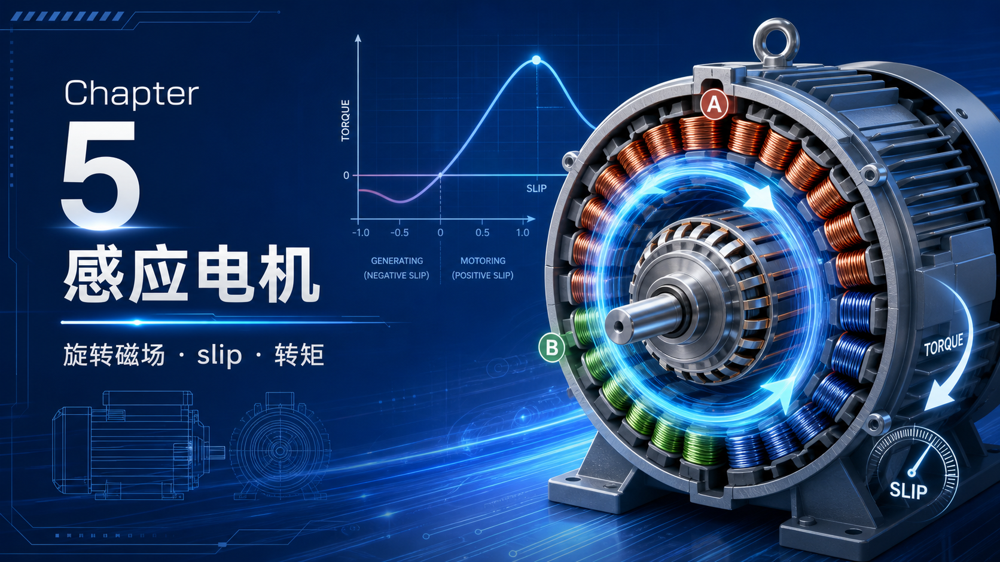

你好，我是老列 👋

上一篇 [4-电机有了，还得配个"大脑"：老列拆开调速柜，里头就两个环](https://app.notion.com/p/4-a59e140878b24e648244b9b630705caa?pvs=21) 收官了直流篇。今天正式进交流世界，主角是**感应电机（异步电机）**——教材作者把它和螺纹并列为人类最伟大的发明之一。这不是吹：全世界发出来的电，约有**一半**最后是被感应电机吃掉变成机械功的。水泵、风机、压缩机、皮带机，全是它在默默干活。

它凭什么？转子上不接一根线、没有电刷、没有换向器，通上三相电它就转。今天咱们就把这层魔术拆穿——看懂了旋转磁场和转差，你就拿到了后面变频、FOC 的入场券。

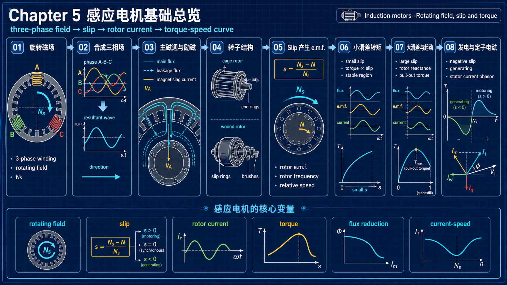

---

## 【老列 驱动导论笔记 05】：感应电机——旋转磁场、转差与转矩

### 🔧 序言：无刷者得天下

回忆一下直流电机：转矩靠转子轴向电流 × 定子径向磁场，但"工作电流"得靠电刷和换向器喂进转子——这是它一辈子的软肋。感应电机的思路狠多了：**转子电流不用喂，直接用电磁感应"变"出来**——这就是"感应"二字的来历。定子绕组一人分饰两角：既产磁场（励磁），又送能量。没有滑动接触，免维护，皮实，便宜。

同功率同基速下，感应电机和直流电机的体积重量其实差不多（铜和铁的用量相近），但感应电机构造简单、产量巨大，所以价格更低。还有三处和直流电机不一样：供电是交流（大机三相、小机单相）；磁场相对定子**旋转**而非静止；定、转子表面都是光滑无凸极的。

先说清本篇的打法：只谈**稳态**——电压频率恒定、负载平稳、暂态已消失，用磁通、磁动势、磁阻、电磁力这些老朋友把定性图像建牢。顺带补一段历史：在工频电网上，感应电机暂态性能差、转矩没法快速控制，长期被认为"干不过直流电机"。1970 年代起局面翻盘——计算机仿真啃下了完整的动态方程，PWM 逆变器提供了快速电流控制的硬件，数字信号处理便宜到能跑复杂算法，**磁场定向（矢量）控制**横空出世。那是笔记 07 的好戏，但地基必须现在打。

### 🌀 三个脉动的场，合成一个旋转的波

定、转子铁芯表面都是光滑的（除了开槽），中间隔一层小气隙，定子绕组产生的磁通**沿径向**穿过气隙——电机的行为全由这个径向磁通波决定。

定子槽里躺着三套一模一样的绕组，空间上互相错开，接成星形或三角形，通上三相电——每相电流幅值相同、时间上依次滞后 120°。

单看任何一相：它产生的磁场只会**原地脉动**，极轴固定，极性一正一负地翻，毫无旋转的迹象。但三相一叠加，奇迹出现了：

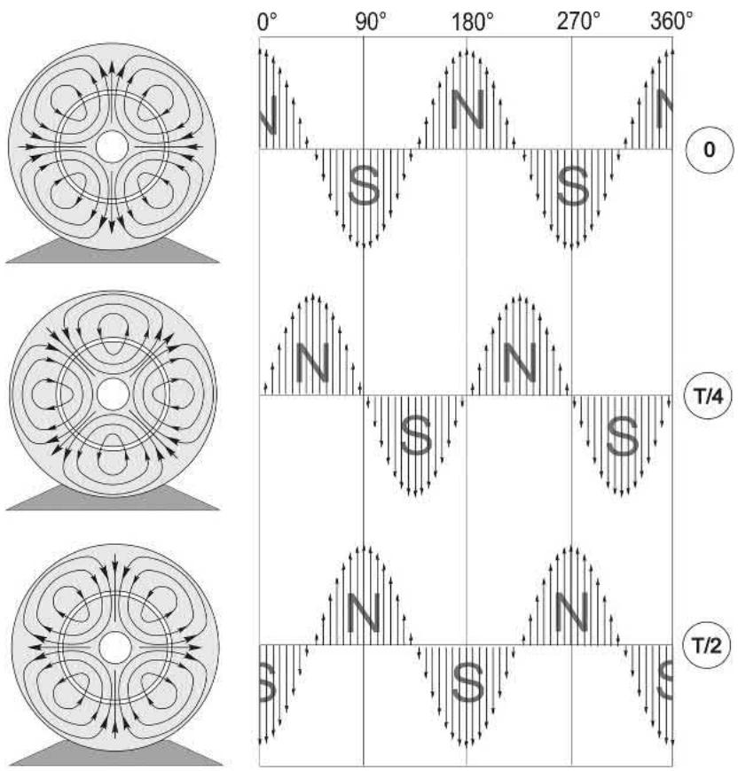

合成磁场是一个**幅值恒定、形状近似正弦、匀速前进的行波**——每过一个电源周期，前进两个**极距**（相邻 N 极中心到 S 极中心的距离）。绕组明明是一段一段塞在槽里的，合成出来的场却惊人地接近理想正弦行波。教材原话：不管怎么看，这都是一项优雅的工程成就。

磁场转速（**同步转速**）只由两个量决定：

$N_s = \frac{120f}{p}$

| 极数 p | 50 Hz（rev/min） | 60 Hz（rev/min） |
| --- | --- | --- |
| 2 | 3000 | 3600 |
| 4 | 1500 | 1800 |
| 6 | 1000 | 1200 |
| 8 | 750 | 900 |

注意：极数是绕组接线"排"出来的，铁芯上没有任何物理特征标明它是几极。想要表格之外的转速？只能改频率 f——这正是变频器存在的意义，笔记 07 的主线。顺带一提，想让电机反转，把任意两根进线对调一下就行（相序反了，磁场就倒着转）。

### 🧵 绕组的艺术：把正弦"排"进槽里

绕组设计师的目标：让每一相单独通电时，产生**极数正确、幅值沿圆周正弦分布**的磁动势波。三相绕组的接法就两种：

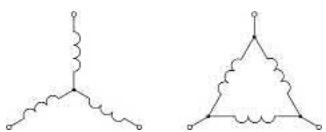

先看最简陋的方案：两个整距线圈错开 180° 摆，极数是对了（四极），但气隙磁密是**方波**，离正弦十万八千里：

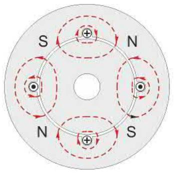

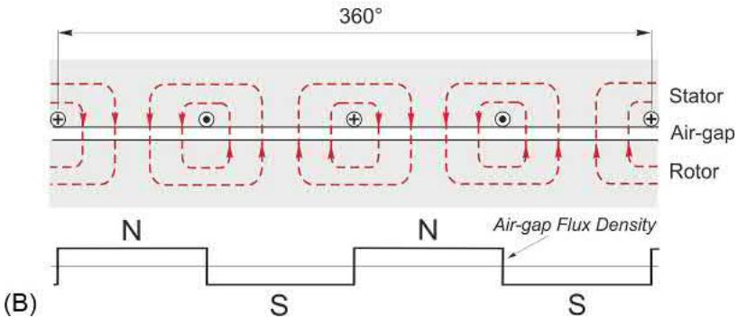

改进第一步：在相邻槽里多加几个同匝数线圈，磁密变成**阶梯波**，离正弦近了一大步：

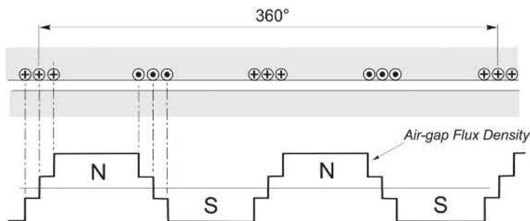

要完美正弦？得把线圈按正弦规律铺满整个圆周、每个线圈匝数还不一样——工艺上不现实。工程解是**双层短距绕组**：每个线圈的 go 边在槽顶、return 边在不到一个极距远的槽底（例如线圈跨 6 槽、极距 9 槽，短距 3 槽）。短距让阶梯更密，一相的磁场已经相当接近正弦：

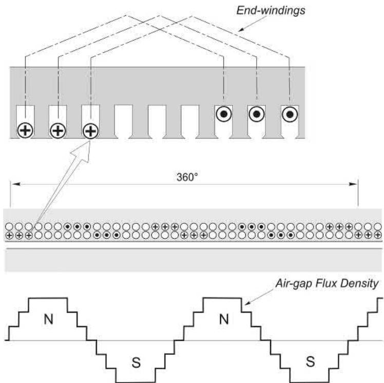

实物长这样（八极双层绕组，先嵌一相，再嵌满三相，之后端部整形、浸漆防振）：

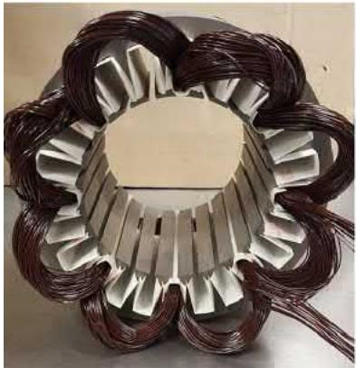

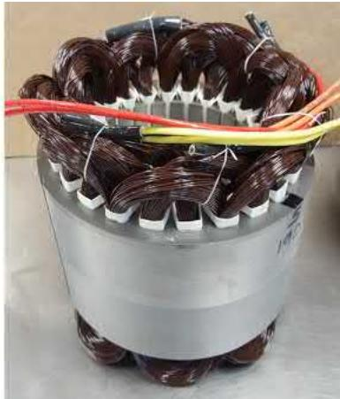

三相完整布局如下——B、C 两相与 A 相一模一样，只是空间上各错开 ±2/3 极距，电流时间上各滞后 1/3 周期：

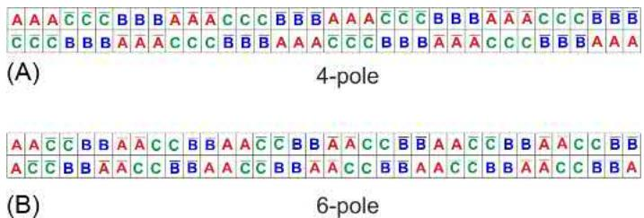

把三个"原地脉动"的场按空间差 + 时间差叠加起来，得到的正是那个近乎理想的旋转行波：

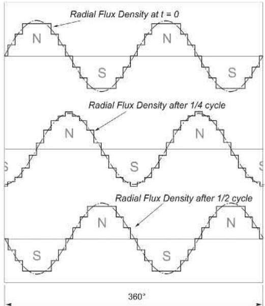

冷知识两条：① 每极每相槽数为整数的叫**整数槽绕组**（图 5.7A 是 3，B 是 2）；出现 4.5 这种**分数槽绕组**也完全能用，常见于一套冲片打多种极数的场合，电动汽车永磁电机甚至把它干到小于 1，那是后话。② 极数高、体积小时（比如 24 槽八极）每极每相只有 1 槽，相磁动势是矩形波、谐波不小——但电机性能由**基波**主导，照样够用。

### 🕳️ 主磁通与漏磁：设计师的走钢丝

定、转子齿形要引导磁通尽量穿过转子齿、与转子导条充分交链——这部分是**主磁通（互磁通）**，电机干活全靠它。但总有一小部分磁通只链定子绕组不链转子（**定子漏磁**）；转子电流产生的磁通也有一部分只链转子（**转子漏磁**）。

"漏"字听着像缺陷，其实是门平衡艺术：耦合太差，大多数性能都受损；耦合**太好**，直接启动时电流会大到吓人。所以设计师排好绕组产生漂亮的主磁通之后，还得精心"调配"槽形细节，让漏磁不多不少刚刚好。（逆变器供电的电机没有直接启动的烦恼，本可以把漏抗做得更低——可惜大多数感应电机还是按通用场景设计的，这一点上它常被不公平地比下去。）

### 📐 磁通多大，谁说了算：V/f 的出生证明

旋转的磁通波会切割定子导体，在每根导体里感应出正弦电动势——幅值正比于磁通幅值 Bm 和频率 f，频率恒等于电源频率（磁场每周期走两个极距，与极数无关）。三相绕组的合成电动势 E 构成对称三相组，所以只看一相就够了。每相可以画成一个极简等效电路：

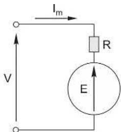

基尔霍夫电压定律给出 $V = I_mR + E$，而绕组电阻压降远小于外加电压，所以 **V ≈ E**。又因为 $E \propto B_m f$，联立就得到：

$$
B_m = k\frac{V}{f}
$$
这是感应电机**最重要的公式**，没有之一。它说了两件事：

- 频率固定时，**电压决定磁通**；
- 想变频调速又保住磁通，**电压必须跟着频率成比例升降**——大名鼎鼎的 V/f 控制，出生证明就在这。

有意思的是，磁化电流 Im 并不出现在公式里——它是个"听差的"：磁通稍有下跌，E 跟着跌，Im 立刻猛增把磁通顶回去，负反馈自动伺候。和直流电机"空载转速自动让反电动势≈外加电压"一个套路：这里是磁化电流自动调整，让感应电动势≈外加电压。

### ⚡ 励磁的账单：VA 巨大，有功寥寥

建立旋转磁场就是给电机"励磁"。磁场里存着能量，但幅值一旦建立就不再变，**维持磁场不需要净功率输入**——所以空载感应电机吃的有功很少，只有定子铜损和铁损（叠片里的涡流+磁滞）。

但磁化电流本身可不小：它的大小主要由磁路磁阻——也就是**气隙**——决定，气隙越大磁化电流越大。为了压低它，气隙都做到机械上允许的最小；即便如此，四极电机的磁化电流仍可达满载电流的 **50%**，六极八极更高。

结果就是：空载时电流几乎纯感性，滞后电压近 90°，**VA 很大、功率因数很难看**——从电网看过去，此时的定子就是一个绕在优质磁路上的大电感：

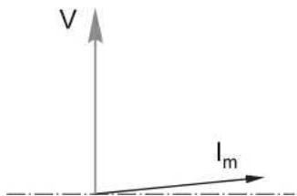

小结（教材 5.2.8）：定子接三相电 → 气隙里出现正弦分布、径向指向的旋转磁密波；转速正比于频率、反比于极数；幅值正比于电压、反比于频率；空载有功很小，但无功需求可观。

### 🐿️ 转子：一只免维护的"松鼠笼"

最常见的转子长这样：硅钢片叠压（表面氧化层绝缘，防轴向涡流），槽里塞实心导条，两端用**端环**把所有导条短接——活像旧时给小动物跑步的笼子，"鼠笼"由此得名。大电机用铜条钎焊，中小电机直接铝压铸，一次成型。

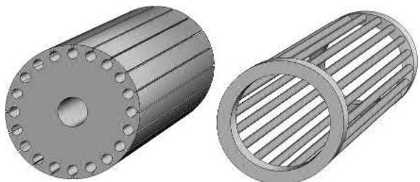

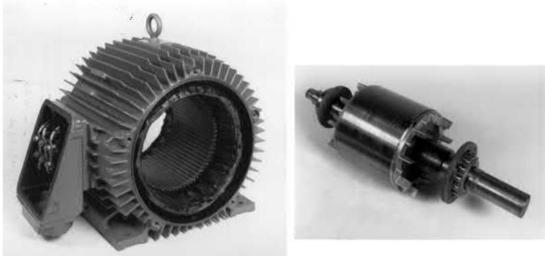

三个特点划重点：

- **没有任何外部电气连接**——转子电流全靠感应；
- 导条永久短接，转子电阻造出来就改不了；
- 鼠笼会**自动适应定子的极数**——同一个转子，配四极六极定子都能用。

不想被"电阻焊死"怎么办？第二种转子——**绕线转子（滑环转子）**：槽里放一套和定子很像的三相绕组，星形连接，三个线端引到**滑环**上，经电刷外接电阻，想加多少加多少：

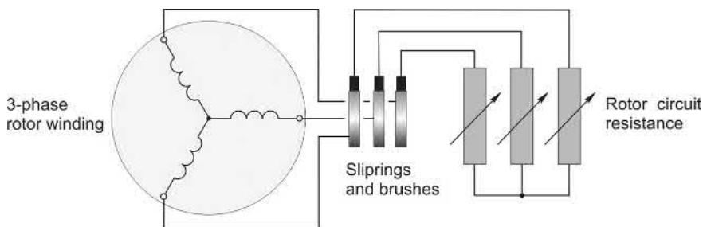

代价是贵、要维护。变频器普及之前，大功率场合常为这份可控性买单；如今新造的少了，但服役中的老机器还多——笔记 06 专门伺候它。鼠笼则胜在便宜、皮实、可靠。

### 🎯 转差：没有它，就没有转矩

转子导条被旋转磁场切割 → 感应电动势 → 导条短接成回路 → 感应电流 → 电流 × 径向磁场 → 转矩，转子被磁场"拖着走"。

关键在"切割"二字：**转子永远追不上磁场**。真追上了（转速 = 同步转速），相对速度为零，没有电动势、没有电流、没有转矩。所以感应电机又叫"异步"电机。转子与磁场的相对速度（Ns − N，叫**转差速度**）用归一化的**转差率**衡量：

$s = \frac{N_s - N}{N_s}$

s = 0 是同步转速（空转极限），s = 1 是堵转（锁转子试验就在这个点做）。另外鼠笼转子自动适配极数这件事，此处再次点赞。

### 🌊 转子里的电压波与电流波

转子感应电动势的**幅值**和**频率**都正比于转差：空载时转子频率接近 0 Hz，堵转时等于电网频率——转子相当于在磁通波上"打滑"，滑得越快，每秒被 N、S 极扫过的次数越多：

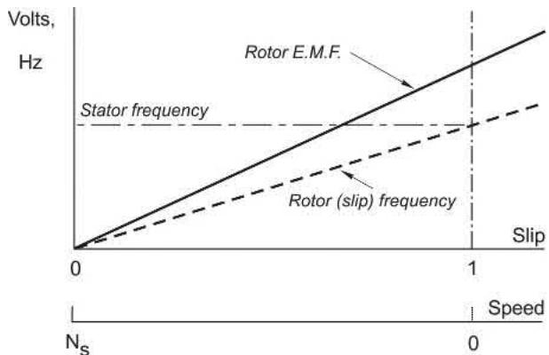

每根导条的电动势幅值频率相同，但**相位**不同：N 极峰下的导条电压最大为正，S 极峰下最大为负，中间平滑过渡——转子瞬时电压的空间分布就是磁密波的翻版，这个"电压波"以转差速度 sNs 相对转子表面移动：

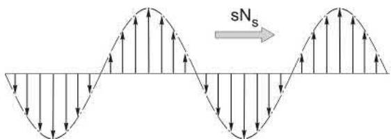

端环把所有导条短接，电压波驱动电流沿导条流动、经端环闭合成回路：

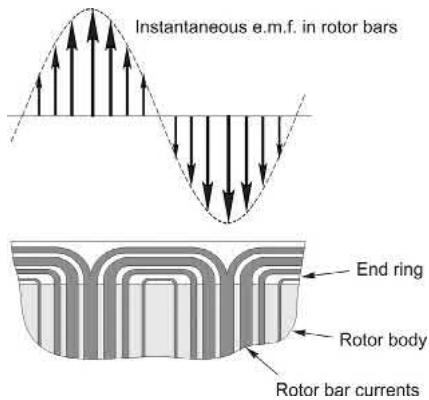

### 📈 小转差：一条又平又硬的好特性

正常运行区（s 在百分之几）转子频率极低，转子回路里感抗可以忽略，电流与电动势同相——于是电流波、电动势波、磁通波**三波对齐**：

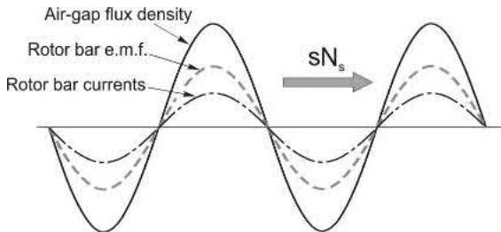

磁密峰对着电流峰，每根导条都在出正力，转矩公式干净利落：

$$
T = KBI_r
$$
磁通 B 恒定（电网电压频率不变），Ir 正比于转差，于是**转矩正比于转差**——特性是一条陡直的直线：

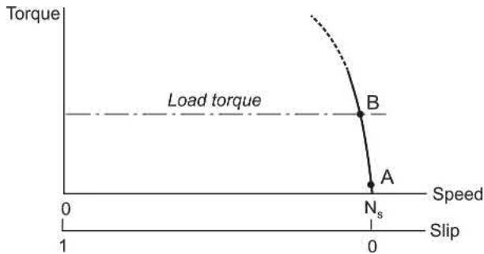

空载几乎贴着同步转速跑；负载加上来，转速略降、转差略增、转矩自动长上去，在转矩平衡点稳住。小电机满载转差约 8%，大电机约 1%；转差再大，转子导条就要过热（图中虚线的过载区）。眼熟吗？**这段特性和直流电机如出一辙**——又平又硬，天生适合干活。

### 📉 大转差：cos φ 掉队，转矩过峰

转差一大，转子频率升高，感抗开始跟电阻掰手腕。后果有二。其一，电流增长放缓：

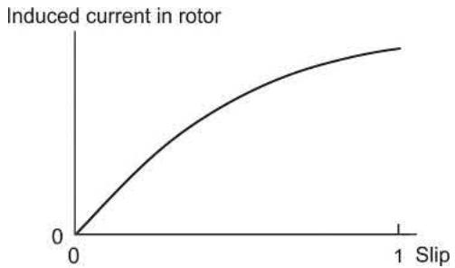

其二更要命：电流在时间上滞后电动势，反映到空间上，转子电流波**滞后**磁通波一个角度 φr——最大电流和最大磁密不再对齐，有些区域甚至流着"帮倒忙"的反向电流：

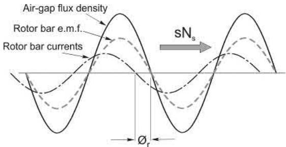

转矩公式得加个折扣因子：

$$
T = KBI_r\cos\varphi_r
$$
转差增大时，cos φr 下跌的速度超过 Ir 上涨的速度，于是转矩在某个转差处**过峰回落**。峰值恰好出现在转子感抗 = 转子电阻的转差点，设计师靠调整电阻/电抗比，想把峰值摆哪就摆哪：

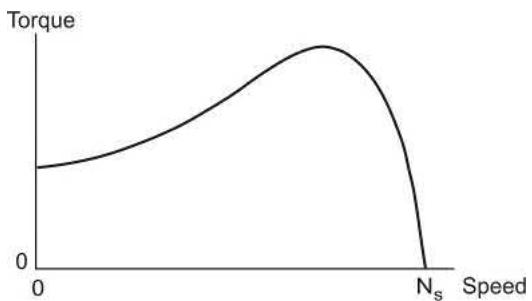

### 🔄 彩蛋：转快了它就是发电机

和直流电机一样，感应电机天生**双向**：被外力拖到同步转速以上（s < 0），转矩自动反向，能量回馈电网——不需要任何操作，自然过渡。很多用户听说自己的"电动机"会发电时一脸怀疑，但风力发电机组里干活的很多正是它。

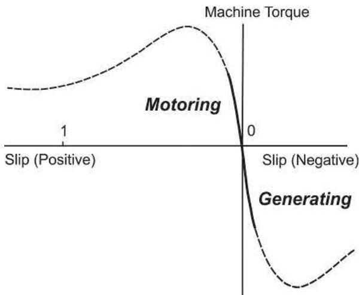

### 🛡️ 磁通的自我保卫战

转子电流也会产生磁动势（从定子看，它永远以同步转速旋转，不管转子转多快），按说要把主磁通拆台。但定子有"护法"：磁通刚有一丝下跌，E 微降，定子立刻从电网多吸一大口电流，其磁动势恰好"抵消"转子磁动势——主磁通几乎纹丝不动（大电机变化不到 1%，小电机约 10%）。这就是定子"知道"何时向气隙输送有功的机制：负载加重 → 转差增大 → 转子电流出现 → 定子电流应声而涨。所以前面"磁通恒定"的假设在小转差区完全站得住。

但在**大转差**下这套保卫战就守不住了：漏磁通喧宾夺主，直接挂电网启动（s = 1）时主磁通可能**只剩一半**——这为下一节的"黑历史"埋好了雷。

### 🔌 定子电流全景：从空载到堵转

定子电流 = 磁化电流（常驻，无功）+ 负载分量（随转差涨，基本与电压同相的有功）。负载越重，合成电流越大，也越靠近电压相位——功率因数随负载改善：

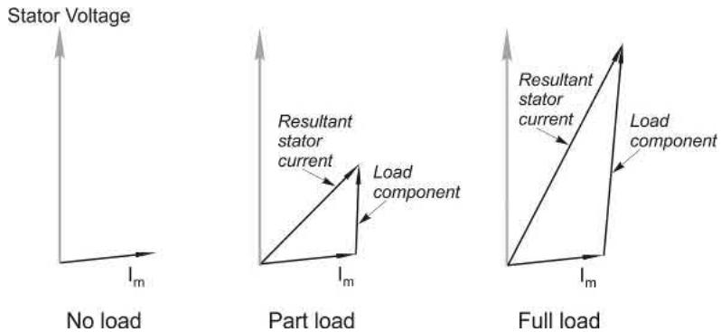

注意和直流电机的反差：直流电机空载电枢电流微乎其微（励磁由独立的励磁回路管），感应电机空载电流却不小——励磁和干活全压在定子这一套绕组上。把全转差范围画出来，电流轨迹长这样：

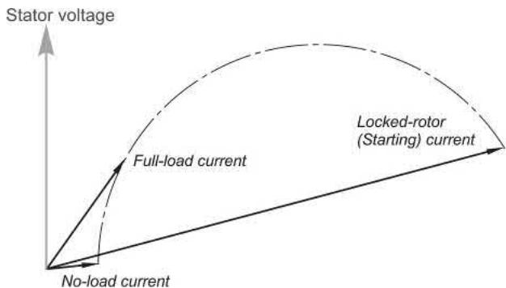

轻载功率因数差，大转差时更差；堵转（启动）电流约为满载的 **5 倍**。于是出现了鼠笼电机最难看的一幕：**启动电流 5 倍，启动转矩却小得可怜**——每安培电流换来的转矩在启动时低得离谱，进了小转差区才像样：

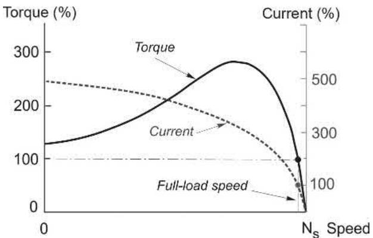

电网侧电压被拉陷、开关柜得加粗，全是直接启动惹的祸。剧透一句：逆变器供电可以彻底绕开这段黑历史，让磁通任何时刻都保持最优——这是笔记 07 的内容；工频电网上的驯服姿势，笔记 06 细说。

### 📜 老列的五条铁律

| # | 铁律 | 一句话解释 |
| --- | --- | --- |
| 1 | Ns = 120f/p | 磁场转速只认频率和极数，想调速就得动频率 |
| 2 | B = kV/f | 电压定磁通；变频必须配变压，V/f 控制的根 |
| 3 | 没有转差就没有转矩 | 转子永远追不上磁场，"异步"之名由此而来 |
| 4 | 小转差区 T ∝ s | 特性又平又硬，和直流电机一个脾气 |
| 5 | 直接启动 5 倍电流、可怜转矩 | 大转差下磁通塌方、cos φ 掉队，鼠笼的先天软肋 |

### 🧠 自测题：过完这几关再走

- 老列出题，答案都藏在正文里（想对答案的，原书附录见）
    1. 铭牌标满载转速 2950 rev/min 的 50 Hz 电机，是几极的？额定转差率多少？
    2. 四极 60 Hz 电机，转差 4%：转速多少？转子频率多少？转子电流波相对转子表面、相对定子表面各转多快？
    3. 按 440 V 设计的电机接到 380 V 电网上：同步转速、气隙磁通、额定转速下的转子电流和转矩各怎么变？
    4. 把六极电机的转子装进同尺寸的四极定子：鼠笼转子要改什么？绕线转子呢？（提示：谁能"自动适应极数"）
    5. 440 V、60 Hz 的电机想搬到 50 Hz 电网上用，电压该给多少？（提示：铁律 2）
    6. 转差增大时转子电流一直在涨，转矩为什么涨着涨着就掉头向下了？

### 📝 后续计划

【笔记 06】讲**感应电机在工频电网上的运行**——直接启动有几种驯服姿势？深槽和双笼转子怎么"自带变阻器"？绕线转子的滑环还有什么绝活？调压调速为什么是死胡同？敬请期待。

---

### 💬 老列碎碎念

老列刚下车间那会儿，师傅指着一台嗡嗡转的水泵电机说："这玩意儿转子里一根线都不接，你信不？"我当场拆了一台报废的看——就一堆铝条两个环，愣是没找到"电从哪进去"。后来才明白：电磁感应本身就是最优雅的"无线输电"。一台不用喂电流的转子，扛起了半个工业文明，这买卖太值了。

你们厂里服役最久的感应电机跑了多少年？评论区报个数。

  <strong>觉得有收获的话，老规矩，</strong> 
  <strong>点赞、在看、转发三连伺候，老列给你比个心。</strong>  
  👇👇👇

---

> 推荐关注公众号「探物及理」，探万物之然，及万理之源。
>
> 
