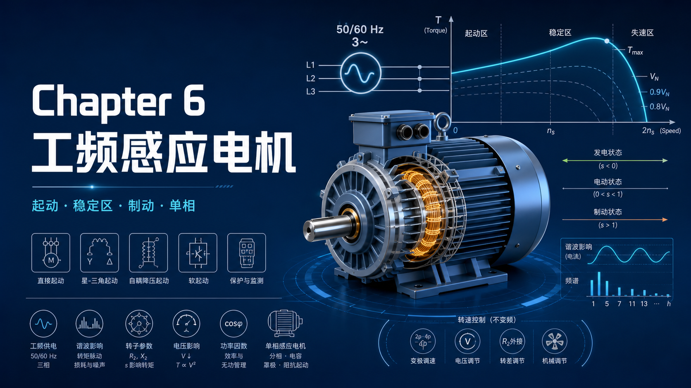

你好，我是老列 👋

上一篇 [5-不通电的转子凭啥会转？老列揭开感应电机的旋转磁场魔术](https://app.notion.com/p/5-ff009602ebf14752aa47dd8fe2fd6822?pvs=21) 留了个尾巴：鼠笼电机直接挂电网启动，电流飙到 5 倍，转矩却小得可怜。今天就讲它在工频电网上的生存之道：怎么启动、怎么别把自己烧了、怎么刨到一点可怜的调速能力。虽然变频器已经铺天盖地，但全世界存量电机的大多数今天仍直接挂在电网上干活——这些"土办法"你早晚会在现场碰到。

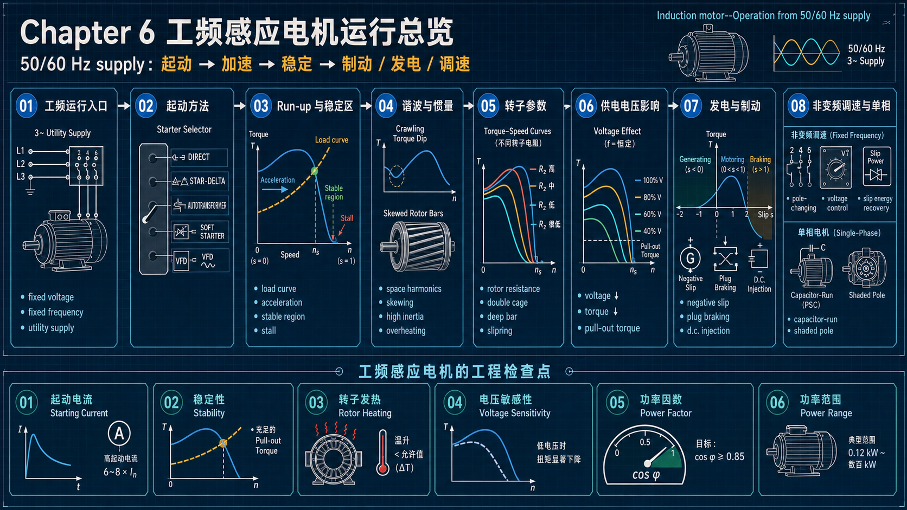

---

## 【老列 驱动导论笔记 06】：工频电网上的感应电机——启动、驯服与"土法"调速

### 🔌 启动难题：电网不是无穷硬

小功率电机（几 kW 以下）合闸就走，一秒内冲到满速，谁也不会注意到启动电流比额定大。但几 kW 以上，就得先算算电网受不受得了。任何电网，不管多复杂，都能等效成"理想电源 + 一个内阻抗"（戴维南等效）：

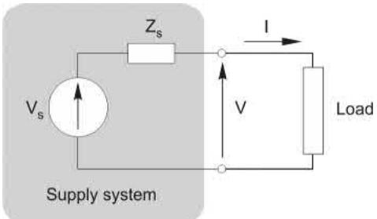

抽电流 I，端电压就往下塌：$V = V_s - IZ_s$。工业电网的内阻抗基本是感性的，而同样大小的电流，**感性负载造成的压降比阻性负载狠得多**——因为感性电流的 IXs 压降正好和 Vs 同相，直接从幅值上砍：

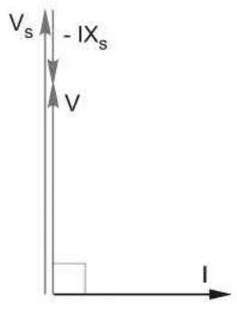

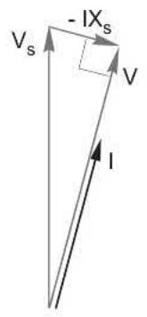

鼠笼电机启动时恰好是**双重暴击**：电流 5~6 倍不说，大转差下电机还呈感性（拉到满速满载后才变成阻性，电流也只剩启动时的五分之一）。

那把电网内阻抗做到零不就完了？想得美：短路电流反比于内阻抗，Zs → 0 时故障电流 → ∞，能切断这种电流的开关柜贵上天。所以供电部门永远在"硬"和"故障电流可控"之间折中。内阻抗小的叫**"硬"电网（stiff）**，直接合闸（DOL）没商量；内阻抗大的"软"电网，一启动全厂灯泡一起暗，得配启动器限流——代价自然是启动转矩更低、加速更慢。

硬软是相对电机阻抗而言的：同一台大电机，在大厂区可以直接合闸，拉到山区末端电网就得配启动器。轻载低惯量的电机冲得快，大电流只持续一秒半秒，往往可以接受；有些场合还装离合器先空载启动、到速后再挂负载。惯量大、负载重、规则严，启动器就跑不了。

### 🎬 驯服姿势一览：从星三角到变频器

| 方法 | 启动电流 | 启动转矩 | 老列点评 |
| --- | --- | --- | --- |
| 直接合闸 DOL | 5~6 倍 | 原值 | 硬电网首选，简单粗暴 |
| 星/三角 | 1/3 | 1/3 | 最便宜最常见，切换时还要再震一下 |
| 自耦变压器（抽头 α） | α² | α² | 星三角转矩不够时的升级方案 |
| 串电阻/电抗 | 可调 | 按电压平方缩水 | 电流降一半、转矩只剩 1/4，不划算 |
| 晶闸管软启动 | 可调、平滑 | 同上 | 免冲击，但波形不正弦，广告词要打折听 |
| 变频器 | ≤ 额定 | 全程额定转矩 | 降维打击，光凭启动能力就能值回票价 |

逐个拆解：

- **星/三角**：先接成星形，每相电压降到 1/√3（约 58%），接近满速时再切回三角。前提是电机六个绕组端子都引到接线盒（除了小电机，大多都满足）。切换时机怎么定？老师傅盯电流表、听转速稳不稳；自动版本检测电流回落、转速阈值，或者干脆定时；
- **自耦变压器**：每相一个带抽头的绕组，先用低压抽头启动，电流落下来再切全压：

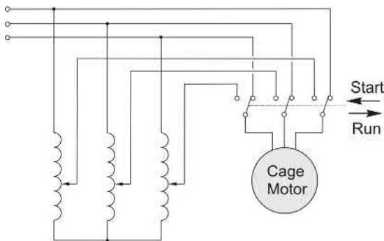

- **串电阻/电抗**：唯一的亮点是转速升高后电机阻抗变大，外串阻抗上的压降自动减小，电机电压越跑越高、转矩逐渐回升；到速后用接触器把它短接掉；
- **软启动**：三对反并联晶闸管串在三相进线里，每半周触发一次，触发角可调——导通时间占比想多少给多少：

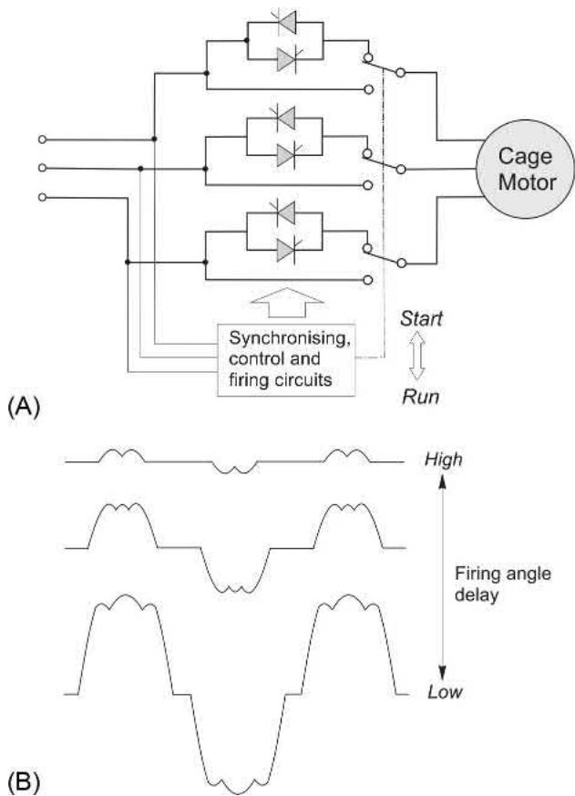

便宜的开环版只把触发角随时间线性拉升（"斜坡时间"试出来），负载一变就得重调，静摩擦大的"黏"负载前半段纹丝不动、一动又窜得太快；高级版带电流闭环，把电流钉在电网能容忍的最大值上，跑到临界转差时转矩陡升、转速会突然一冲，更高级的再加电机模型控速度剖面。

两个坦诚提醒：星三角、自耦、软启动都是"降压换安静"，**每安培电流换到的转矩最多持平 DOL**，广告里"大幅降流不降矩"都是胡扯；只用一两只双向晶闸管的廉价软启（<50kW 常见），三相不平衡会把气隙磁场扭曲，转矩一抽一抽的。

### 🏃 冲上去也有讲究：加速、爬行与热量炸弹

加速度 = （电机转矩 − 负载转矩）/ 总惯量。同一台电机带不同负载，起速过程大不相同：

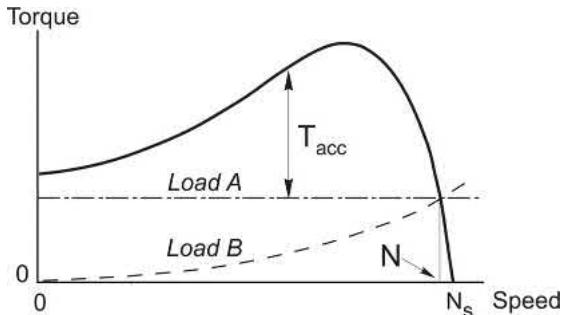

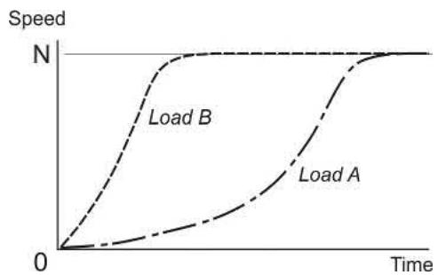

提醒一句：手册里的转矩-转速曲线是**稳态**曲线。刚合闸那几个周波，三相电流还没走到对称状态，转矩会剧烈抖动甚至瞬间反向：

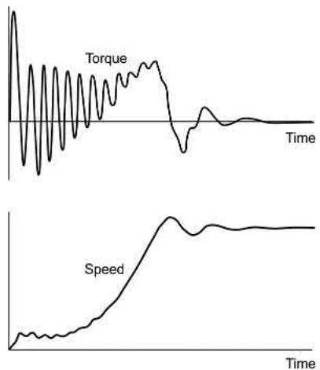

好在惯量大、起速慢时，拿稳态曲线估平均转矩足够准（"准稳态"处理）。另外两个坑要留神：

- **谐波爬行**：绕组磁动势不是完美正弦，空间谐波自带"小同步速"：5 次谐波反转 1/5 同步速，7 次谐波正转 1/7 同步速，在低速段制造转矩凹坑——极端情况下电机会"坐"在 7 次谐波上，以 1/7 同步速**爬行**不肯上去：

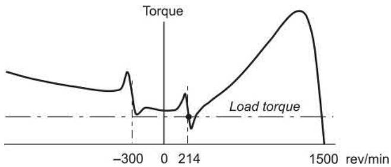

对策是把转子导条**斜一两个齿距**（斜槽），基波几乎不受影响，谐波响应大幅削弱——拆开电机看到斜着的铝条，就是这个用意：

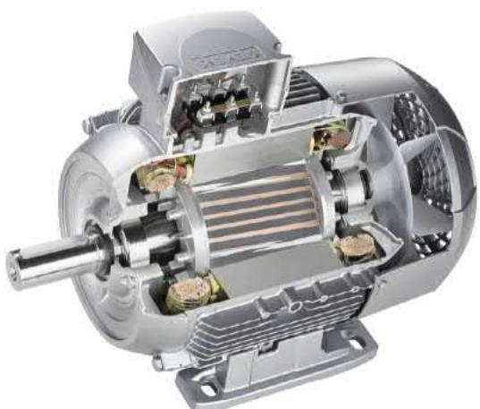

- **高惯量启动 = 热量炸弹**：每启动一次，绕组里发的热**恰好等于系统全部动能**——哪怕稳态负载轻得很。而全封闭电机的转子散热最差，频繁启动首先烤的就是它。厂家标注"每小时允许启动次数"就是这么来的，惯量翻倍、问题加倍，拿不准就问厂家。

### ⚖️ 一条狠规矩：转子效率 = 1 − s

穿过气隙的功率 Pr，永远按转差分赃：**sPr 变热，(1−s)Pr 变机械功**。转差 5%，转子效率 95%；硬要用转差滑到半速跑，一半的气隙功率直接变暖气。这条规矩判了所有"转差调速"的死缓：调压调速、转子串电阻调速，全是拿电费换转速。也顺带拆穿一个牛皮："满载转差 5%、总效率 96%"——不可能，总效率永远明显低于 1−s（还有定子铜损、铁损、风摩损在后面排队）。

还有个稳定性边界：负载在曲线陡坡段（图中 0XYZ 区）才能自动找平衡——负载重一点，转速略降、转矩自动长上去。但超过**峰值（pull-out）转矩**的 Z 点，转速一掉、转矩缺口反而更大，电机带着怒音迅速**失速**停转——钻床卡钻头那声"嗡"，老师傅都听得懂；而卷扬机超载则会被倒拖反转，得靠机械抱闸兜底：

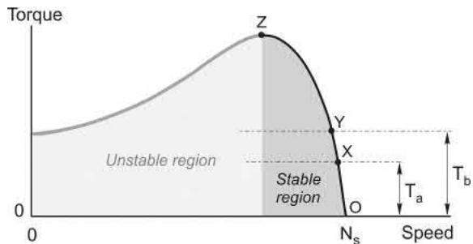

### 🧬 转子电阻的两难，和"自带变阻器"的转子

低转子电阻 → 特性陡、效率高（铜比铝更低，但再低也低不过满槽实铜），可启动转矩小、启动电流大；高电阻正好相反，甚至能把峰值转矩摆到启动点（青铜、黄铜笼），代价是满载转差大、效率低——冲压机飞轮这种"干活全在加速段"的老应用倒是它的舏得地：

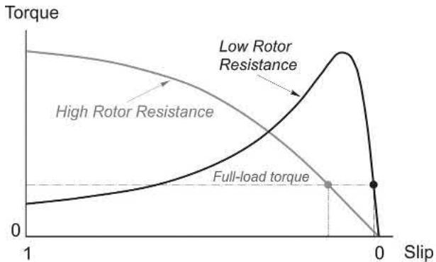

鱼和熊掌怎么兼得？让电阻**随频率自动变**：

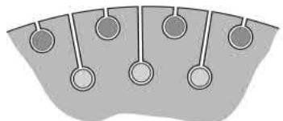

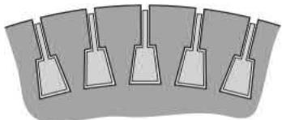

- **双笼转子**：外笼青铜高阻、漏感小；内笼紫铜低阻、埋得深、被铁包着漏感大。启动时转子频率高，内笼感抗大得进不去电流，电流全走高阻外笼 → 高启动转矩、启动电流还明显更小；运行时转子频率几近于零，电流改走低阻内笼 → 高效率。代价只是运行性能略微打折；
- **深槽转子**：更便宜的同款思路，利用**集肤效应**——铜条埋在铁里，工频下有效电阻可达直流值的两三倍；启动时电流挤在槽口，电阻自动变大，转速上去后电流铺开、电阻回落。市面上绝大多数中小电机都或多或少吃了这口红利，代价是漏抗略大、峰值转矩稍低。

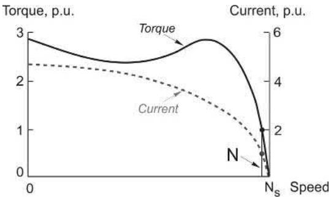

（顺带科普个行话：图里的 p.u. 就是"标幺值"，1 p.u. = 100% = 额定值，电流 400% 就是 4 倍额定。）

至于**绕线转子（滑环）电机**：外接电阻可以让它用**额定电流启动出满转矩**，随转速逐级切除电阻保持转矩接近恒定（图中 ABC 轨迹），最后短接滑环当低阻鼠笼用——石头破碎机、起重机、皮带机的老功臣：

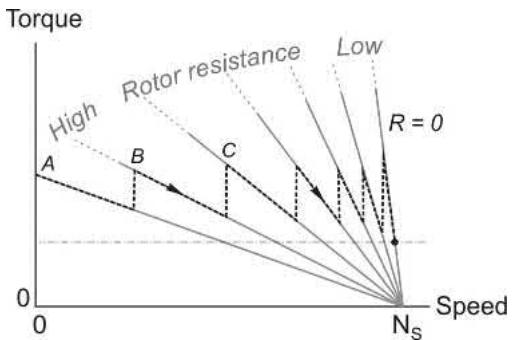

如今新项目基本被变频鼠笼取代，但存量设备还多得很。

### ⚡ T ∝ V²：欠压是慢性毒药

磁通正比于电压，转子电流又正比于磁通，所以**转矩正比于电压平方**。电压跌 10%，转矩能力掉 19%。带同样负载时转差得增大（例如从 5% 到 6%）、转子电流得多 10%，发热多 21%——转速只掉了 1%，表面上风平浪静，电机却在慢性过热：

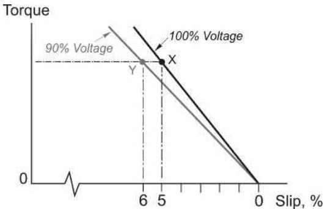

三相电压**不平衡**更阴。用"对称分量法"拆解：不平衡电压 = 正序分量（干活的）+ 负序分量（制造反旋磁场，拖后腿、狂加转子损耗）+ 零序分量（星点接出才有戏）。国际标准只允许长期承受 **1%** 负序电压；硬要在 4% 不平衡下连续运行，得降额到约 80% 用。大电机都配过热保护甚至负序保护，小电机得靠你自己盯着。（彩蛋：单相电机就是"不平衡到极致"的情况——正序负序分量相等，脉动磁场 = 正反两个旋转场，后面番外用得上。）

### 🔄 一张全谱图：制动、电动、发电

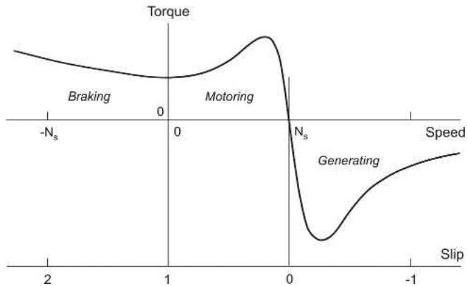

诀窍只有一条：**决定转矩方向的是转差不是转速，转矩永远把转子往同步转速拉**。由此衍生出一整套玩法：

- **反接制动（plugging）**：对调两相，磁场倒转，s ≈ 2，电机猛减速、过零、反向加速到反向同步速附近——1kW 电机不到一秒完成正反转：

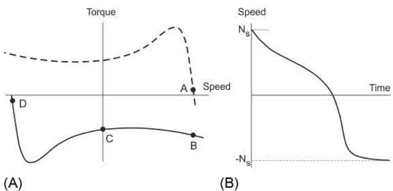

代价：反接电流比启动还大，每反接一次**四倍动能**化作绕组热量；用它停车还得配零速检测切断电源，不然倒转飞奔；

- **直流注入制动**：断三相、经两个端子向定子灌直流（低压大流变压器+整流器供电）——直流就是"零频磁场"，磁场站着不动，转子只能被拖向静止，制动转矩随转速降低而减到零：

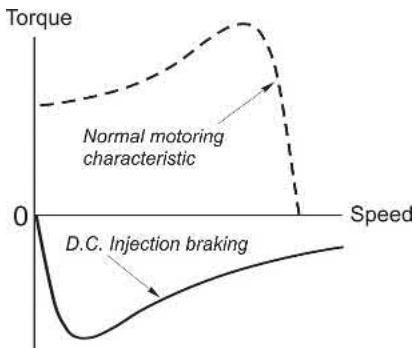

同样是耗散式，动能全部变热；

- **自然发电（再生）**：卷扬机放空钩，绳越放越多、下放转矩超过摩擦后眼看要飞车——一旦超过同步速，电机自动转入发电区拉住，转速稳在同步速上方一丁点，能量回馈电网，全程不需要任何操作。但注意：**离了电网它发不了电**（磁化电流没来源）——"感应机不能发电"的谣言大概就是这么来的；
- **孤网自励发电**：想脱网发电也有土方子——靠转子铁芯的**剩磁**起动，并联一组电容和绕组电感谐振（ω₀ = 1/√LC），给磁化电流一条极低阻抗回路：小小的剩磁电动势驱动大电流，正反馈自举，直到铁芯饱和把电压稳住，再合上负载开关：

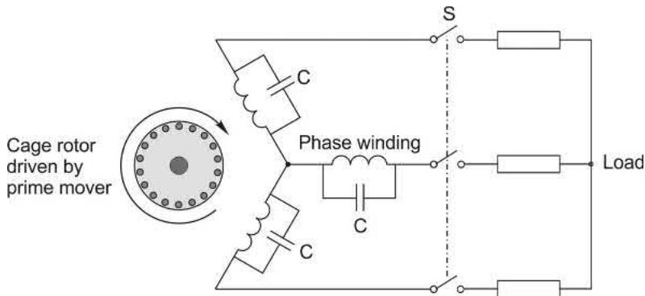

这套只适合转速负载变化不大的小型孤网电站，实用系统还得加可变电容控制稳住电压；

- **双馈风电（DFIG）**：绕线转子的现代高光——定子直连电网，转子经一对背靠背变流器也连电网：

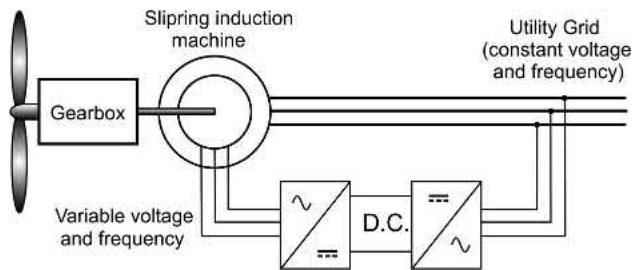

原理很优雅：定子磁场锁定同步速（比如 4 极 60Hz = 1800 rev/min），转子灌入**滑差频率**的三相电流补上转速差：轴速 1500 就灌 10Hz 正序（转子磁场相对转子 +300），轴速 2100 就灌 10Hz 反序（−300）——两个磁场永远锁在一起，转速可在同步速 ±30% 浮动而发电频率不变。亚同步时转子从电网"借"P/6 的功率，超同步时定转子一起向电网送电（最多 7P/6）；变流器只需电机容量的 30% 左右，还能顺手调功率因数——这就是风电场爱它的全部理由。

### 🪛 不动频率的调速：全是妥协的艺术

高效调速只能调同步转速，而同步转速只认频率和极数。不碰频率，就剩三条窄路：

1. **变极调速**：改接线把 N-S-N-S 变成 N-N-S-S，极数减半、转速翻倍（鼠笼转子自动适配，不用换）；1960 年代的 PAM 技术连 4/6、6/8 这种近比都能做，只多引几根线+接触器切换，便宜好用，但只有几个**离散档位**，风机水泵电梯够用；
2. **调压调速**：普通低阻鼠笼的稳定区太窄，基本没得调；高阻转子 + 风机负载才能刨出一段可用转速范围，硬件和软启动同一套晶闸管调压器：

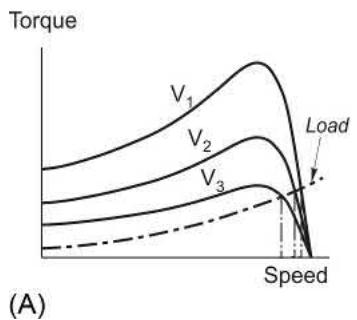

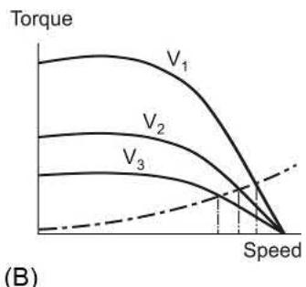

1. **转子串阻 / 转差能量回收**：滑环电机专属。串阻简单，选对阻值可在任意转速出到 1.5 倍满转矩，但烧钱：

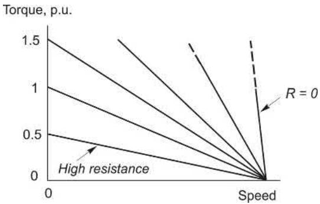

高级版是把滑差频电能整流后逆变回电网（静止 Kramer 系统），适合 70% 同步速以上的大泵大压缩机，如今也被变频鼠笼拍在沙滩上。

结论已经呼之欲出：**想要又宽又顺又高效的调速，只剩变频一条大道**。

### 💡 调压省电？功率因数优化的真相

晶闸管调压器还有个副业：轻载时降压"瘦身"。原理：轻载满压时磁通满值，磁化电流比干活电流还大，功率因数难看；把电压降一半，磁通减半、磁化电流至少减半，干活电流翻倍补转矩，功率因数明显改善：

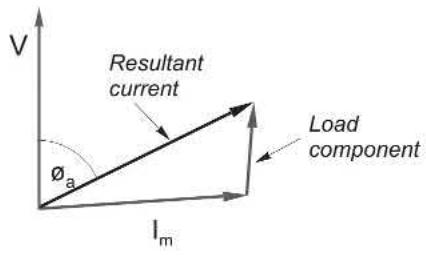

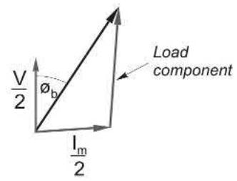

但算总账得诚实：降压降的是铁损，转子铜损却在涨——一般电机只有在 **25% 负载以下**才有净省电，满载时什么都省不了（磁通必须满值）。只有长期轻载或空载的场合，才值得为这点节约掏钱。

### 🏠 番外：单相电机和"为什么没有微型感应电机"

家里冰箱、风扇里的单相电机，本质是把脉动磁场拆成正反两个旋转场：静止时两场势均力敌、没有转矩；转起来后转子电流压制反向场、助长正向场，正反馈越转越强——所以"推一把就能转"，而且两个方向都行。堵转了却不会自启动，大电流+怒音，不断电就烧。自启动得靠第二套绕组制造相移，丰俭由人：

- **电容运转式**：副绕组串几 μF 电容制造相移，启动转矩一般，最适合风机负载；要大启动转矩可以双电容、到速切掉一只：

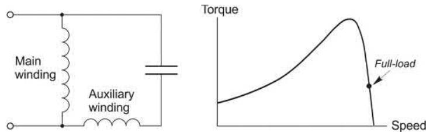

- **裂相式**：主绕组粗线低阻高抗，副绕组细线高阻低抗，阻抗差异本身就够出相移，启动转矩可达 1.5 倍满转矩：

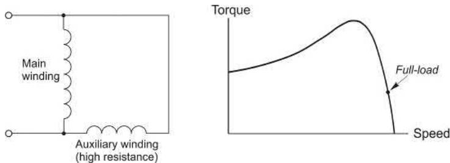

- **罩极式**：最便宜最皮实——磁极上开个槽套一圈短路铜环，环里的感应电流把局部磁通拖慢半拍，磁场就沿极面"滑"过去。效率低、只能单向，但吹风机烤箱风扇够用：

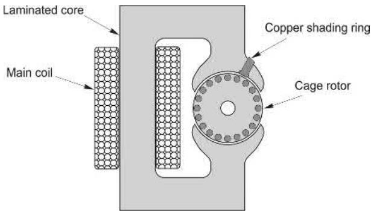

另一个有意思的问题：感应电机功率跨度六个数量级（几十 W 到几十 MW），为啥往小了做会撞上**励磁墙**？算笔账：尺寸缩半，气隙减半、磁化电流减半，但绕组电阻翻倍，励磁损耗只降一半；而散热面积只剩四分之一——**温升翻倍**，光励磁就把温度额度吃光了，没余量干活。所以三相感应电机很少小于 200W，单相很少小于 50W；微小功率的地盘属于永磁——磁钢产磁通不产热。这个伏笔留到笔记 09。

### 📜 老列的五条铁律

| # | 铁律 | 一句话解释 |
| --- | --- | --- |
| 1 | 降压启动不白嫖 | 星三角电流转矩同降 1/3，每安转矩没人胜过 DOL |
| 2 | 转子效率 = 1 − s | 转差就是效率税，转差调速都是拿电费换转速 |
| 3 | 双笼/深槽 = 自带变阻器 | 靠漏感和集肤效应，启动高阻、运行低阻两头占 |
| 4 | T ∝ V² | 欠压 10% 丢 19% 转矩，过热全数留给转子 |
| 5 | 每次启动，动能全额变热 | 高惯量频繁启动先烤转子，反接制动更是四倍套餐 |

### 🧠 自测题：过完这几关再走

- 老列出题，答案都藏在正文里（想对答案的，原书附录见）
    1. 为什么大电机直接合闸会把电网电压拉塌？同一台电机为什么在甲地能 DOL、在乙地就得配启动器？"硬"电网硬在哪？
    2. 星接每相电压是三角接的 1/√3，据此推一推：为什么星接启动的线电流和转矩都是三角接的 1/3？
    3. 很多鼠笼转子的导条和铁芯之间不加绝缘，为什么不出乱子？
    4. 60 Hz 磨床要跑 3500 rev/min、50 Hz 泵要跑 700 rev/min，各选几极？8000 rev/min 的透平压缩机呢？
    5. 4 极 60 Hz 电机满载 1700 rev/min，为什么总效率不可能高达 94%？（提示：铁律 2）
    6. 4 极 60 Hz 低阻鼠笼满载 1740 rev/min：半转矩满压、满转矩 85% 电压下各跑多快？后者为什么不能久跑？
    7. 空载电机反复启停，转子为什么会很烫？
    8. 5 次谐波反转 1/5 同步速、7 次谐波正转 1/7 同步速，它们在定子绕组里感应的电动势频率各是多少？

### 📝 后续计划

铺垫全部就位，【笔记 07】进入重头戏：**变频运行**——把频率握在自己手里，同步转速任我拿捏；V/f 怎么配合？低速为什么要电压提升？基速以上的弱磁区又是什么光景？敬请期待。

---

### 💬 老列碎碎念

老列见过最惨的一次事故，是一台带大飞轮的破碎机：操作工嫌启动慢，一小时内反复启停了十几次，第二天转子铝条熔了一根——他至今不信"空载启动也会烧电机"。记住那条铁律：启动一次，不管带不带负载，系统动能那份热量一分不少全在绕组里。电机不怕干活，怕的是反复折腾。

你现场见过最膈应的启动方式是哪种？星三角切换那一下入没入过你的监控报警？评论区聊聊。

  <strong>觉得有收获的话，老规矩，</strong> 
  <strong>点赞、在看、转发三连伺候，老列给你比个心。</strong>  
  👇👇👇

---

> 推荐关注公众号「探物及理」，探万物之然，及万理之源。
>
> 
