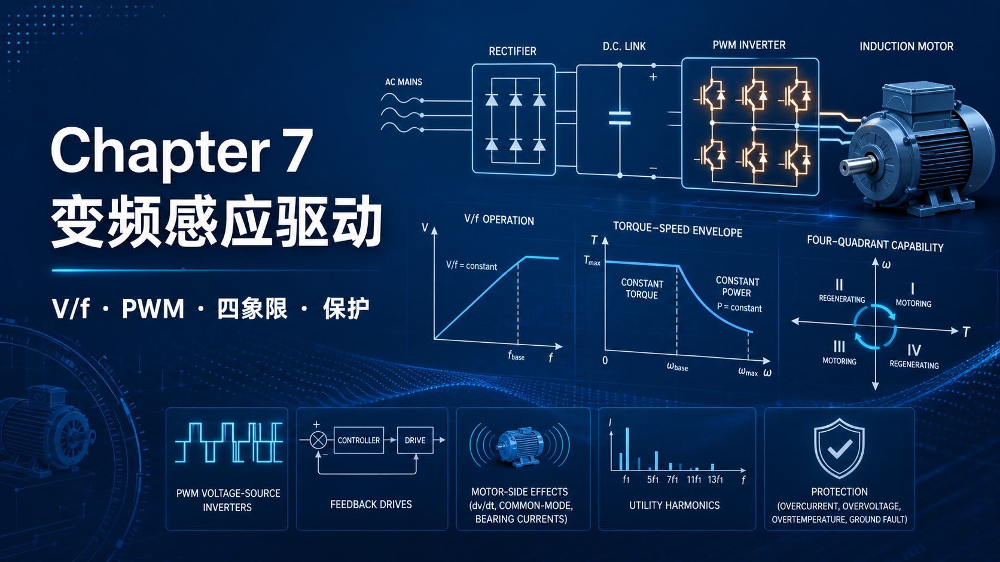
你好，我是老列 👋

上一篇 [6-五倍启动电流怎么驯？老列盘点感应电机挂电网的十八般武艺](https://app.notion.com/p/6-3feb8b7bea744671bc3df8da36fe7749?pvs=21) 的结论是：想要又宽又顺又高效的调速，只剩变频一条大道。今天就走上这条大道：把频率握在自己手里之后，感应电机的好处一样不少，毛病一个不剩——唯一速变无级调速，五倍启动电流变不超额定，反转不用倒线，还白送四象限能力。顺便回答一个新手必惊奠的问题：**降速时变频器为啥把电压也调低了？400V 的电机吃 200V，不会餕着吗？**

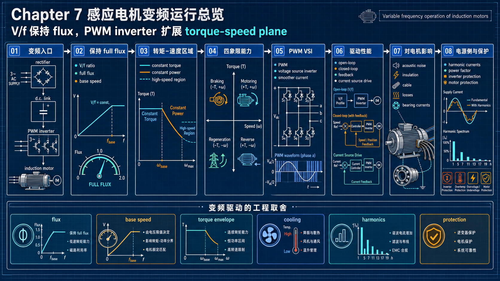

---

## 【老列 驱动导论笔记 07】：变频运行——恒转矩、恒功率与四象限

### 🔧 序言：三条主线，提纲挘领

变频运行的全部绠密，就藏在前两篇已经证明过的三条关系里：

1. 转矩取决于**磁通幅值**和**转差速度**；
2. 磁通幅值正比于 **V/f**；
3. 磁场转速正比于 **f**。

于是控制策略一句话就能说完：**控频率定转速，控电压保磁通**。频率定到哪，同步转速就在哪，电机带着小转差紧跟其后；而磁通必须任何时候都顶在额定值——磁通足，同样的转矩只需最小的转差，效率才高。

另外交代一个好消息：虽然 PWM 逆变器输出的电压波形是一串方波，但电机在谐波频率下阻抗很高，**电流几乎是正弦的**——所以前面学的正弦供电理论直接拿来用，只看基波就够。

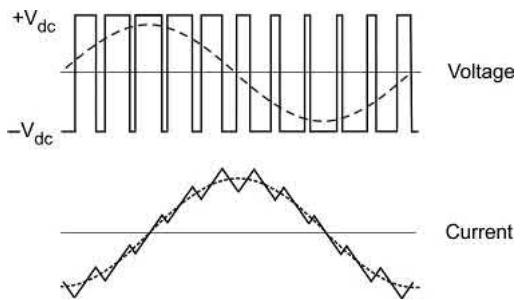

### 📉 电压为啥越调越低：不是餕着，是怕撑着

回到开头的问题。400V/50Hz 只是这台电机**在 50Hz 时**的正确电压。降到 25Hz 还给足 400V？按 B = kV/f，磁通会冲到两倍额定——磁路深度饱和，磁化电流爆表，铁耗铜耗零彰大乱。所以 25Hz 的正确电压恰恰是 200V：**电压随频率成比例升降，磁通才纹丝不动**。

还有个观念要翻篇：接上变频器之后，**工频 50Hz 不再有任何特殊地位**。电机可以绕成几乎任意基频——比如 400V/100Hz，那它就能恒磁通一路跑到 100Hz。基频是设计参数，不是物理定律。

### 🚀 低速补一口：电压提升（voltage boost）

纯按 V/f 直线走到低频段会露馅：电压本身已经很低，定子电阻压降的占比越来越大，真正留给磁通的电动势不够了——磁通亏额，低速转矩疲软。对策就是在低频段把电压比直线多给一口（升压补偿），把磁通顶回额定。现代驱动器用电机模型自动算，老式变频器得你手动调参数。补好之后的特性相当漂亮：

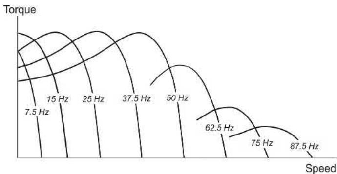

### 🗺️ 一张地图：恒转矩区、恒功率区、高速区

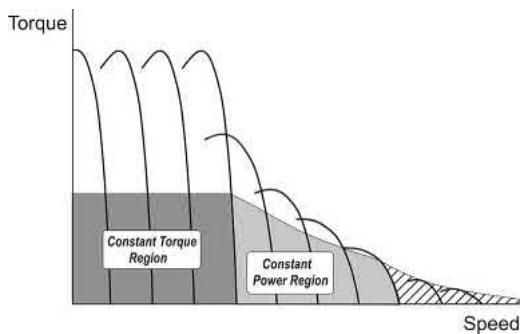

- **恒转矩区（零速→基速）**：磁通满额，变频器把电流限在额定值，对应的转矩上限就是额定转矩（大约是峰值转矩的一半，留足了裕量）——对标直流驱动的调压区；
- **恒功率区（基速以上）**：电压到顶了，磁通只能按 1/f 衰减（弱磁）；电流仍被热限制卡死，所以转矩上限也按 1/f 降——转矩 × 转速 ≈ 恒功率，和直流电机弱磁区一个剧本；
- **高速区（约两倍基速以上）**：恒压下峰值转矩按 1/f² 跌，跌得比电流限制线还快——上限改由电机自身说了算，想再快就得接受转矩打骨折。

### 🏁 启动？从此不存在的难题

变频启动的思路：频率从几赫兹开始慢慢往上爬，转子与磁场的**转差自始至终很小**——电机全程工作在最优转矩工况，上一章那些"大转差 = 低转矩 + 大电流"的丑态全部绕开。结果：**零速就能出额定转矩，从电网抽的电流却不超满载值**——软电网也敢随便用。星三角、自耦、软启动全体下岗；不少项目哪怕不调速，光凭启动能力就能把变频器的钱值回来。

### 🔄 四象限与刹车电阻

反转？不用倒电缆，逆变器在逻辑层把相序从 ABC 换成 ACB 就完事。减速？把频率往下调，转子瞬间快于同步速、转差变负，电机自动变发电机把动能往回送。加减速碰到电流限幅时，驱动器会自动放缓频率变化，沿着恒流轨迹平稳过渡——和直流双环的限幅启动异曲同工。

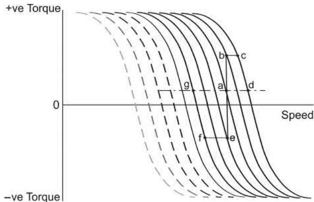

但注意一个工程坑：普通变频器前端是**二极管整流桥，能量只进不出**。回馈的能量会把直流母线电压顶高，必须靠斩波器把它导进**刹车电阻**烧掉。大惯量频繁启停的场合，刹车电阻的功耗得认真算；真要大量回馈，得上 PWM 整流前端（可回馈型）。

如果把反转也画进来，整张地图就是四象限：一、三象限是正反向电动运行，二、四象限是正反向制动/发电运行。变频器的优势在于，相序、频率斜坡、限流、制动逻辑都在控制层解决，不再靠倒线和硬切接触器硬来。

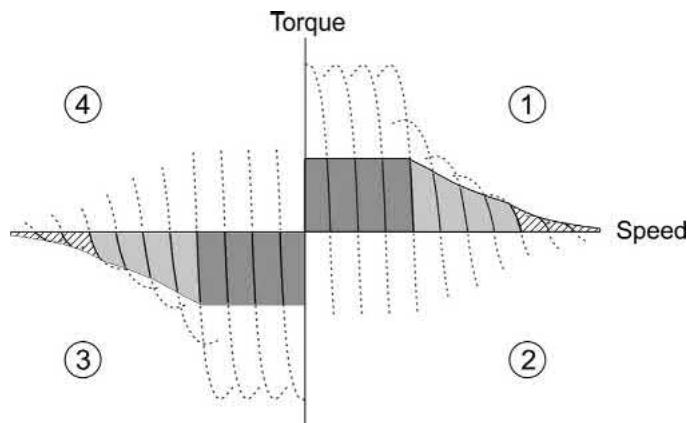

### 🧱 变频器长啥样：整流桥、直流母线、PWM 逆变器

把变频器拆成三块看就不神秘了：

1. **前端整流桥**：把固定频率、固定电压的交流电先整成直流；
2. **直流母线**：用电容（有时还有电抗器）做能量缓冲；
3. **PWM 电压源逆变器（VSI）**：用 IGBT/MOSFET 高频开关，把直流重新“剁”成可变频、可变压的三相交流。

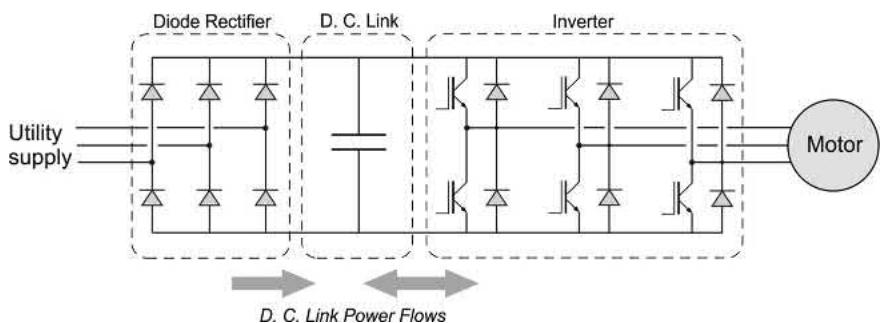

这里有两个工程直觉很有用：

- **开关频率越高，噪声越容易跑到人耳听不到的超声区，但变频器损耗也越高**；
- **三相输入比单相输入舒服得多**：三相瞬时功率比较平，母线电容不用扛太大的“断粮”时间；单相输入的小功率变频器，里面最显眼的往往就是那堆电解电容。

虽然逆变器输出电压满是 PWM 脉冲，但电机漏感对高频谐波阻抗大，所以相电流比电压圆润得多。现场用示波器看波形时还要小心：电压尖峰、采样带宽、接地方式、互感器噪声，都会把图像“画得很吓人”。

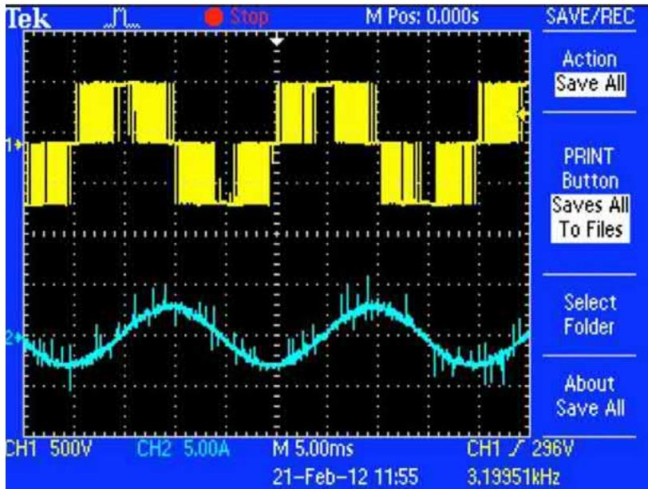

### 🕰️ 老古董插播：电流源型感应电机驱动

主流是电压源型 VSI，但历史上还有一类**电流源型逆变器（CSI）**：直流环节串大电抗，先把电流“硬”起来，再按顺序切进电机绕组。它曾经在 50～3500kW 的单电机风机、泵、挤出机、压缩机上很常见。

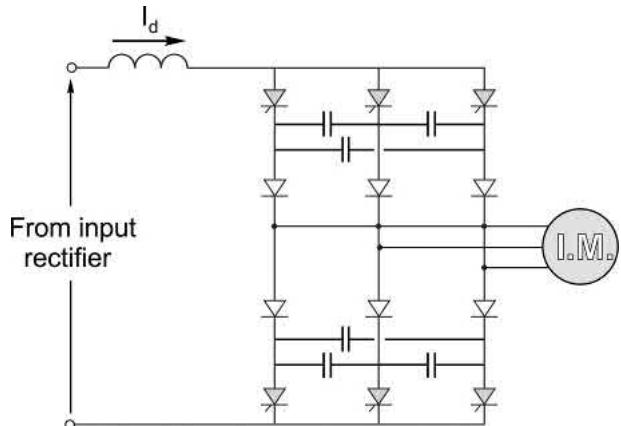

它的毛病也很鲜明：换流慢，频率范围通常只有 5～60Hz；低频转矩脉动明显；供电功率因数会随速度变差。今天多数厂家产品线里已经很少见，除非碰到老系统改造，否则知道它“存在过、为什么退场”就够。

### 🏎️ 现代变频驱动有多能打？

老记忆里“变频不如直流机灵活”，早翻篇了。配合磁场定向控制（下章主角），商用驱动器的典型指标已经相当夸张：

| 指标 | 开环无速度反馈 | 闭环带位置反馈 |
| --- | --- | --- |
| 转矩响应 | <0.5ms | <0.5ms |
| 速度恢复时间 | <20ms | <10ms |
| 100% 转矩最低频率 | 约 0.8Hz | 零速 |
| 1Hz 峰值转矩 | >175% | >175% |
| 速度环响应 | 约 75Hz | 约 125Hz |

对比一下晶闸管直流调速：光等下一个触发脉冲就可能要 3ms。交流驱动能反超，核心不是感应电机突然“开悟”，而是 PWM 逆变器能极快改变定子电压矢量的幅值、相位和频率，再配合实时电机模型，把本来看不见的转子磁链和转矩电流估出来。

怎么选控制形态，老列给个不严谨但好用的现场版：

- **风机、泵、皮带机、离心机**：开环无感/普通矢量控制通常够用；
- **吊车、提升、开卷、收卷、轧机**：低速大转矩、负载突变、再生制动都狠，优先闭环；
- **高速主轴、弱磁范围很宽的场合**：感应电机反而很香，转子结实，没有永磁体退磁焦虑。

但有一个场景高级控制也得认怂：**一拖多（一台变频器带多台电机）只能用老实的 V/f 控制**。磁场定向和直接转矩控制都要建“单台电机”的磁通模型；多台电机并联后，每台负载、温升、转差都不一样，模型没有唯一对象。每台电机还必须单独配热保护，别指望总电流保护能替某一台小电机兜底。

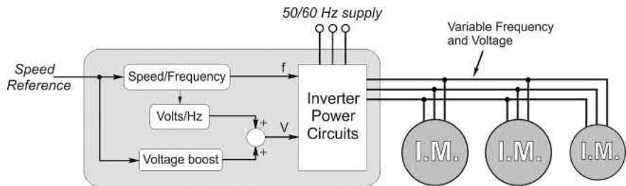

### 🩺 现实清单（对电机）：普通电机上变频，有五件事要盯

#### 1）散热：低速恒转矩最容易把电机焖熟

标准电机的外风扇长在轴上，电机越慢，风量越小。可恒转矩负载在低速仍然要同样的电流、同样量级的铜耗，热却吹不走——这就是“变频器能拖得动，电机不一定扛得住”。

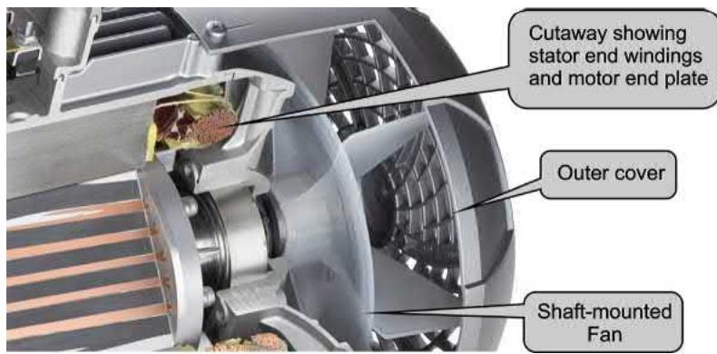

风机水泵这种负载轻松得多，因为负载转矩大致随转速平方下降、功率随转速三次方下降；低速时本来就不怎么发热。恒转矩负载就要认真看电机曲线：普通电机可能要降容，**inverter grade** 电机通常能恒转矩跑到 30% 基速；再往下，配独立风机才靠谱。

#### 2）噪声：耳朵听到的是铁心和机座在唱歌

PWM 谐波会带来电磁噪声。提高开关频率能把啸叫推到更高频，但代价是变频器开关损耗上升。有些电机还会在特定开关频率下共振，换个载波频率就能明显改善——别一听到尖叫就先怀疑轴承。

#### 3）绝缘与长电缆：dV/dt 比电压数值更阴险

400V 等级 IGBT 变频器的直流母线大约 540V，开关沿可能只有 100ns，dV/dt 可超过 **5000V/μs**。电缆一长，就从“电线”变成“传输线”：脉冲到电机端会反射，极端情况下端电压能接近两倍。

风险主要出在老电机、廉价电机、超长电缆、高压系统。现代正规变频电机通常按 IEC 60034-17/25、NEMA MG1 Part 31 等思路加强绝缘；中高压和长电缆项目则要考虑 dV/dt 滤波器、正弦滤波器、屏蔽与接地。

#### 4）损耗与降容：谐波不多，但热常常偏心

PWM 供电下，电机效率通常比正弦供电低 **1～2%**。听着不大，但谐波损耗不平均：一部分喜欢堆在转子，热路径又绕，最后可能逼着标准电机降容 **5～10%**。所以看变频适配，不只看额定电流，还要看热模型、低速冷却和工况占空比。

#### 5）轴承电流：小机少见，大机别装作没听过

磁路不对称、共模电压、接地不好，都可能让轴上出现电压。油膜被击穿后，电流从轴承滚道走，时间长了会电蚀。中小机型比较少见；大机组、长电缆、高开关频率系统要关注接地、绝缘轴承、接地碳刷或共模滤波。

### 🔌 现实清单（对电网）：功因变好了，谐波来了

一个常见误解是：电机侧电流谐波会原样传到电网侧。不会。中间有直流母线隔着，电网看到的是前端整流器。

好消息：有了直流母线缓冲，电机的磁化电流不再直接找电网要，**基波功率因数接近 1**。原文给的 11kW 例子很典型：同一台电机，直接挂网 cosφ ≈ 0.85，经变频器后基波功率因数可到 0.99。坏消息：二极管整流桥不是连续吸电流，而是在交流电压高过母线电压时一口一口“猛嘬”，于是电网电流变成尖峰脉冲。

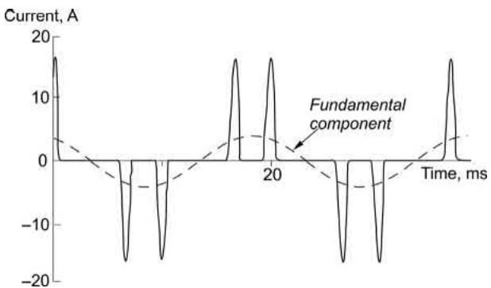

这些尖峰主要带来 5、7、11、13 次等低频谐波，不要和射频 EMC 混为一谈。经验法则：**整流类负载不超过电网容量的 20%，多数项目不用太焦虑**；超过这个比例，就要做谐波规划：

- **直流电抗 / 进线电抗**：最常见、性价比高，能把尖峰削圆；
- **12 脉波整流**：靠移相变压器让 5、7 次等谐波在一次侧相互抵消，适合大功率；
- **PWM 有源前端（AFE）**：电网侧电流接近正弦，还能把制动能量送回电网，贵但优雅。

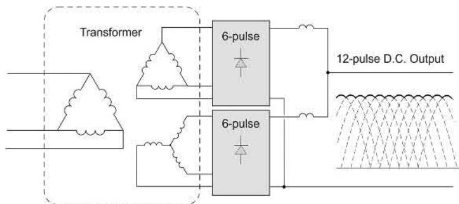

### 🛡️ 保护：变频器怕过流，电机怕过热，母线怕过压

保护逻辑可以抓三条：

1. **变频器保护看电流**：功率半导体不耐过流，早期驱动器最核心的保护就是电流阈值跳闸；现代驱动器会先限流、降频、拉斜坡，实在不行再停机；
2. **电机保护看热**：传统说法叫 i²t 热保护，现在算法复杂得多，会结合电流、速度、冷却、热时间常数估算电机温升；
3. **制动保护看直流母线电压**：普通二极管前端不能回馈，减速能量灌回母线后电压上升，必须靠制动单元和刹车电阻吸收；频繁启停、大惯量负载要按平均功率和峰值功率一起校核。

最后再强调一遍一拖多：总变频器的电流保护保护不了每台小电机的热命。每台电机都要有自己的热继电器、热敏、电子保护或等效方案。

### 📜 老列的五条铁律

| # | 铁律 | 一句话解释 |
| --- | --- | --- |
| 1 | 控频定速，控压保磁 | V/f 成比例升降，磁通永远顶在额定值 |
| 2 | 低频要升压补偿 | 定子电阻吃掉的那口电压，得额外补回来 |
| 3 | 基速以下恒转矩，以上恒功率 | 电压到顶后只能弱磁，两倍基速后连恒功率都保不住 |
| 4 | 变频启动不超额定电流 | 转差全程最优，零速满转矩，启动器集体下岗 |
| 5 | 普通前端不能回馈 | 减速能量要么刹车电阻烧掉，要么上可回馈整流 |

### 🧮 思考题（对应原书 7.7）

留几道原书的复习题给你练手，答案在附录里，也欢迎评论区交作业：

1. 选一个合适的极数，让感应电机在 30～75Hz 变频供电下覆盖 400～800 rev/min 的转速范围。
2. 一台 2 极、440V、50Hz 感应电机在 2960 rev/min 出额定转矩，对应定子、转子电流分别为 60A 和 150A。若调节电压与频率保持磁通恒定，求供电频率为 (a) 30Hz、(b) 3Hz 时出满转矩的转速。
3. 估算上题电机在 30Hz 和 3Hz 时的定子电流、转子电流和转子频率。
4. 开环电压源逆变器里的“电压提升（voltage boost）”是什么？为什么需要它？
5. 一台同步转速为 Nₛ 的感应电机在基频下拖恒转矩负载，转差 5%。若供电频率翻倍而电压不变，估算新的转差速度和新的百分比转差。
6. 假设负载转矩在所有转速下恒为 100%、基速效率为 80%，估算变频供电电机在满（基）速、50% 速、10% 速下效率大致如何变化。
7. 为什么标准感应电机拖高转矩负载时，不宜长期低速运行？
8. 为什么变频供电的感应电机，每安培供电电流能产生比直接挂网更大的启动转矩？当供电阻抗较高时，这一点为什么尤其重要？
9. 为什么变频供电感应电机电流波形的谐波含量，比电压波形的谐波含量小？

### 📝 后续计划

本篇的 V/f 控制管住了稳态，但瞬态转矩依然摸不着——转子电流测不到，只能隔着定子"隔山打牛"。【笔记 08】讲**磁场定向控制（FOC）**：怎么把交流电机在数学上"援成"一台直流电机，让转矩响应进入毫秒时代。这是全书最硬的一仗，敬请期待。

---

老列带过一个实习生，监控画面上看到电机降速时电压也在掉，他惊呼"变频器坏了欠压了"，差点拍下急停。我拦住他，在白板上写了个 B = kV/f：电压从来不是给电机的"伙食标准"，它只是保磁通的手段。把这个式子刻进脑子，变频器面板上一半参数你都能看懂了。

你的现场有没有因为刹车电阻选小了而频繁跳"直流母线过压"的变频器？评论区聊聊。

  <strong>觉得有收获的话，老规矩，</strong> 
  <strong>点赞、在看、转发三连伺候，老列给你比个心。</strong>  
  👇👇👇

---

> 推荐关注公众号「探物及理」，探万物之然，及万理之源。
>
> 
