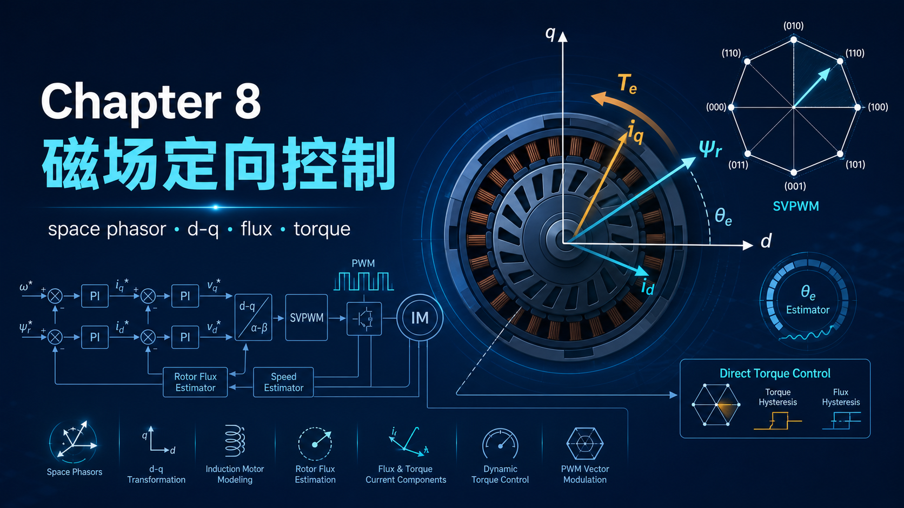
你好，我是老列 👋

上一篇 [7-变频器为啥还要把电压调低？老列讲透恒转矩、恒功率与四象限](https://app.notion.com/p/7-207300265996469fb37a0c6e66c8e02c?pvs=21) 留了个问题：V/f 控制管得住稳态，瞬态转矩却摸不着——转子电流测不到，只能隔山打牛。今天讲磁场定向控制（FOC，也叫矢量控制）：驱动史上公认的里程碑，也是教科书里公认最难啄的硬骨头。别怕，老列不甩矩阵不甩变换公式，就用一张三角形把它讲明白。

先把一句被数学埋没的大实话摆在最前面，这是全篇的骨架：**FOC 获得转矩阶跃的办法，是从一个稳态直接跳到另一个稳态，中间不经过任何瞬态过渡**。下面所有内容，都是在回答"凭什么能跳"和"怎么跳"。

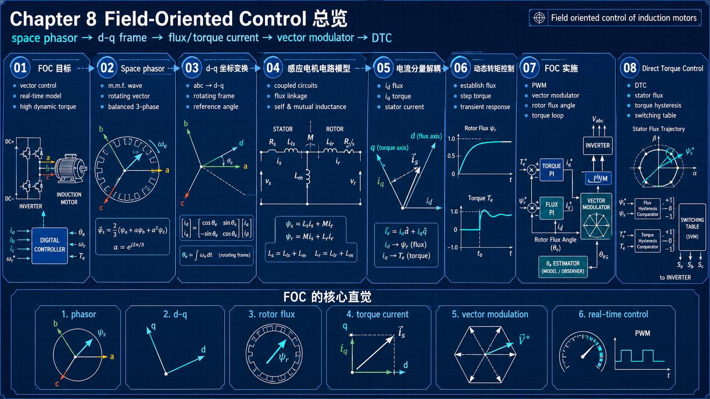

---

## 【老列 驱动导论笔记 08】：磁场定向控制——交流电机的"直流化"手术

### 🧭 工具一：空间矢量——三个脉动的场，一支旋转的箭

第五篇说过：三套绕组各自只会原地脉动，合成后却是恒幅旋转的磁动势波。现在把它升级成正式工具：每相磁动势用一支沿绕组轴线的矢量表示，长度正比于瞬时电流，三支矢量相加——得到一支**幅值恒定（相峰值的 1.5 倍）、匀速旋转的合成矢量**。从此不用盯着三个电流各自忙活，只盯这一支箭就行。更关键的是：这支箭的**幅值、转速、瞬时角度**都在我们掌控之中——这就是"矢量控制"名字的由来。

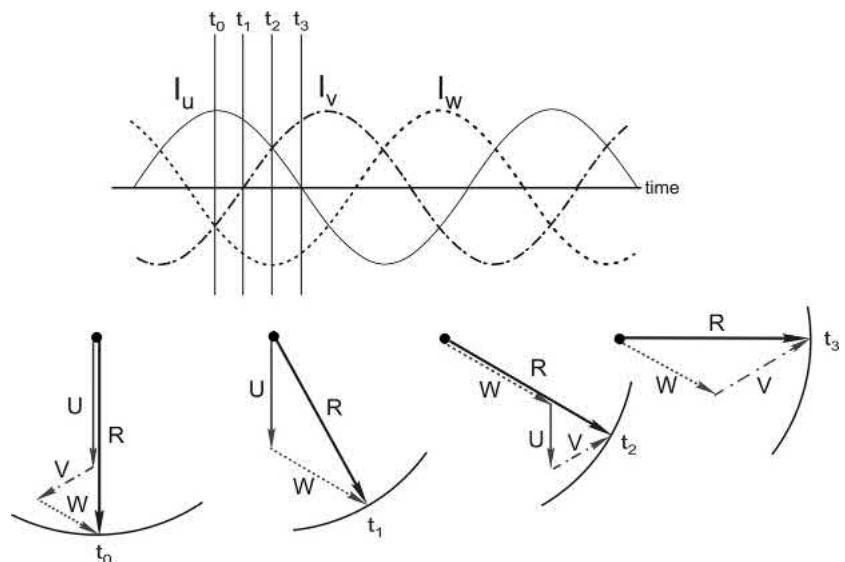

再配一个视角切换的技巧：把观察者搬到**随磁场一起转的参考系**里，旋转矢量看上去就是静止的——交流量变成了直流量。这就是 Clarke/Park 变换干的事：三相交流 → 两轴旋转坐标系里的两个直流量 Id、Iq。公式都是现成的，芯片算得飞快，咱们只需记住结论：**换个坐标系，交流问题变直流问题**。

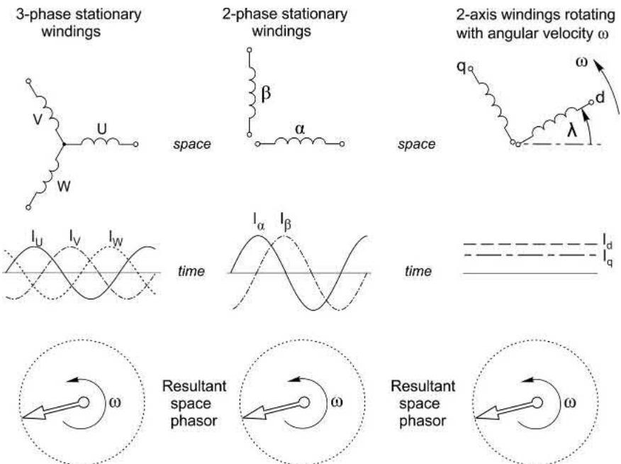

### ⚡ 工具二：想无瞬态跳变，就不能碰储能

给 R-L 电路突加正弦电压，电流要拖好几个周波的衰减瞬态才进稳态。但如果挑在**稳态电流恰好过零的时刻**接入，电流直接无缝进入稳态——因为那一刻**电感里的储能不需要突变**。磁场有储能，储能不能突变（那需要无穷大功率），所以：**想让转矩瞬间跳变，就必须挑一条不动储能的路径**。记住这句，后面全靠它。

### 🧮 工具三：把电机看成六个互感线圈

不谈磁场也能建模电机：定子三个线圈 + 转子三个等效线圈（鼠笼可等效成三相绕组），彼此磁耦合。全部玄机就一句话：**定转子之间的互感随转子角度正弦变化——互感随位置变，就意味着能出转矩**：

$T = \sum i_S\, i_R \frac{dM_{SR}}{d\theta}$

九对定转子组合逐项求和，看着吓人，其实机械得很。真正的拦路虎是转子电流：转子短路、电流全靠感应，六个联立微分方程，电压馈电时只能靠计算机硬解。但**一旦定子电流被直接指定（矢量控制的常态），方程立刻变得好解**——这正是下一节视角革命的数学底气。

### 🔑 惊人发现：盯住转子磁链，世界瞬间清爷

以前没人用"电流馈电"的视角分析感应电机，因为没法直接控制定子电流；现在逆变器+高带宽电流环可以把定子电流强行按住在任意值。在这个视角下重新推一遍方程，跳出来一个漂亮得过分的结论：

**转子合成磁链矢量 ψR，永远垂直于转子电流矢量**——磁密最大的地方恰好对着电流最大的导条。这不就是直流电机的摆位吗？N 极正对正向电流，S 极正对反向电流，每一根导条都在最佳位置出力。于是转矩公式简洁得感人：

$T = \psi_R I_R$

和直流电机 T = kΦI 一模一样。第五篇里"气隙磁通与转子电流有相位差、还得乘 cosφ"的糟心事，换成盯住**转子磁链**这个主角后自动消失——同一台电机同一套物理，视角对了，图景就简单了。

更妙的在后头：若控制定子电流使 **ψR 恒定**，可以推出转子电流正比于转差，于是**转矩严格正比于转差**，特性和直流电机完全一致——而且**理论上没有 pull-out 失速点**，上限只剩热限制。画成图就是一张三角形：竖边是恒定的 ψR，横边正比于转差（即转子电流），**三角形面积就是转矩**：

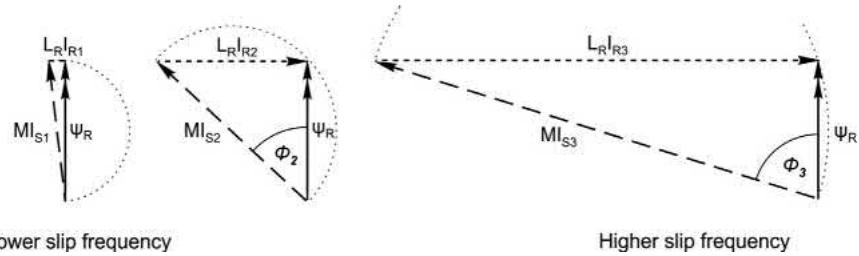

### 🧩 定子电流的两个分身：励磁的，和干活的

把定子电流矢量沿着转子磁链方向分解，两个分量各司其职：

- **磁通分量（Id）**：与 ψR 同向，负责把磁通立住——对应直流电机的**励磁电流**；
- **转矩分量（Iq）**：与 ψR 垂直，负责抵消转子电流的反磁动势——对应**电枢电流**。

两者互不干扰（"解耦"）：动 Iq 不动磁通，动 Id 才动磁通。轻载时定子电流几乎全是 Id（就是以前说的磁化电流），重载时 Iq 逐渐坠大——和前几章的结论严丝合缝。

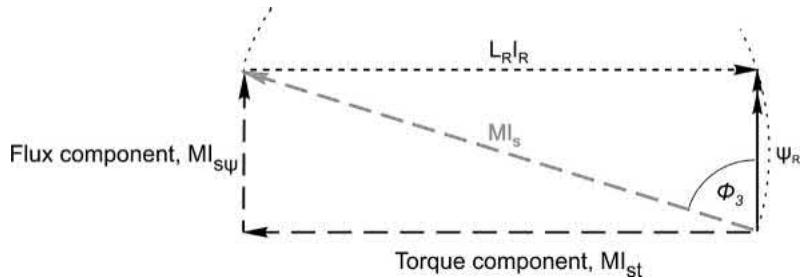

### 🚀 动态控制：磁链不动，转矩任跳

现在把两个工具拼起来。想要转矩阶跃，有两条路：变磁链，或变转子电流。变磁链？磁场有储能，受**转子时间常数**支配——几千瓦的电机就有 0.25 秒，大电机更长，慢得没法要。所以唯一出路：**磁链死死抱住不动，只突变转矩分量**。

但定子电流自己能突变吗？定子明明是个大电感。这里藏着本章最优雅的一颗彩蛋：**紧耦合短路线圈的特性**。转子是永久短接的，定子电流一变，转子立刻感应出反向电流把磁链变化抵消掉——从定子端看进去，有效电感只剩 Ls(1−k²)。感应电机耦合系数 k ≈ 0.95，有效电感不到自感的 10%（大致就是漏感）。**正是这个天赐的小电感，让逆变器用有限的电压就能把定子电流瞬间掰到位。**

于是转矩阶跃的完整动作是三个"同时"：定子电流矢量的**幅值突增、频率突增（新转差）、角度向前跳一步**（保持磁通分量不变、只增转矩分量）。三个都对，转子电流无缝跳入新稳态，转矩干净利落地阶跃；只改幅值和频率、不跳角度？磁通分量被扰动，储能要变，老实等转子时间常数慢慢磨吧。**角度那一跳，就是"矢量"控制的灵魂。**

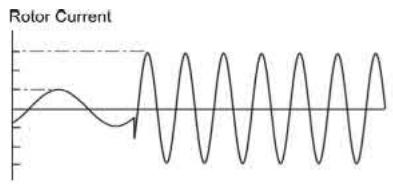

### 🏗️ 工程实现：两个 PI，一个矢量调制器，一个磁链角

实际控制框图长这样：

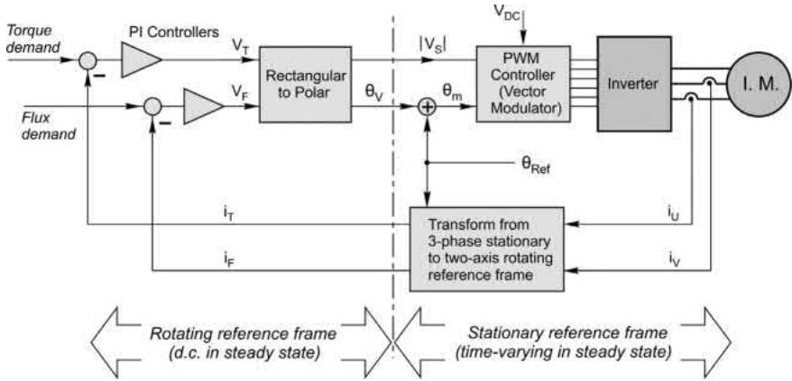

拆成四句话：

1. **测**：采两相电流（第三相算得出），变换到转子磁链坐标系，得到 Id、Iq 两个直流量；
2. **比**：两个 PI 控制器分别把 Id、Iq 拉向给定值——磁通给定基速以下恒定（基速以上按弱磁递减），转矩给定来自外环速度控制器——和直流双环一个骨架；
3. **调**：矢量调制器接管逆变器——六个开关只能拼出 6 个有效电压矢量 + 2 个零矢量，靠在相邻矢量间按时间配比快速切换，合成任意幅值任意角度的电压矢量；
4. **定向**：一切变换都需要**转子磁链角 θRef**——它就是"磁场定向"四个字的本体。

矢量调制器凭什么能"拼"出任意电压矢量？六个开关的合法组合只有 8 种——6 个有效矢量互成 60°，外加 2 个零矢量。在一个开关周期（比如 10kHz 下的 100μs）里给相邻矢量和零矢量分配时间占比，就能合成六边形内任意幅值、任意角度的电压矢量：

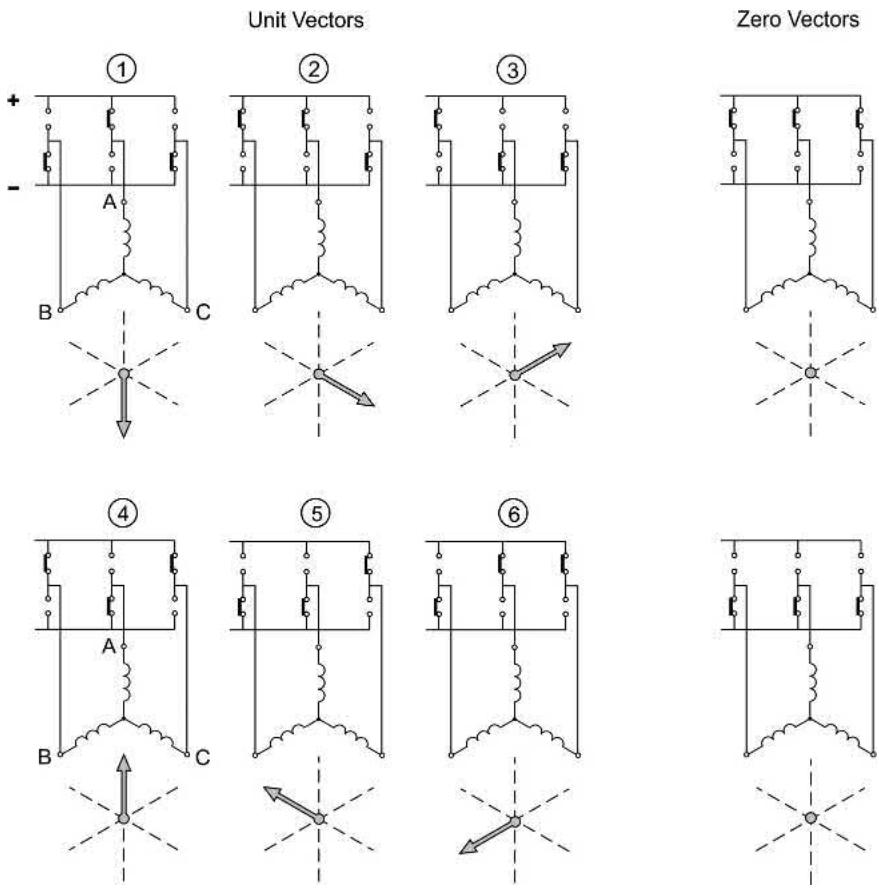

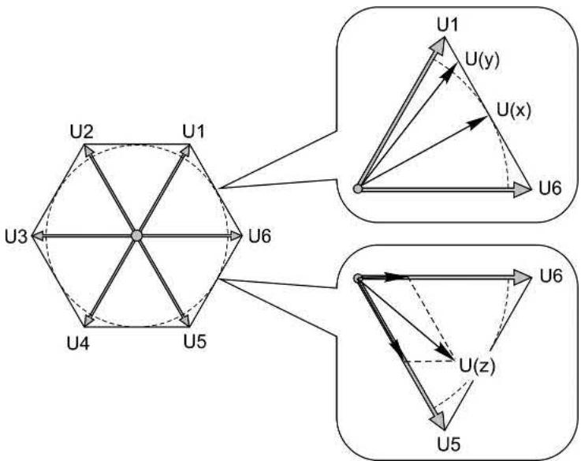

再往外套一圈速度环就是完整调速系统——转矩给定和磁通给定都由速度控制器供给，基速以上磁通给定按弱磁递减：

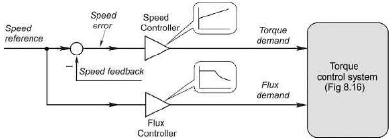

磁链角从哪来？装磁通传感器不现实，工程上全靠**估算**：磁链角 = 转子机械角 + 转差角（由 Iq、ψR 和转子时间常数算出后积分）。带编码器的"闭环/直接"版本机械角实测，零速都能满转矩；"开环/间接"（无传感器）版本连机械角也靠电机模型估，省钱省线，但低于约 0.75Hz 时电压信号太小、噪声淹没算法，持续低速就吃力。还有个工程痛点：转子电阻随温度飘，转子时间常数跟着飘——模型不准，坐标系就歪，解耦失效。所以正经驱动器商用中都在后台不停地在线辨识参数。

再记一个实操细节：开机先**建磁通再给转矩**。建磁受转子时间常数拖累，工程上的套路是短时"强励"——先给 3 倍磁通电流把磁通快速顶起来，快到目标再退回正常值。所以 FOC 电机上电后会有一个短暂的"愕一下"才开始转——那是它在充磁。

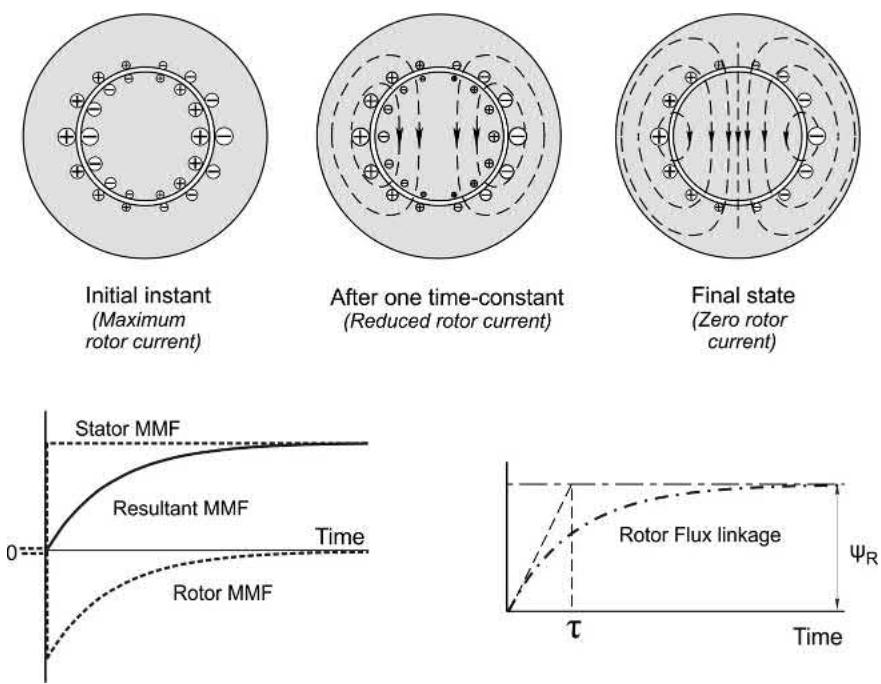

实测长什么样？下面是一台转子时间常数约 0.1s 的电机：先用 3 倍电流强励建磁，0.2s 时给转矩阶跃，三相电流从直流无缝滑进"幅值恒定、频率渐升"的交流，0.4s 撤转矩、稳稳停在约 40Hz——教科书级的干净：

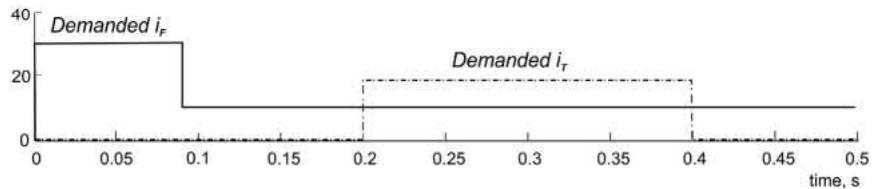

### 🥊 番外：直接转矩控制（DTC）

另一条高性能路线：不做坐标变换、不用 PI，直接估算定子磁链和转矩，谁超出滞环带就查**开关表**，从 8 个电压矢量里挑最能把它拉回来的那个——bang-bang 控制，理论上转矩响应最快。代价：采样率要上 40kHz（FOC 只要 6～15kHz）、开关频率不固定、转矩纹波略大。两条路殊途同归：**都是抱住磁链、突变相位**。

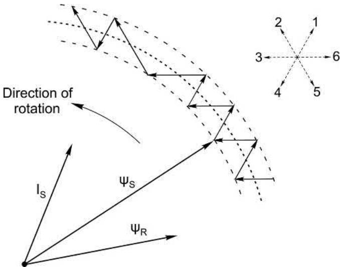

### 📜 老列的五条铁律

| # | 铁律 | 一句话解释 |
| --- | --- | --- |
| 1 | FOC = 稳态间直接跳跃 | 不动储能就没有瞬态，这是全部魔法的底牌 |
| 2 | ψR 永远垂直于转子电流 | 盯住转子磁链，T = ψR·IR，交流机瞬间"直流化" |
| 3 | Id 管磁，Iq 管力，互不串门 | 解耦之后，控制结构和直流双环一个骨架 |
| 4 | 漏感是天赐的快通道 | 短路转子把有效电感压到 10%，定子电流才能说变就变 |
| 5 | 磁链角是命门 | 角度估准了才叫磁场定向；转子时间常数飘移要在线辨识 |

### 🧮 思考题（对应原书 8.8）

1. 矢量控制下满载转子电流 30A。负载转矩降到 50% 时，转子电流约是多少？
2. 图 8.17 中磁通控制器旁的小曲线图，横纵轴各代表什么？曲线形状说明什么？
3. 常说的 d 轴、q 轴电流，哪个随负载基本不变，为什么？负载转矩翻倍时另一个会怎样？
4. 带 FOC 的感应电机上电后，细心的旁观者会发现转子先"愕"一小会儿才开始转——这段时间里发生了什么？
5. FOC 感应电机拖纯惯量负载，跟踪对称三角形速度曲线：最高速稳态频率 40Hz，加速期间转差频率恒为 2Hz。推算曲线各特征点的瞬时频率；若曲线含零速段，有人用手转动电机轴，电机会作何反应？
6. 某 FOC 感应电机基速满载稳态时，定子磁链矢量与转子磁链矢量夹角 70°。估算 (a) 100% 速度、50% 转矩，(b) 50% 速度、满转矩时的夹角。
7. 两台相同感应电机拖相同负载，一台普通"逆变器馈电"（V/f），一台矢量控制，同速同转矩稳态运行——用户怎么分辨哪台是哪台？

### 📝 后续计划

感应电机篇到此全部收官。【笔记 09】换主角：**同步电机家族**——永磁同步、磁阻同步、混合型。为什么新能源车和伺服清一色永磁？磁钢不要钱一样的磁阻电机凭什么也能转？敬请期待。

---

教材里有句话老列必须搜出来给你看：年轻读者大概不觉得这些实验结果有什么了不起，但**直到上世纪七十年代，业界还普遍相信感应电机永远不可能做到这种性能**。从"不可能"到"每台伺服驱动器里的标配"，靠的不是新电机，而是把同一台电机**看懂了**——换了个坐标系，魔法就变成了工程。这是老列入行以来最受震撼的一课：有时候卡住你的不是物理，是视角。

你第一次调 FOC 参数是什么场景？碰没碰到过转子时间常数飘移导致的低速抖动？评论区聊聊。

  <strong>觉得有收获的话，老规矩，</strong> 
  <strong>点赞、在看、转发三连伺候，老列给你比个心。</strong>  
  👇👇👇

---

> 推荐关注公众号「探物及理」，探万物之然，及万理之源。
>
> 
