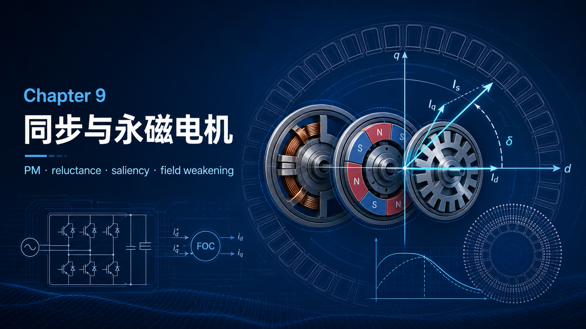
你好，我是老列 👋

上一篇 [8-把交流电机援成直流电机：老列用一张三角形讲透 FOC](https://app.notion.com/p/8-FOC-bd3e9e1acdc344ec9273facd4f54b6dc?pvs=21) 把感应电机篇收了官。今天换主角：**同步电机家族**——新能源车、伺服、风电直驱里的当红炸子鸡。先帮你破一个选型时最容易被啄晕的迷鬼阵：**永磁同步电机、无刷交流电机、无刷直流电机、PM 伺服电机——厂家喷的这一堆名字，本质上是同一台电机**。“brushless”这个前缀都是多余的，它们本来就没地方装电刷。

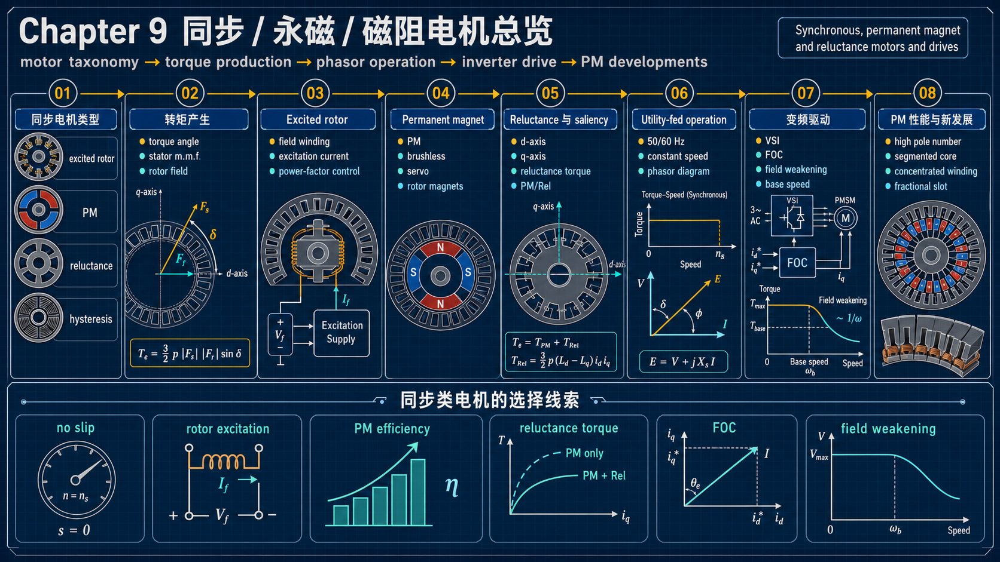

---

## 【老列 驱动导论笔记 09】：同步、永磁与磁阻电机

### 📏 “同步”两个字值多少钱：一条垂直线

感应电机永远带着转差追磁场；同步电机则是转子自带磁场（励磁绕组或永磁体），与定子旋转磁场**锢死**：负载怎么变，转速严格等于 Ns = 120f/p，一转不差。所以它的转矩-转速曲线干脆得可爱——**一条垂直线**，还延伸进第二象限（强行超同步速就发电）：

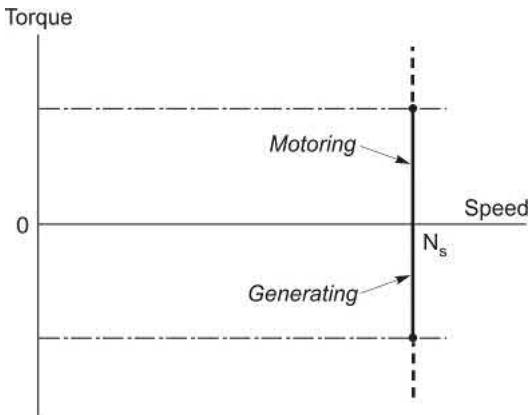

代价也写在曲线里：负载超过 pull-out 转矩（普通机型约 1.5 倍额定，高性能永磁机可设计到 4～6 倍），转子就**失步**——直接堆转。这是工频直接供电时代的头号心病；后面会看到，变频自同步驱动把它彻底根治了。

### 👪 家族点名

- **励磁转子型**：转子绕组通直流（滑环或同轴无刷励磁机），几千瓦到几十兆瓦；独门绝活是**功率因数可调**（后面展开）；
- **永磁型**：磁钢替掉励磁绕组，表贴或内置（埋入式），百瓦到几百千瓦；转子无需供电、结构皱实，代价是励磁锢死不可调；
- **磁阻型**：最简单的同步机——转子就是一堆冲压硅钢片，既无绕组也无磁钢，全凭凸极形状讨生活；
- **磁滞型**：薄壁硬钢套筒转子，靠磁滞效应出力，降到陀螺仪、离心机等小众角落，点到为止。

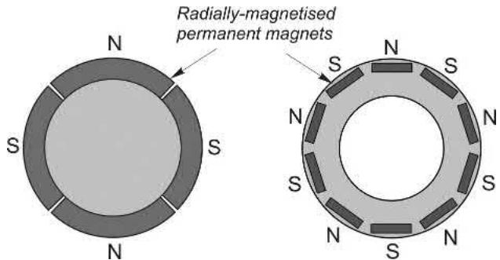

### 🔺 又见三角形：转矩就是“两个磁场想对齐”

同步机的转矩机制一句话：**定子磁场和转子磁场总想彼此对齐，拉开角度就产生回拉转矩**。定量写出来又是老熏人：

$T \propto F_S F_R \sin\lambda$

Fs、Fr 两边夹角 λ（转矩角），乘积正是三角形面积——**上一篇感应电机的磁链三角形，这一篇换了两条边，面积即转矩的规矩不变**。对齐时零转矩，垂直时最大；超过 90° 进入不稳定区，失步就是从这儿掉下去的。

### 🪞 磁阻转矩：不给磁钢钱，也能转

磁阻电机转子既无电流又无磁钢，凭什么出转矩？凭**凸极**：沿着凸极方向（直轴 d）磁阻小、磁通好走；垂直方向（交轴 q）磁阻大、磁通难走。定子磁场一旦斜着穿过转子，磁通被往直轴方向“拘”过去，磁场与磁动势不再共线——转矩就来了，本质还是“想对齐”：

$T \propto I_s^2 (L_d - L_q)\sin 2\gamma$

三个看点：转矩正比于**电流平方**（正反电流都一样）；正比于**两轴电感之差**（凸极差越大越好）；角度的**二倍频**函数，45° 处峰值。

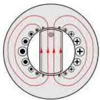

早年磁阻电机名声不好：同功率大一两个机座、功率因数寒酸。如今设计水平今非昔比，再加上**稀土磁钢供应链焦虑**，行业正在把磁钢和磁阻混着用：**PM/Rel 混合转子**——磁阻式磁通导流槽里埋少量磁钢，永磁转矩与磁阻转矩比例从 4:1 做到 1:1，用更少的磁钢换相近的性能——新能源车驱动电机的主流路线之一。

### 🔌 工频直挂时代的独门绝活：功率因数随便调

励磁转子型有个感应电机永远给不了的福利：磁通由电压钔死，但励磁可以由**转子直流**和**定子滞后电流**两家凑份子。欠励（E 小于 V）时定子补滞后无功，功因滞后；励磁给够，功因正好为 1（同功率下电流最小）；**过励时定子电流反过来超前——整台电机对电网呈现电容性**，还能帮同线的感应电机们补无功。早年电网里专门有不带负载、只调无功的“同步补偿机”，就是拿这招吃饭的。而永磁机磁钢强度出厂定死，这项福利不享。

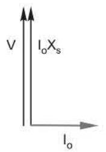

### 🏁 先天短板：工频不能自启动

同步机有个尴尬：转子没转到同步速前，定转子磁场互相滑过，平均转矩为零——**天生不能自启动**。工频直挂的同步机因此往往在转子上再嵌一套**启动鼠笼**：合闸时先当感应电机把转子拖到接近同步速，再投入励磁“拉入”同步。鼠笼只在起动时出力，同步后转差为零、无电流；但负载突变时它还能阻尼转子摆动。大电机起动电流常达 6 倍以上额定、持续几十秒，所以往往还得配减压启动器，或用小“辅助电机”先把主机拖到同步再加载。

### 🔄 变频自同步：永不失步的同步机

现代同步机绝大多数挂在变频器上，而且玩法和第七篇的“外部振荡器定频”根本不同：**逆变器的开关节拍由转子位置决定**（自同步）——磁场永远踩着转子的点走，**想失步都失不了**。FOC 那套在这里原样好使，而且更简单：没有转差，磁链角就是转子机械角——但注意永磁机有凸极性，需要**绝对位置**（感应机只要相对角度）。磁阻机和 PM/Rel 的控制同源，只是电流给定策略里多一块“Id/Iq 配比”的学问（磁阻机常取近 45° 峰值转矩角）。

### 🗺️ 变频调速：恒转矩区 + 弱磁区

和直流、感应机一样，永磁机变频也分两段。基速以下**恒转矩**：电压随频率线性升，电流管转矩，FOC 会把定子电流摆到与磁钢磁通垂直（Id=0），每安培转矩最大、铜耗最小。基速以上电压顶格，只能**弱磁**扩速——可永磁机弱磁天生别扭：磁钢是“关不掉”的强励磁源，要降磁通只能让定子电流去**顶消一部分磁钢磁场**。原书算例很扎心：二倍基速、半转矩时电流要冲到 1.73pu，铜耗涨到三倍，所以永磁机弱磁区常常只能短时运行：

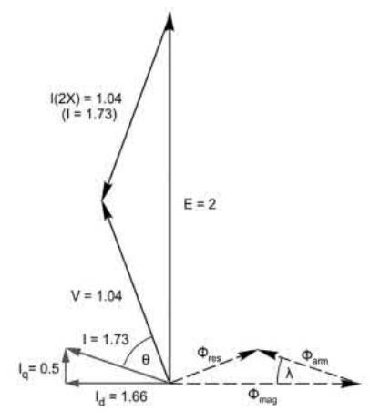

### 🎛️ 怎么驱动：励磁机上 CSI，永磁机上 VSI

- **大功率励磁转子机**：常用**负载换流逆变器（LCI）**——电流源、晶闸管，靠电机自身反电动势换流，2～100MW、电压十几 kV 都拿得下，天然四象限，堪称“里外翻转的直流机”。启动时反电动势太小，靠瞬时切断直流母线电流来换流，配轴端绝对位置传感器；约 5% 额定转速以上就能自然换流。

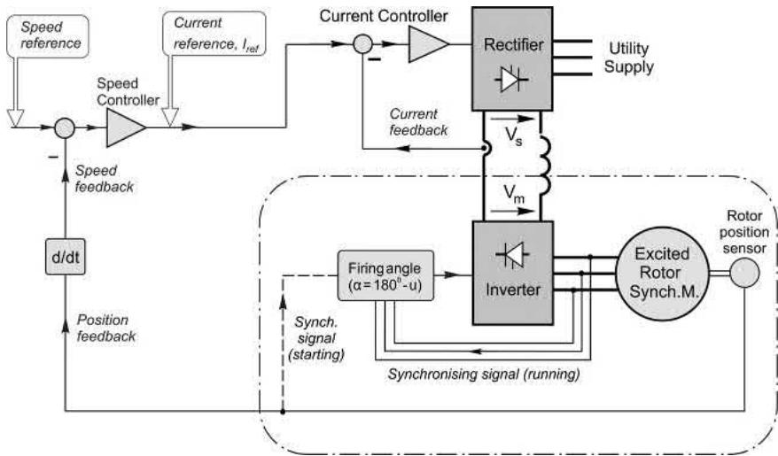

- **永磁/磁阻/PM-Rel 机**：清一色 **PWM 电压源逆变器 + FOC**，硬件平台和感应机通用。永磁机 FOC 里磁通给定直接置零（磁钢供磁），只有弱磁时才叠加负 Id。

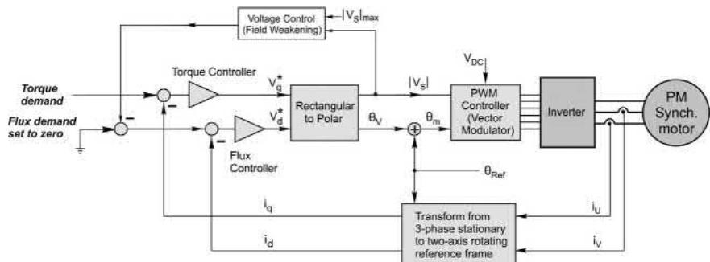

**弱磁高速有个致命坑**：万一高速时控制失灵，顶消磁钢的那股电流一撤，转子满磁通高速旋转，端电压能飙到数倍额定，击穿绝缘和器件——工程上常在电机端加 crowbar 钳位电路兜底。磁阻机、PM/Rel 机控制同源，只是电流给定里多一块 Iq/Id 配比的学问：

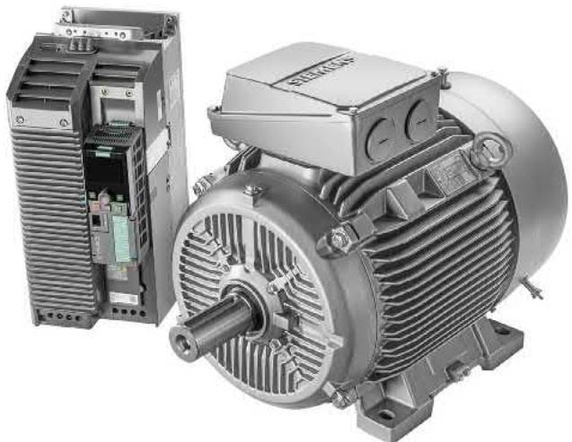

### 🏎️ 永磁机凭什么食物链顶端？

1. **功率密度**：定子不用再出磁化电流，同样的铜线全部用来干活；
2. **效率与散热**：转子无电流无铜耗，而转子恰恰是封闭电机里最难散热的地方；
3. **和直流机同源的简洁**：E = kω，T = kIa，一个电机常数 k 走天下——又是 BIl 家族；
4. **设计自由**：本来就为变频而生，不受工频和标准机座束缚。要加速快？惯量正比于半径四次方，做成细长杆——这就是伺服电机的身材；要抗冲击？做成短胖大惯量。

性能有多暴力，看一组实测：带着 **78 倍转子惯量**的负载，从 +6000rpm 到 −6000rpm 的整个反转只用 **120ms**，全程位置误差不超过 0.05°：

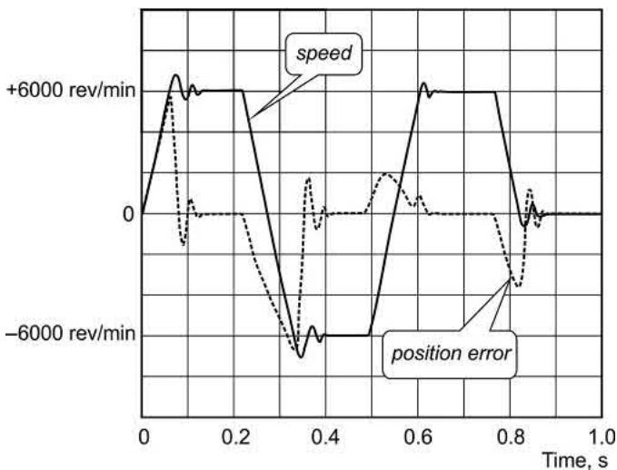

当然也有要盯的地方：**弱磁扩速要花额外电流去“顶着”磁钢**，效率下降、磁钢发热有退磁风险，高速下一旦失控，反电动势超额定电压可能损坑驱动器；齿槽转矩（cogging）带来转矩纹波；磁钢怕高温，热保护要认真。

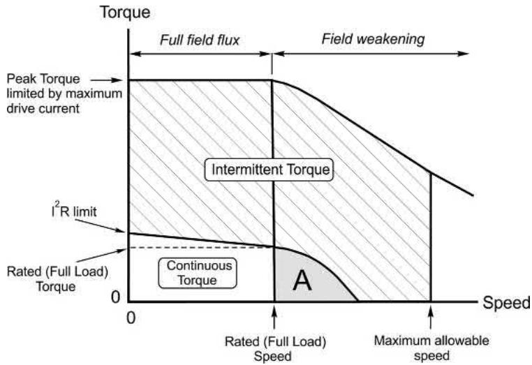

看这张运行边界图就懂了：伺服机有一大片“间歇可超额定转矩”区域，正对快速定位这类短时大加速需求；连续区受温升限制，弱磁区还会因铜耗剧增进一步缩水。

### 🔧 新趋势：高极数 + 分数槽集中绕组 + 分段铁芯

变频器把频率限制拆了，高极数不再等于低速。对永磁机来说高极数是纯赚：每极磁通小、轭部铁芯薄、端部绕组短——铁和铜都省了（感应机反而不行：磁化磁动势不降，槽面积却被摊薄，功因难看）。配套玩法：定子拆成预绕线的单齿段拼装（槽满率高、自动化友好），10 极 12 槽这类分数槽集中绕组虽然磁动势波形谈不上优雅，但成本、容错（四组线圈可分驱，坏一组剩三组接着转）完胜——电动车时代的工程取舍。

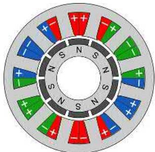

顺带一提，如今永磁机也被塞进标准 IEC/NEMA 机座，作为感应机的直接替代品主打高效率、高功率密度、转子更凉：

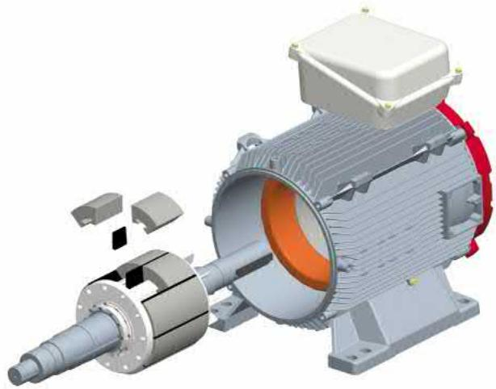

### 📜 老列的五条铁律

| # | 铁律 | 一句话解释 |
| --- | --- | --- |
| 1 | 一堆名字，一台电机 | 永磁同步/无刷交流/无刷直流/PM 伺服，本质同源 |
| 2 | 同步 = 垂直线 + 失步风险 | 转速锢死在 Ns，超过 pull-out 直接堆转；变频自同步彻底根治 |
| 3 | 转矩 = 两磁场想对齐 | T ∝ Fs·Fr·sinλ，三角形面积即转矩，老配方了 |
| 4 | 凸极差就是钱 | T ∝ Is²(Ld−Lq)sin2γ，磁阻转矩不花磁钢钱，PM/Rel 混着用最香 |
| 5 | 永磁的代价在边界 | 弱磁费电流、磁钢怕热怕退磁、高速失控怕过压 |

### 🧮 思考题（对应原书 9.9）

1. 420V、60Hz、4 极同步电机要用在 50Hz 电网上，应改用多大电压？
2. 两台三相同步机（转子分别 10 极、12 极）同轴联接、两端无轴伸，能派什么用场？
3. 励磁转子同步机的励磁绕组经滑环通直流，绕组明明在转，为什么不提转子回路里的运动电动势？
4. 大同步机空载，励磁调到最大或最小时定子电流都很大，中间某值时电流几乎为零，且定子功率始终很低——用等效电路和相量图解释；什么条件下电机对电网呈现电容性？
5. 参考图 9.5：右图工况下若突然反接定子电流极性，会发生什么？
6. 4 极磁阻电机有几个稳定平衡位置？（提示：把定子电流想成图 9.8 的直流）
7. 电流馈电磁阻机重新设计转子，使直/交轴电抗比从 4 升到 5（Xd 不变），峰值转矩增加多少？
8. 10 极永磁机定子通恒定直流、转子静止于 0°：手动转过 (a)15°、(b)45° 后释放，最终停在哪？何处测到最大转矩？电流反向后停在哪？
9. 为什么永磁机同一转矩可对应一段范围的定子电流？
10. 电压源逆变器供电的永磁机空载在基速时电流几乎为零，升到二倍基速后即使空载电流也大增——用相量图解释。

### 📝 后续计划

【笔记 10】讲两个“反主流”的硬汉：**步进电机**——不要传感器也能精确定位的数字化老前辈；以及**开关磁阻电机**——结构简单到丧心病狂却能吃苦耐劳的狠角色。敬请期待。

---

老列年轻时跟着师傅修一台老磨床，拆开一台“无刷直流电机”，满心以为会看到换向器，结果里面干干净净一圈磁钢。师傅敲着烟斗说：“名字是卖电机的人起的，结构才是电机自己的。”这句话老列记了小二十年——选型时别被商品名牌带进沟里，翻开手册看转子结构，三秒钟真相大白。

你的项目里碰过选永磁还是选感应的纠结吗？磁钢涨价的那几年有没有被采购追着问“能不能换磁阻方案”？评论区聊聊。

  <strong>觉得有收获的话，老规矩，</strong> 
  <strong>点赞、在看、转发三连伺候，老列给你比个心。</strong>  
  👇👇👇

---

> 推荐关注公众号「探物及理」，探万物之然，及万理之源。
>
> 
