# AI->机器学习分类图
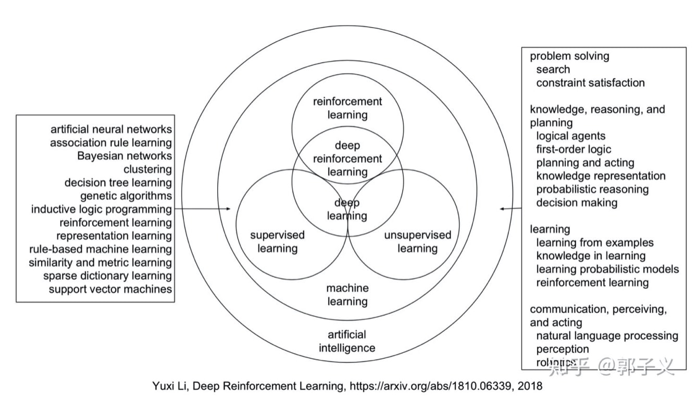
# 分类
## 几种网络结构分类
NN——回归预测
CNN（convolution NN）卷积神经网络——图片
RNN (Recurrent Neural Network）递归神经网络——声音、语言处理
LSTM长短期记忆网络——

## 激活函数
sigmoid
ReLU——rectified linear unit 修正线性单元

## 概念
Cost function 每个样本的误差均值
Loss function 单个样本的误差
贝叶斯误差
泛化——提取特征的能力？
归一化，不同变量分布尺度调整一致
正则化，减少过拟合
正交化，调整变量，不影响其他变量
迁移学习，把model从一个task1 应用到 task2
玻尔兹曼机-无监督学习

# 神经网络
## 连式法则
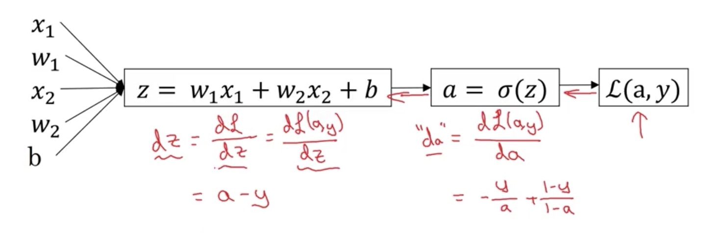

## 算法流程
**General methodology**
As usual you will follow the Deep Learning methodology to build the model:
1. Initialize parameters / Define hyperparameters
2. Loop for num_iterations:
    a. Forward propagation
    b. Compute cost function
    c. Backward propagation
    d. Update parameters (using parameters, and grads from backprop) 
4. Use trained parameters to predict labels
Let's now implement those two models!

## 2、加速训练的方法
## 正则化
1. L2，二范数
2. L1，绝对值——容易造成**稀疏化**
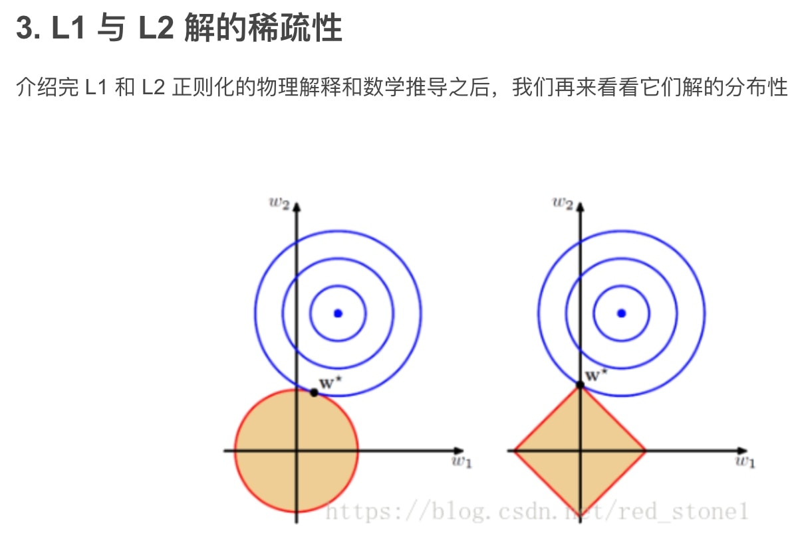
3. dropout随机失活 正则化
对于神经网络来说，用其中的一部分预测结果，等同于正则化的效果。不要让网络过分依赖某个神经元
一般在靠前的层较低的存活率
输入层和后面的层，存活率较高
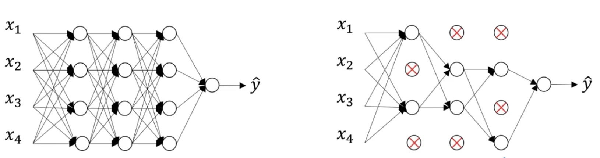
1. 数据扩充Data augmentation
2. Early stopping
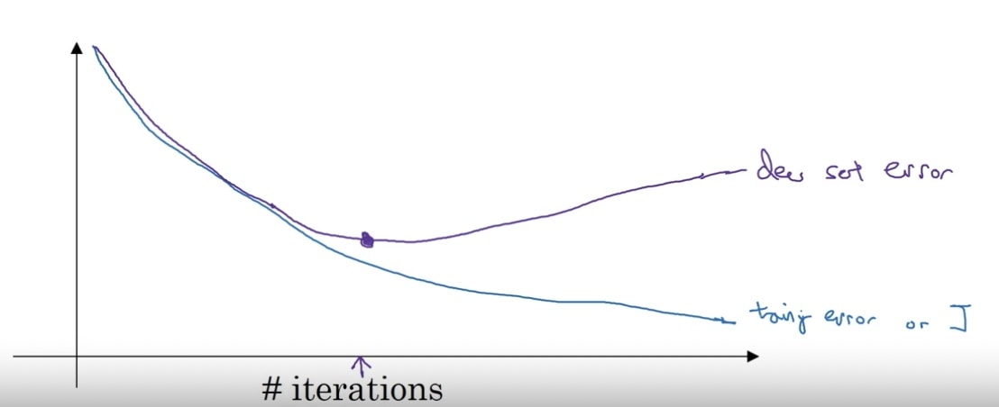
发

扩展到高维，同样的道理，L2 的限定区域是平滑的，与中心点等距；而 L1 的限定区域是包含凸点的，尖锐的。这些凸点更接近 Ein 的最优解位置，而在这些凸点上，很多 wj 为 0。

### 归一化输入变量X
### 参数初始化——避免梯度爆炸/消失
* 随机初始化 打破 对称性
* 初始化值不要太小或者太大，否则

### 梯度检验 Gradient checking，但是不能和随机失活一起使用

## 3、寻优方法加速训练
### batch Gradient Descent
### mini-batch Gradient Descent
### stochastic SGD随机梯度下降法
### Exponentially weighted averages 指数加权滑动平均
类似于信号滤波，造成延迟

**bias correction**
初始值：$v_0$设置为0导致的
处理办法，✖️$\frac{1}{(1-\beta)^t}$
### 动量法 GD with momentum
与指数加权滑动平均类似
对梯度加权滤波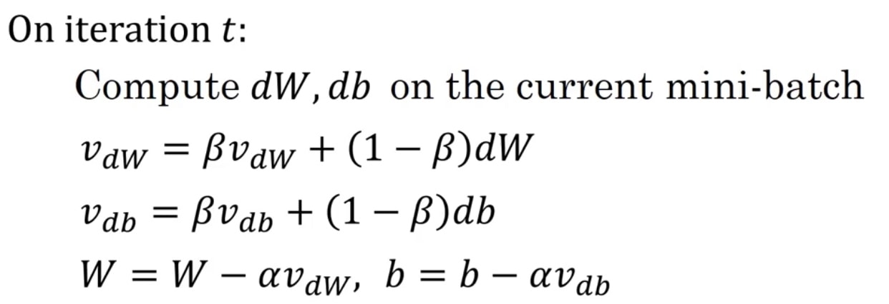
### Root mean square prop均方根传递
压制导数过大的项，使各个特征值上的导数尽可能
$(dw)^2$是element operation
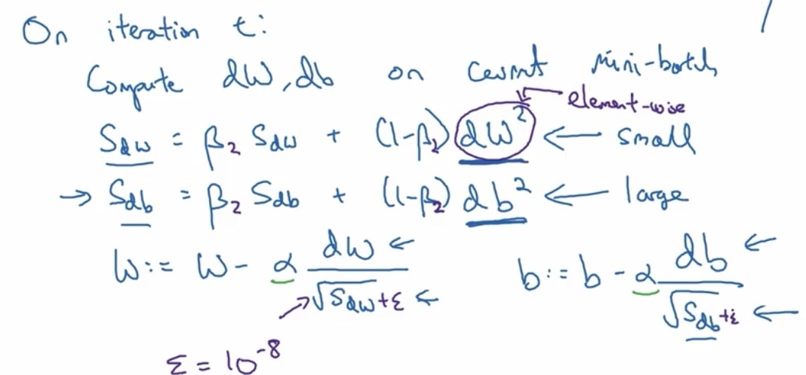
### Adam算法——Adaptive moment estimation自适应矩估计
将 带动量GD 和 均方根RMS-prop 算法 结合
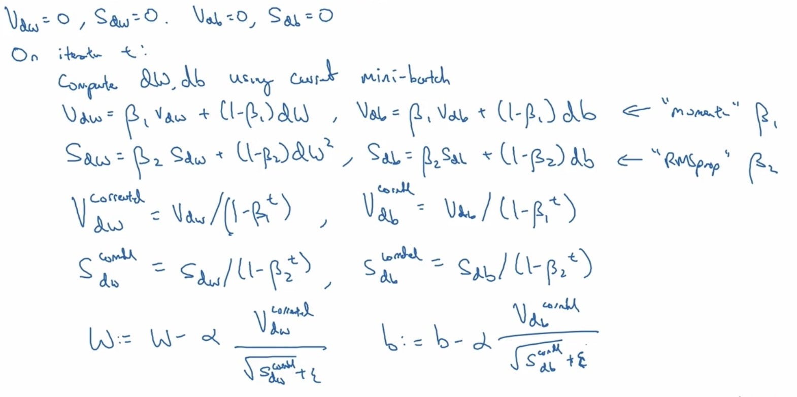
$\alpha$
$\beta_1 = 0.9$
$\beta_2 = 0.999$
$\epsilon = 10^{-8}$

### learning rate decay
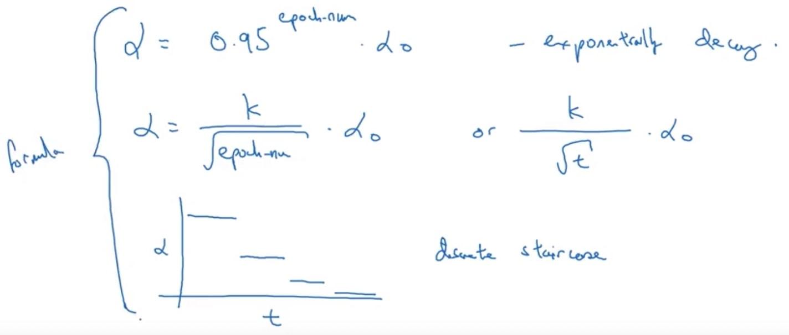

## 优化过程问题
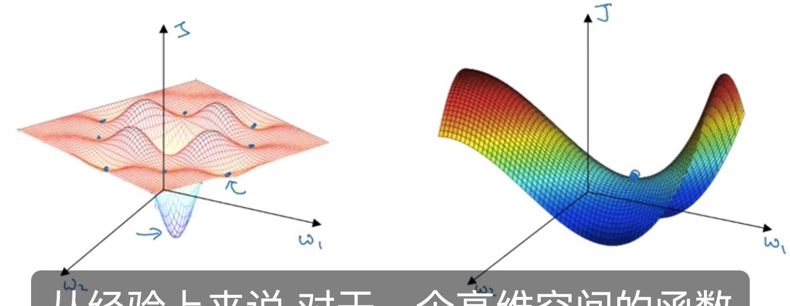

## 4、超参数调参过程Tuning process
1. try random values: don't use grid
2. 区域定位搜索过程，粗搜索，确定密度高的地方
3. 搜索尺度，Log分布，对指数的幂平均
4. **BN归一化**Normalizing activations in a network
通过γ和β，任意改变Z值的分布
原理：减少隐藏层 变量值分布的不确定性
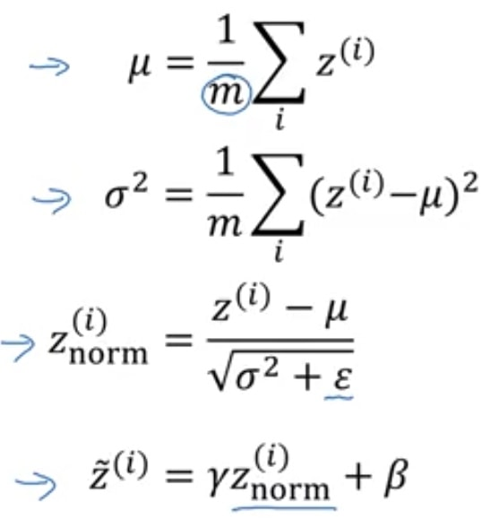

Predict时，用训练集得到的参数，进行同样的缩放

## 多class回归分类
### softmax regression
将线性变量的概率，用e幂增大分辨率，归一化到0-1
激活函数为
$func(Z) = np.exp(Z) \sum^{n^{l}} e^{Z_i}$
### Hardmax regression
将变量归一化到[1 0 0 0]

# Structuring ML project
## 正交化Orthogonalization
针对某个问题，作出调整，不改变其他特性
Training -> Dev -> Test -> Real world
## 评价准则
### 单一评价指标
例如分类器存在多个评价指标
Precision精度 & Recall查准率，
$F sore = \frac{PR}{P+R}$
多分类器，一般用均值

### 优化和满意度矩阵Satisficing and Optimizing metric
精度、运行时间
### ML的上限
理论值：贝叶斯最优误差
人类performance距离上限不远，一旦ML表现超过人类，人类很难根据偏差和方差，指导算法提高。

### 避免 偏差 和方差
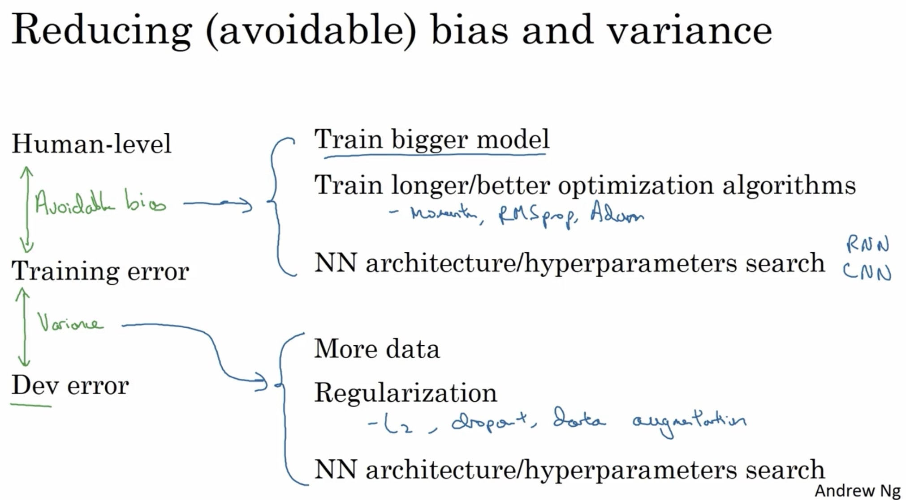

## 误差分析
在错误集合中找到主要影响因素，对训练集做适应性改造
* 大小
* 其他种类
* 清晰度
* 滤镜

## 数据分布改变（Train、D、T）
### 错误标签solution
Robust，如果error比较大，则主要成分不是少量的错误标签

### 新标签
训练集保留原数据
dev 和 test 集 去除原标签，得到新数据的精度
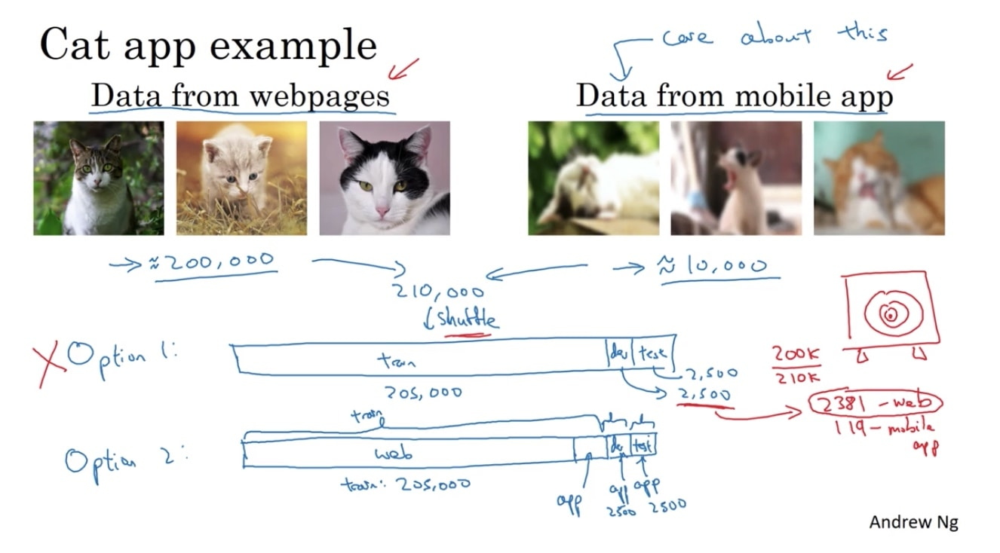

### 不同分布下的变差和方差
添加新样本后，D、T分布改变，其误差已经无法反应变差和方差
从训练集T中，选出一小部分，作为Train-Dev集，验证训练，计算偏差和方差
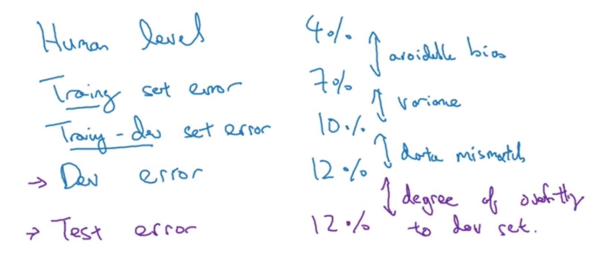

如果误差在D、T集下降了，说明测试集较为简单
横坐标：原集合、新集合
纵坐标：人performance、新训练model、原训练model（训练集未加入新样本）
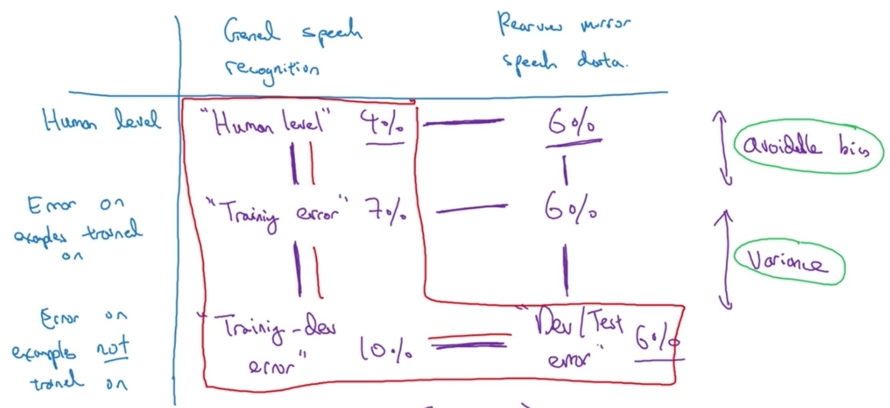

### 解决数据分布不匹配办法
* 获取数据
* 人工生成数据（参与合成成分数量级与被合成的一致、避免过度拟合）

## 迁移学习
在相似的任务重，将Task1训练好的模型Model1，稍作修改生成用于Task2的Model2，让新任务的模型参考之前模型已经学习到的经验。

预训练（pre-training）for Model1
细微训练（fine-tunning）for Model2

根据数据量，决定需要训练的层数
数据量较小，只训练Model1的末层
#### 限制条件
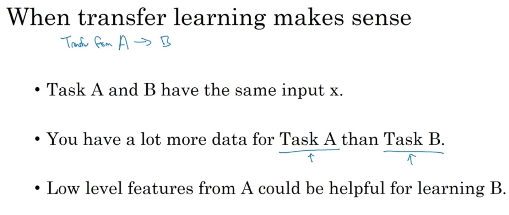

## 多任务学习Multi-task learning
相比于多类别分类器，y向量不一定只有一个1，存在多个1

### 限制条件
任务之间的相似性
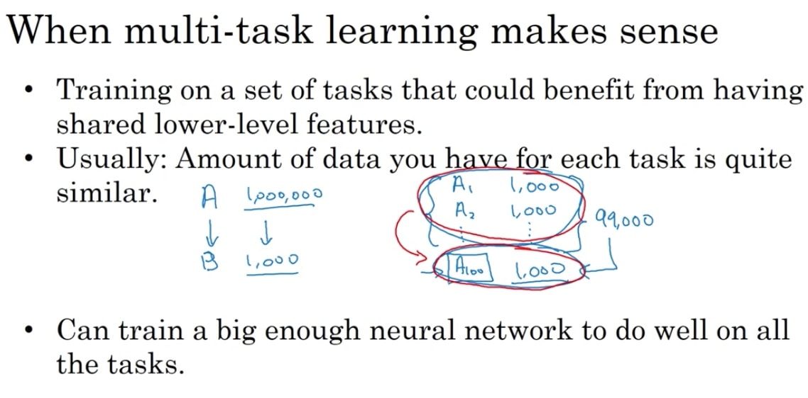

规模不够大时，多任务学习比单项学习  损害准确率

## 端到端学习End-to-end
Start -> End，复杂任务不需要中间的各个模块
缺陷是数据量需求巨大

* 传统方法，分模块，串联执行，完成任务

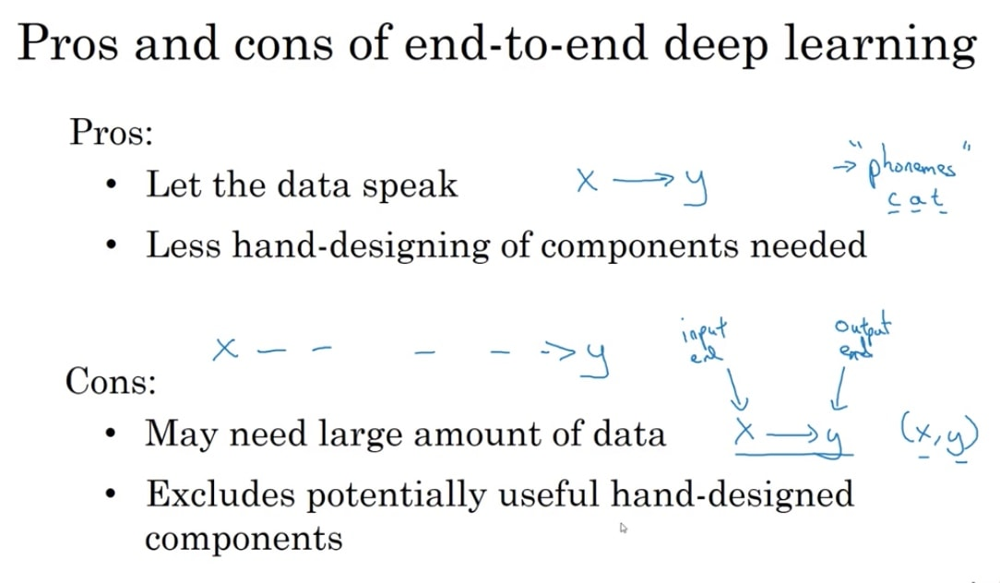

