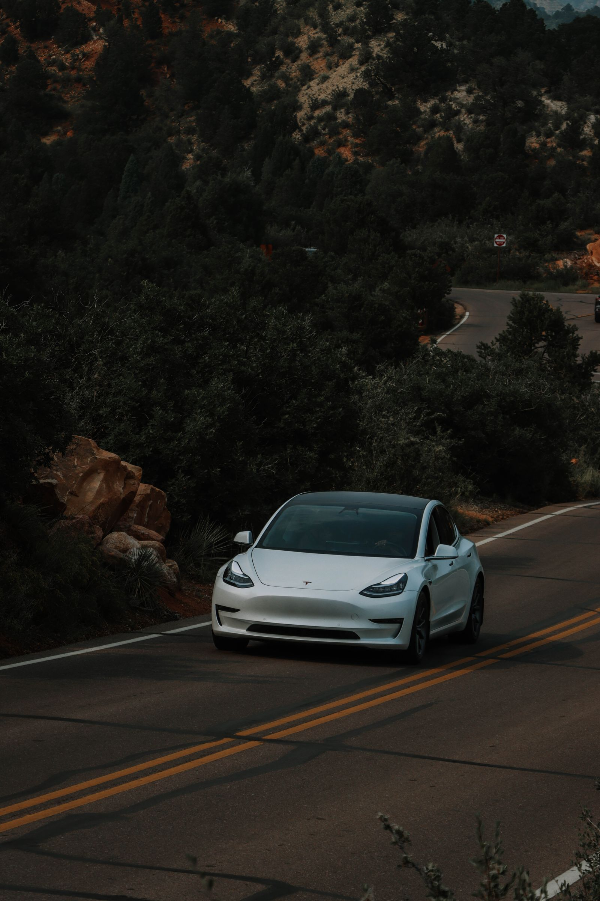

你好，我是老列👋

很多人第一次理解「坡起」，是在驾校的手动挡教练车里。

教练坐在副驾驶反复念叨：左脚慢抬离合，找到半联动；右脚松刹车、轻给油。离合抬早了，发动机的力还没接到车轮，车会后溜；油门给猛了，车又会往前蹿。所谓油离配合，本质上是在完成一次**保持力与驱动力的交接** 。

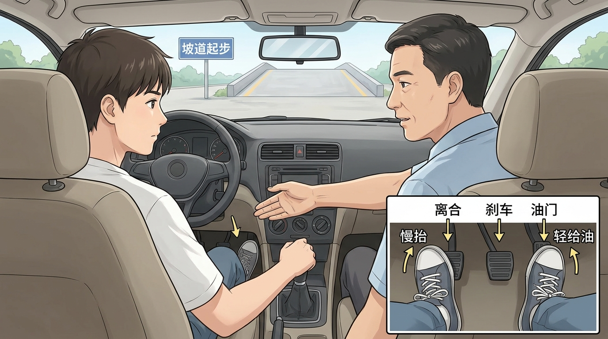

换成电动车，离合器和发动机怠速消失了，但这个控制问题并没有消失： **车轮从「被刹住」变成「被电机向前驱动」，中间仍然需要一次不留空档的交接** 。

这就是本文所说的「油电不分家」：不是说油车与电车结构相同，而是人们在油车时代靠双脚完成的坡起协调，到了电动车上，变成了制动控制器、整车控制器和电机控制器之间的软件协同。

开新能源车上坡堵车时，你可能遇到过一个很微妙的现象：

- Auto Hold 已经点亮，松开刹车，车稳稳不动；
- 只是轻踩刹车把车停住，准备换脚起步，松开的一瞬间，车却可能先往后溜一点。

电机不是从零转速就能输出最大转矩吗？燃油车还能怪离合器，电动车电机反应这么快，为什么还会溜？

> 🔑 **答案是：Auto Hold 与「轻踩停住」进入的是两套不同的控制状态** 。 前者明确命令制动系统持续夹住车轮；后者未必建立持续驻车状态。松开刹车后，在驱动转矩追上坡道下滑趋势之前，车辆就可能出现短暂后溜。

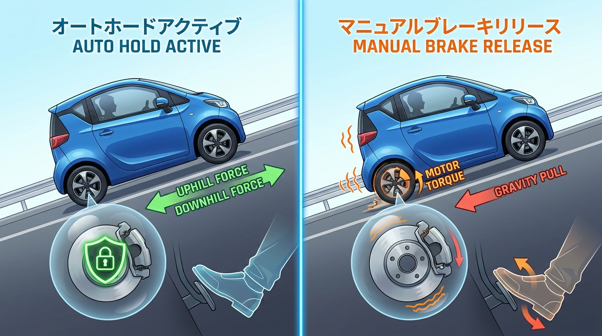

真正值得分析的不是「电机够不够快」，而是三个更深层的问题： **系统当前处于什么状态、怎样判断驾驶员下一步要做什么，以及制动与驱动怎样完成无缝交接** 。这三个环节共同决定车辆是稳稳起步，还是先退半步再追上来。

注意，这不是所有车型都会出现的固定规律。不同品牌、车型、坡度、蠕行/单踏板设置和踏板操作，标定差异很大。本文讨论的是背后的通用控制机理，而不是替代车辆说明书。

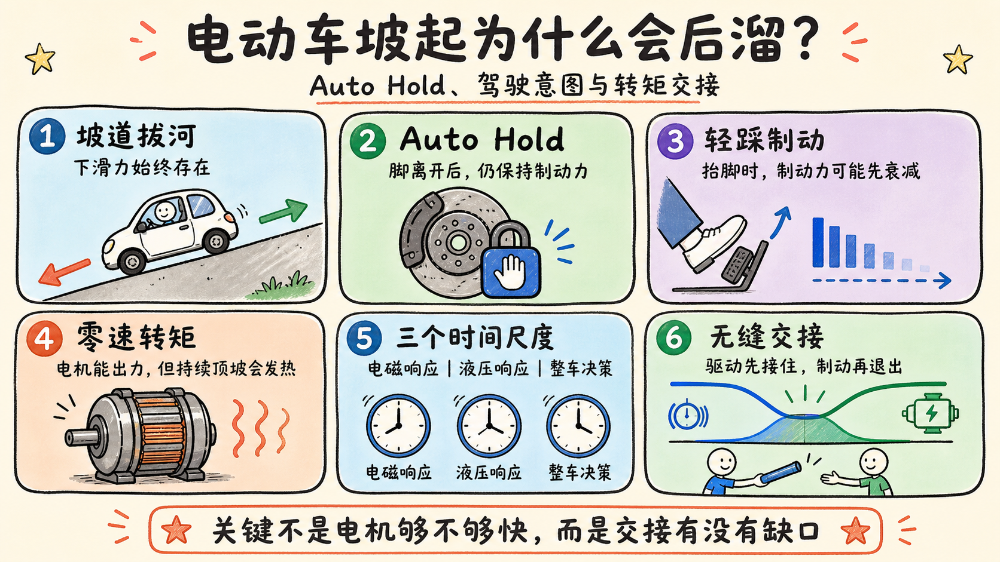

## 🧗 车停在坡上，谁在和重力拔河

把计算先放到一边，坡上停车只需要理解一件事： **重力一直在把车往坡下拉** 。

车辆不后溜，是因为轮胎处存在一股向上的作用力与它对抗。这股力可以来自制动器夹紧车轮，也可以来自电机向前驱动，还可以由两者在短时间内共同承担。

- 停稳时，制动器像有人一直拉着绳子，车轮不能转；
- 起步时，电机要逐渐接过这根绳子，把车向坡上拉；
- 如果制动器已经松开，而电机还没有接稳，重力就会在这个空档里把车拉回去。

坡越陡、车辆越重，重力这一侧越占优势；但对读者更重要的不是算出具体数值，而是看懂**任何时刻都不能出现「制动已经退出、驱动尚未顶上」的力矩缺口** 。

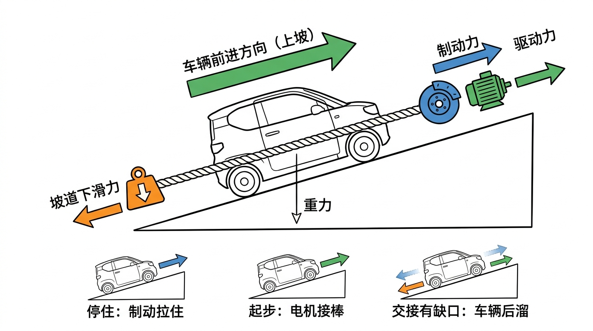

## 🟢 Auto Hold：系统已经明确接管了「停住」

Auto Hold 的关键不是多施加了一点制动力，而是整车控制状态发生了变化：驾驶员已经把「继续保持静止」这项任务交给车辆。

满足激活条件后，制动控制器保持液压压力；等待时间较长时，部分车型还会把保持任务转交给电子驻车制动。即使驾驶员松开踏板，系统中的「驻停请求」仍然存在，因此制动不会跟着脚一起退出。

如果借用驾校的说法， **Auto Hold 相当于整车控制器替你接管了油离配合中的「刹车脚」** ：系统先替你把车稳稳按在坡上，你只需要踩下电门表达「我要起步」。随后，控制器让电机转矩逐渐接棒，再同步松开制动。驾驶员不再需要一只脚守着刹车、另一只脚抢着给油，而是把注意力集中在前方和加速需求上。

### Auto Hold 怎样识别起步意图

系统通常不会只看一个加速踏板信号，而会综合加速踏板开度、挡位、车门与安全带状态、坡度、轮速、电机可用转矩和制动系统状态。只有条件彼此一致，才把「保持」切换为「起步」。

理想的控制顺序是：

```
驾驶员踩加速踏板
→ 整车控制器确认起步意图与安全条件
→ 逆变器建立电流，电机预建上坡转矩
→ 制动控制器按可用驱动转矩逐步卸压
→ 轮速确认车辆按预期向前
```

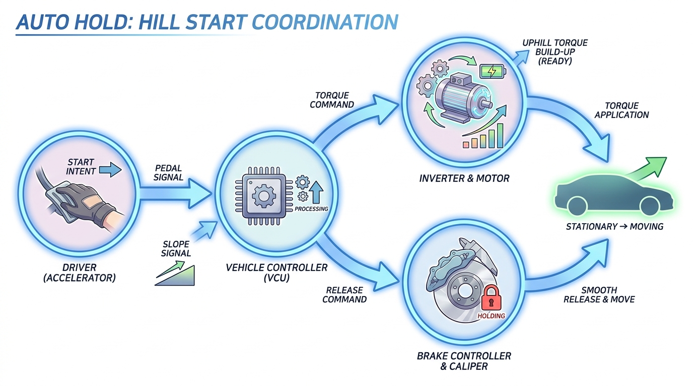

这不是简单的先后开关，而是一场带反馈的**转矩交接** ：驱动侧报告「我能接多少」，制动侧据此「放多少」，轮速信号继续验证车是否按预期运动。若电机转矩不可用、车门打开或安全条件不满足，系统应保持制动或转入更安全的驻车状态，而不是盲目释放。

交接做得好，驾驶员感觉不到刹车与电机在幕后换班，只觉得车辆被「粘」在坡上，然后平稳向前。现代车型的说明书通常会明确说明：Auto Hold 激活后，即使松开制动踏板，车辆仍保持静止；踩加速踏板后才自动释放。比如 [Kia EV6 的 Auto Hold 说明](https://www.kia.com/content/dam/kia2/in/en/content/ev6-manual/topics/chapter6_6_4.html)就是这一逻辑。

## 🟡 轻踩刹车停住：你可能只是暂时压住了车轮

如果只是轻踩制动踏板把车停住，却没有触发 Auto Hold 或完整的坡道保持状态，系统更可能把它理解为一个仍由驾驶员掌控的连续输入：踩多少，就给多少制动力；脚抬多少，压力就退多少。

这与 Auto Hold 有本质区别： **轻踩制动是一个连续量，Auto Hold 是一个带记忆的状态** 。前者随脚变化，后者在脚离开后仍保存「必须保持静止」的目标。

松开轻踩的制动踏板后，控制系统还要判断：驾驶员是想继续停车、让车辆蠕行，还是马上加速？与此同时，制动压力正在下降，蠕行目标转矩和电机电流则需要根据模式重新建立。

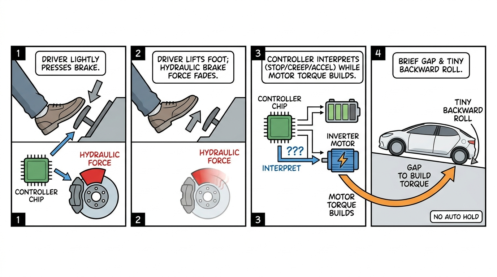

这里的难点不在电磁响应，而在**意图存在歧义** 。过早给大转矩，车辆可能突然前蹿；给得太保守，又可能在坡上后退。不同厂家会在舒适性、响应性和防后溜之间做不同取舍。

有些车型会在检测到坡度和反向轮速趋势时迅速补偿，有些车型依靠短时坡道辅助保压，还有些车型更依赖驾驶员明确踩下加速踏板。因此「轻踩一定会溜」并不是通则，更准确的说法是： **没有进入明确保持状态时，制动—驱动交接更容易出现缺口** 。

## ⚡ 电机零转速能出力，为什么不永远顶住？

这是本文最反直觉的地方。

永磁同步电机在零转速时确实可以输出转矩。简化来看：

$$
T \approx \frac{3}{2}p\psi_f i_q
$$

$p$ 是极对数， $\psi_f$ 是永磁磁链， $i_q$ 是产生转矩的电流。速度为零，不代表转矩为零。

但要让车辆一直靠电机顶在坡上，逆变器就必须持续给定子通电。零速时没有机械功率输出，却仍有铜耗：

$$
P_{\mathrm{Cu}} \approx 3I^2R
$$

电流越大，绕组和功率器件越热；车辆也可能因为转矩估算误差出现细小爬动。此外，如果驾驶员开门、解开安全带、系统故障或高压掉电，单靠电机保持并不是最稳妥的安全状态。

所以量产车通常不会把「无限期零速顶坡」作为唯一驻车手段。短时坡起可以用电机快速接力，稳定驻停更适合交给液压制动或电子驻车。

**电机擅长把车拉走，制动器擅长把车可靠地锁住** 。

## 🚦 别把四个功能混为一谈

| 功能 | 主要目的 | 典型保持方式 | 何时释放 |
| --- | --- | --- | --- |
| Auto Hold | 等红灯、坡道等场景持续驻停 | 保持液压制动，必要时转 EPB | 识别到起步意图后协调释放 |
| 坡道起步辅助 HSA | 防止换脚瞬间后溜 | 松开刹车后短时保压 | 几秒内或驱动转矩建立后释放 |
| 蠕行 Creep | 模拟自动挡松刹车缓慢前进 | 给一个小的正向驱动转矩 | 踩刹车或改变模式 |
| 单踏板/强回收 | 松加速踏板减速，部分车型可停住 | 回收制动 + 低速液压协调 | 再踩加速或模式退出 |

Honda 对坡道起步辅助的描述很典型：松开制动踏板后，系统只保持大约一秒，为驾驶员换脚争取时间；它不等于可以长时间驻停的 Auto Hold。[Honda Hill Start Assist](https://global.honda/en/tech/Hill_Start_Assist)

蠕行也不等于防溜坡。小蠕行转矩在平地上足以让车缓慢向前，到了陡坡上却可能小于重力下滑转矩。部分车辆允许关闭蠕行，部分车辆在 Auto Hold 激活时必须踩加速踏板才会开始蠕行。[Volvo 对自动蠕行的说明](https://www.volvocars.com/us/support/car/xc60-plug-in-hybrid/article/844bae67ce57e895c0a8b04a7050f94b-54203776596e4219c0a8b0977f452789-8664b2fa77a7e089c0a8296870d1a409)

## 🤯 反直觉时间：溜车不一定是电机反应慢

从电流指令发出到电机产生电磁转矩，响应通常很快；驾驶员感觉到的迟滞，却包含了这条更长的链路：

```
踏板变化 → 意图判断 → 状态切换 → 目标转矩计算 → 制动卸压 → 逆变器执行 → 轮速反馈
```

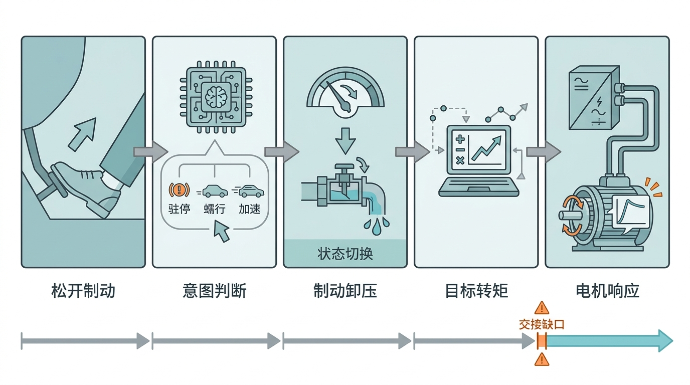

因此需要区分三个时间尺度：

1. **电机电磁响应** ：电流和转矩建立很快；
2. **液压与机械响应** ：制动压力建立或释放需要过程；
3. **整车决策响应** ：控制器要确认状态、约束和驾驶意图，往往最容易让人感到「犹豫」。

更容易造成后溜的，不是某个单一部件太慢，而是**制动力下降曲线与驱动转矩上升曲线没有严密重叠** 。系统是否已进入保持状态、目标蠕行转矩是否足够、是否允许极小反向轮速，以及低温、低电量或故障降级时可用转矩是否受限，都会改变结果。

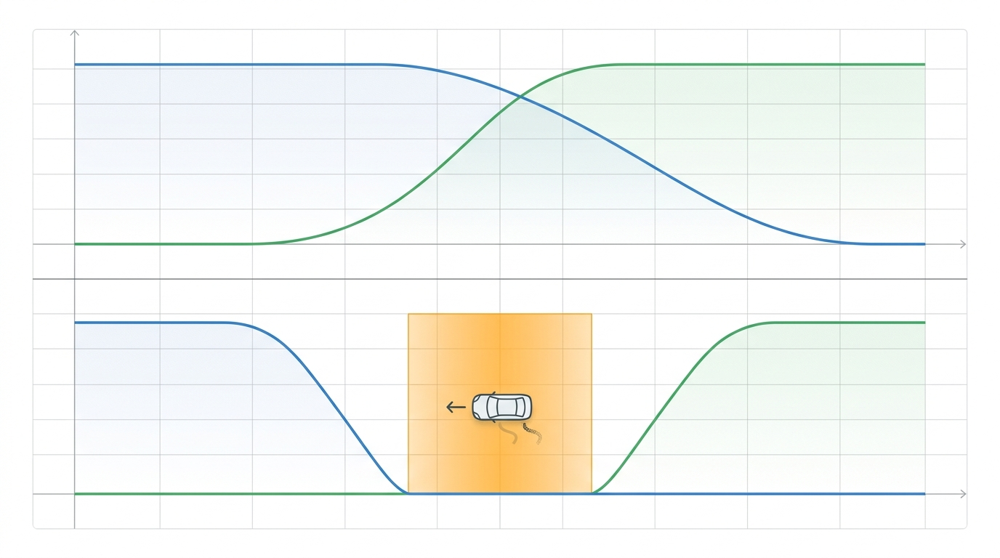

换句话说，所谓「溜了一下」更像一次**状态机与转矩交接没有完全对齐** ，而不是电机从睡梦中醒得太慢。

## 🧠 完全不溜可以做到，难的是让所有场景都自然

先给结论： **只要允许系统主动保压，并在驱动转矩足够之前不释放制动，厂家把一次正常坡起做到几乎不后溜，技术上完全可行** 。Honda 对坡道辅助的企业说明就是典型方案：坡度传感器识别坡道，系统继续保持制动压力，直到驾驶员踩下加速踏板且驱动转矩达到上坡所需水平，再释放制动。[Honda：Hill Start Assist](https://global.honda/en/tech/Hill_Start_Assist)

真正困难的不是证明「能不能」，而是把这套策略覆盖到所有边界条件，并且让驾驶员觉得自然：

- **不能前蹿** ：为了绝不后溜而过早给出大转矩，平地和缓坡起步会显得突兀；
- **不能拖刹车** ：保压过久会产生拖拽感、发热和顿挫；
- **不能误判** ：松开刹车可能表示要蠕行，也可能只是调整脚位、继续停车或准备倒车；
- **需要适应边界** ：坡度、载荷、轮胎附着、电池温度和可用电机转矩都在变化；
- **必须故障安全** ：传感器异常、高压系统不可用或车门打开时，系统要退回可预期的制动策略；
- **还要符合用户习惯** ：有人期待燃油自动挡式积极蠕行，有人期待单踏板模式下松电门就稳稳停住。

因此，「偶尔出现轻微后溜」不应被简单解释成电机能力不足；更准确地说，它可能来自功能没有进入保持状态、保压触发阈值、蠕行风格或制动—驱动交接标定。当然，如果实际车辆后溜明显、频繁或与说明书描述不符，也应按故障线索检查，而不能都归因于所谓厂家风格。

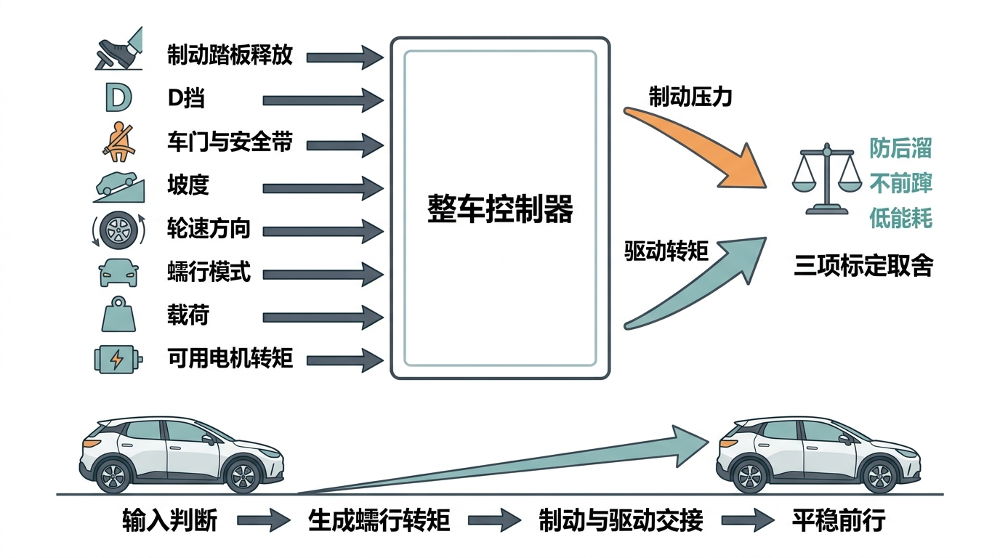

### 学者和企业为什么还在研究

如果只靠一条规则——「检测到松刹车，就立刻给电机转矩」——实现并不难；难的是这条规则在所有人、所有坡度和所有操作节奏下都不误判。驾驶员的真实意图无法被传感器直接读取，只能从踏板位移、松开速度、挡位、坡度、轮速和前后操作序列中推断。

一些研究和企业方案正好说明这个问题仍在持续优化：

1. **坡度识别后再释放制动** 。2013 年的电动车坡起控制研究使用坡度观测器触发 HSA，并等到电机驱动转矩超过起步阻力后才释放制动，同时把起步冲击作为评价指标。[Control Strategy for Hill Starting of Electric Vehicle](https://scialert.net/fulltext/?doi=jas.2013.1429.1435)
2. **同时优化后溜、磨损与顿挫** 。2020 年针对分布式驱动电动车的研究，不只追求防后溜，还比较驻车制动释放延迟、摩擦功和起步冲击，并在不同坡度下验证控制器。[IEEE Access：Hill-Start of Distributed Drive Electric Vehicle](https://www.semanticscholar.org/paper/Hill-Start-of-Distributed-Drive-Electric-Vehicle-on-Wu-Wang/ecee1392c48ac719ee91b2ce6859ed701e76d2f2)
3. **低附着坡道仍是难点** 。2025 年的研究继续探索分离附着路面的坡起，把行车制动、驻车制动、驱动转矩和防滑控制结合；没有协调策略时，释放驻车制动后会出现明显后溜。[Research on hill start assist control with ASR](https://www.sciencedirect.com/science/article/pii/S1000934525000653)
4. **企业仍在细化「半刹车」意图** 。一项电动车蠕行控制专利把蠕行转矩与制动踏板行程、踏板变化率关联，希望在半刹车状态下判断驾驶员意图，而不是只有「踩下/松开」两个开关状态。[CN111688502A：一种电动车蠕行控制方法](https://patents.google.com/patent/CN111688502A/zh)
5. **意图需要看一段时间，而不是一个瞬间** 。国内关于制动意图识别的研究指出，驾驶意图不能只由当前制动状态判断，而要观察快速/缓慢踩下、快速/缓慢松开、保持等连续动作，再结合车速和减速度用双层 HMM 推断。[基于驾驶员意图识别的电动汽车电机制动失效监控系统研究](https://html.rhhz.net/GLJTKJ/20161223.htm)
6. **产业界仍在研究电动蠕行进入与退出条件** 。相关专利会区分不同制动过程，并根据预设条件允许或限制车辆在松开制动后进入电动蠕行，说明「松刹车即蠕行」也不是一条可以无条件执行的规则。[电动蠕行控制相关专利](https://data.epo.org/publication-server/rest/v1.2/publication-dates/2025-07-09/patents/EP4309938NWB1/document.pdf)

这些案例共同指向一个结论： **规则可以实现基本功能，但规则越简单，越难兼顾复杂场景；规则越多，状态边界和标定工作又会迅速膨胀** 。所以工程上逐步引入坡度与载荷估计、时序特征、状态机、模糊控制、观测器乃至数据驱动的意图识别，并不是因为电机不会出力，而是为了让系统既不溜、也不蹿，还能准确理解驾驶员想做什么。

## 🛠️ 驾驶员应该怎么做

1. **先看说明书** ：确认 Auto Hold、坡道辅助、单踏板和蠕行功能的适用条件；
2. **坡上需要驻停时，明确使用制动或 Auto Hold** ：不要把轻微蠕行转矩当作驻车装置；
3. **起步时平稳踩加速踏板** ：让系统识别明确的起步意图并完成转矩交接；
4. **陡坡、湿滑路面或重载时留出更大距离** ：辅助功能不能突破轮胎附着极限；
5. **不要用单踏板习惯替代安全操作** ：车型、软件版本和电池状态变化都可能改变低速表现。

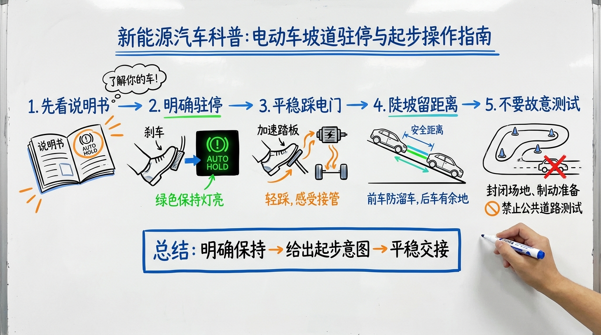

如果需要验证自己的车，请在封闭、低坡度、后方无人员和障碍物的环境中进行，并准备随时踩下制动踏板。不要在公共道路上故意测试溜车距离。

## 📜 老列的五条坡起铁律

| # | 铁律 | 一句话解释 |
| --- | --- | --- |
| 1 | 坡上停住靠力平衡 | 制动与驱动力之和必须大于下滑力 |
| 2 | Auto Hold 是明确状态 | 松开踏板后，系统仍持续保持制动力 |
| 3 | 轻踩刹车只是连续输入 | 松脚后制动力下降，未必存在持续保持命令 |
| 4 | 零速能出转矩不等于适合驻车 | 持续电流会发热，制动器更可靠、更安全 |
| 5 | 蠕行不等于坡道保持 | 平地够用的小转矩，在陡坡上可能压不过重力 |

## 💬 老列碎碎念

新能源车把离合器和液力变矩器拿掉了，却没有把坡起问题凭空删除。过去是驾驶员在离合器、油门和手刹之间交接；今天则是制动控制器、整车控制器和逆变器在毫秒之间交接。 **结构由油变电，控制问题仍然一脉相承——这就是另一种「油电不分家」** 。

Auto Hold 之所以让人安心，不是因为电机突然更有力，而是系统替你接管了驾校坡起时最紧张的那只「刹车脚」：在驱动转矩真正接稳之前继续把车按住。驾驶员只需观察环境并踩下电门，剩下的「油离配合」由控制器在后台完成。

系统收到的核心命令也很清楚： **在我明确起步之前，把车稳稳停住；当我要起步时，让驱动先接住，再松开制动** 。

你的车在坡起时会不会先溜一下？开启和关闭 Auto Hold 的表现有什么差别？欢迎在评论区留下车型和使用模式。公众号后台回复 **「坡起」** ，领取《新能源车低速控制状态图》。

<p align="center">
  <strong>觉得有收获，老规矩，</strong><br>
  <strong>点赞、在看、转发三连。</strong><br><br>
  👇👇👇
</p>

## 参考资料

- [Kia EV6 用户手册：AUTO HOLD](https://www.kia.com/content/dam/kia2/in/en/content/ev6-manual/topics/chapter6_6_4.html)
- [Honda：Hill Start Assist System](https://global.honda/en/tech/Hill_Start_Assist)
- [Volkswagen：Auto Hold](https://www.volkswagen.co.uk/en/technology/driver-assist/braking.html)
- [Volvo：Automatic creeping](https://www.volvocars.com/us/support/car/xc60-plug-in-hybrid/article/844bae67ce57e895c0a8b04a7050f94b-54203776596e4219c0a8b0977f452789-8664b2fa77a7e089c0a8296870d1a409)

---

> 推荐关注公众号「探物及理」，探万物之然，及万理之源。
>
> 
