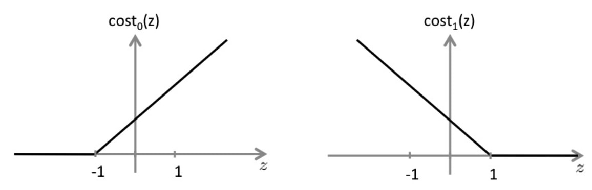

# AI->机器学习分类图
)

# 矩阵补课
## 特征值分解EVD，奇异值分解SVD
$A$是矩阵
$x_i$ 是单位特征向量
$\lambda_i$是特征值
$\Lambda$ 是矩阵特征值
### EVD特征值分解（The eigenvalue value decomposition）
针对方阵，特征值
)
$A = U\Lambda U^{-1} = U\Lambda U^T$
进行矩阵运算时，Ax，先对x分解$x =aU^T= a_1 x_1+...a_mx_m$
)

则$U\Lambda U^T x = U\Lambda U^T U a^T = U\Lambda a^T$
)

$U\Lambda a^T = U(\lambda a)^T$
)
效果如下，将向量在单位特征向量上，伸长为$\lambda$倍
)
### SVD奇异值分解（Singularly Valuable Decomposition）
矩阵A，mxn维，将n维的向量映射到m维空间中,k<=m
正交基，$(v_1,v_2...v_n)$
)
$A^T A = \lambda_j$
)
)
)
### 应用
)

存储领域，选取u，v正交基矩阵，计算奇异值矩阵，使奇异值矩阵尽量集中，即可取到


# 机器学习
## 1、Introduction
E：经验
T：任务
P：概率
### 机器学习分类
* 监督学习(supervisor learning)：分类（classification）、回归（regression）
* 无监督学习(unsupervisor learning)：
* 强化学习Reinforcement learning


## 2、Linear regression线型回归
### Cost funciton-代价函数

)
矩阵表达
$J(\theta) = \frac{1}{2m}(X\theta-Y)^T(X\theta-Y)$
* 梯度下降法（Gradient Descent）
$\theta_{i+1} =\theta_i - \alpha\nabla J(\theta) $
$\frac{\partial J(\theta)}{\partial\theta} = \frac{1}{m}X^T(X\theta-Y)$
推导过程
)
)


* 正规方程法（Normal Equation）
)
图中公式，theta的维是n，不是m
另一种理解方式
相当于求解$Y = X\theta$
)

b相当于y，a相当于x组成的矩阵，
)
求导过程
)

### 线性代数回顾
矩阵、向量使用规范
)


### 加速梯度下降方法，让$x_i$尺度一致
* Feature Scaling
将输入值归一化，缩放到[-1,1]之间，梯度下降法更快收敛
* Mean Normalization
$x_i = \frac{x_i - \mu_i}{s_i}$,其中$\mu_i$是input的平均值，$s_i$是取值的范围，或者标准偏差

### 回归问题方法选择
)
正规方程法行不通：
* $X^TX$不可逆
1. 元素中有redundant features,linearly dependent
2. 过多的features，导致input维度n>m

### 回归问题的矩阵表达
)

## 3、Logistic Regression逻辑回归
分类classification
### 函数表达式
$z = \theta^T x$
$h(z) = sigmoid(z)$
处理regression函数：连续变离散->Hypothesis 
### 作用
h(z)代表着一个边界，将值分为>0和<0
由于sigmoid函数的特性，程序最终会优化到z取值远离零点
### Cost function 的选择
不能选择最小二乘法，因为目标是一个非凸函数
凸函数才能最好利用梯度下降法
所以对于，y-0，1的分类问题，改写cost function为
)
进一步改写为一个式子
)
)

推导过程中，利用了sigmoid的求导法则
$\sigma'(x) = \sigma(x)(1-\sigma(x))$

特殊设计过的sigmoid函数 和 cost function 
使得，满足$\theta$参数更新可以矢量化
$\theta_{i+1} = \theta_i - \alpha  \nabla J(\theta)=\theta_i - \alpha X^T(g(X\theta) - Y)$
$g(X\theta)$是sigmoid函数对$\X\theta$矩阵每个元素进行操作
特征缩放，
## 其他参数优化方法
* Conjugate gradient 共轭下降法
* BFGS
* L_BFGS
优点：
* 不需要选择学习速率$\alpha$
* 收敛速度快
缺点：复杂
可以直接调用

```
1.设置优化参数 optimset = 初始参数，方法，强制结束迭代次数
2.设置初始条件，Initialpara = 
3.[Jval, theta'] = Cost_function (X,Y)
4.调用优化函数[Jval，theta'] = (@Cost_function,Initialpara,optimset)，
```
## 多类别分类
构建i个分类器，利用i个h(z)，处理
分别给出属于某个分类的几率值

X 特征矩阵


## 3.2回归遇到的问题，解决方案，正则化
* 过拟合
拟合特征数>>样本量，

* 欠拟合
特征数不够<<样本量，不能正确预测，回归
### 办法
1、 减少无关特征
* 手动减少无关特征
* 模型选择算法，自动选择相关变量
2、 regularization 正则化
)
正则化参数，使特征拟合参数减小权重

#### 线性回归正则化
)
**对于逻辑回归正则化，式子一样**

## 4、神经网络——Nonlinear Hypotheses
)
输入层、隐藏层、输出层
g 激活函数$\in[0,1]$：
h 输出函数
* 阶跃
* 逻辑函数，sigmoid，无限可微
* 斜坡函数
* 高斯函数
)
### multiclass classification 
输出层y不是一个数字，[1;0;0;0] [0;1;0;0]instead
### Forward propagation
$a^{(j+1)} = g(\Theta ^ {(j})a^{(j)})$

### Backpropagation
Cost function
**符号约定**
)
[传播计算推导](https://github.com/halfrost/Halfrost-Field/blob/master/contents/Machine_Learning/Neural_Networks_Learning.ipynb)
### BP神经网络——算法步骤
)
)

**调用函数的时候 unroll矩阵->Vector**
)

gradient check
引入 $\epsilon$，数值计算，缺点太慢，只用于编程时的校验

$\Theta$初始化
随机初始化，零值代入会有问题，权重难更新
我们将初始化权值 $\Theta_{ij}^{(l)}$ 的范围限定在 $[-\Phi ,\Phi ]$ 。

## 6、Advice for applying machine learning
### 评价拟合函数hypothesis
1. 分类数据集（training set、test set）
2. 用训练集的theta 计算测试集的误差（分类问题，误差定义为0/1，最终统计结果表现为错误率）
### 模型选择——（Train/ Validation/ Test sets）
* 训练多个模型，在测试集中找到表现最优
* 偏差和方差（Bias/ Variance）
关于 模型种类
)
关于 正则化参数
)

## 学习曲线
)

High bias
)

High Variance
)

)

## 6.2 设计神经网络
1. **快速部署**、设计简单网络
2. plot 学习曲线，发现问题
3. 误差分析（验证集）：数值被错误分类的特征，度量误差

### 误差度量 for skewed classes 偏斜类
precision/recall
)
针对最后一级h(x)，
防止错判，阈值提高，设定逻辑判断阈值0.9  instead of 0.5
防止漏过1，阈值放低

#### 综合评定标准
)

## 7、支持向量机SVM（support vector machine）
### 7.1 SVM 大间距分类器（Large Margin Classification）
**重写了cost function 和 h（z）**

支持向量机的代价函数为：
$$min_{\theta} C[\sum_{i=1}^{m}{y^{(i)}}cost_1(\theta^Tx^{(i)})+(1-y^{(i)})cost_0(\theta^Tx^{(i)})]+\frac{1}{2}\sum_{j=1}^{n}{\theta_j^2}$$




有别于逻辑回归假设函数输出的是概率，支持向量机它是直接预测 y 的值是0还是
**假设函数**
$$h_{\theta}(x)=\left\{\begin{matrix}
1,\;\;if\; \theta^{T}x\geqslant 0\\ 
0,\;\;otherwise
\end{matrix}\right.
$$


)
最小化$\theta$的模，相当于最大化样本在$\theta$上的投影长度，图中直观表现为，绿色边界在$\theta$方向上距离样本距离最远。
)
)

## 7.2 kernels核函数
核函数满足$κ(xi·xj)=φ(xi)T·φ(xj)$
低维线性不可分（欠拟合）->映射到高维
避免维度灾难，引入核函数（Kernels），用样本去构造特征
适用于n<<m, 增加特征数量变为m


### 高斯核函数
参数：$l(i),\sigma$
$f = exp^{(-\frac{||x-l^{(i)}||^2}{2\sigma^2})}$
取值[0,1]
### 注意的点
核函数用于逻辑回归，运算很慢
核函数优化算法仅适用于SVM
使用前，一定归一化处理

## 分类模型的选择[]()
7.3 分类模型的选择
目前，我们学到的分类模型有：
（1）逻辑回归；
（2）神经网络；
（3）SVM
怎么选择在这三者中做出选择呢？我们考虑特征维度 n 及样本规模 m ：
1. 如果 n 相对于 m 非常大，例如 n=10000 ，而 $m\in(10,1000)$ ：此时选用逻辑回归或者无核的 SVM。
2. 如果 n 较小，m 适中，如  $n\in(1,1000)$ ，而  $m\in(10,10000)$ ：此时选用核函数为高斯核函数的 SVM。
3. 如果 n 较小，m 较大，如  $n\in(1,1000)$ ，而 m>50000 ：此时，需要创建更多的特征（比如通过多项式扩展），再使用逻辑回归或者无核的 SVM。 神经网络对于上述情形都有不错的适应性，但是计算性能上较慢。

## 8、无监督学习（Unsupervised learning）
### 8.1 分类K-means algorithm(Clustering)
1. cluster 分类，计算到$\mu_k$距离将下表k分配给$c_i$的
2. 移动cluster central到，分类的平均点
#### 优化目标
Cost function
找到$c_i$ 和 $\mu_k$，使函数：
$$J(c^{(1)},c^{(2)},\cdots ,c^{(m)};\mu_1,\mu_2,\cdots ,\mu_k)=\frac{1}{m}\sum_{i=1}^m\left \| x^{(i)}-\mu_c(i) \right \|^2$$

$c_i\in[1,K]$

#### $\mu_k$随机初始化，避免局部最优
1. k<m
2. 随机指定$\mu_k = x(i)$
3. 多次运算，找最优结果
小k时，多次初始化进行运算
#### 选择cluster 数量
plot cluster 数量 为横坐标，找突变点

### 8.2 Dimensionality reduction
#### 数据压缩 Data Compression
减少冗余特征变量
#### 可视化

#### PCA主成分分析法（Principal Component Analysis）

### PCA算法流程
1. 特征压缩
假定我们需要将特征维度从 n 维降到 k 维。则 PCA 的执行流程如下：
特征标准化，平衡各个特征尺度：
$$x^{(i)}_j=\frac{x^{(i)}_j-\mu_j}{s_j}$$
$\mu_j$ 为特征 j 的均值，sj 为特征 j 的标准差。
计算协方差矩阵 $\Sigma $ ：
$$\Sigma =\frac{1}{m}\sum_{i=1}{m}(x^{(i)})(x^{(i)})^T=\frac{1}{m} \cdot  X^TX$$
通过奇异值分解（SVD），求取 $\Sigma $ 的特征向量（eigenvectors）：
$$(U,S,V^T)=SVD(\Sigma )$$
从 U 中取出前 k 个左奇异向量，构成一个约减矩阵 Ureduce :
$$U_{reduce}=(\mu^{(1)},\mu^{(2)},\cdots,\mu^{(k)})$$
计算新的特征向量： $z^{(i)}$
$$z^{(i)}=U^{T}_{reduce} \cdot  x^{(i)}$$

2. 特征还原
因为 PCA 仅保留了特征的主成分，所以 PCA 是一种有损的压缩方式，假定我们获得新特征向量为：
$$z=U^T_{reduce}x$$
那么，还原后的特征 $x_{approx}$ 为：
$$x_{approx}=U_{reduce}z$$
3. 信息保留评价
降维多少才合适？
从 PCA 的执行流程中，我们知道，需要为 PCA 指定目的维度 k 。如果降维不多，则性能提升不大；如果目标维度太小，则又丢失了许多信息。通常，使用如下的流程的来评估 k 值选取优异：
求各样本的投影均方误差:
$$\min \frac{1}{m}\sum_{j=1}^{m}\left \| x^{(i)}-x^{(i)}_{approx} \right \|^2$$
求数据的总方差variance：
$$\frac{1}{m}\sum_{j=1}^{m}\left \| x^{(i)} \right \|^2$$
评估下式是否成立:
$$\frac{\min \frac{1}{m}\sum_{j=1}^{m}\left \| x^{(i)}-x^{(i)}_{approx} \right \|^2}{\frac{1}{m}\sum_{j=1}^{m}\left \| x^{(i)} \right \|^2} \leqslant \epsilon $$
其中， $\epsilon $ 的取值可以为 0.01,0.05,0.10,⋯，假设  $\epsilon = 0.01 $ ，我们就说“特征间 99% 的差异性得到保留”。
**看$\Sigma$矩阵的二范数占比就知道**
)

### PCA-point

协方差矩阵$\Sigma$看主成分
取前k个u构成向量
$U_{reduce}\in \mathbb{R}^{n\times k}$
PCA 不能解决过拟合，要用正则化的方式


## 9、异常检测
### 9.1高斯分布(Gaussian normal distribution)
$x\sim N(\mu,\sigma^2)$
其分布概率为：
$$p(x;\mu,\sigma^2)=\frac{1}{\sqrt{2\pi}\sigma}exp(-\frac{(x-\mu)^2}{2\sigma^2})$$
其中 $\mu$ 为期望值（均值）， $\sigma^2$ 为方差。
在概率论中，对有限个样本进行参数估计
$$\mu_j = \frac{1}{m} \sum_{i=1}^{m}x_j^{(i)}\;\;\;,\;\;\; \delta^2_j = \frac{1}{m} \sum_{i=1}^{m}(x_j^{(i)}-\mu_j)^2$$
这里对参数 $\mu$ 和参数 $\delta^2$ 的估计就是二者的极大似然估计。
假定每一个特征 $x_{1}$ 到 $x_{n}$ 均服从正态分布，则其模型的概率为：
$$
\begin{align*}
p(x)&amp;=p(x_1;\mu_1,\sigma_1^2)p(x_2;\mu_2,\sigma_2^2) \cdots p(x_n;\mu_n,\sigma_n^2)\\
&amp;=\prod_{j=1}^{n}p(x_j;\mu_j,\sigma_j^2)\\
&amp;=\prod_{j=1}^{n} \frac{1}{\sqrt{2\pi}\sigma_{j}}exp(-\frac{(x_{j}-\mu_{j})^2}{2\sigma_{j}^2})
\end{align*}
$$
当 $p(x)&lt;\varepsilon$时，$x$ 为异常样本。

### 算法评价
由于异常样本是非常少的，所以整个数据集是非常偏斜的，我们不能单纯的用预测准确率来评估算法优劣，所以用我们之前的查准率（Precision）和召回率（Recall）计算出 F 值进行衡量异常检测算法了。
真阳性、假阳性、真阴性、假阴性
查准率（Precision）与 召回率（Recall）
F1 Score
我们还有一个参数 $\varepsilon$ ，这个 $\varepsilon$ 是我们用来决定什么时候把一个样本当做是异常样本的阈值。我们应该试用多个不同的 $\varepsilon$ 值，选取一个使得 F 值最大的那个 $\varepsilon$ 。

### 异常检测与逻辑回归的区别
)

异常检测数据特点是：
1. 数据偏斜，y=1数据量极少
2. 异常数据特征不聚类（不稳定），难以预测

### 多元高斯函数
其概率模型为： $$p(x;\mu,\Sigma)=\frac{1}{(2\pi)^{\frac{n}{2}}|\Sigma|^{\frac{1}{2}}}exp(-\frac{1}{2}(x-\mu)^T\Sigma^{-1}(x-\mu))$$
（其中 $|\Sigma|$ 是 $\Sigma$ 的行列式，$\mu$ 表示样本均值，$\Sigma$ 表示样本协方差矩阵。）。
)
其中$\Sigma$参数估计：
$$\mu=\frac{1}{m}\sum_{i=1}^{m}{x^{(i)}}$$$$\Sigma=\frac{1}{m}\sum_{i=1}^{m}{(x^{(i)}-\mu)(x^{(i)}-\mu)^T}$$
### 算法流程-多元高斯分布异常检测
采用了多元高斯分布的异常检测算法流程如下：
选择一些足够反映异常样本的特征 $x_j$ 。
对各个样本进行参数估计： $$\mu=\frac{1}{m}\sum_{i=1}^{m}{x^{(i)}}$$$$\Sigma=\frac{1}{m}\sum_{i=1}^{m}{(x^{(i)}-\mu)(x^{(i)}-\mu)^T}$$
当新的样本 x 到来时，计算 $p(x)$ ：
$$p(x)=\frac{1}{(2\pi)^{\frac{n}{2}}|\Sigma|^{\frac{1}{2}}}exp(-\frac{1}{2}(x-\mu)^T\Sigma^{-1}(x-\mu))$$
如果 $p(x)&lt;\varepsilon $ ，则认为样本 x 是异常样本。

### 相关性
一般高斯模型：
需要手动创建一些特征来描述某些特征的相关性
多元高斯模型：
利用协方差矩阵$\Sigma$获得了各个特征相关性
### 复杂度
一般高斯模型：
计算复杂度低，适用于高维特征
多元高斯模型：
计算复杂
### 效果¶
一般高斯模型：
在样本数目 m 较小时也工作良好
多元高斯模型：
需要 $\Sigma$ 可逆，亦即需要 $m&gt;n$ ，(通常会考虑 $ m \geqslant 10*n $，确保有足够多的数据去拟合这些变量，更好的去评估协方差矩阵 $\Sigma$ )且各个特征不能线性相关，如不能存在 $x_2=3x_1$ 或者 $x_3=x_1+2x_2$
### 结论：
基于多元高斯分布模型的异常检测应用十分有限。


### 9、2 推荐器 Recommender system

#### Content based recommendations

$y(i,j) = \theta_{j}^T x_i$评分等于电影特征成分*用户喜好
前提：电影特征$x_i$已知，求解用户喜好$\theta_j$

为了对用户 j 打分状况作出最精确的预测，我们需要：
$$\min_{(\theta^{(j)})}=\frac{1}{2}\sum_{i:r(i,j)=1}^{}{((\theta^{(j)})^T(x^{(i)})-y^{(i,j)})^2}+\frac{\lambda}{2}\sum_{k=1}^{n}{(\theta_k^{(j)})^2}$$
计算出所有的 $\theta$ 为：
$$J(\theta^{(1)},\cdots,\theta^{(n_u)})=\min_{(\theta^{(1)},\cdots,\theta^{(n_u)})}=\frac{1}{2}\sum_{j=1}^{n_u}\sum_{i:r(i,j)=1}^{}{((\theta^{(j)})^T(x^{(i)})-y^{(i,j)})^2}+\frac{\lambda}{2}\sum_{j=1}^{n_u}\sum_{k=1}^{n}{(\theta_k^{(j)})^2}$$
与前面所学线性回归内容的思路一致，为了计算出 $J(\theta^{(1)},\cdots,\theta^{(n_u)})$，使用梯度下降法来更新参数：
更新偏置（插值）：
$$\theta^{(j)}_0=\theta^{(j)}_0-\alpha \sum_{i:r(i,j)=1}((\theta^{(j)})^Tx^{(i)}-y^{(i,j)})x^{(i)}_0$$
更新权重：
$$\theta^{(j)}_k=\theta^{(j)}_k-\alpha \left( \sum_{i:r(i,j)=1}((\theta^{(j)})^Tx^{(i)}-y^{(i,j)})x^{(i)}_k+\lambda \theta^{(j)}_k \right),\;\;\; k \neq 0$$


#### 协同过滤Collaborative filtering
电影特征成分$x_i$和用户喜好$\theta_j$均未知
#### 算法实现
1. 目标优化
当用户给出他们喜欢的类型，即 $\theta^{(1)},\cdots,\theta^{(n_u)}$ ，我们可以由下列式子得出 $x^{(i)}$ ：
$$\min_{(x^{(i)})}=\frac{1}{2}\sum_{j:r(i,j)=1}^{}{((\theta^{(j)})^T(x^{(i)})-y^{(i,j)})^2}+\frac{\lambda}{2}\sum_{k=1}^{n}{(x_k^{(i)})^2}$$
可出所有的 x 则为：
$$\min_{(x^{(1)},\cdots,x^{(n_m)})}=\frac{1}{2}\sum_{i=1}^{n_m}\sum_{j:r(i,j)=1}^{}{((\theta^{(j)})^T(x^{(i)})-y^{(i,j)})^2}+\frac{\lambda}{2}\sum_{i=1}^{n_m}\sum_{k=1}^{n}{(x_k^{(i)})^2}$$
只要我们得到 $\theta$ 或者 x ，都能互相推导出来。
协同过滤算法基本思想就是当我们得到其中一个数据的时候，我们推导出另一个，然后根据推导出来的再推导回去进行优化，优化后再继续推导继续优化，如此循环协同推导。
2. 协同过滤的目标优化
推测用户喜好：给定$x^{(1)},\cdots,x^{(n_m)}$ ，估计$\theta^{(1)},\cdots,\theta^{(n_\mu)}$ ： $$\min_{(\theta^{(1)},\cdots,\theta^{(n_\mu)})}=\frac{1}{2}\sum_{j=1}^{n_\mu}\sum_{i:r(i,j)=1}^{}{((\theta^{(j)})^T(x^{(i)})-y^{(i,j)})^2}+\frac{\lambda}{2}\sum_{j=1}^{n_\mu}\sum_{k=1}^{n}{(\theta_k^{(j)})^2}$$
推测商品内容：给定$\theta^{(1)},\cdots,\theta^{(n_\mu)}$ ，估计$x^{(1)},\cdots,x^{(n_m)}$ ： $$\min_{(x^{(1)},\cdots,x^{(n_m)})}=\frac{1}{2}\sum_{i=1}^{n_m}\sum_{j:r(i,j)=1}^{}{((\theta^{(j)})^T(x^{(i)})-y^{(i,j)})^2}+\frac{\lambda}{2}\sum_{i=1}^{n_m}\sum_{k=1}^{n}{(x_k^{(i)})^2}$$
协同过滤：同时优化$x^{(1)},\cdots,x^{(n_m)}$ ，估计$\theta^{(1)},\cdots,\theta^{(n_\mu)}$： $$\min \; J(x^{(1)},\cdots,x^{(n_m)};\theta^{(1)},\cdots,\theta^{(n_\mu)})$$
即：
$$\min_{(x^{(1)},\cdots,x^{(n_m)};\theta^{(1)},\cdots,\theta^{(n_\mu)})}=\frac{1}{2}\sum_{(i,j):r(i,j)=1}^{}{((\theta^{(j)})^T(x^{(i)})-y^{(i,j)})^2}+\frac{\lambda}{2}\sum_{i=1}^{n_m}\sum_{k=1}^{n}{(x_k^{(i)})^2}+\frac{\lambda}{2}\sum_{j=1}^{n_u}\sum_{k=1}^{n}{(\theta_k^{(j)})^2}$$
因为正则化的原因在这里面不再有之前的 $x_0=1$,$\theta_0=0$ 。
3. 协同过滤算法的步骤为：
随机初始化$x^{(1)},\cdots,x^{(n_m)},\theta^{(1)},\cdots,\theta^{(n_\mu)} $为一些较小值，与神经网络的参数初始化类似，为避免系统陷入僵死状态，不使用 0 值初始化。
通过梯度下降的算法计算出$J(x^{(1)},\cdots,x^{(n_m)},\theta^{(1)},\cdots,\theta^{(n_\mu)})$,参数更新式为： $$x^{(i)}_k=x^{(i)}_k-\alpha \left( \sum_{j:r(i,j)=1}((\theta^{(j)})^Tx^{(i)}-y^{(i,j)})\theta^{(j)}_k+\lambda x^{(i)}_k \right)$$$$\theta^{(j)}_k=\theta^{(j)}_k-\alpha \left( \sum_{i:r(i,j)=1}((\theta^{(j)})^Tx^{(i)}-y^{(i,j)})x^{(i)}_k+\lambda \theta^{(j)}_k \right)$$
如果用户的偏好向量为$\theta$，而商品的特征向量为 x ，则可以预测用户评价为 $\theta^Tx$ 。
因为协同过滤算法 $\theta$ 和 x 相互影响，因此，二者都没必要使用偏置 $\theta_0$ 和 $x_0$，即，$x \in \mathbb{R}^n$、 $\theta \in \mathbb{R}^n$ 。
#### 低秩分解（Low Rank Matrix Factorization）
$Y = X\Theta^T$
)


#### 正则化
1. $\lambda$正则化，使$\theta$趋向0
2. 平均值正则化(mean normalization)
将平均值作为0点，让Y偏置
)


## 10、大数据集——提升运算速度
### Stochastic Gradient Descent（随机梯度下降法）
不用全部数据集进行运算
1. 预处理，随机排序
2. 内循环，单个特征修改拟合参数
每次使用一个样本
#### SGD收敛性
每隔1000个样本画cost函数
* 小$\alpha$让曲线慢，准
* 大样本采样间距->曲线更光滑
* 随着迭代次数，减小α

### Mini-Batch Gradient Descent
)
矢量化->并行计算，提高效率


### 在线学习Online learning
数据集连续，减少存储成本


### Map reduce and data parallelism
)
代数计算库自动implement


## 12、Photo OCR pipeline
)

1. 文本检测
2. 特征分割
3. 特征识别
4. 修正C1eaning->cleaning
### Sliding window 滑窗分类器
#### 文本检测
步长step size
不同大小，按照比例缩放

检测到特征，相邻互联
#### 特征分割
)

### 获取数据，人造数据
1. 加背景噪音
2. 字体处理
3. 人工扭曲

加入高斯噪声没用

### 大量数据获取建议
)

### Ceiling analysis上限分析
找到提升最大的Module
)


## 强化学习
[连接](https://blog.csdn.net/xyk_hust/article/details/86649104)


### 一些概念


* 向量机

* 核函数
作用：
减小计算量，解决多维输入问题
无需知道非线性变换函数的形式和参数


[核函数种类](https://blog.csdn.net/weixin_42137700/article/details/81479322)

* 贝叶斯滤波器：概率滤波器


## 处理微分的手段
1. 微分+一阶惯性环节，$tf = s/(T_s s +1)$
2. TD微分跟踪器)
3. 状态观测器
4. 卡尔曼滤波器

