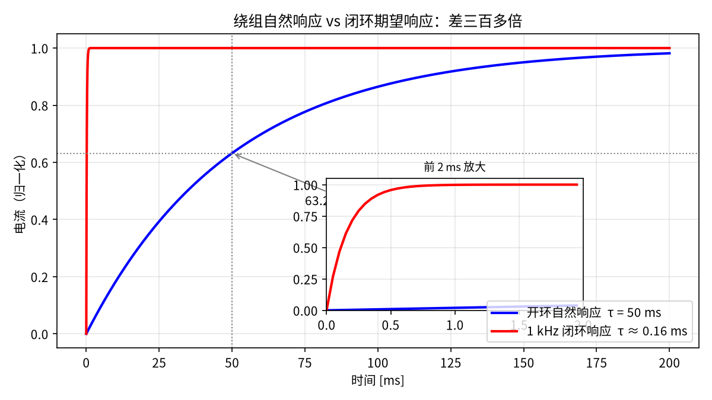
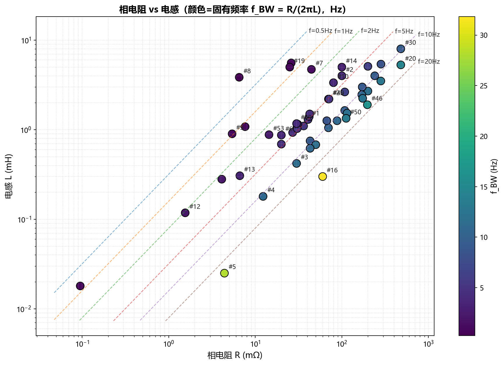
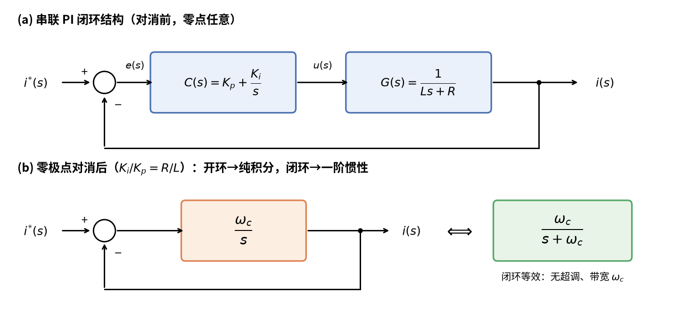
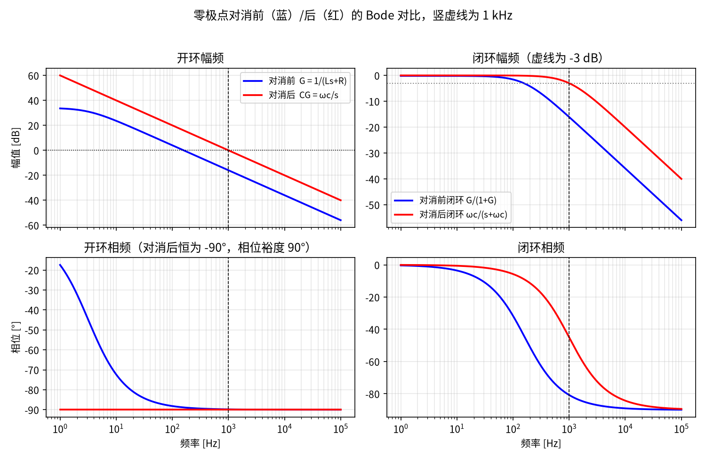
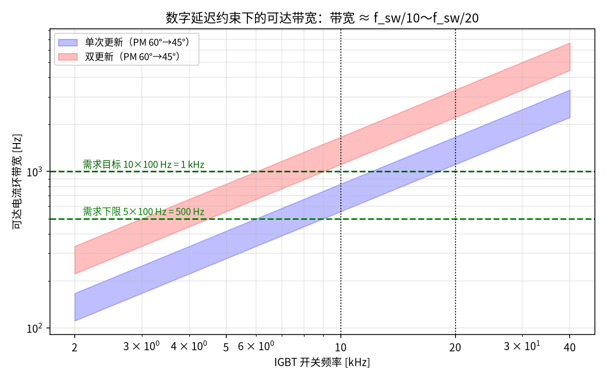
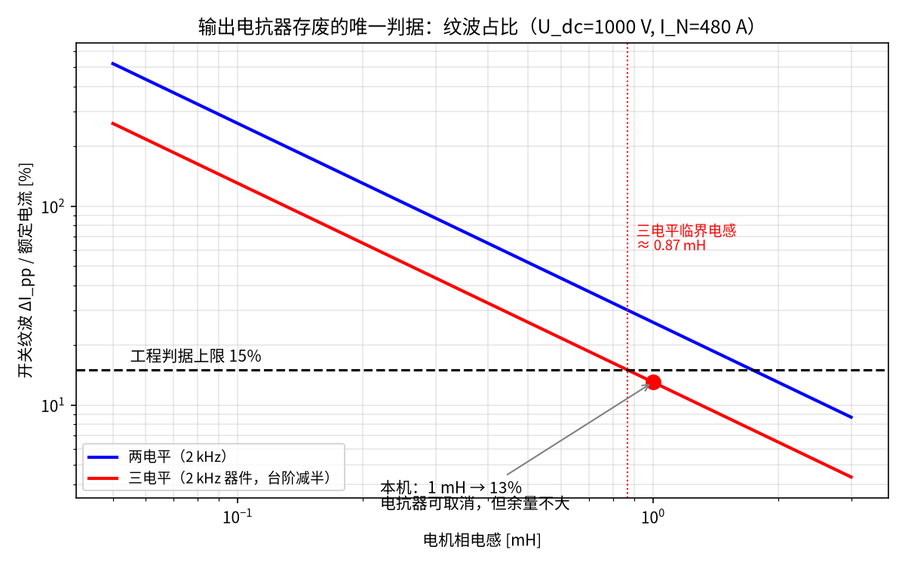
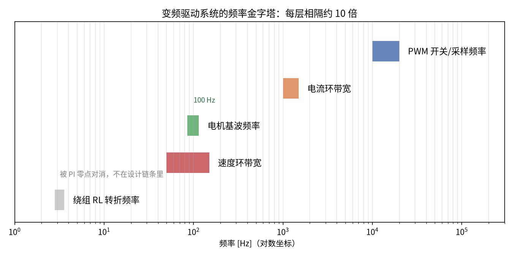

你好！我是老列👋

这篇文章源自一次真实的驱动方案评审。会上聊到一台大功率永磁电机，有个说法让全场下意识点头："这电机绕组的固有频率才几个 Hz，电流环怎么可能跑到 1 kHz？是不是得加个电抗器帮帮忙？"——听起来太合理了，合理到没人质疑。

散会后我把传递函数从头到尾算了一遍，发现这条"合理"的推理链，从第一步就是断的。今天咱们不谈玄学，就用一个一阶 RL 环节和一只 PI 控制器，把这笔账当面算清楚。⚖️

> 一台 500 kW 永磁电机，绕组的自然响应频率只有 3 Hz，却要在 100 Hz 基频下实现 1 kHz 的电流控制带宽——这中间差了两个数量级。更反直觉的是：这个"慢"不但不是障碍，反而与控制器能跑多快毫无关系。
> 

本文从一次真实的驱动方案论证出发，聊聊永磁电机（PMSM）矢量控制里几个容易想错的地方。

**关键词：** PMSM、FOC、dq 解耦、PI 电流环、零极点对消、数字延迟、电压饱和、PWM 纹波、输出电抗器、带宽设计

## 一、先算一笔账：绕组到底有多"慢"

一台 FOC 驱动的永磁电机：相电阻 20 mΩ，d、q 轴电感 1 mH，额定电频率 100 Hz（对应 1500 rpm）。

绕组是一个典型的一阶 RL 环节，它的"反应速度"由电时间常数决定：

$\tau = \frac{L}{R} = \frac{1\,\text{mH}}{20\,\text{m}\Omega} = 50\,\text{ms}$

对应的转折频率只有 R/(2πL) ≈ **3.2 Hz**。

什么概念？给绕组施加一个阶跃电压，电流要爬 50 ms 才能到稳态的 63%。而我们希望电流环带宽做到 1 kHz——响应时间零点几毫秒。**期望比自然响应快了三百多倍。**

图 1｜绕组开环自然响应与 1 kHz 闭环期望响应的阶跃对比，内嵌图为前 2 ms 放大

3.2 Hz 是不是这台电机的特例？不是。下图收集了几十台实际电机的相电阻和电感：尽管 R 跨了四个数量级、L 跨了三个数量级，数据点却沿对角线紧密排列——**RL 转折频率几乎全部落在 0.5~20 Hz 的窄带里**。原因不难理解：电阻和电感都随匝数、尺寸同向缩放，比值 R/L 的变化范围天然有限。绕组的"慢"是普遍规律，不是个案。

图 1b｜几十台实际电机的相电阻-电感分布（颜色为 RL 转折频率）：无论功率等级和结构形式，转折频率普遍仅为几 Hz 到十几 Hz

直觉告诉我们：这不可能，或者至少很勉强。

直觉错了。

## 二、第一个反直觉：电流环能跑多快，和电机几乎无关

电流环把 PI 控制器串联在绕组这个一阶环节前面。先把推导完整走一遍。

**被控对象。** dq 解耦后的绕组电压方程为 L·di/dt + R·i = u，拉氏变换得：

$G(s) = \frac{I(s)}{U(s)} = \frac{1}{Ls+R} = \frac{1/R}{\tau s + 1},\qquad \tau = \frac{L}{R}$

唯一的极点在 s = −R/L，对应的正是那个 3.2 Hz。

**串联 PI 控制器。**

$C(s) = K_p + \frac{K_i}{s} = \frac{K_p\,(s + K_i/K_p)}{s}$

它自带一个原点极点（积分器，保证稳态无静差）和一个位置可调的零点 −K_i/K_p。闭环控制框图如下：

图 2a｜串联 PI 电流环控制框图：(a) 对消前的通用闭环结构；(b) 零极点对消后，开环退化为纯积分器 ω_c/s，闭环等效为一阶惯性环节

**对消前（零点任意放）**，开环与闭环传函为：

$G_{ol}(s) = C(s)\,G(s) = \frac{K_p\,(s + K_i/K_p)}{L\,s\,(s + R/L)}$

$G_{cl}(s) = \frac{G_{ol}}{1+G_{ol}} = \frac{K_p\,s + K_i}{L\,s^2 + (R + K_p)\,s + K_i}$

闭环是**二阶系统**，还带一个闭环零点 −K_i/K_p：两个极点的频率与阻尼被 K_p、K_i 联合牵制，零点放低了阶跃响应拖出慢尾巴，放高了超调冒头——带宽、阻尼、超调三者互相打架，整定只能折中。

**对消：令 PI 零点对准对象极点**，即取 K_i/K_p = R/L，分子分母的 (s + R/L) 相消：

$G_{ol}(s) = \frac{K_p}{L\,s} = \frac{\omega_c}{s},\qquad \omega_c \triangleq \frac{K_p}{L}$

$G_{cl}(s) = \frac{\omega_c/s}{1+\omega_c/s} = \frac{\omega_c}{s + \omega_c}$

开环退化为**纯积分器**：幅频全程 −20 dB/dec，相位恒为 −90°，相位裕度高达 90°，穿越频率就是 ω_c。闭环退化为**一阶惯性环节**：阶跃响应 1 − e^(−ω_c·t)，零超调，直流增益恰为 1（无静差），−3 dB 带宽严格等于 ω_c。由对消条件与 ω_c = K_p/L 反解，得整定公式：

$K_p = L\cdot\omega_c,\qquad K_i = R\cdot\omega_c$

原来那个 3.2 Hz 的"慢极点"**在数学上消失了**——带宽 ω_c 想设多少设多少，只由 K_p 和 L 的比值决定。

图 2｜零极点对消前（蓝）与对消后（红）的开环/闭环 Bode 对比：对消后开环是纯积分器，闭环 -3 dB 带宽正好落在 1 kHz

物理上这不是魔法：想让电流比自然时间常数更快地变化，控制器就瞬间怼上更大的电压（L·di/dt 要多少给多少）。**本质是用逆变器的电压裕量购买响应速度。**

那带宽的真正上限在哪？在两个和电机无关的地方：

**约束一：数字延迟。** 采样 + PWM 零阶保持约 1.5 个采样周期。要保住 45°~60° 相位裕度，可达带宽如下表：

| 开关/采样方案 | 环路延迟 1.5Tₛ | 可达带宽（PM=60°） | 可达带宽（PM=45°） |
| --- | --- | --- | --- |
| 10 kHz 单次更新 | 150 µs | ≈ 560 Hz | ≈ 830 Hz |
| 10 kHz 双更新（20 kHz 采样） | 75 µs | ≈ 1.1 kHz | ≈ 1.7 kHz |
| 20 kHz 单次更新 | 75 µs | ≈ 1.1 kHz | ≈ 1.7 kHz |

工程经验公式由此而来：**电流环带宽 ≈ 开关频率的 1/10 ~ 1/20**。

**约束二：电压裕量。** 低速时母线电压富余，电流环飞快；接近额定转速时反电势吃掉大部分母线电压，大幅值电流阶跃会进入电压饱和——这时变慢不是 PI 的错，是物理极限。

图 3｜数字延迟约束下的可达带宽：蓝带为单次更新、红带为双更新，绿色虚线为 5×/10×基波的带宽需求——反推出 IGBT 开关频率需 ≥ 10~20 kHz

所以电流环的设计链条是反过来的：先定基波频率（100 Hz），要求带宽 ≥ 5~10 倍基波（0.5~1 kHz），再反推 IGBT 开关频率 ≥ 10~20 kHz。**电机参数 R、L 只决定 PI 系数怎么填，不决定能跑多快。**

还有一个容易忽略的细节：100 Hz 基波下交叉耦合项 ωₑL ≈ 0.63 Ω，是相电阻的 **31 倍**——dq 解耦前馈必须做，否则高速段电流环严重耦合。这同样是控制器的事，不是电机的错。

## 三、第二个反直觉：输出电抗器的存废，和电流环频率无关

一个常见的推理：轴向磁通电机电感小 → 绕组固有频率高 → 和 IGBT 开关频率不匹配 → 需要加输出电抗器"补电感"。

这个推理链从第二步就断了。

上一节已经说明：控制带宽由 PI 整定和数字延迟决定，电感大小的差异被零极点对消完全吸收——**L 变了，PI 零点跟着挪就是，控制层面永远不需要电抗器**。

那输出电抗器到底管什么？管**开关纹波**。每个 PWM 周期内，电流在电感上锯齿波动：

$\Delta I_{pp} \approx \frac{U_{dc}}{k\cdot L\cdot f_{sw}}$

电感太小、开关频率又上不去时，纹波电流过大——电机附加发热、转矩脉动、EMI、过流误跳。这才是低电感电机可能需要电抗器的原因。

算一下这台电机：L = 1 mH，母线 1000 V，三电平（器件 2 kHz，电压台阶减半），纹波峰峰值约 63 A，占额定电流（约 480 A）的 13%——仍在 5%~15% 的工程可接受范围内。**结论：电抗器可以取消**，但余量已经不大。

图 4｜纹波占比随电机电感的变化：本机 1 mH 处纹波约 13%，低于 15% 判据线；三电平临界电感约 0.87 mH，电感再降就需重新评估电抗器

判据只有一条：ΔI_pp 是否超过额定电流的 ~15%。和"频率匹配"没有半点关系。本机 1 mH 离三电平的临界电感 0.87 mH 已经不远——若将来换成更低电感的无轭/无铁芯轴向磁通设计，就要重新算这笔账。

（顺带一提：长电缆场景下的输出电抗器是另一个故事——那是为了压 dv/dt、防传输线反射过电压，判据是电缆长度超过 v·t_r/2 ≈ 7~30 m，同样与控制带宽无关。）

## 四、把所有频率串起来

最后把全文的频率收束在一张图和一张表里。变频驱动系统是一个严格分层的频率金字塔，每层之间隔约 10 倍：

图 5｜频率金字塔：从 PWM 到速度环逐层递减，而绕组 RL 转折频率（灰色）被对消，不在设计链条里

| 层级 | 典型值（本文案例） | 由谁决定 |
| --- | --- | --- |
| PWM 开关/采样频率 | 10~20 kHz | 器件损耗与散热 |
| 电流环带宽 | 1~1.5 kHz（≈ f_sw/10） | 数字延迟 + 电压裕量 |
| 电机基波频率 | 100 Hz（≤ 带宽的 1/5~1/10） | 电机设计 |
| 速度环带宽 | 50~150 Hz | 机械惯量 + 编码器 |
| 绕组 RL 转折频率 | 3.2 Hz | 电机本体——**被对消，不在链条里** |

注意最后一行：那个最容易被当成"瓶颈"的绕组转折频率，在闭环设计里根本不占频率金字塔的一层——它被 PI 的零点安静地抵消掉了。

## 写在最后

两句话带走：

1. **电流环的快慢是控制器和逆变器的事，不是电机的事**——带宽由数字延迟和电压裕量决定，RL 极点被零极点对消抹平。
2. **输出电抗器的存废只看纹波判据** ΔI_pp = U_dc/(k·L·f_sw)，与"频率匹配"无关；长电缆场景另算，那是 dv/dt 的账。

工程直觉很宝贵，但控制回路里的因果链经常和直觉相反。算一遍传递函数，往往比想十遍更快。

---

*本文由一次真实的 500 kW 轴向磁通电机驱动方案论证整理而来，参数已做示意性处理；插图由 matplotlib 根据正文参数计算生成。*

如果你觉得有收获，请点个“在看”，转发给你的工头朋友吧！🚀✨

  <strong>如果觉得这篇文章对你有帮助，</strong>
   
  <strong>别忘了点赞、在看、分享三连哦！</strong>
   
   
  👇👇👇

---

> 推荐朋友关注公众号“探物及理”，谢谢各位。
>
> 