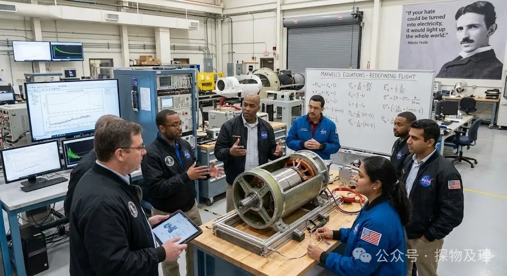
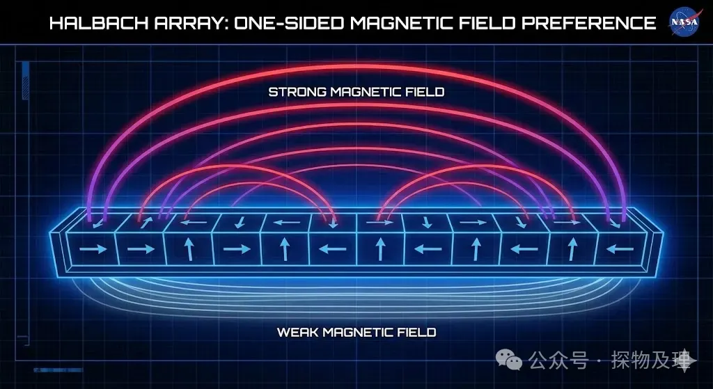
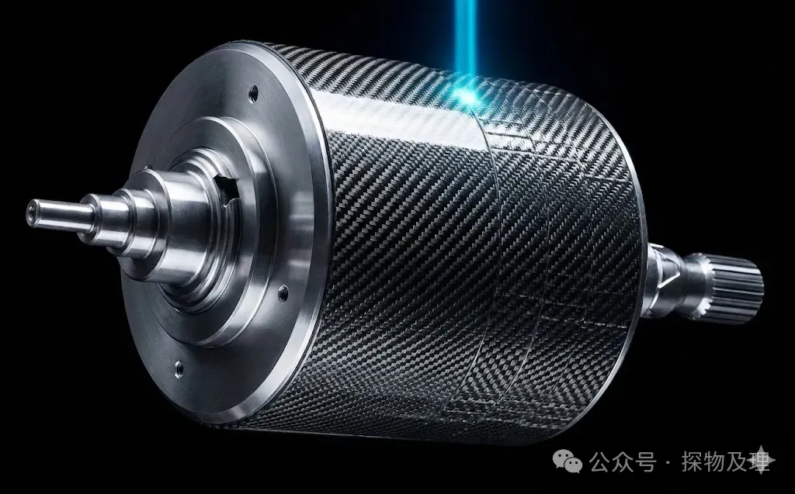
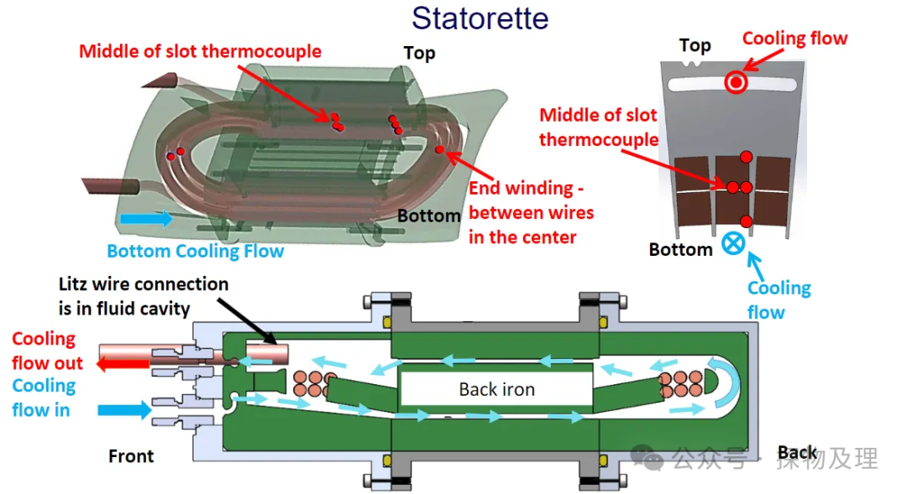
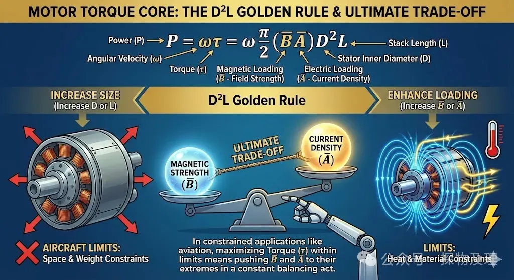
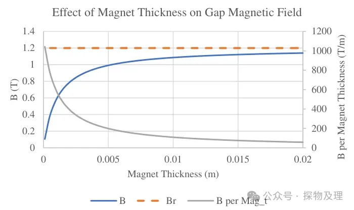
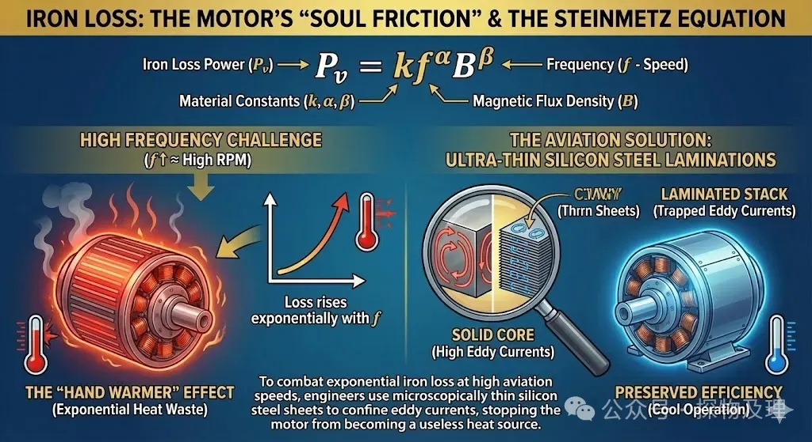
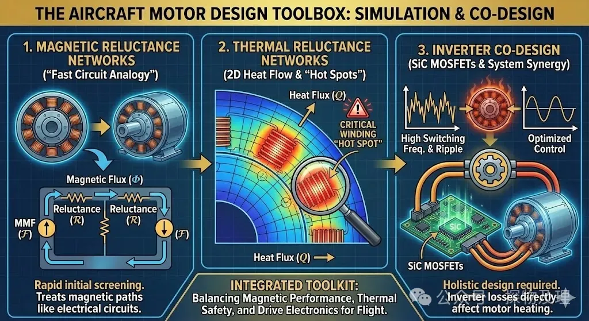

关键词： #电机设计 #NASA #永磁同步电机

------

你好！我是老列，一个在机电领域摸爬滚打了15年的“老工头”。今天不聊那些空洞的行业黑话，咱们把目光投向云端。⚡

最近我翻看了 NASA 的一份硬核技术报告——《飞机永磁同步电机的解析设计与性能评估方法》。不禁感叹：咱们平时搞地面工业电机的，觉得功率密度做到极致了，但在“天上的要求”面前，真的只是弟弟。⚙️

今天，我就以一名工头的身份，带大家拆解一下“飞行的马达”背后的硬核机电逻辑。🤖

------

## PART 01-序幕：灵魂拷问

大家伙儿想过没，咱们在煤矿里用的那些大家伙，或者新能源车里的驱动电机，能直接搬到飞机上吗？🏗️

很多人会说“功率不够”，但这只说对了一半。在航空领域，每一克重量都是要“收税”的。如果你把普通的工业电机搬上天，它那厚重的铸铁外壳和沉重的铁芯会瞬间拖垮飞机的航程。航空电机的核心命题只有一个：**如何在极轻的重量下，压榨出恐怖的功率？**✈️

这不仅是电磁学的问题，更是热力学、结构力学、甚至流体力学在几万转转速下的“极限共舞”。⚡

### 【致敬先驱】

在深入技术之前，我想引用尼古拉·特斯拉（Nikola Tesla）的一句话：

“如果你的仇恨可以转化为电能，它将点亮整个世界。”

在航空电机的研发中，我们不需要仇恨，我们需要的是对**损耗**的极度克制。NASA 格伦研究中心的这群疯子，正在用麦克斯韦方程组重新定义“飞行的动力”。⚙️

## PART 02-实战演绎——解析 NASA 的“飞行心脏”🏆

这份报告展示了一种为城市空中交通（UAM）设计的永磁同步电机（PMSM）。咱们来看看，为了上天，这台电机都经历了哪些“魔改”：🤖

### **1. 磁场的“单向偏爱”：Halbach 阵列**

普通电机的磁铁是南北极交替排列的，磁力线向四周发散。但 NASA 重点探讨了 **Halbach 阵列**。这种阵列通过特殊的磁块排列，让磁场在一侧极强，在另一侧几乎为零。⚡

**这有什么好处？**它能省掉转子内部厚重的背铁！磁场自己就能闭合，不需要铁磁材料导磁，转子重量直接砍掉一大截。⚙️

### **2. “碳纤维外壳”的紧箍咒**

当电机转速达到每分钟几万转时，转子磁钢在巨大的离心力作用下恨不得飞出去。NASA 没用笨重的钢套，而是采用了**碳纤维加强环**（Carbon Fiber Retaining Hoop）。这种材料比强度高得离谱，能紧紧锁住磁钢。最绝的是，由于碳纤维是非磁性材料，它的厚度必须被精确计算进电磁气隙里，这在电磁设计上是极大的挑战。🏗️

### **3. 冰与火的平衡：水冷夹套**

航空电机功率密度极大，单位体积的发热量高得惊人。为了不让绕组烧毁，NASA 设计了一个带翅片的水冷夹套。总工在设计时必须像算命一样，预估出冷却液流过每一个微小弯道时的压力损失和换热系数。⚡

## PART 03-【硬核实验室】：电机设计的底层逻辑📚

作为一名老工头，我得教你们看本质。电机设计的本质是一个**多物理场耦合**（Multiphysics）的拼图。⚙️

### **核心公式：D2L黄金法则**

电机产生的扭矩 T 遵循一个经典公式：

$$P = \omega T = \omega \frac{\pi}{2}\left( \bar{BA}\right)D^2L$$

- D是定子内径，L 是叠片长度。
- $\bar B$是磁负荷（磁感应强度）
- $\bar A$ 是电负荷（电流密度）。

想提高扭矩？要么把电机做大（增加D 或 L），要么增强磁场或电流。但在飞机上，你不能无限做大。于是，**磁感应强度和电流密度的极限博弈**就开始了。🤖

### 【磁铁的“边际效应”】

很多人觉得磁铁越厚磁场就越强。但 NASA 的研究显示：磁铁是有“利用率极限”的。

当磁铁厚度增加时，磁路本身的磁阻也会增加，因为永磁材料的磁导率和空气差不多。就像你往海绵里塞水，塞到一定程度，再塞就没效率了。这种“质量效率”的衰减，是航空电机减重时最头疼的问题。⚡

上图展示了永磁体厚度增加时，气隙磁感应强度的变化趋势。可以看到，当磁铁厚度超过某个临界值后，磁感应强度增长变得极其缓慢，这就是我们常说的"边际效应递减"。在航空电机设计中,必须精确找到这个"甜点"——既要保证足够的磁感应强度,又不能让无效的磁铁重量拖累整体功率密度。⚡

这清晰地说明了为什么 NASA 在设计时会反复权衡磁铁用量。每增加 2mm 磁铁厚度,虽然磁密在增加,但单位质量带来的性能提升却在快速下降。到了 10mm 时,质量效率已经跌到 42%,意味着新增的磁铁有超过一半的重量是"白搭"的。这就是航空电机设计师必须面对的残酷现实。🏗️

### 【铁损：电机的“灵魂摩擦”】

定子铁芯在交变磁场下会产生迟滞损耗和涡流损耗。NASA 用经典的 Steinmetz 方程来估算这些损耗：

$$P_v = kf^\alpha B^\beta$$

频率 $f$越高（转速越快），铁损呈指数级增长。为什么航空电机要用极薄的硅钢片？就是为了保住那最后一点效率，不让电机变成一个“暖手宝”。⚙️

## PART 04-【神兵利器】：老总工的设计工具箱🛠️

搞设计不能光靠脑补，得有家伙什🤖

1. 磁路分析（Magnetic Reluctance Networks）：

   这是“快餐版”的有限元分析。把电机想象成电路，磁通是电流，磁阻是电阻。虽然精度不如三维仿真（FEA），但在方案初筛阶段，它比电脑算几个小时要快得多。⚡

2. 热网络模型（Thermal Reluctance Networks）：

   NASA 推荐用 2D 热网络来模拟绕组、铁芯和散热片之间的热流。你要是算不准绕组的“热点”（Hot Spot），这电机上天就是个大烟花。🏗️

3. 逆变器协同设计：

   现在的电机不是单独工作的，它离不开逆变器。NASA 的方案详细讨论了 **SiC（碳化硅）MOSFET**的损耗。逆变器的开关频率和电流纹波会直接导致电机的额外发热。记住，电机和驱动器必须“合体”设计，否则就是互相伤害。⚙️

## PART 05-【工业之魂】：智造浪潮下的战略意义📈

兄弟们，别觉得这些 NASA 的东西离我们很远。当前咱们国家大力推行“低空经济”，从送外卖的无人机到未来的飞行汽车（eVTOL），其核心驱动力就是这种**高功率密度永磁同步电机**。🏗️

这不仅是技术的突破，更是生产力的重构。传统的工业制造追求稳定、廉价；而航空级的机电一体化技术追求的是**极致的材料利用率**和**极致的多场耦合精度**。这种技术正在放到民用领域，比如机器人关节、新能源车的轮毂电机，妥妥的趋势。🤖

## PART 06-【老总工碎碎念】：给年轻工程师的建议📋

看过太多年轻小伙子，刚学会点 SolidWorks 和 ANSYS 就觉得自己能拯救世界。听老工头一句劝：⚡

- 物理直觉比软件更重要。

  你得能脑补出电流在绕组里跳动、热量在铁芯里传导的动态感。公式只是这些现象的文字描述。

- 设计永远是妥协的艺术。

  没有完美的电机，只有最适合应用场景的电机。减重、增效、可靠性，这三个球你得玩平衡了。⚙️

- 关注失效。

  别光盯着性能参数，去研究一下轴承的 DN 值极限、绝缘材料的热机械应力。在航空领域，可靠性是 1，其他性能都是后面的 0。🤖

### 【评论区茶话会】

老总工今天抛个砖⚡

在受限空间的低速大扭矩驱动场景，到底是**直接驱动负载**好，还是**加个减速箱**好？

欢迎在评论区分享你的看法！⚙️🏗️🤖

------

**下一阶段，你想让我为你深入拆解具体的 FOC 矢量控制算法，还是看看逆变器散热片的拓扑优化方案？**

最后，想深入研究论文中的 66 个详细公式，了解NASA电机散热试验的相关细节？ 欢迎在后台回复 “NASA电机” 领取完整版 40 页 PDF 报告。

如果你觉得有收获，请点个“在看”，转发给你的工头朋友吧！🚀✨

  <strong>如果觉得这篇文章对你有帮助，</strong>
   
  <strong>别忘了点赞、在看、分享三连哦！</strong>
   
   
  👇👇👇

---

> 推荐朋友关注公众号“探物及理”，谢谢各位。
>
> 
