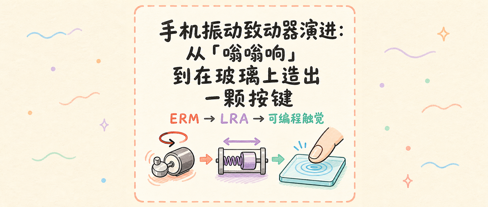

你好，我是老列👋

你有没有发现，十几年前的手机振动像桌上滚过一只蜜蜂：一开就是「嗡——」，一停还要拖半拍。现在的手机却能给你一个干脆的「哒」，甚至让一整块不能移动的玻璃摸起来像真的按键。

它们都叫「振动」，手感为什么差这么多？

**答案不只是马达变高级了，而是手机里的振动装置从「会转的偏心块」，进化成了「可控的质量—弹簧系统」，最后又与传感、驱动和操作系统合成了一件虚拟触觉乐器** 。

今天咱们拆开这条演进路线：ERM、LRA、横向线性马达，再到正在走来的宽频与压电触觉。看完你会知道，所谓「高级振感」到底高级在哪。

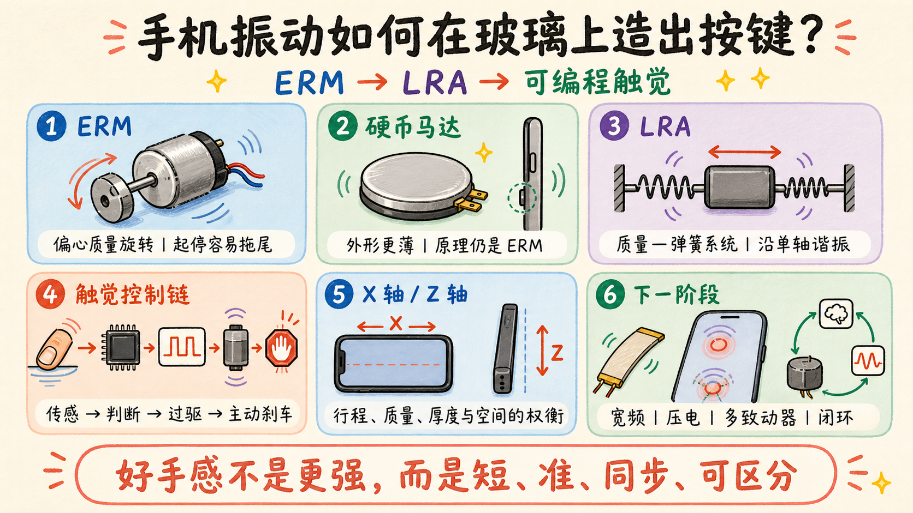

## 🐝 第一代：给小电机装一块偏心铁

早期手机最常见的是 ERM，中文叫**偏心旋转质量做动器** 。结构简单得不能再简单：

- 一只微型直流电机；
- 电机轴上装一块不对称的偏心块；
- 电机一转，离心力方向跟着转，机身就被周期性摇晃。

振动力大致满足：

$$
F \approx m r \omega^2
$$

其中，m 是偏心块质量，r 是偏心距，ω 是转速。转得越快，振动越强。

这套方案便宜、耐用、控制简单：通直流电就转，调电压或 PWM 占空比就能改变强弱。因此从功能机到早期智能手机，它长期占据主流。

但它有个天然缺陷： **电机必须先加速，再减速** 。转子和偏心块都有惯量，命令已经结束，它还会继续转一会儿。于是振动的起停边沿比较软，很难做出短促、清晰、彼此不同的触感。

你想让它打一记「哒」，它却回答你一声「嗡」。

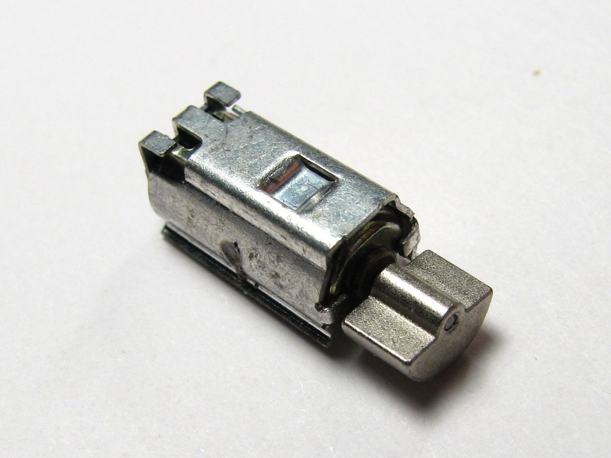

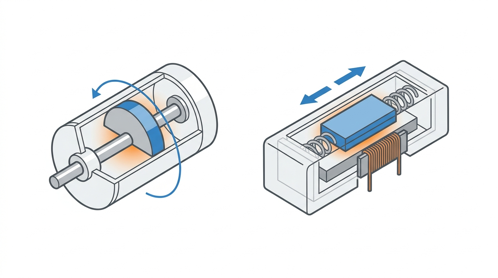

## 🪙 扁平化：从圆柱电机到硬币马达

智能手机越来越薄，传统圆柱振动马达显得太高。工程师把转子、线圈和偏心质量压进扁平外壳，做成「硬币马达」。

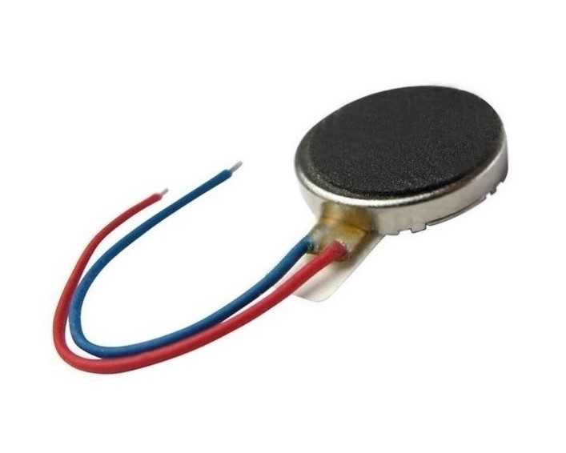

[Vybronics VC1018B001L 硬币式振动马达](https://www.vybronics.com/coin-vibration-motors/with-brushes/v-c1018b001l)

它解决了空间问题，却没有改变物理本质：仍然是偏心质量旋转，仍然需要起转和刹车。

这提醒我们： **外形改变不等于原理升级** 。无论圆柱还是硬币，只要靠偏心块转动，响应速度和触感分辨率就会受到转动惯量约束。

## 🧲 第二代：不再转圈，改成直线往复

真正改变手感的是 LRA——**线性谐振做动器** 。

它内部没有持续旋转的偏心块，而是一块由弹簧悬挂的质量块。线圈与永磁体产生交变电磁力，推动质量块沿一个方向来回运动。质量块撞出的不是实物按键，而是作用在机身上的惯性反力。

从电机视角看，它很像一台只允许动子走几毫米的短行程直线电机；从机械视角看，它又是一个典型的「质量—弹簧—阻尼」系统。

$$
m\ddot{x}+c\dot{x}+kx=F(t)
$$

m 是运动质量，c 是阻尼，k 是弹簧刚度，F(t) 是电磁驱动力。

当驱动频率接近它的机械谐振频率时，小小的电磁力也能换来明显振动。与 ERM 相比，LRA 有三项关键优势：

1. **起停更快** ：质量块不需要连续加速到某个转速；
2. **方向明确** ：振动力集中在一条轴线上，不再向四周平均摇；
3. **波形可控** ：配合过驱和主动刹车，可以做出短、脆、层次不同的触感。

代价也很清楚：LRA 对频率敏感，温度、装配和老化都会让谐振点变化，因此通常需要专用驱动芯片做自动谐振跟踪和闭环控制。[TI 对 LRA 的说明](https://www.ti.com/document-viewer/lit/html/SSZTAP9)也强调了它与 ERM 在运动方式上的根本区别。

## 🍎 Taptic Engine：为什么一块玻璃能骗过手指

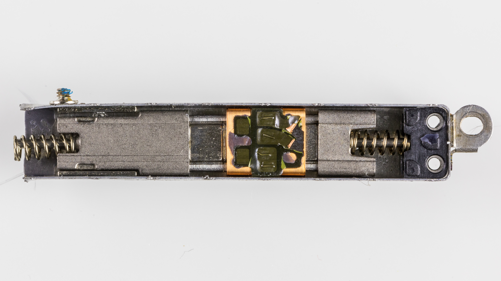

2015 年的 iPhone 6s 把 Taptic Engine 带进 iPhone 产品线。此后，线性触觉不再只是「来电提醒」，而开始参与界面交互。

最典型的例子是 iPhone 7 的 Home 键：表面看是一颗按键，实际上它并没有像传统机械键那样明显下沉。系统在检测到按压后，让 Taptic Engine 在恰当时刻输出一个短促脉冲，大脑便把「手指施力」「机身回弹」「界面响应」拼成了一次真实点击。

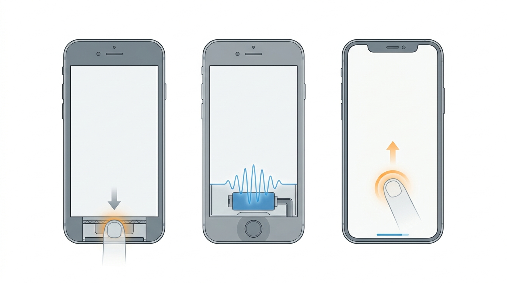

这里最值钱的不是某一块磁铁，而是**时间同步** ：

```
触摸/压力检测 → 系统判断 → 波形生成 → 驱动器过驱 → 质量块运动 → 主动刹车
```

只要触觉比画面慢几十毫秒，或停止后还拖着尾巴，幻觉就会破功。

所以高质量触觉是一个系统工程：做动器决定上限，驱动电路决定波形，传感器决定触发时刻，结构件决定振动如何传遍机身，操作系统则决定什么场景该给哪一种「手感」。

Apple 后来开放 Core Haptics，让开发者能像编辑声音一样组合瞬态触觉、连续触觉、强度和锐度。触觉反馈由「硬件功能」变成了一种可编程的界面语言。[Apple Core Haptics 介绍](https://developer.apple.com/videos/play/wwdc2019/223)

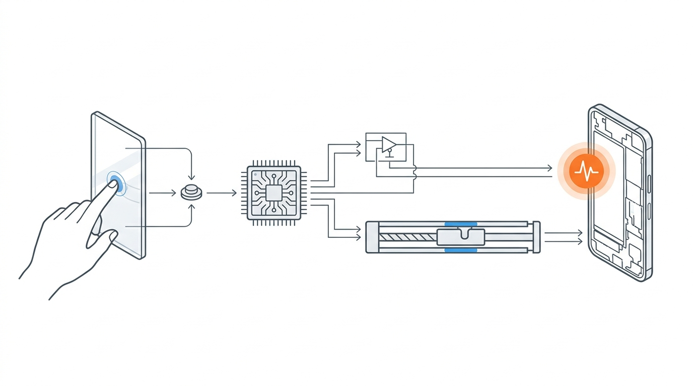

## ↔️ Z 轴、X 轴，为什么极客总要争谁更好

手机参数里常见「Z 轴线性马达」和「X 轴线性马达」。这里的轴，指质量块主要运动方向。

| 类型 | 典型特点 | 常见取舍 |
| --- | --- | --- |
| Z 轴 LRA | 厚度方向运动，结构紧凑、占平面面积小 | 行程和运动质量受机身厚度限制 |
| X 轴 LRA | 沿机身横向运动，可容纳更长行程和更大质量 | 占用主板、电池或扬声器的宝贵面积 |

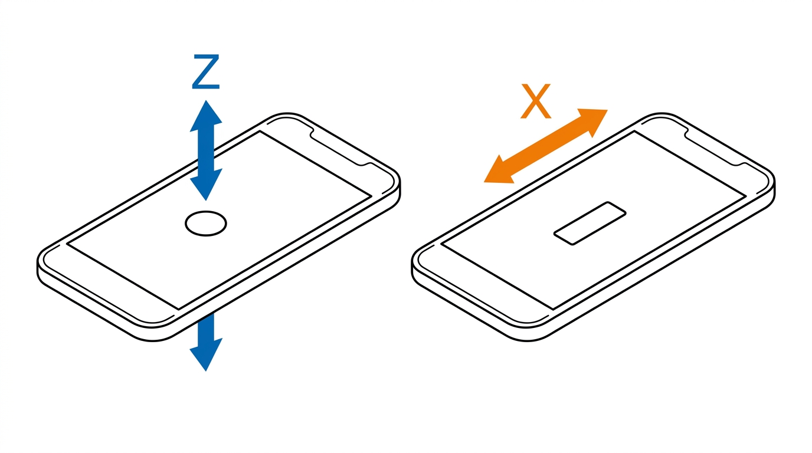

在其他条件相近时，更大的运动质量和行程意味着更强的惯性冲量，也更容易做出干脆、有层次的点击感。但不能只看「X 轴」三个字下结论：弹簧、磁路、驱动电压、制动算法、安装位置和整机结构都会改变最终手感。

**一颗好马达装进松散的中框，照样可能振成铁皮柜；普通马达配上精心调校，也能超过纸面参数更豪华的方案** 。

## 🎼 从「振动强弱」到「触觉频谱」

ERM 时代，手机能调的主要是振动持续多久、转得多快。LRA 时代，系统开始控制脉冲的强度、锐度、节奏和包络。

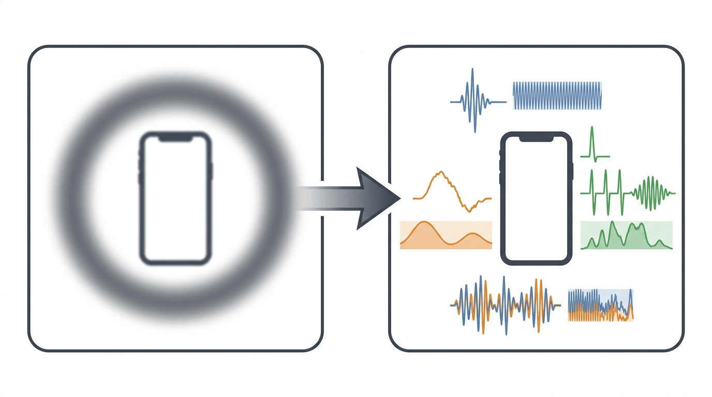

但传统 LRA 仍有窄带问题：离开谐振频率后，输出能力快速下降。下一阶段的方向，是让触觉覆盖更宽频带、更多方向和更局部的区域：

- **宽带电磁做动器** ：在更大频率范围内输出不同质感；
- **压电做动器** ：响应极快、可做高频细腻触觉，但驱动电压和结构集成更难；
- **多做动器协同** ：让不同位置产生局部触觉，而非整机一起振；
- **闭环触觉** ：实时感知做动器反电动势或机身加速度，补偿个体差异、温度和握持状态。

届时，手机表达的不再只是「有没有振动」，而可能是按钮的软硬、旋钮的刻度、表面的粗糙感，甚至物体碰撞的质感。

### 🎛️ 强弱和频率，如何变成用户能设置的「触感」

从信号角度看，一次振动可以粗略写成带包络的周期信号：

$$
x(t)=A(t)\sin\left(2\pi f t+\varphi\right)
$$

其中， $A(t)$ 决定振动在每个时刻有多强， $f$ 决定主要振动频率， $\varphi$ 表示相位。真正的触觉波形往往包含多个频率成分，还要叠加启动、保持和制动包络。

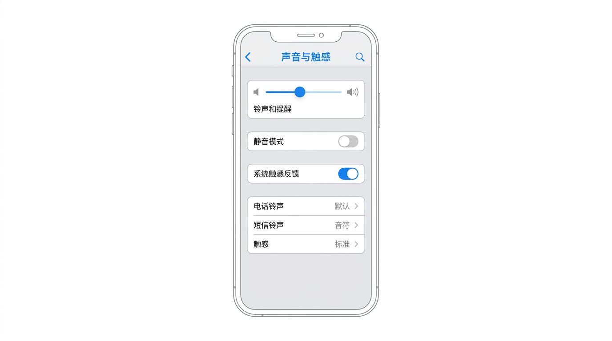

用户看到的是「铃声」「短信铃声」和「系统触感」，系统内部处理的却是不同的时间序列和频率能量。消息需要一记短促确认，来电需要持续重复，短信适合双击节奏，警报则强调密集、急迫和难以忽略。

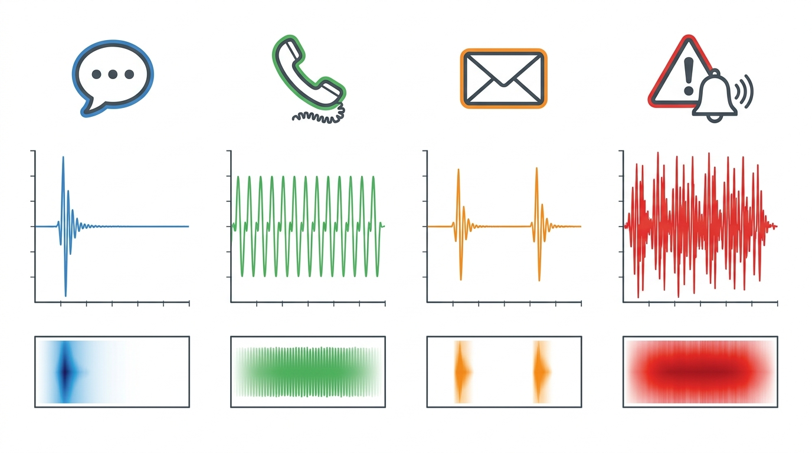

这也是为什么「振动模式」可以承载信息：即使手机静音、屏幕朝下，手指和口袋仍能从节奏与质感中分辨事件的重要程度。

### 🧩 为什么手机厂家要把振动做成可定制

先回答一个直观问题： **确实有人会被突然的强振动惊一下，但「防止把人吓到」只是可定制触觉的原因之一，而且未必是最主要的原因** 。

手机贴着人体、放在口袋里或搁在桌面上时，同一条驱动波形会变成完全不同的体验。安静会议室里，桌面会把振动放大成「电钻声」；睡前握在手里，一记突发强振可能造成明显惊跳；走路或乘车时，同样的振动又可能弱到感觉不到。因此厂家无法用一个固定强度覆盖所有用户和场景。

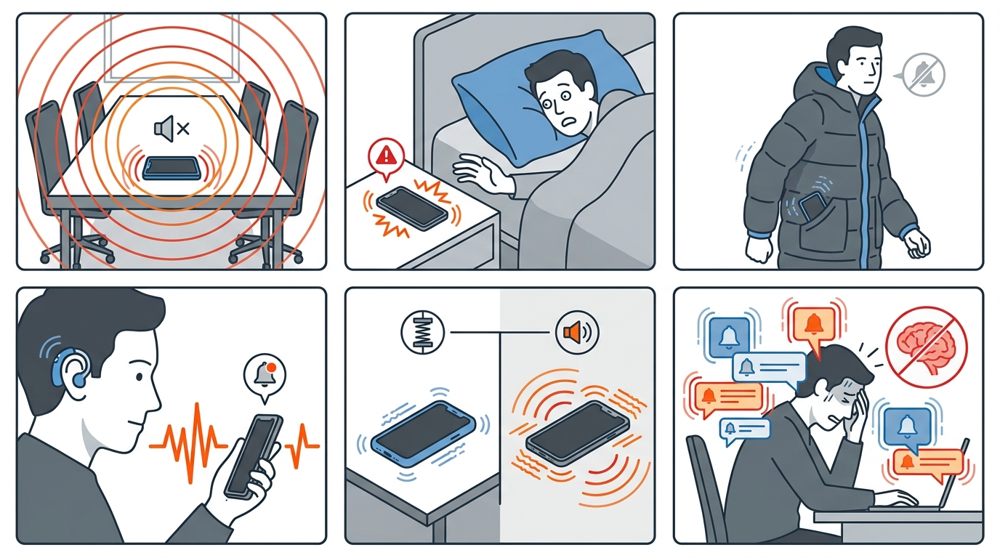

可定制触觉至少在解决八类问题：

1. **避免惊跳与打扰** 。突发、强烈且边沿陡峭的刺激，更容易在安静、专注或临睡场景中造成惊扰。用户需要降低强度、关闭系统触感，或只保留重要事件。
2. **适配个体感觉差异** 。年龄、皮肤敏感度、握持方式、使用习惯和注意状态都不同；有人嫌「震得手麻」，也有人把默认振动放在厚外套口袋里完全感觉不到。
3. **适配手机壳与放置边界** 。软硅胶壳会吸收部分高频振动，硬壳和空腔可能放大噪声；手机握在手里、放在木桌、玻璃台面或床垫上，等效质量、刚度和阻尼都会变化。
4. **让不同事件可以被盲辨** 。来电、短信、普通消息、支付确认和紧急警报的重要性不同。若所有事件都只是同样的一声「嗡」，用户必须掏出手机确认；不同节奏相当于给触觉建立了一套编码。
5. **兼顾无障碍需求** 。听障用户可能把振动作为主要提醒通道，视障用户则依赖触觉确认点击、滚动边界和操作结果。允许选择模式、按联系人设置触觉，能让提醒更可靠。Apple 也允许用户为铃声和提醒选择或创建振动模式，并决定静音状态下是否播放触感。[Apple：更改 iPhone 的声音与振动](https://support.apple.com/guide/iphone/change-sounds-and-vibrations-iph07c867f28/ios)
6. **降低通知焦虑和感觉疲劳** 。高频通知会让人长期保持「是不是又来消息了」的警觉。研究中还存在所谓「幻振」现象：手机没有振动，人却误以为口袋里振了一下。其成因仍在研究，但重复通知、频繁查看和感知警觉被认为可能有关。[关于幻振与手机使用的研究](https://pmc.ncbi.nlm.nih.gov/articles/PMC6149296/)
7. **平衡电耗、发热与机械噪声** 。更强、更长的振动需要更多驱动能量，也会增加致动器发热和结构噪声。短促而明确的波形往往既省电，又比长时间蛮力振动传递更多信息。
8. **给应用开发者一套触觉语言** 。系统需要区分「操作成功」「操作失败」「警告」「选择变化」等语义。可编程和可关闭同样重要：开发者负责表达，用户保留最终控制权。

从工程角度看，厂家真正要解决的不是「把振动调到一个人人满意的强度」，而是把控制权分成三层：

| 层级 | 控制什么 | 解决的问题 |
| --- | --- | --- |
| 硬件与底层驱动 | 谐振跟踪、过驱、制动和一致性校准 | 让不同批次、温度和老化状态下的振感尽量一致 |
| 操作系统与应用 | 不同事件的波形、节奏、锐度和优先级 | 建立可识别的触觉语义，避免每个应用乱震 |
| 用户设置 | 开关、模式、联系人和场景偏好 | 适配个人敏感度、环境与无障碍需求 |

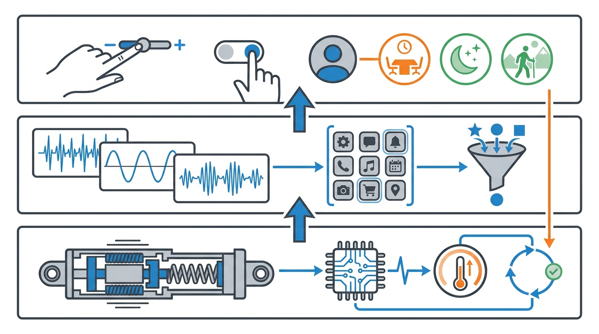

所以， **可定制不是为了让用户把振动调得更花哨，而是承认触觉不存在一个适合所有人的「标准答案」** 。最好的触觉系统既能在关键时刻叫醒你，也知道什么时候应该轻一点，甚至完全保持沉默。

## 🤯 反直觉时间：振动越强，手感不一定越好

人手对触觉的判断，不只看峰值加速度，还看起停速度、频率成分、方向、持续时间，以及它是否与视觉和声音同步。

一个幅值很大的长振动，常常只让人觉得「吵」；一个能在几毫秒内起振并迅速刹住的短脉冲，反而更像真实按键。

所以手机触觉升级的主线不是：

```
更强 → 更高级
```

而是：

```
可控性更高 → 信息维度更多 → 更像真实触摸
```

## 📜 老列的五条触觉铁律

| # | 铁律 | 一句话解释 |
| --- | --- | --- |
| 1 | ERM 靠偏心块旋转 | 便宜可靠，但受转动惯量限制，起停容易拖尾 |
| 2 | LRA 靠质量块谐振 | 响应快、方向明确，但需要匹配谐振频率 |
| 3 | 线性马达不只看轴向 | 运动质量、行程、驱动与结构共同决定手感 |
| 4 | 触觉是一条控制链 | 传感、算法、驱动、做动器和机身缺一不可 |
| 5 | 好手感不是更强 | 短、准、同步和可区分，比单纯振幅更重要 |

## 🧪 一个人人都能做的小实验

找两部不同年代或不同价位的手机，分别测试：

1. 键盘单击反馈；
2. 长按图标；
3. 调节系统滚轮或时间选择器；
4. 来电长振动。

把手机平放在硬桌面，再握在手里各试一次。你会发现，安装结构和边界条件一变，触感与声音都会变化——这就是同一只做动器在不同机械负载下的响应差异。

注意：不要拆机通电测试松动的锂电池设备，也不要给未知马达直接接高电压。

## 💬 老列碎碎念

从偏心块到线性做动器，手机振动装置走的是一条很典型的机电系统进化路线：先解决「能不能动」，再解决「能不能快」，最后解决「能不能精确表达」。

真正让玻璃长出按键的，不是魔法，而是电磁力、机械谐振、主动制动和人类感知在毫秒尺度上的一次合谋。

你更喜欢干脆的「哒」，还是更有弹性的「咚」？评论区说说你的手机型号和手感。公众号后台回复 **「触觉」** ，领取《手机振动做动器演进图谱》。

<p align="center">
  <strong>觉得有收获，老规矩，</strong><br>
  <strong>点赞、在看、转发三连。</strong><br><br>
  👇👇👇
</p>

## 参考资料

- [TI：How Does a Linear Resonant Actuator Work?](https://www.ti.com/document-viewer/lit/html/SSZTAP9)
- [Apple：Expanding the Sensory Experience with Core Haptics](https://developer.apple.com/videos/play/wwdc2019/223)
- [Precision Microdrives：Vibration Motors—ERMs and LRAs](https://www.precisionmicrodrives.com/vibration-motors-erms-and-lras)

---

> 推荐关注公众号「探物及理」，探万物之然，及万理之源。
>
> 
