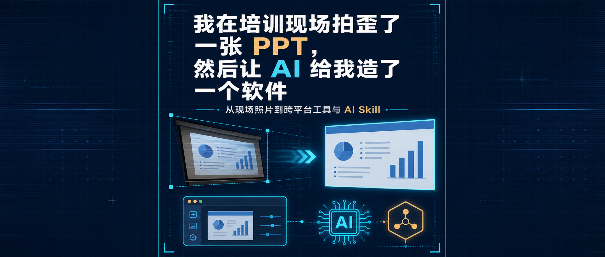
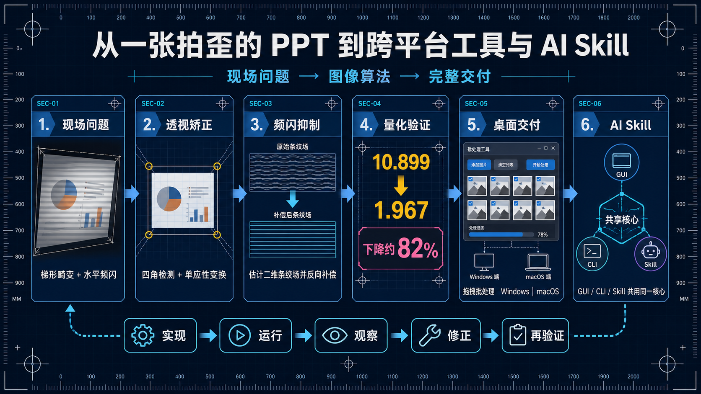
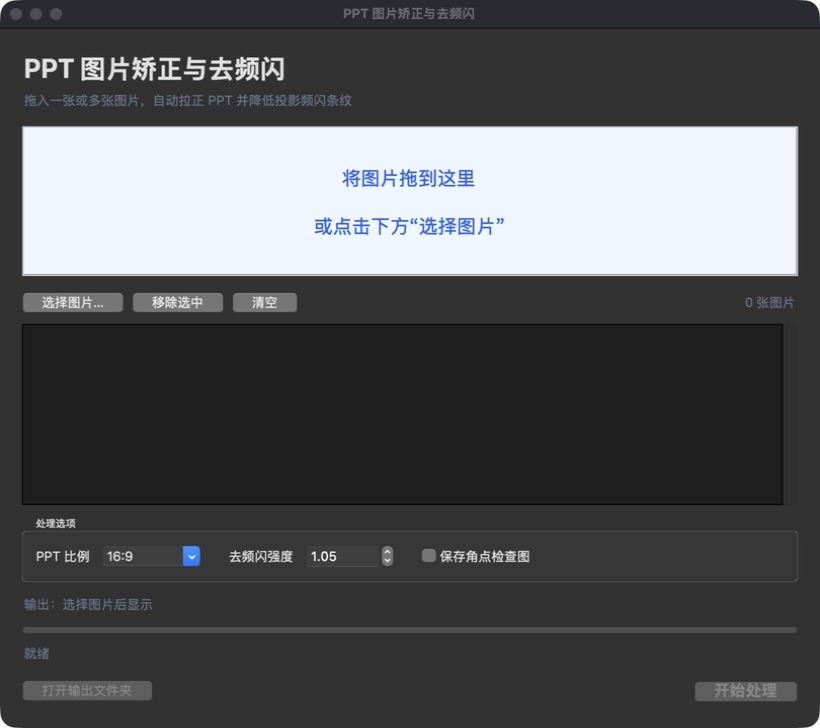
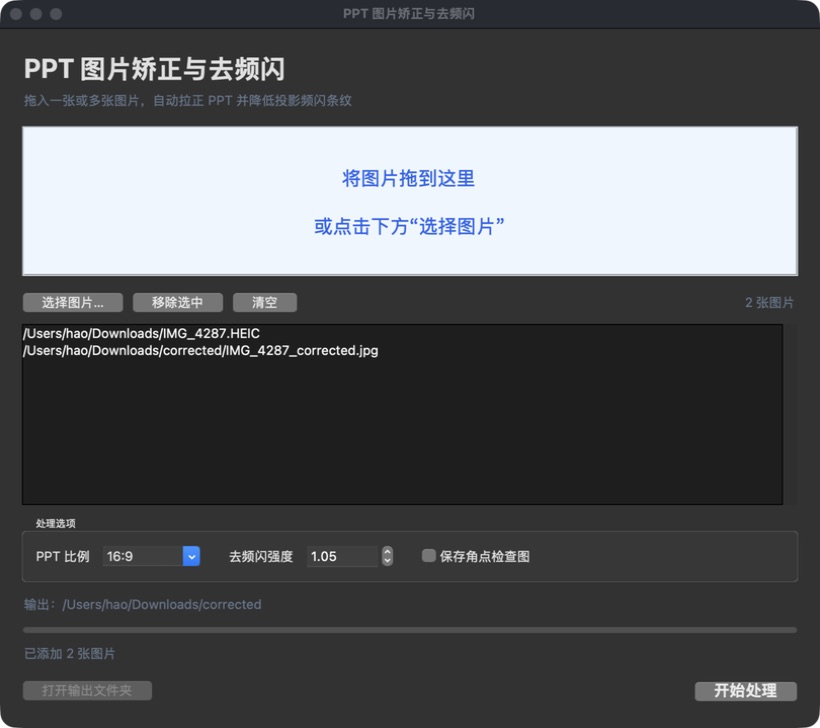
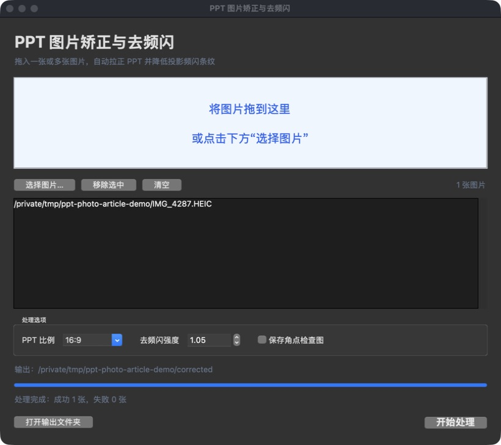
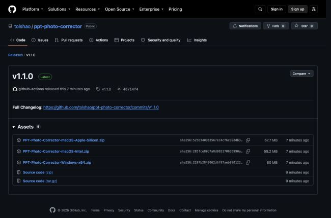

> 我已经为模型买了算力，为什么还要为每个小功能再开一张会员卡？

你好，我是老列👋

前几天，我在现场听一位行业大拿做培训。

现场用的是一块很大的屏幕，内容也很有价值。遇到值得回去慢慢消化的页面，我自然会掏出手机拍下来。

问题是，我没有坐在正中间。

于是照片里的 PPT 不再是 PPT，而像一块被人从侧面拽歪的梯形：左边大、右边小，横线全是斜的。更麻烦的是，肉眼看着很正常的大屏，到了手机照片里却多出一条条横向明暗带，还夹着蓝绿偏色。

一张照片，同时集齐了 **透视畸变** 和 **屏幕频闪** 。

如果只是自己回看，勉强也能忍；但想归档、转发或者交给 OCR，体验就很糟糕了。

我当时冒出的第一个念头不是「回去找个 App」，而是：

> 能不能让 AI Agent 现在就给我写个脚本，把它拉正、把条纹压下去？

本来只想修一张照片。结果做到最后，它变成了一个普通人可以拖拽使用的 Windows/macOS 桌面程序，也变成了 AI Agent 可以直接调用的 Skill。

这件事最有趣的地方，不是我又写了一个图像处理程序，而是： **一个人在培训现场遇到的具体麻烦，怎样借助 AI，在很短的反馈循环里长成一件完整工具** 。



## 💸 软件肯定有，但我已经充了 token

先说清楚：我完全相信市面上已经有很多软件可以完成透视矫正，移动端也一定有不少成熟的商业 App。

它们收费也很合理。产品设计、适配、维护、客服和上架都要成本，愿意为省心付费没有任何问题。

但这一次，我连 App Store 都没有认真调研，也没有安装一圈再做横评。

原因很朴素：这不是我每天都要做的高频工作，而是一个边界非常明确的小需求——找到屏幕四角、拉成正视图、压掉横向频闪，最好还能批量处理。

更关键的是： **我已经充了 AI token** 。

如果每遇到一个小功能，我都要再下载一个 App、注册一个账号、交一份会员费，最后手机里会住着一排一年只打开两次的软件。

所以我的想法很直接：

> 我已经为通用模型买了算力，为什么不能让它按我的需求，现场做一把只属于这件事的扳手？

这不是「所有软件都应该自己写」，更不是说商业软件没有价值。它只是提供了第三种选择：除了忍受和付费，还可以把一个明确需求交给 AI Agent，看看现有 token 能不能直接换成可用工具。

## 📐 第一个问题：照片拍歪，不是旋转一下就行

侧面拍大屏造成的是透视畸变，不是简单的角度倾斜。

普通旋转只能让某一条边变水平，却不能把梯形重新变回矩形。程序真正需要做的是找到 PPT 的四个角：左上、右上、右下、左下，然后计算单应性矩阵，把这个任意四边形映射成规则的 16:9 或 4:3 画面。

第一版自动检测流程大致是：

1. 缩小原图，提高检测速度；
2. 在 HSV 和 RGB 空间寻找高亮、偏冷或接近中性的投影区域；
3. 使用形态学闭运算，把被文字和图表切碎的区域连接起来；
4. 提取最大轮廓、凸包和候选四边形；
5. 结合长直线检测，修正屏幕缺边或相邻区域干扰；
6. 用 OpenCV 完成透视变换，输出正视图。

听起来很顺，但真实照片立刻给算法上了一课。

画面里的图表边框比屏幕边缘更清楚，第一版程序一度把图表中的斜线当成 PPT 左边界。结果照片是拉正了，标题和一部分图表也被「拉没了」。

AI Agent 没有停在「代码运行成功」，而是重新查看角点检查图，收紧竖边角度约束，降低对目标宽高比的迷信，再优先选择更接近真实屏幕位置的强边界。

经过几轮 **运行—看图—修正** ，四个角才真正贴住大屏。

这个过程也提醒我：自动识别再聪明，都应该保留手动四角坐标作为回退入口。不是算法越高级，界面上的人工选项就越丢人；恰恰相反， **能在自动化失手时把任务救回来，才是真正可用的工具** 。

## 🌈 第二个问题：频闪不能靠一层模糊糊过去

照片中的横向条纹，看起来像普通噪声。

最粗暴的办法当然是模糊。但条纹变淡的同时，小字、坐标和图表边缘也会一起糊掉。培训照片最重要的就是信息，不能为了画面「干净」把内容也洗没了。

更合适的思路，是把 **PPT 内容** 和 **条纹场** 分开估计。

程序先沿水平方向做较强平滑，让文字笔画和局部图标在估计图中弱化，同时保留横跨大面积的扫描条纹；再沿竖直方向估计缓慢变化的背景，从中提取周期性的 RGB 偏移场，最后把这部分偏移反向补偿到原图。

真实照片又给了第二次提醒：条纹并不是「整行共享一个数值」。不同横向区域的幅度和相位可能不完全相同，所以最后使用的是一个允许沿横向缓慢变化的二维条纹场。

同一张示例照片，使用同一个高频水平变化指标测量：

- 校正前： `10.899` ；
- 校正后： `1.967` ；
- 下降约： **82%** 。

它当然不能恢复已经过曝、失焦或被遮挡的细节，但粗重的扫描色带明显减弱，文字边缘也尽量保留了下来。

这比一句「看起来好多了」更让我安心，因为至少我们用同一把尺子比较了前后结果。

## 🖱️ 事情开始失控：脚本长出了 GUI

到这一步，我已经有了一个能处理真实 HEIC 照片的 Python 脚本。

如果只给自己用，命令行其实足够。但我转念一想：既然算法已经能跑，为什么不把它变成一个不用记参数、拖进去就能用的小工具？

于是脚本长出了图形界面，项目也有了名字： **PPT Photo Corrector** 。



现在的使用方式很简单：把一张或多张照片拖进窗口，选择 PPT 比例和去频闪强度，点击「开始处理」。程序会在第一张图片所在目录创建 `corrected` 文件夹，把整批结果放进去。

界面只保留真正有用的选项：

- PPT 比例：16:9、4:3 或自动；
- 去频闪强度：0～1.5；
- 保存角点检查图；
- 批处理进度与失败提示；
- 完成后直接打开输出目录。



GUI 使用 Tkinter 和 TkinterDnD，图片处理放到后台线程，避免处理高分辨率 HEIC 时窗口直接「假死」。



这里又踩了一个很朴素的坑：构建成功，不等于软件真的好用。

本机第一次启动打包后的 `.app` 时，默认窗口高度偏小，底部按钮差点被挡住。这个问题不会出现在单元测试里，只会出现在你真正打开软件、盯着它看一眼的时候。

所以 AI 协作并没有停在「PyInstaller 返回 0」，而是继续启动成品、检查界面、调整窗口，再重新构建。

## 🍎🪟 一份 Python，变成三个安装包

普通用户不会为了修几张照片先配置 Python、OpenCV 和 HEIC 解码环境。既然叫桌面工具，就应该尽量做到下载即用。

项目使用 PyInstaller 打包 Python、OpenCV、Tk、拖拽原生库和 HEIC 解码器。但 PyInstaller 不能在 macOS 上直接生成 Windows 程序，也不能在 Windows 上生成 macOS 应用。

最后，GitHub Actions 使用三个原生环境并行构建：

- Windows x64；
- macOS Apple Silicon；
- macOS Intel。

推送 `v*` 标签后，工作流会自动运行测试、构建程序、压缩 ZIP，并把三个安装包挂到 GitHub Release。



首个图形界面版本是 `v1.1.0` 。没有 Python 环境的人，也可以下载对应平台的压缩包使用。

## 🤖 人能拖拽，AI 也应该能调用

做到桌面程序之后，我又冒出一个念头：既然这次工具本来就是 AI Agent 写出来的，它为什么只能交给人点按钮？

于是同一个仓库又被整理成了 Codex Skill。

安装后，不需要记住命令参数，只需要表达目标：

> 使用 `$ppt-photo-corrector` ，把当前文件夹里的侧拍 PPT 拉正并去除频闪，先生成角点检查图。

AI 会根据任务选择宽高比、频闪强度和调试输出；如果自动角点失败，还可以观察检查图，再改用手动四角坐标。

这里我最在意的工程原则是：

> GUI、CLI 和 AI Skill 不应该各自维护一套算法。

项目抽出了统一的 `process_image_file()` 接口。命令行、桌面界面和 Skill 都调用同一颗核心。算法修一次，三个入口一起生效，也不会出现「脚本版效果很好，桌面版却是另一套结果」的维护灾难。

换句话说，它不是三套程序，而是 **同一件能力的三种使用方式** ：

- 我自己批量处理时，用 CLI；
- 普通用户处理照片时，用 GUI；
- AI Agent 整理文件时，用 Skill。

## 🔁 AI 真正有价值的，不是第一次就写对

回头看，这个项目并不是 AI 第一次生成代码就大功告成。

真实过程更像这样：

```text
读取真实 HEIC
→ 写出第一版
→ 生成角点检查图
→ 发现图表边框被误识别
→ 收紧边界条件
→ 重新处理
→ 对比频闪指标
→ 抽出统一核心
→ 增加 GUI 与 Skill
→ 本机构建并启动
→ 等待三平台 Release 完成
```

AI 真正帮到我的，是把每一次尝试的成本压得很低：发现不对，马上改；改完马上跑；跑完继续看结果。

**和 AI 一起做工程，最有价值的不是一次生成很多代码，而是把「实现、运行、观察、修正、再验证」压缩成一个很短的反馈循环** 。

没有真实运行和目视检查，再长的代码也只是看起来像答案。

## 🧰 这次留下的五条经验

### 1. 先拿真实失败样本说话

图像算法非常依赖真实数据。一张拍歪、缺边、带频闪的真实照片，比十个凭空设想的参数更有价值。

### 2. 自动化必须留回退入口

自动角点会遇到过曝、遮挡和屏幕缺边。手动四角不是失败，而是工具的安全出口。

### 3. 隐私应该默认开启

培训照片可能包含参会者、企业名称和未公开内容。公开仓库默认忽略常见图片格式和输出目录，避免一次 `git add .` 把原图推上去。

### 4. 构建通过不等于交付完成

只有真正启动打包后的应用、检查窗口、确认拖拽和原生依赖，才能算桌面版本可用。

### 5. 先沉淀能力，再增加入口

稳定核心函数在前，CLI、GUI、Skill 在后。入口可以继续增加，算法不应该复制三遍。

## 💬 老列碎碎念

这次让我觉得最有意思的，不是「AI 会写 Python」，而是我在培训现场刚遇到一个具体问题，几乎可以立刻把它变成一段可运行、可观察、可修改的实现。过去这种小需求常常卡在「值得不值得专门学、专门买」；现在，多了一个现场造工具的选项。

我不排斥为好软件付费，也不会因为能自己写就否定商业 App 的体验和服务。但对于一年可能只用几次、边界又很清楚的小功能，我确实会先问一句： **我已经充了 token，这个需求能不能直接变成自己的工具** ？

你有没有为了一个很小的功能，装过一个后来再也没打开的 App？如果把那个功能交给 AI Agent，你最想先做成什么工具？欢迎在评论区聊聊。

项目地址：

[GitHub：PPT Photo Corrector](https://github.com/tolshao/ppt-photo-corrector)

下载地址：

[Release v1.1.0](https://github.com/tolshao/ppt-photo-corrector/releases/tag/v1.1.0)

<p align="center">
  <strong>如果觉得这篇文章对你有帮助，</strong><br>
  <strong>别忘了点赞、在看、分享三连哦！</strong><br><br>
  👇👇👇
</p>

---

> 推荐关注公众号「探物及理」，探万物之然，及万理之源。
>
> 
