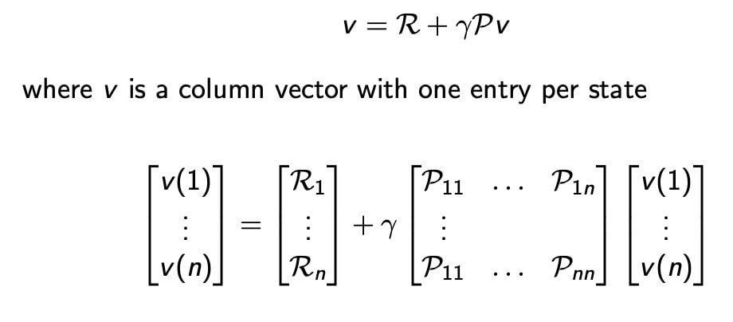
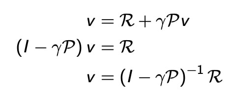
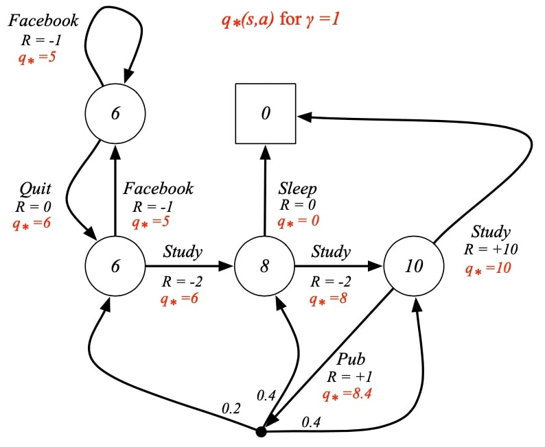
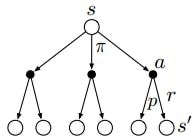

# 马尔科夫过程（Markov Process，MP）

我们说一个state若满足 ，则其具有马尔可夫性，即该state完全包含了历史中的所有信息。马尔科夫过程是无记忆的随机过程，即随机状态序列 具有马尔可夫属性。

一个马尔科夫过程可以由一个元组组成$\langle\mathcal{S}, \mathcal{P}\rangle$

$\mathcal{S}$为（有限）的状态（state）集；
$\mathcal{P}$为状态转移矩阵， $$
P_{s s^{\prime}}=\mathbb{P}\left(S_{t+1}=s^{\prime} \mid S_{t}=s\right)
$$ 。所谓状态转移矩阵就是描述了一个状态到另一个状态发生的概率，所以**_矩阵每一行元素之和为1_**。

## 马尔科夫奖励过程（Markov Reward Process，MRP）

在MP上加入了 奖励Reward 和 折扣系数$\gamma$

对于状态转移概率矩阵确定的情况，Value值可以显式计算得到

对于MDP，并不适用，因为$\mathbb{P}$**非线性**

### 解析解
对于理想的的MDP，且参数已知，其解析解可以直接逆运算得到
状态在策略下的value值，可以由一下的公式计算得到
$$
\begin{array}{c}
v_{\pi}=\mathcal{R}^{\pi}+\gamma \mathcal{P}^{\pi} v_{\pi} \\
v_{\pi}=\left(I-\gamma \mathcal{P}^{\pi}\right)^{-1} \mathcal{R}^{\pi}
\end{array}
$$

## 马尔科夫决策过程（Markov Decision Process，MDP）

MDP相对于MP加入了瞬时奖励 $R$(Immediate reward）、动作集合$A$和折扣因子 $\gamma$ （Discount factor），这里的瞬时奖励说的是从一个状态 s到下一个状态 s' 即可获得的rewards，虽然是“奖励”，但如果这个状态的变化对实现目标不利，就是一个负值，变成了“惩罚”，所以reward就是我们告诉agent什么是我们想要得到的，但不是我们如何去得到。

MDP由元组 $\langle\mathcal{S}, \mathcal{A}, \mathcal{P}, \mathcal{R}, \gamma\rangle$ 定义。其中

$\mathcal{S}$为（有限）的状态（state）集；
$\mathcal{A}$为有限的动作集；
$\mathcal{P}$为状态转移矩阵。所谓状态转移矩阵就是描述了一个状态到另一个状态发生的概率，所以矩阵每一行元素之和为1。[公式]
$\mathcal{R}$为回报函数（reward function), [公式]
$\gamma$为折扣因子，范围在[0,1]之间， 越大，说明agent看得越“远”。

对于每一个$\pi$,$a\in A$
$$
\begin{aligned}
\mathcal{P}_{s, s^{\prime}}^{\pi} &=\sum_{a \in \mathcal{A}} \pi(a \mid s) \mathcal{P}_{s s^{\prime}}^{a} \\
\mathcal{R}_{s}^{\pi} &=\sum_{a \in \mathcal{A}} \pi(a \mid s) \mathcal{R}_{s}^{a}
\end{aligned}
$$
### 收获 Return
定义：收获$G_t$为在一个马尔科夫奖励链上从t时刻开始往后所有的奖励的有衰减的总和。也有翻译成“收益”或"回报"。
G值，从t时刻起，包括了**未来**，计算了**折扣**的总奖励：
$$
G_t = R_{t+1}+\gamma R_{t+2} + ... = \sum^\infty_{k=0}\gamma^k R_{t+k+1}
$$

- 考虑了未来的不确定性
- 给与较近的未来更高权重

### 价值函数和动作值函数

- 价值函数：在状态s，策略π下的值函数
$$
v_{\pi}(s)=\mathbb{E}_{\pi}\left[G_{t} \mid S_{t}=s\right]
$$
- 动作值函数（action-value function）：在状态s，执行动作a，遵循策略π，回报期望
$$
q_{\pi}(s, a)=\mathbb{E}_{\pi}\left[G_{t} \mid S_{t}=t, A_{t}=a\right]
$$

# 贝尔曼方程
状态值函数可以分解为即刻回报+未来回报x折扣值
分解 -> 迭代实现
$$
v_{\pi}(s)=\mathbb{E}_{\pi}\left[R_{t+1}+\gamma v_{\pi}\left(S_{t+1}\right) \mid S_{t}=s\right]
$$

动作值函数类似：
$$
q_{\pi}(s, a)=\mathbb{E}_{\pi}\left[R_{t+1}+\gamma q_{\pi}\left(S_{t+1}, A_{t+1}\right) \mid S_{t}=s, A_{t}=a\right]
$$
在每个状态，会存在多个备选动作；
每个动作，也可能会导致不一样的状态，因此存在下图。

$$
v_{\pi}(s)=\sum_{a \in \mathcal{A}} \pi(a \mid s) q_{\pi}(s, a) \\ q_{\pi}(s, a)=\mathcal{R}_{s}^{a}+\gamma \sum_{s^{\prime} \in \mathcal{S}} \mathcal{P}_{s s^{\prime}}^{a} v_{\pi}\left(s^{\prime}\right) \\ 
$$
于是
$$v_{\pi}(s)=\sum_{a \in \mathcal{A}} \pi(a \mid s)\left(\mathcal{R}_{s}^{a}+\gamma \sum_{s^{\prime} \in \mathcal{S}} \mathcal{P}_{s s^{\prime}}^{a} v_{\pi}\left(s^{\prime}\right)\right) \\ q_{\pi}(s, a)=\mathcal{R}_{s}^{a}+\gamma \sum_{s^{\prime} \in \mathcal{S}} \mathcal{P}_{s s^{\prime}}^{a} \sum_{a^{\prime} \in \mathcal{A}} \pi\left(a^{\prime} \mid s^{\prime}\right) q_{\pi}\left(s^{\prime}, a^{\prime}\right)
$$
描述了当前状态值函数和其后续状态值函数之间的关系，即状态值函数（动作值函数）等于瞬时回报的期望加上下一状态的（折扣）状态值函数（动作值函数）的期望。

## 贝尔曼最优方程
学习的目的是优化一个策略π使得值函数v or q最大
$$
v_{*}(s)=\max _{\pi} v_{\pi}(s) $$
$$
 q_{*}(s, a)=\max _{\pi} q_{\pi}(s, a) $$
 对于任意一个MDPs，存在一个$\pi_*$使得$ v_{\pi_{*}}(s)=v_{*}(s), \quad q_{\pi_{*}}(s, a)=q_{*}(s, a) $
可得，贝尔曼最优方程：
$$ v_{*}(s)=\max _{a} \mathcal{R}_{s}^{a}+\gamma \sum_{s^{\prime} \in \mathcal{S}} \mathcal{P}_{s s^{\prime}}^{a} v_{*}\left(s^{\prime}\right) $$ 
$$ q_{*}(s, a)=\mathcal{R}_{s}^{a}+\gamma \sum_{s^{\prime} \in \mathcal{S}} \mathcal{P}_{s s^{\prime}}^{a} \max _{a^{\prime}} q_{*}\left(s^{\prime}, a^{\prime}\right)
$$

### 求解最优方程方法
- Value iteration
- Policy iteration
- Q-learning
- Sarsa
- 等

