# introduction

## v、q表的问题
* 解决离散化的s,a,导致q-table存储量、运算量大
* 解决连续s、a的表示问题

## solution
用带权重估计函数，估计v or q
$$
\begin{aligned}
\hat{v}(s, \mathbf{w}) & \approx v_{\pi}(s) \\
\text { or } \hat{q}(s, a, \mathbf{w}) & \approx q_{\pi}(s, a)
\end{aligned}
$$

## 函数估计器
可谓函数逼近，需要函数式可微分的
- 线性组合
- 神经网络

这些**不可微**
- 决策树 decision tree
- 领域Nearest neighbour
- 傅里叶/ 小波Fourier/ wavelet bases

# incremental methods 递增方法

## Gradient descent 梯度下降
值函数估计：随机梯度下降法SGD
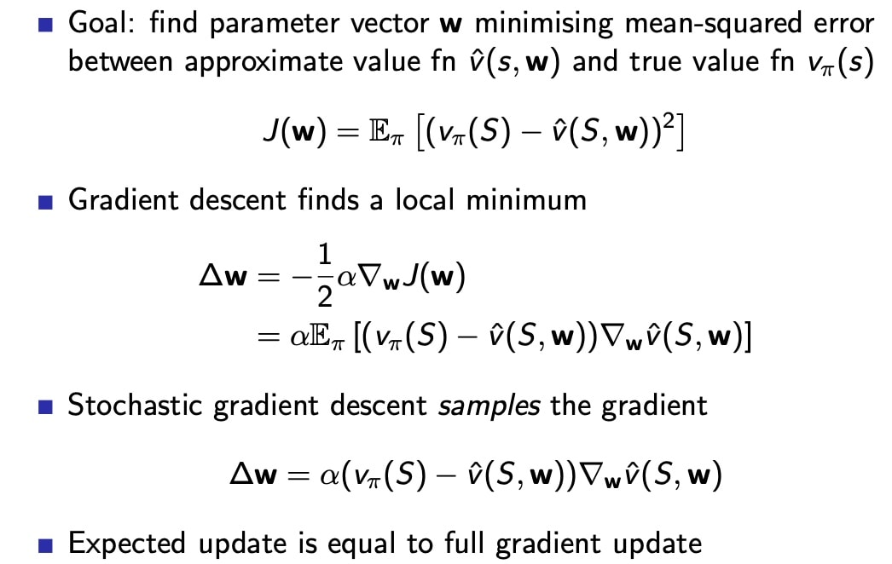

## Table lookup 是 GD的一种特例
类似于机器学习的分类问题，将状态值写成0、1向量

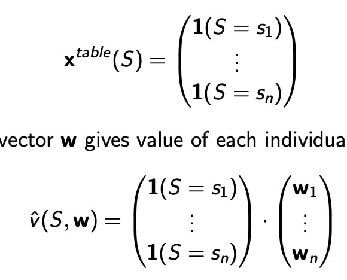
## Find a target for value function approximation
把估计函数作为一个监督学习
目标是谁呢，通过MC、TD方法，设定目标
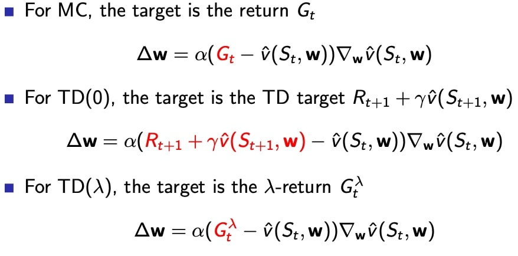

## 生成训练集

### For linear MC
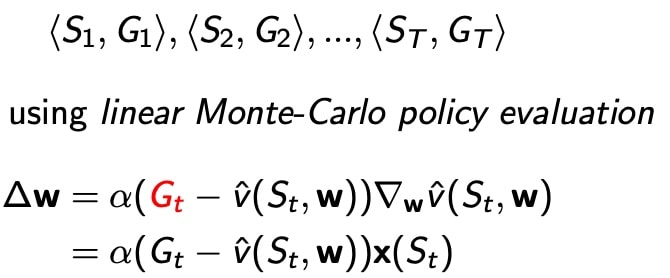
- 无偏目标估计
- 局部最优

### For linear TD（0）
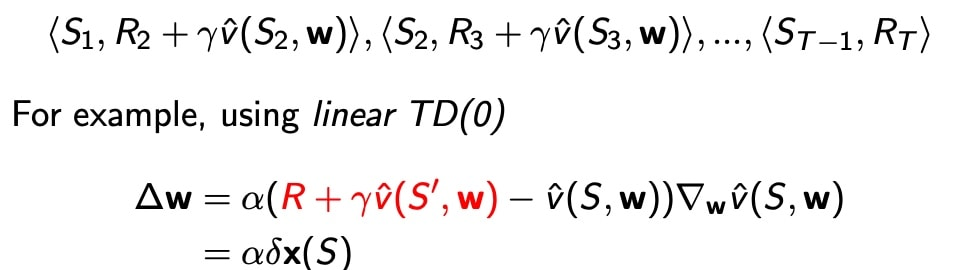
- 收敛趋向全局最优

### For linear TD（$\lambda$）
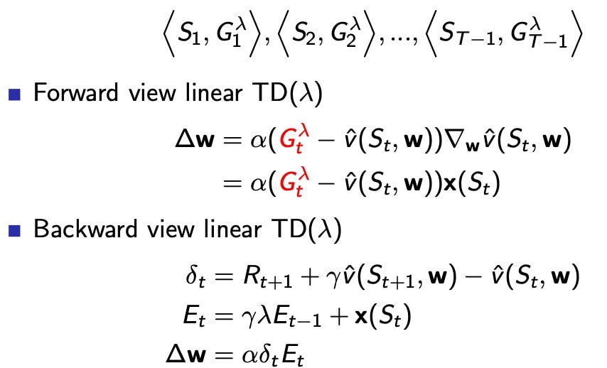

$\delta$ scalar number
$E_t$ 维度和s维度一致

- 前后向 相等

# Incremental Control Algorithms
用q函数，替代v函数
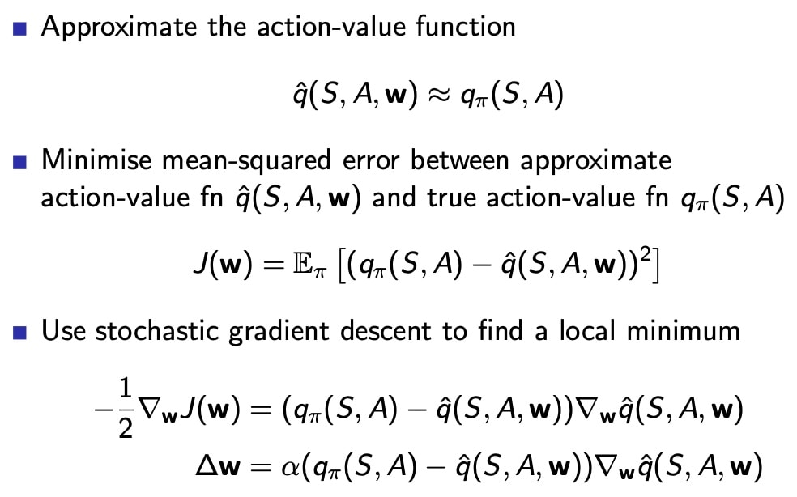

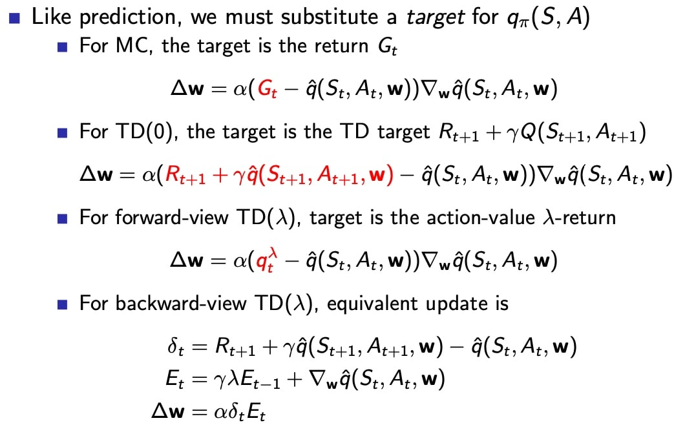

## 收敛性分析
- 预测学习

 - On-policy：一般边训练，边执行，(s,a)是当前policy产生的
 - off-policy：离线训练，通过训练其他策略或者agent产生的(s,a)训练集

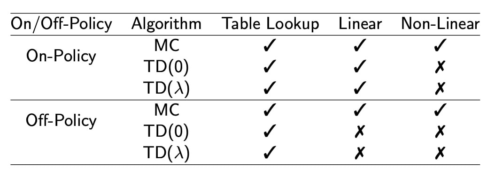
引入Gradient TD，完全满足贝尔曼方程，无差
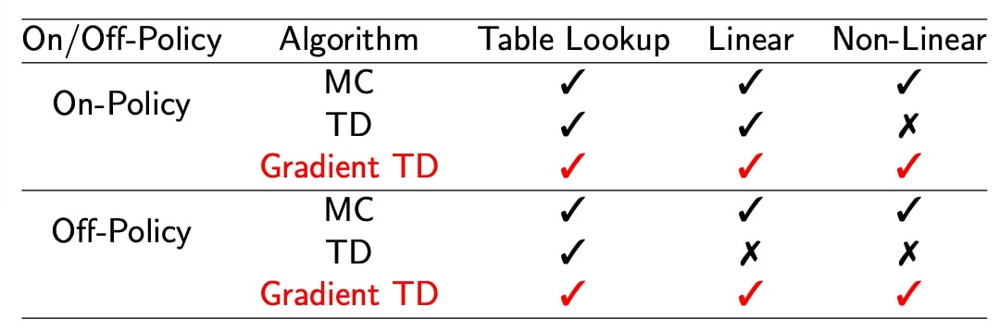

- 控制学习

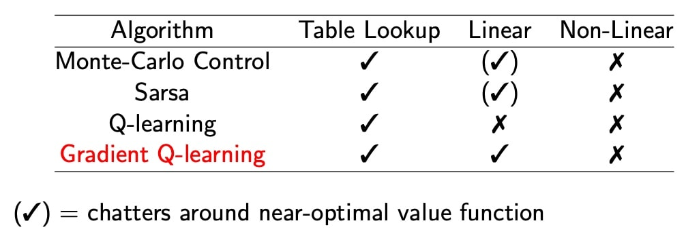

（√）表示在最优值函数附近振荡

# batch methods
## For least squares prediction
LS定义，估计误差平方，求和
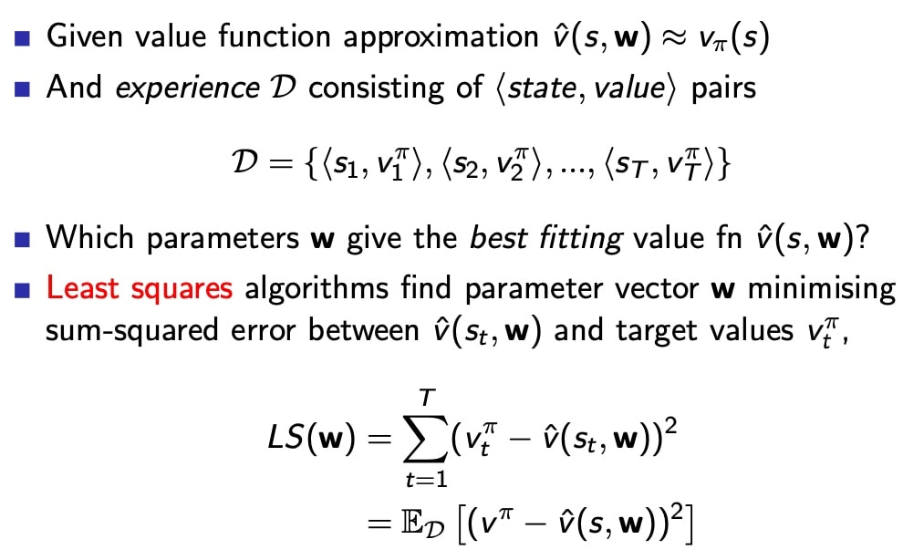

相当于经历重现（experience replay）

- 从history中sample一个batch
- 用SGD更新参数w

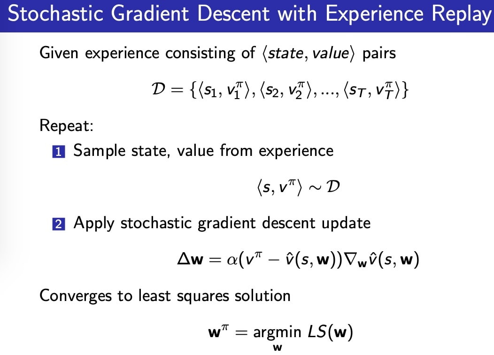
找到使LS最小的权重$w^\pi$

## Experience Replay in Deep Q-Networks (DQN)
### Two features
- **Experience Relpay**：minibatch的数据采样自memory-D
- **Fixed Q-targets**：$w^-$ 在一个更新batch内 ，保持不变，让更新过程更稳定
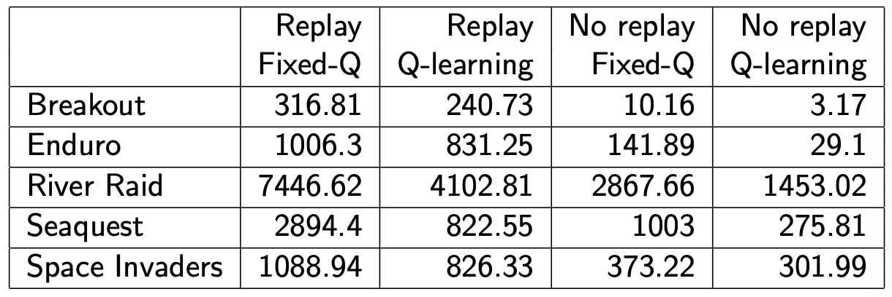

### 算法流程
1. Take action at according to ε-greedy policy
2. Store transition (st,at,rt+1,st+1) in replay memory D 
3. Sample random mini-batch of transitions (s,a,r,s′) from D 
4. Compute Q-learning targets w.r.t. old, fixed parameters $w^− $
5. Optimise MSE between Q-network and Q-learning targets

$$
\mathcal{L}_{i}\left(w_{i}\right)=\mathbb{E}_{s, a, r, s^{\prime}} \sim \mathcal{D}_{i}\left[\left(r+\gamma \max _{a^{\prime}} Q\left(s^{\prime}, a^{\prime} ; w_{i}^{-}\right)-Q\left(s, a ; w_{i}\right)\right)^{2}\right]
$$

6. 用SGD更新
伪算法：
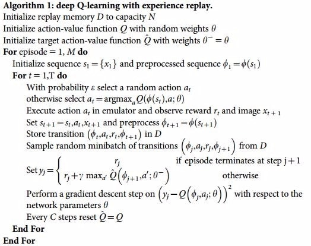
**注意：**
- Fixed Q-target $\theta$，每C steps 更新一次
- Experience Replay： minibatch 从 memory D 采样

Features：
 - 随机采样，打破了状态之间的联系
 - 冻结参数，增加了算法的**稳定性**，选q的网络参数回合制更新

-  例子
  DQN in Atari（构成）
  - input: state s （4 frames pictures）
  - output: Q(s,a) 
  - CNN： mapping input(s) to output(Q)

### LS 最小二乘法  总结
- Experience replay -> LS solution
- 迭代次数太多
- 用线性估计$\hat v(s,w) = x(s)^Tw$
- 直接求解LS

## LSP 直接求解
对于线性近似函数：
$$
\hat v(s,w) = x(s)^T w
$$

最终的平衡状态，梯度=0
求解方程，得到w值关于状态s和v真值的函数关系
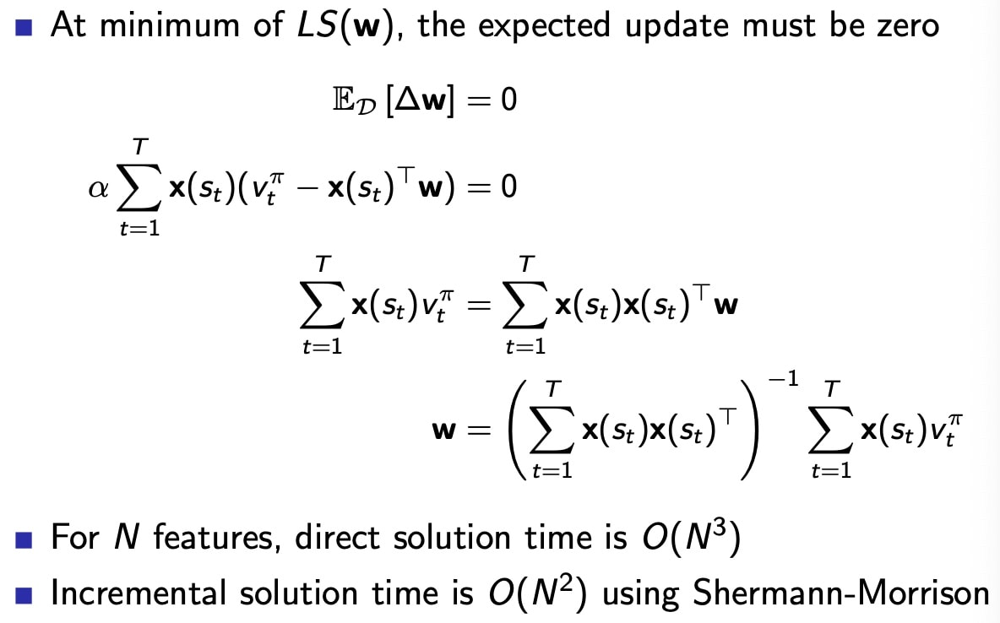
However，真值**不知道**
缺点是复杂度高，引入了矩阵的逆
### Other algorithms
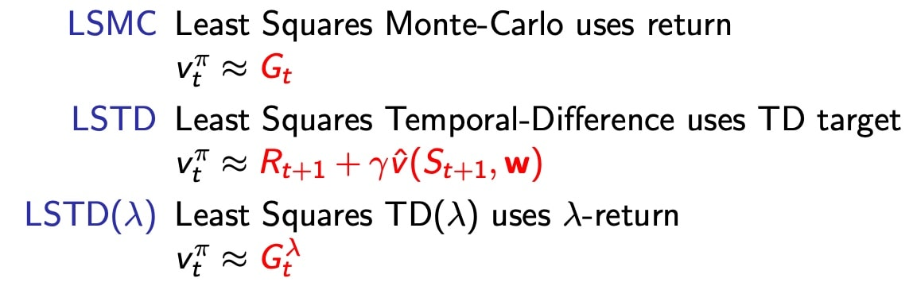
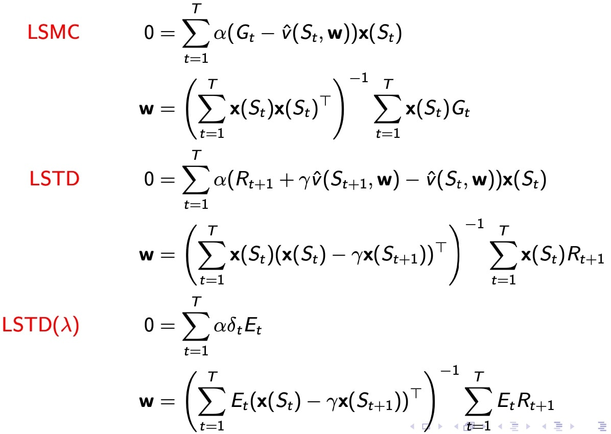
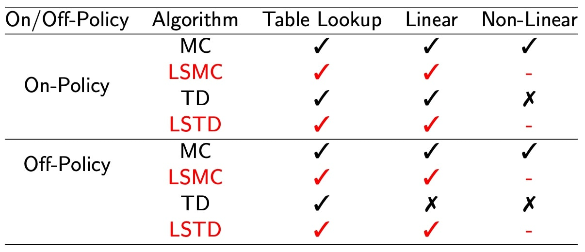

