# 1、introduction

第7章节，讲了PG，从episode经验学习到 策略 policy
之前的章节，讲了从episode 经验学习到 价值函数

本章，从过去经验学习到环境模型

通过**规划**的手段，构建值函数或者策略

- Model-free
 -  没有模型
 -  从经验中学习，得到**价值函数** 
-  Model-based
 -  有模型
 -  根据模型规划价值函数

本讲指出解决这类问题的关键在于“前向搜索”和“采样”，通过将基于模拟的前向搜索与各种不依赖模型的强化学习算法结合，衍生出多个用来解决类似大规模问题的切实可行的算法，如：Dyna-2算法之类。

# 2、Model-based reinforcement learning
当学习价值函数或策略变得很困难的时候，学习模型可能是一条不错的途径，像下棋这类活动，模型是相对直接的，相当于就是游戏规则。
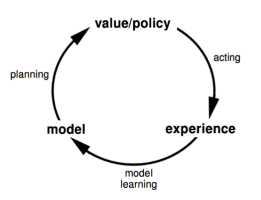

- 优点
 - 用监督学习高效实现建模
 - 推断模型不确定性
- 缺点
 - 第一步建模，第二步构建价值函数，两个过程带来双重的**估计误差**

## 模型，我们要做什么
- MDP模型包括$\langle\mathcal{S}, \mathcal{A}, \mathcal{P}, \mathcal{R}\rangle$
- 假设状态空间$\mathcal{S}$、动作空间$\mathcal{A}$已知
我们期望构建一个模型 $\mathcal{M} = \langle \mathcal{P}_{\eta}, \mathcal{R}_{\eta} \rangle$ 来表示状态转移概率P和奖励R
$$
\begin{array}{l}
S_{t+1} \sim \mathcal{P}_{\eta}\left(S_{t+1} \mid S_{t}, A_{t}\right) \\
R_{t+1}=\mathcal{R}_{\eta}\left(R_{t+1} \mid S_{t}, A_{t}\right)
\end{array}
$$

假设状态转移和 奖励 无关
$$
\mathbb{P}\left[S_{t+1}, R_{t+1} \mid S_{t}, A_{t}\right]=\mathbb{P}\left[S_{t+1} \mid S_{t}, A_{t}\right] \mathbb{P}\left[R_{t+1} \mid S_{t}, A_{t}\right]
$$

## Model learning
- Goal：构建一个模型model $\mathcal{M} = \{S_1, A_1, R_2 ...m S_T\}$ 
- 构建**监督学习**问题，根据状态和动作，估计奖励和下一时刻的状态
$$
\begin{aligned}
S_{1}, A_{1} & \rightarrow R_{2}, S_{2} \\
S_{2}, A_{2} & \rightarrow R_{3}, S_{3} \\
& \vdots \\
S_{T-1}, A_{T-1} & \rightarrow R_{T}, S_{T}
\end{aligned}
$$

- 奖励r的估计是**回归**问题
- 状态s'的估计是**密度估计**问题
- 选择损失函数，例如 MSE， KL divergency（相对熵）
- 优化参数$\eta$最小化loss func

### 模型实例
- Table lookup model
- Linear expectation model
- Linear Gaussian model
- Gaussian Process model
- Deep Belief Network model

#### 例子 Table lookup example 
模型是显示MDP，表示为$\hat P, \hat R$
采样、奇数，即可得到概率的估计值
$$
\begin{aligned}
\hat{\mathcal{P}}_{s, s^{\prime}}^{a} &=\frac{1}{N(s, a)} \sum_{t=1}^{T} 1\left(S_{t}, A_{t}, S_{t+1}=s, a, s^{\prime}\right) \\
\hat{\mathcal{R}}_{s}^{a} &=\frac{1}{N(s, a)} \sum_{t=1}^{T} 1\left(S_{t}, A_{t}=s, a\right) R_{t}
\end{aligned}
$$

特点：
- 每一步都需要记录，格式：$\langle S_t, A_t, R_{t+1}, S_{t+1} \rangle$ 
- 随机采样$\langle s,a,\cdot,\cdot \rangle$，进行模型估计

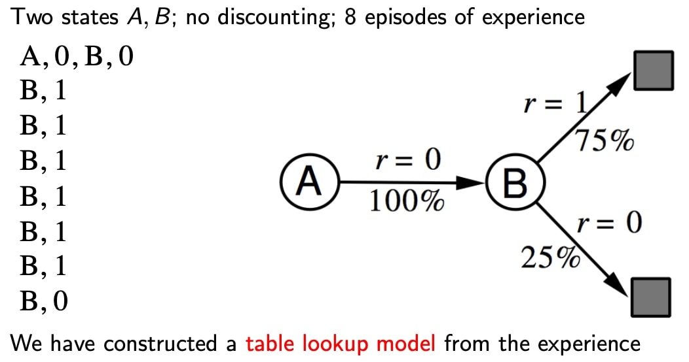

## Planning with a model
- 根据已知模型$\mathcal M_\eta = \langle \mathcal{P_\eta},\mathcal{R_\eta}\rangle$
- Solbe the MDP $\langle S, A, \mathcal{P_\eta},\mathcal{R_\eta}\rangle$ 
- 使用规划方法
 - 值迭代
 - 策略迭代
 - 树搜索
 - 其他

### Sample-based planning
要素2个点：
- 1、只使用模型去产生采样点
- 2、用model-free RL 去学习 samples
 - MC control
 - Sarsa
 - Q-learning

特点
- model产生的sample 比 从env 中sample更高效

### Planning with an inaccurate Model
显然，模型的准确性，直接制约了Model-based RL 性能的上限

Solution：
- 模型错误的情况，直接model-free RL，并且从env中采样
- 明确模型不确定性的原因

# 3、integrated architectures

本节将把基于模型的学习和不基于模型的学习结合起来，形成一个整合的架构，利用两者的优点来解决复杂问题。从两种渠道进行采样
 - Env 真实MDP
 - Model 估计MDP

实际经历： $S^{\prime} \sim P_{s, s^{\prime}}^{a}, \quad R=R_{s}^{a}$

模拟经历：$S^{\prime} \sim P_{\eta}\left(S^{\prime} \mid S, A\right), \quad R=R_{\eta}(R \mid S, A)$

## - 集成**学习**和**规划** **Dyna**
### Dyna

Dyna是并列、综合与model-free、model-based的学习方法
- Model-free RL
 - 无模型
 - 从真实环境Env采样，**学习**价值函数
- Model-based RL
 - 从真实环境Env中学习，建模Model
 - 从Model虚拟采样，**规划**价值函数
- Dyna 
 - 从真实环境Env中学习，建模Model
 - 根据Env 和 Model采样，同时**学习** 并 **规划** 价值函数

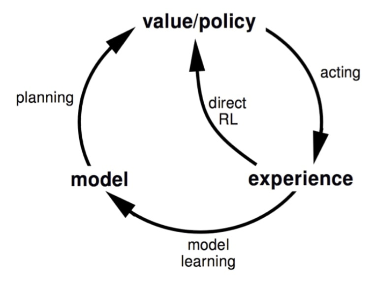

### Dyna-Q 算法框图
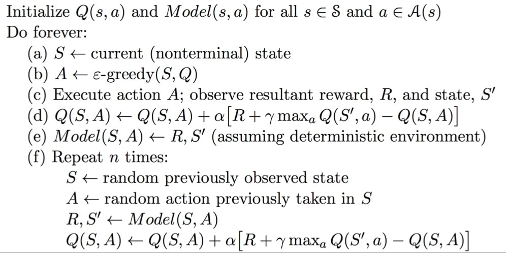
a,b,c,d,和e都是从实际经历中学习，d过程是学习价值函数，e过程是学习模型。
在f步，给以个体一定时间（或次数）的思考。在思考环节，个体将使用模型，在之前观测过的状态空间中随机采样一个状态，同时从这个状态下曾经使用过的行为中随机选择一个行为，将两者带入模型得到新的状态和奖励，依据这个来再次更新行为价值和函数。

类似监督学习里，用**数据增强**，来丰富数据集。

- 例子
将规划引入RL之后，规划比学习具有更小的抖动和噪声，稳定性好
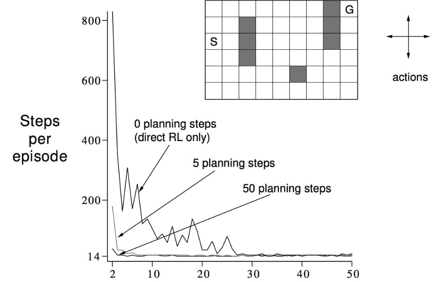

#### Dyna-Q with 不准确模型
由于Dyna综合了实际和模拟两种情况，在实际环境改变时，错误的模型会被逐渐更正。

- 环境剧烈改变
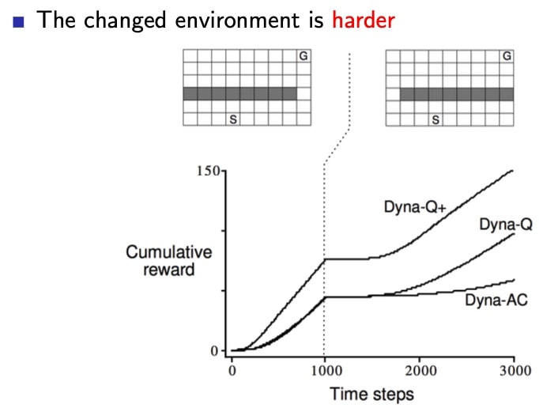
我们可以发现，不同算法对环境改变的适应性，相差悬殊
- 环境柔和改变
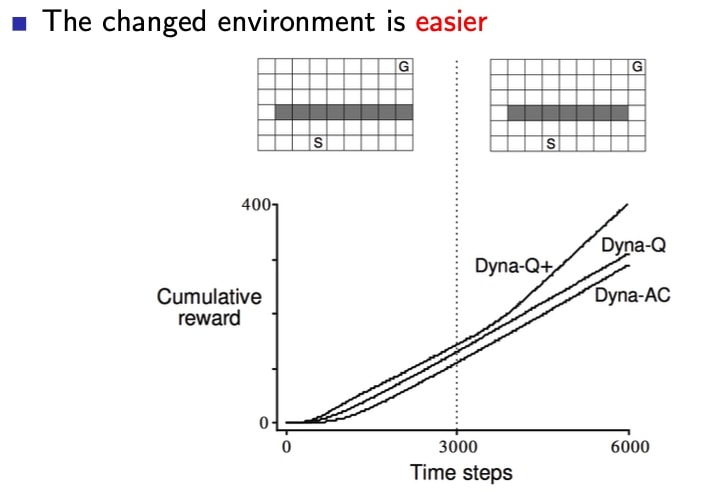

Q+ 算法，奖励函数里 鼓励 episode 探索新的状态

# 4、simulation-based search
搜索相对于规划，区别之一就是，不搜索整个空间，用**采样**的方法来优化
## Forward search
两个重要特征：
- 不求解整个MDP，以**当前**状态为起始状态
- 使用基于**采样**的规划

两点都可以显著降低计算量

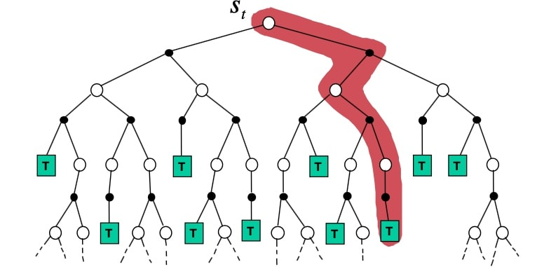

步骤：
- **Simulate** episode 从**当前时刻**开始
$$\left\{s_{t}^{k}, A_{t}^{k}, R_{t+1}^{k}, \ldots, S_{T}^{k}\right\}_{k=1}^{K} \sim \mathcal{M}_{\nu}$$
- 应用 **model-free RL** to 仿真并学习 episodes
 - MC control $\rightarrow$ MC search
 - Sarsa $\rightarrow$ TD search

总结：仿真+学习 = 搜索

##  MC search
### Simple MC search
选择动作a，根据的Q值，**只包含**当前的状态$s_t$和动作集A

1. 给定模型 $\mathcal{M_v}$ 和simulation policy $\pi$
2. For **each** action $a\in A$
 - simulate k episodes 从当前状态(real)$s_t$
 $$\left\{s_{t}, a, R_{t+1}^{k}, S_{t+1}^{k}, A_{t+1}^{k}, \ldots, S_{T}^{k}\right\}_{k=1}^{K} \sim \mathcal{M}_{\nu}, \pi$$
 - 根据平均值评价动作(MC evaluation)
$$Q\left(s_{t}, a\right)=\frac{1}{K} \sum_{k=1}^{K} G_{t} \stackrel{P}{\rightarrow} q_{\pi}\left(s_{t}, a\right)$$
3. 选择最优动作
$$a_{t}=\underset{a \in \mathcal{A}}{\operatorname{argmax}} Q\left(s_{t}, a\right)$$

小结：值函数，只根据当前状态s 和 策略 $\pi$产生，因此，可能不是最优的。

### MC tree search (evaluation)
对于真正的MC tree search，Q值的构建，包含了所有状态s和动作a
估计步骤：
- 给定模型 $\mathcal{M_v}$ 和simulation policy $\pi$
- simulate k episodes 从当前状态(real)$s_t$
$$\left\{s_{t}, A_{t}^{k}, R_{t+1}^{k}, S_{t+1}^{k}, \ldots, S_{T}^{k}\right\}_{k=1}^{K} \sim \mathcal{M}_{\nu}, \pi$$
- 构建搜索树，包含访问过的状态和动作
- 评价状态 $Q(s,a)$，用平均值方法
$$Q(s, a)=\frac{1}{N(s, a)} \sum_{k=1}^{K} \sum_{u=t}^{T} \mathbf{1}\left(S_{u}, A_{u}=s, a\right) G_{u} \stackrel{P}{\rightarrow} q_{\pi}(s, a)$$
- 搜索结束后，根据最大值函数，选择最优动作
$$a_{t}=\underset{a \in \mathcal{A}}{\operatorname{argmax}} Q\left(s_{t}, a\right)$$

小结：完整版的MCTS，比简单版，记录了(s,a)对，不是($s_t,a$)对，顺便将状态空间和动作空间的值函数进行了更新，丰富了信息。
### MC tree search (Simulation)
【区别】：搜索树并不包括整个状态行为对空间的Q值，因此在改进策略时要分情况对待
1. 树内确定性策略（Tree Policy）：对于在搜索树中存在的状态行为对，策略的更新倾向于最大化Q值，这部分策略随着模拟的进行是可以得到持续改进的；
2. 树外默认策略（Default Policy）：对于搜索树中不包括的状态，可以使用固定的随机策略。

也就是说，每一次从当前状态到终止状态的模拟都包括两个阶段：状态在搜索树内和状态在搜索树外。两个状态对应的策略分别是树内的确定性（最大化Q）策略和树外的默认（随机）策略。

随着不断地重复模拟，状态行为对的价值将得到持续地得到评估。同时基于$\epsilon-greedy(Q)$的搜索策略使得搜索树将不断的扩展，策略也将不断得到改善。

上述方法就相当在某一个状态$s_t$时，针对模拟的经历使用蒙特卡罗控制来寻找以当前状态$s_t$为根状态的最优策略。之前的讲解已经解释过：这种方法最终将找到最优策略。我们来看一个具体的例子：

仿真步骤：
- MCTS中，策略$\pi$ **提升**
- 每个仿真包含两个阶段（in-tree, out-of-tree）
 - Tree policy(improves): 选择最优Q值的动作
 - Default policy(fixed): 选择随机动作
- 重复(each simulation)
 - 用MC evaluation **评估** 状态Q(S,A)
 - 用$\epsilon - greedy(Q)$ **提升**策略$\pi$
- 收敛到最优搜索树，$Q(S,A)\rightarrow q_*(S,A)$

#### 例子：围棋Go
##### Position evaluation in go
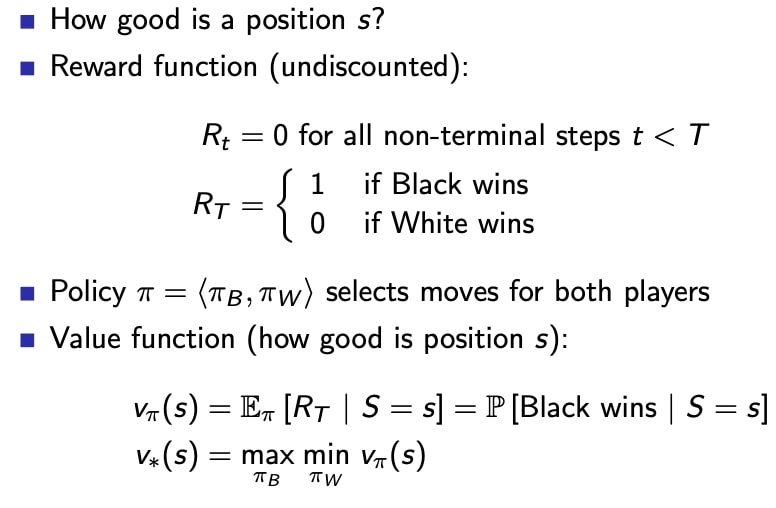
##### MC evaluation in go
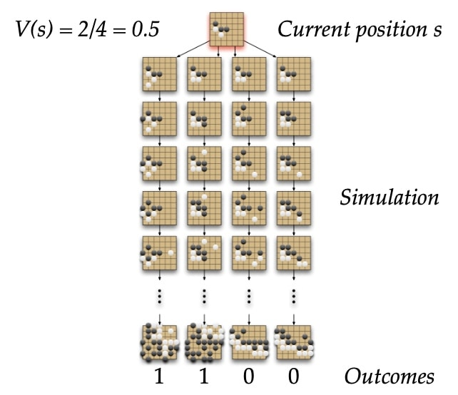

MCTS 步骤：
- 第一次迭代：如下图所示，五角形表示的状态是个体第一次访问的状态，也是第一次被录入搜索树的状态。我们构建搜索树：将当前状态录入搜索树中。使用基于蒙特卡罗树搜索的策略（两个阶段），由于当前搜索树中只有当前状态，全程使用的应该是一个搜索第二阶段的默认随机策略，基于该策略产生一个直到终止状态的完整Episode。图中那些菱形表示中间状态和方格表示的终止状态，在此次迭代过程中并不录入搜索树。终止状态方框内的数字1表示（黑方）在博弈中取得了胜利。此时我们就可以更新搜索树种五角形的状态价值，以分数1/1表示从当前五角形状态开始模拟了一个Episode，其中获胜了1个Episode。这是第一次迭代过程。
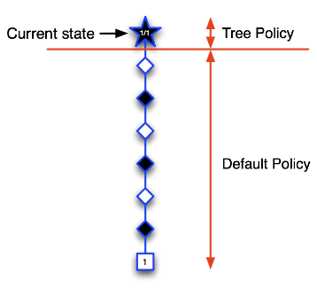
- 第二次迭代：如下图所示，当前状态仍然是树内的圆形图标指示的状态，从该状态开始决定下一步动作。根据目前已经访问过的状态构建搜索树，依据模拟策略产生一个行为模拟进入白色五角形表示的状态，并将该状态录入搜索树，随后继续该次模拟的对弈直到Episode结束，结果显示黑方失败，因此我们可以更新新加入搜索树的五角形节点的价值为0/1，而搜索树种的圆形节点代表的当前状态其价值估计为1/2，表示进行了2次模拟对弈，赢得了1次，输了1次。第二次迭代结束。
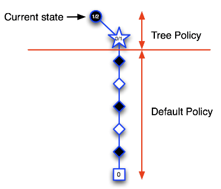
经过前两次的迭代，当位于当前状态（黑色圆形节点）时，当前策略会认为选择某行为进入上图中白色五角形节点状态对黑方不利，策略将得到更新：当前状态时会个体会尝试选择其它行为。
- 第三次迭代：如下图，假设选择了一个行为进入白色五角形节点状态，将该节点录入搜索树，模拟一次完整的Episode，结果显示黑方获胜，此时更新新录入节点的状态价值为1/1，同时更新其上级节点的状态价值，这里需要更新当前状态的节点价值为2/3，表明在当前状态下已经模拟了3次对弈，黑方获胜2次。
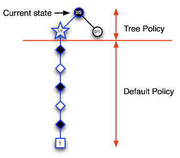
随着迭代次数的增加，在搜索树里录入的节点开始增多，树内每一个节点代表的状态其价值数据也越来越丰富。在搜索树内依据Ɛ-greedy策略会使得当个体出于当前状态（圆形节点）时更容易做出到达图中五角形节点代表的状态的行为。
- 第四次：如下图，当个体位于当前（圆形节点）状态时，树内策略使其更容易进入左侧的蓝色圆形节点代表的状态，此时录入一个新的节点（五角形节点），模拟完Episode提示黑方失败，更新该节点以及其父节点的状态价值。该次迭代结束。
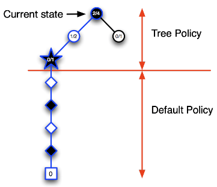
- 第五次迭代：如下图，更新后的策略使得个体在当前状态时仍然有较大几率进入其左侧圆形节点表示的状态，在该节点，个体避免了进入刚才失败的那次节点，录入了一个新节点，基于模拟策略完成一个完整Episode，黑方获得了胜利，同样的更新搜索树内相关节点代表的状态价值。
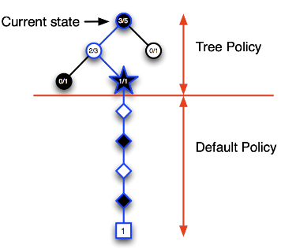

随着迭代次数增加：
- 当个体处于当前状态时，其**搜索树将越来越深**，那些能够引导个体获胜的搜索树内的节点将会被充分的探索，其节点代表的状态价值也越来越有说服力；
- 搜索树内的节点越来越多，代表着搜索树外的节点将逐渐减少，少量的随机行为并不会影响个体整体的决策效果。

##### MCTS 优点
- **选择性好**，好的结果被**优先选择**
- **动态**的评估状态（立足当前状态），不是动态规划（没有离线的评估整个状态空间）
- 使用**采样**方法，不在全部状态空间搜索，避免了维度灾难
- 采样所以具有**黑盒**特性，对黑盒模型同样有效
- 可以异步、并行计算，**高效**

## TD search
- simulation-based search
- 自举特性Bootstrapping， TD而不是MC
- MCTS 将 MC control 应用于 子MDP from now
- TD search 将 Sarsa 应用于 子MDP from now

### MC vs TD search
- 对于 model-free RL， Bootstrapping 特性 行之有效
 - TD 减小方差，但是增加偏差
 - TD 比MC 更高效
 - $TD(\lambda)$比MC更高效
- 对于 simulation-based search， Bootstrapping 特性 同样有用
 - 特性同上

### 步骤
1. 根据当前真实状态$s_t$， 开始仿真episodes
2. 估计动作价值函数$Q(s,a)$
3. 每个仿真步骤，用Sarsa更新动作价值函数
$$\Delta Q(S, A)=\alpha\left(R+\gamma Q\left(S^{\prime}, A^{\prime}\right)-Q(S, A)\right)$$
4. 根据Q值选择最优动作
e.g. $\epsilon - greedy$

在上述过程，优化函数估计器 for Q

相比于MC搜索，TD搜索不必模拟Episode到终止状态，其仅聚焦于某一个节点的状态，这对于一些有回路或众多旁路的节点来说更加有意义，这是因为在使用下一个节点估计当前节点的价值时，下一个节点的价值信息可能已经是经过充分模拟探索了的，在此基础上更新的当前节点价值会更加准确。

### Dyna-2
与Dyna-Q不同，dyna-Q只有一套参数，虽然经验有2个source（env和model）

Dyna-2 特征权重来源于两部分
- Long-term memory
 - 长期记忆 从真实经验中获取， 方法使用TD learning
通用的知识，可以应用于任何episode
- Short-term（working） memory
 - 短期记忆 从仿真经验中获取， 方法用TD search
特定的局部知识，对当前状态有效

- 总的价值函数 = 两部分之和

显而易见，将仿真产生数据应用于搜索，并将搜索结合到学习中，**增强了数据**，会产生显著的提升
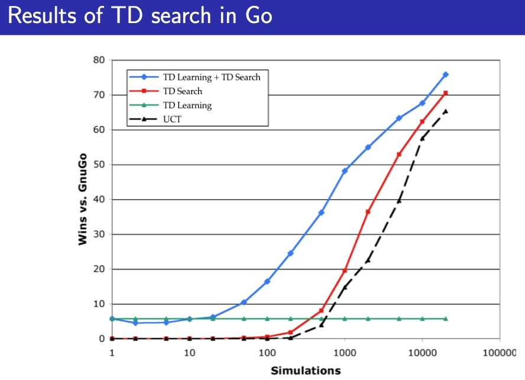

