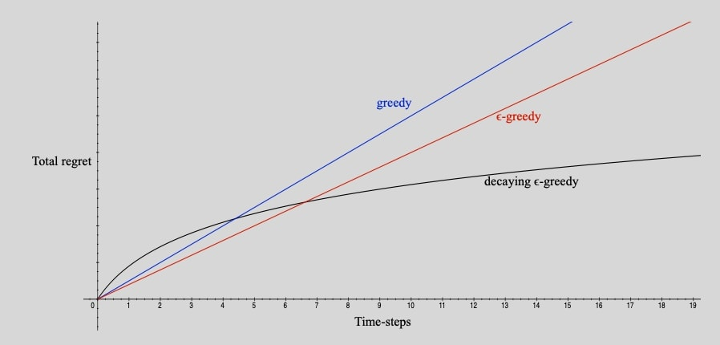
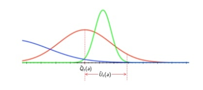
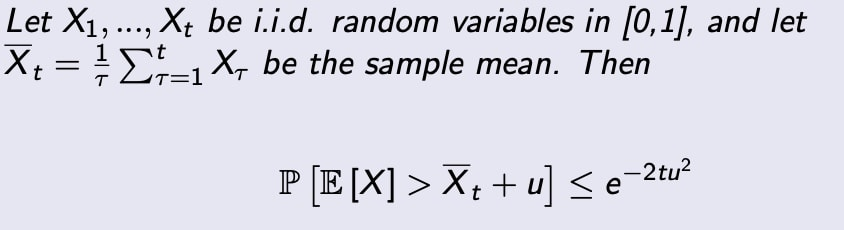
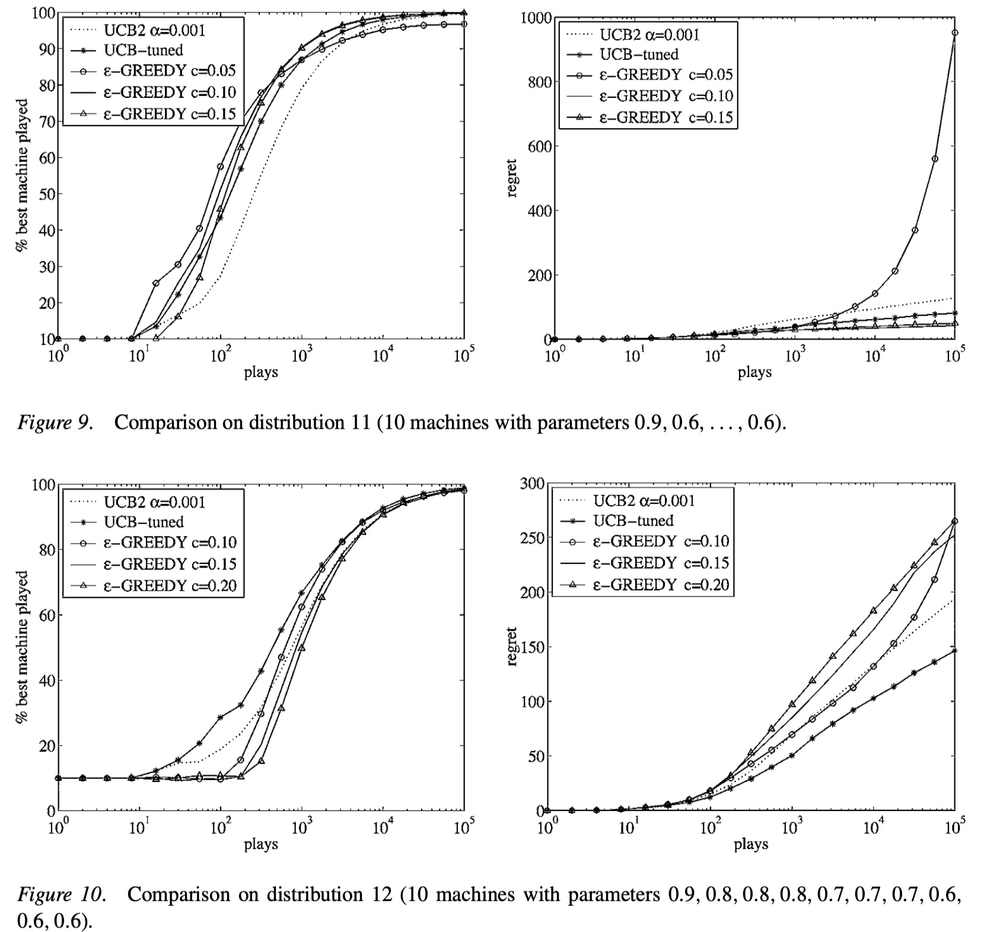
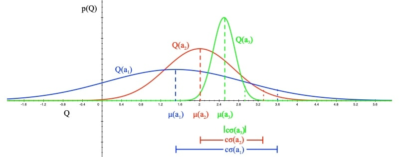
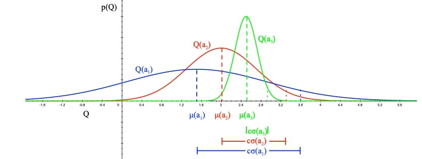
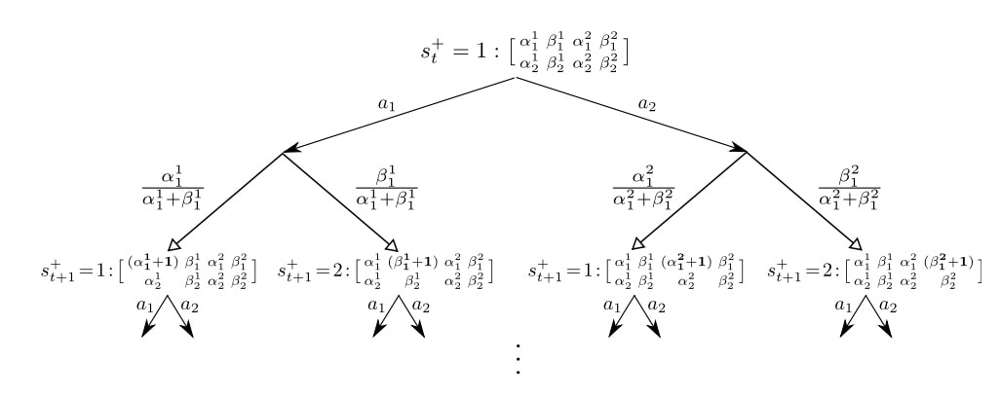
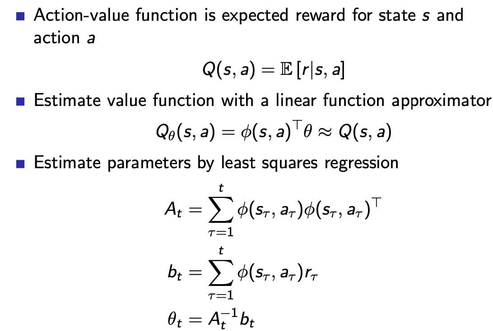
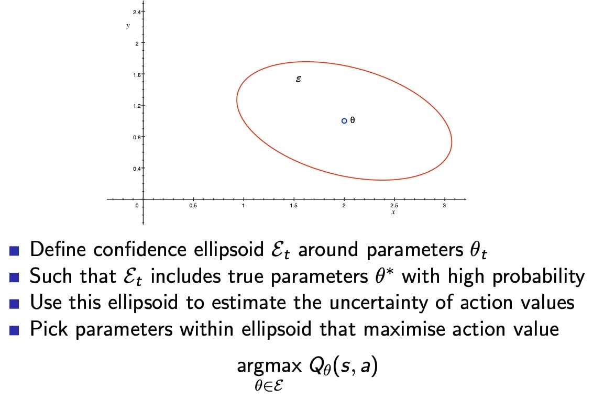
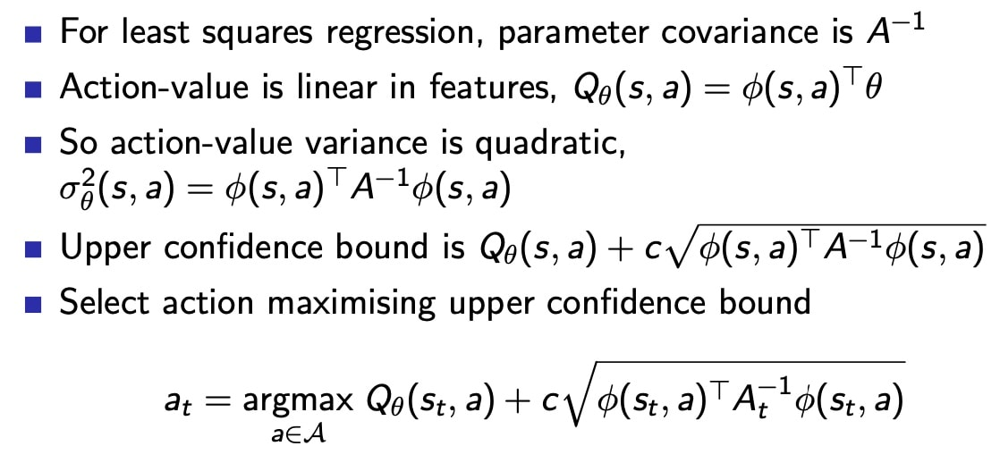

# 1、introduction
本章的主题是关于利用和探索的矛盾：
- Exploitation：利用当前已知信息做决策
- Exploration：探索未知空间获取更多信息

最佳的策略是用长期的眼光来看，放弃短期高回报
获取足够策略是让策略变成全局最优的必要条件

几个基本的探索方法：
主要分三类：
1. 随机
2. 基于不确定性
3. 信息状态空间

- **朴素探索**(Naive Exploration): 在贪婪搜索的基础上增加一个Ɛ以实现朴素探索；
- **乐观初始估计**(Optimistic Initialization): 优先选择当前被认为是最高价值的行为，除非新信息的获取推翻了该行为具有最高价值这一认知；
- **不确定优先**(Optimism in the Face of Uncertainty): 优先尝试不确定价值的行为；
- **概率匹配**（Probability Matching): 根据当前估计的概率分布采样行为；
- **信息状态搜索**(Information State Search): 将已探索的信息作为状态的一部分联合个体的状态组成新的状态，以新状态为基础进行前向探索。
- **状态动作探索**State-action exploration：系统地探索状态和动作空间，类似于查表法
- **参数探索**Parameter exploration：
    - 动作选择遵照策略$\pi (A|S,u)$
    - 每隔一段时间，更新策略参数
    - 优点：连续的探索
    - 缺点：对状态/动作空间不直观

# 2、多臂赌博机 Multi-Armed Bandits
## 简介
一个赌徒面前有N个赌博机,事先他不知道每台赌博机的真实盈利情况,他如何根据每次玩赌博机的结果来选择下次拉哪台或者是否停止赌博,来最大化自己的从头到尾的收益.

将MDP简化为$\langle \mathcal A,\mathcal R \rangle$
- 动作空间A 已知
- 奖励映射函数$\mathcal {R^a(r)} = \mathcal P [R=r|A=a]$ 未知
- 目标是最大化累计奖励$\sum^t_{\tau=1} r_\tau$

### 后悔值 Regret 
- 动作价值函数
$$Q(a)=\mathbb{E}[r \mid a]$$
- 最优价值函数
$$V^* = Q(a^*) = \underset{a\in A}{max}Q(a)$$
- 后悔机会（one step）
$$l_t = \mathcal E[V^* - Q(a_t)]$$
- 后悔函数
$$L_T = \mathcal E[\sum^t_{\tau = 1}V^* - Q(a_{a_\tau})]$$
- 最大化总计奖励 = 最小化 total regret

#### total Regret的表达方式
- $N_t(a)$是动作a的计数
- gap $\Delta_a$是当前动作价值函数和最优值的偏差

将上页的后悔价值函数表示为 计数 和 gap 的乘积
$$
\begin{aligned}
L_{t} &=\mathbb{E}\left[\sum_{\tau=1}^{t} V^{*}-Q\left(a_{\tau}\right)\right] \\
&=\sum_{a \in \mathcal{A}} \mathbb{E}\left[N_{t}(a)\right]\left(V^{*}-Q(a)\right) \\
&=\sum_{a \in \mathcal{A}} \mathbb{E}\left[N_{t}(a)\right] \Delta_{a}
\end{aligned}
$$

好的算法让大gap对应的计数最小，但问题是，gaps未知？？？

### 线性和次线性的regret

因为总计后悔值，是累加计算，只要有gap，就会随着时间步增长
- 曲线线性增长，表明
    - 算法停止探索
    - 算法卡在局部最优

## 2.1 朴素探索 native exploration
### greedy：卡在局部最优，总后悔线性增长
- 算法目标是估计价值函数$\hat Q_t(a) \approx Q(a)$
- 使用MC evaluation 估计价值函数，引入平均值的概念
$$\hat{Q}_{t}(a)=\frac{1}{N_{t}(a)} \sum_{t=1}^{T} r_{t} \mathbf{1}\left(a_{t}=a\right)$$

- 选取最优动作
$$
a^*_t = \underset{a\in A}{\operatorname {argmax}} \hat Q_t(a)
$$

Greedy 可能卡在永远次优动作，总regret随时间步线性增长

### **Solution**：乐观初始化 Optimistic initialisation 
理论上，还应该是total regret 线性增长，实际效果却很好，采用递归MC更新Q值
$$
\hat{Q}_{t}\left(a_{t}\right)=\hat{Q}_{t-1}+\frac{1}{N_{t}\left(a_{t}\right)}\left(r_{t}-\hat{Q}_{t-1}\right)
$$
操作步骤：
- 将V值初始化为最大值，$Q(a)= r_{max}$
- act greedily
$$A_t = \underset{a\in A}{\operatorname {argmax}} Q_t(a)$$
- 鼓励探索未知values
但是仍未能避免不幸的采样导致卡在次优

### $\epsilon-greedy$：小概率随机动作，累加后悔值，导致总后悔值随时间步线性增长
- 特性：永远保持探索:
    - 概率（1-$\epsilon$）$A= \underset{a\in A}{argmax}Q(a)$
    - 概率（$\epsilon$）随机动作

- $\epsilon$保证了最小的regret，满足
$$
l_t \geq \frac{\epsilon}{A}\sum_{a\in A}\Delta_a
$$
$\epsilon-greedy$ 仍然是线性总regret，因为会$\epsilon$随机采样到大gap

### **Solution**：选择策略让$\epsilon$递减
核心思想：假设我们现在知道每一个行为的最优价值$V^*$，那么我们可以根据行为的价值计算出所有行为的$\Delta_a$ 。可设置为：如果一个行为的差距越小，则尝试该行为的机会越多；如果一个行为的差距越大，则尝试该行为的几率越小。数学表达如下：

策略如下：
$$
\begin{array}{l}
c>0 \\
d=\min _{a \mid \Delta_{a}>0} \Delta_{i} \\
\epsilon_{t}=\min \left\{1, \frac{c|\mathcal{A}|}{d^{2} t}\right\}
\end{array}$$

小结：
- 对数渐进regret
- $\epsilon$调整策略需要提前知道gap，**不符合实际**
- 对于任意多臂赌博机，都可找到次线性regret，不用R的信息

## 2.2 不确定性优先 optimism in the face of uncertainty

### 相关概念
#### 总后悔值下限 lower bound
当有噪声干扰，或者表现具有相似性，无法从反馈信息直接判断动作好坏

可以用$gap\Delta_a$， 和分布的相似程度KL散度 $KL(R^a||R^a*)$，来计算总后悔值的下限：
- 差距越大，后悔值越大
- 奖励分布的相似程度越高，后悔值约低

**定理**：（Lai and robbins）
存在一个总后悔值的下限，没有哪一个算法能够做得比这个下限更好
渐进总regret 至少是步数的**对数**
$$\lim _{t \rightarrow \infty} L_{t} \geq \log t \sum_{a \mid \Delta_{a}>0} \frac{\Delta_{a}}{K L\left(\mathcal{R}^{a}|| \mathcal{R}^{a^{*}}\right)}$$

#### 置信上限 Upper confidence bound

为什么要分析置信上限，通过分析上限，可以将表现**有潜力**的动作选出
上限的选取，是基于概率的，选择要包容95%、99%的置信区间

- 上限值$U_t(a)$ 以均值为基准，叠加在均值之上的
- 

- 对每个动作价值函数，进行估计上限$\hat U_t(a)$
- 例如：$Q(a) \leq \hat Q_t(a) + \hat U_t(a)$ 具有高概率
- 这取决于步的计数个数$N(a)$，采样到的个数越多，估计越准确
    - 小的 $N(a)$对应 大的 $\hat U_t(a)$，估计不确定
    - 大的 $N(a)$对应 小的 $\hat U_t(a)$，估计**准确**
- 按照置信上限 upper confidence bound（UCN）选取最优动作
$$
a_t = \underset{a\in A}{\operatorname {argmax}}\left(\hat Q_t(a) + \hat U_t(a)\right)
$$
小结：随仿真进行，提高置信度

#### 霍夫丁不等式 Hoeffding's inequality
提供了置信上限的计算方法，要求先对数据进行缩放，缩放到[0,1]

将不等式应用到奖励赌博机中

$$\mathbb{P}\left[Q(a)>\hat{Q}_{t}(a)+U_{t}(a)\right] \leq e^{-2 N_{t}(a) U_{t}(a)^{2}}$$

##### 利用霍夫丁不等式计算UCB
- 选择允许的概率 P
- 计算上限值，$U_t(a)$
$$
\begin{aligned}
e^{-2 N_{t}(a)} U_{t}(a)^{2} &=p \\
U_{t}(a) &=\sqrt{\frac{-\log p}{2 N_{t}(a)}}
\end{aligned}
$$
实际操作过程中，随着采样点增多，我们希望对Q的估计越来越确信，所以逐步减少p值
通过降低p，可以获取更多奖励，随着仿真进行，降低p值，e.g. $p = t^{-4}$
$$U_{t}(a)=\sqrt{\frac{2 \log t}{N_{t}(a)}}$$

#### UCB1
利用霍夫丁不等式，let $p = t^{-4}$
UCB1算法如下：
$$a_{t}=\underset{a \in \mathcal{A}}{\operatorname{argmax}} Q(a)+\sqrt{\frac{2 \log t}{N_{t}(a)}}$$

定理：
UCB算法趋向于对数渐进 总regret
$$\lim _{t \rightarrow \infty} L_{t} \leq 8 \log t \sum_{a \mid \Delta_{a}>0} \Delta_{a}$$

效果对比：

- 小结：
    - 如果$\epsilon-greedy$调参合适，表现更好，参数差就是灾难
    - UCB不需要掌握任何信息也可以表现良好

UCB可以被应用到：
- 伯恩斯坦 不等式
- 经验伯恩斯坦 不等式
- 切尔诺夫 不等式
- azuma 不等式

#### 贝叶斯 Bayesian bandits

与多臂赌博机不同，贝叶斯赌博机中，我们期望通过episode 的经验构建动作-奖励概率函数 和 Q值函数，用**后验估计来指导最优动作的选取**
- 特性：
    - 贝叶斯赌博机利用 已知的奖励经验，$p[R^a]$
    - 构建Q值的概率分布，使用参数w，$p[Q|w]$
        - e.g. Gaussians: $w = [\mu_1, \sigma^2,...]$ for each $a\in [1,k]$
    - 计算奖励的后验分布 $p[R|h_t]$，使用奖励的历史信息
    - 使用后验去指导探索
        - UCB
        - 概率匹配（thompson sampling）
    - 先验知识准确的条件下，表现会更好

#### 贝叶斯UCB    
- 计算方法：
    - 假设奖励服从高斯分布$R_a(r) = N(r;\mu_a,\sigma^2_a)$
    

    - 根据贝叶斯准则计算均值$\mu_a$ 和 方差 $\sigma^2_a$
    $$p\left[\mu_{a}, \sigma_{a}^{2} \mid h_{t}\right] \propto p\left[\mu_{a}, \sigma_{a}^{2}\right] \prod_{t \mid a_{t}=a} \mathcal{N}\left(r_{t} ; \mu_{a}, \sigma_{a}^{2}\right)$$

    - 选择最大化标准差的$Q(a)$值

$$a_{t}=\underset{a\in A}{\operatorname {argmax}} \mu_{a}+c \sigma_{a} / \sqrt{N(a)}$$

### 2.1 概率匹配
选择动作：按照最有动作的概率挑选动作

$$\pi\left(a \mid h_{t}\right)=\mathbb{P}\left[Q(a)>Q\left(a^{\prime}\right), \forall a^{\prime} \neq a \mid h_{t}\right]$$

按照纵坐标的大小去选

特点：
- 面对不确定性时，概率匹配是最优的
    - 不确定行动，可能获取最大值
- 无法得到解析的后验值

### 2.2 Thompson Sampling
基于概率匹配的方法
$$
\begin{aligned}
\pi\left(a \mid h_{t}\right) &=\mathbb{P}\left[Q(a)>Q\left(a^{\prime}\right), \forall a^{\prime} \neq a \mid h_{t}\right] \\
&=\mathbb{E}_{\mathcal{R} \mid h_{t}}[\mathbf{1}(a=\underset{a \in \mathcal{A}}{\operatorname{argmax}} Q(a))]
\end{aligned}
$$
操作步骤：
1. 使用贝叶斯法则计算后验分布$p[R|h_t]$
2. 从后验分布中采样 R 值，根据奖励值期望，计算动作价值函数
3. 选取最优动作，即可最大化Q(a) as $a_t = \underset{a\in A}{\operatorname{argmax}}Q(a)$

汤姆森采样，同样满足Lai robbins 下限

采样在序列问题中，表现的很好，因为采样打破了序列的排列造成的干扰。

## 2.3 信息状态空间搜索 Information state search

### Value information
Value 可以指导 动作性选择

评价 value of information
- 预算，获取信息的成本
    - 如果次数少，基于目前的选择；选择机会多，倾向于探索
    - 长期的奖励 由于 即刻 奖励
- 在不确定的情况下，信息增益高，如果什么都知道了，不需要获取信息
- 如果我们知道更多信息，就可以最优的平衡 利用 和 探索

### 信息状态空间 Information state space

信息状态空间包括了状态在内的历史信息，总结归纳出的信息，可以通过状态空间的信息预估奖励、下时刻的状态等

- 每个时间步，都有信息状态$\tilde S = f(h_t)$，包括了历史信息的统计、摘要
- 每次动作，生成新信息状态，对应概率是$\tilde {\mathcal P}^a_{\tilde S, \tilde S'}$
- 每一步，都会计算概率分布，用先验估计的方法，预测下一步的状态和奖励

定义**增强MDP** $\tilde {\mathcal M}$ as
$$\tilde{\mathcal M} = \langle \tilde S, A, \tilde P, R, \gamma \rangle$$

- 例子：伯努利赌博机
    - 对于伯努利赌博机，汇报函数满足beta分布：$R^a = B(\mu_a)$
    - e.g. 赢的概率是 $\mu_a$
    - 目标是找到最高的$\mu_a$
    - 信息状态空间是 $\tilde S = \langle \alpha, \beta \rangle$，相较于传统MDP的状态 S = 1 or 0
        - $\alpha_a$计数为奖励=0
        - $\beta_a$计数为奖励=1

这是一个infinite MDP，因为空间无限，但是可以用RL解决

Solution for information state space bandits：
- 无模型强化学习 model-free RL
    - Q-learning
- 基于模型的贝叶斯强化学习 Bayes model-based RL
    - Gittins indices（Bayes-adaptive RL）
    找到关于先验分布的最优平衡点（利用 和 探索）

#### 具体步骤
beta 分布，根据计数，更新后验估计的分布函数

1. 从$beta(\alpha_a,\beta_a)$先验分布开始
2. 每一步选取动作，根据结果更新后验估计 for $\mathcal {R^a}$
    - $beta(\alpha_a+1,\beta_a)$ if r = 0;
    - $beta(\alpha_a,\beta_a+1)$ if r = 1;
3. 定义了状态转移函数$\tilde P$ for 贝叶斯自适应MDP
4. 信息空间对应$beta(\alpha_a,\beta_a)$
5. 每个状态转移 对应 一次贝叶斯模型更新

### Gittins indices for 贝叶斯赌博机
贝叶斯自适应 MDP 可以用 动态规划 求解，被称作 【gittins index】
精确求解贝叶斯自适应MDP是非常棘手的，信息状态空间太大

更高效的解决方法是：使用simulation-based search
    - 对信息状态空间进行前向搜索
    - 从当前状态开始，用simulation的方法

## 总结
- 随机探索
    - $\epsilon$-greedy
    - softmax
    - Gaussian noise
- 基于不确定性的最优
    - 乐观初始化
    - UCB upper confidence bound
    - 汤姆逊采样 thompson sampling
- 信息状态空间
    - Gittins indices
    - 贝叶斯自适应 MDPs

# 3、语境赌博机 Contextual Bandits
## introduction
- 相较于传统赌博机，考虑tuple$\langle A,S,R\rangle$，考虑了状态
- 状态分布未知，$S = \mathcal P[s]$
- 奖励函数分布未知，$R_s^a(r) = \mathcal P [r|s,a]$
- 在每一个时间步
    - env 产生状态变量 $s_t \in S$
    - Agent 选择动作 $a_t\in A$
    - 环境产生奖励 $r_t \sim R_{s_t}^{a_t}$
- 目标：最大化累计奖励 $\sum^t_{\tau = 1}r_\tau$

## 线性 UCB
### 线性回归：
构建线性回归Q值 函数估计器，求解估计参数，在状态s下可以求得最优动作a

### 线性 UCB
最小二乘回归，使用参数$\theta$，估计动作价值函数
同样，可以估计Q值的方差$\sigma^2_\theta (s,a)$
- 不确定性，来源于参数估计的误差

定义UCB as， $U_\theta (s,a) = c \sigma$
- 表示UCB背离了均值 c个标准差

#### 几何解释：

#### 求解线性UCB

# 4、MDPs
前述的利用/探索的规则，虽然是基于赌博机问题开发的，但是扩展到 full MDPs过程，同样有效
- 原始探索 e.g. $\epsilon-greedy$
- 乐观初始化
- 基于不确定性的最优
- 概率匹配
- 信息状态空间搜索

Agent，不根据最大的平均Q值来选择动作，根据概率分布推测的Q值上限来选择动作，不放过潜力股
但是，一般的Q值只是在某个策略下的Q值，最好能考虑策略的上限，然而这是非常难的

## 乐观初始化： model-free RL
- 初始化Q值，为$\frac{r_{max}}{1-\gamma}$
- 运行model-free RL算法
    - MC control
    - Sarsa
    - Q-learning
- 鼓励系统地探索**状态**和**动作**

## 乐观初始化： model-based RL
- 构建最优模型 for MDP
- 初始化转移（i.e.过度到终止状态（with $r_{max}$）奖励）
- 用规划算法求解 最优 MDP
    - policy iteration
    - value iteration
    - tree search
    - 。。。
- 鼓励系统地探索**状态**和**动作**空间
- e.g. RMax 算法 （Brafman and Tennenholtz）

## UCB：model-free RL
- 最大化UCB on 价值函数(在策略$\pi$下)$Q^\pi(s,a)$
$$
a_{t}=\underset{a \in \mathcal{A}}{\operatorname{argmax}} Q\left(s_{t}, a\right)+U\left(s_{t}, a\right)
$$
    - 估计策略评估的不确定性，（简单）
    - 在策略提高的过程中，忽略不确定性
- 最大化UCB on 最优价值函数 $Q^*(s,a)$
$$
a_{t}=\underset{a \in \mathcal{A}}{\operatorname{argmax}} Q\left(s_{t}, a\right)+U_{1}\left(s_{t}, a\right)+U_{2}\left(s_{t}, a\right)
$$
    - 估计策略评估的不确定性$U_1(s_t,a)$，（简单）
    - **加上** 策略评估的不确定性$U_2(s_t,a)$，（复杂）

## Bayesian model-based RL
- 获取MDP 模型的后验估计
- 估计转移 和 奖励 概率函数分布，$p[P,R|h_t]$
    - $h_t$是$s_1,a_1,...,s_t$等历史信息
- 用后验估计去指引探索
    - 贝叶斯UCB
    - 概率匹配

## 汤姆逊采样：model-based RL
- thompson sampling 采用概率匹配的方法
$$
\begin{aligned}
\pi\left(s, a \mid h_{t}\right) &=\mathbb{P}\left[Q^{*}(s, a)>Q^{*}\left(s, a^{\prime}\right), \forall a^{\prime} \neq a \mid h_{t}\right] \\
&=\mathbb{E}_{\mathcal{P}, \mathcal{R} \mid h_{t}}\left[\mathbf{1}\left(a=\underset{a \in \mathcal{A}}{\operatorname{argmax}} Q^{*}(s, a)\right)\right]
\end{aligned}$$
- 使用贝叶斯法则去计算后验估计$p[P,R|h_t]$
- 从后验估计中采样MDP
- 用规划方法求解最优价值函数$Q^*(s,a)$
- 从采样的MDP中，选取最有动作，$a_t = \underset{a\in A}{\operatorname{argmax}}Q^*(s_t,a)$

## Bayes adaptive MDPs
### 信息空间搜索 in MDPs
- MDPs 可以被增强为 带有信息空间的MDPs
- 增强后的空间表示为$\langle S,\tilde S \rangle$
    - S是MDP的原始状态
    - $\tilde S$是静态的历史状态
- 每个动作造成一个转移
    - 去新状态s'的概率$\mathcal P^a_{s,s'}$
    - 去新的信息空间$\tilde{s'}$
- 定义MDP$\tilde M$ 表示为
$$
\tilde M = \langle \tilde S, A \tilde P , R , \gamma \rangle
$$
### 自适应贝叶斯 MDPs
- 后验分布 for MDP model 是一个信息空间
$$
\tilde S_t = \mathcal P[\mathcal P, R|h_t]$$
- 增强的MDP $\langle S, \tilde S \rangle$被叫做自适应贝叶斯MDP
- 求解MDP，找出利用和 探索 之间的平衡（关于先验的）
- 然而，带有历史信息的自适应贝叶斯MDP，规模通常超级巨大
- 通常使用simulation-based search，即用采样的方法来学习

