这里有很多形象的图，方便理解强化学习的公式[知乎白话强化学习](https://zhuanlan.zhihu.com/p/111869532)，有空了可以来看


# 强化学习-11：Matlab RL

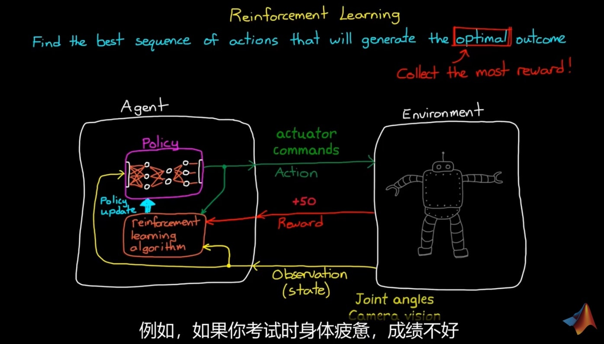

- Agent： 
由Policy 和 RL_Algorithm构成
    - policy负责将observation映射为action
    - RL_Algorithm负责优化policy

- Enviroment：
    - 输入action
    - 输出reward、state
    - 内部执行状态转移、判断是否任务终止等

## 关键定义
* Reward：根据当前状态得到的即刻奖励
* Value：根据当前状态预测的整个周期的reward（包括未来）

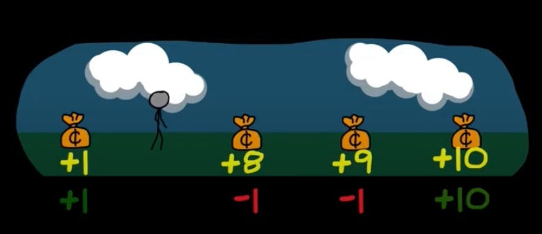

未来奖励折扣：未来Value不最优
1. reward now > reward later
2. 未来的不确定性

* Balance: exploration探索 vs exploitation利用

one step update
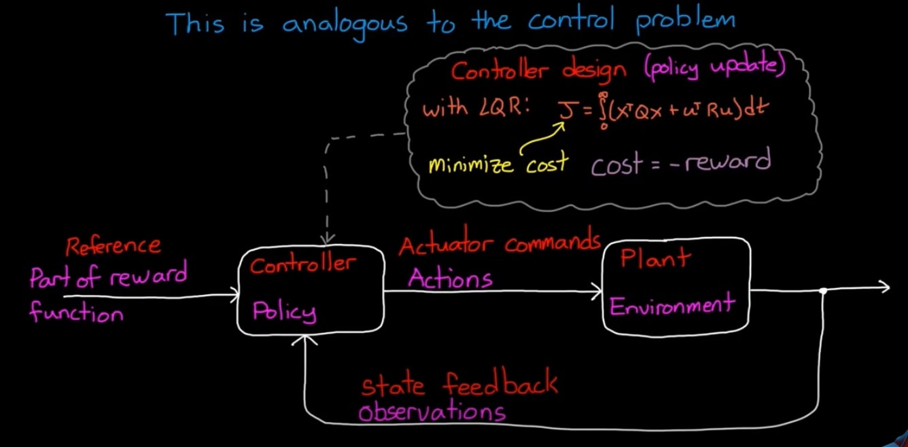
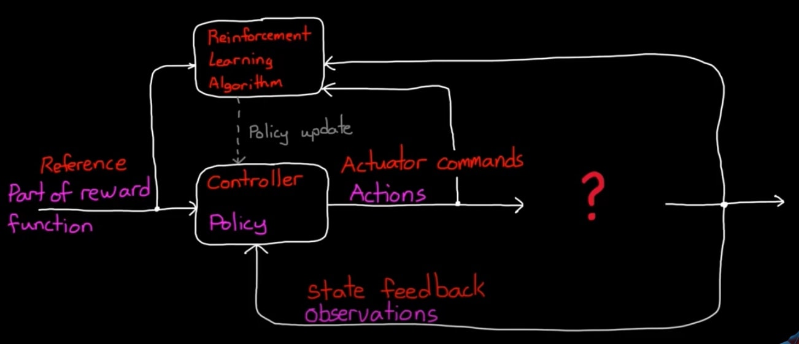

## RL workflow
* Env：Real or simulated？
* Reward signal：指导agent按预期action
* Policy：observation 映射到 action的结构
* Training：选择算法寻优
* Deploy/verify：部署agent

## 一些策略
### Q-function
更新states-action表格，根据s，选a
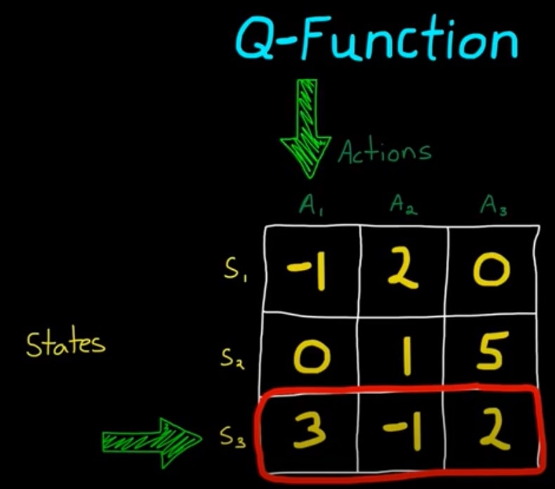

缺点：带来维度灾难
对于连续空间，构建Value = w1 * state + w2 * action
手段：函数近似器
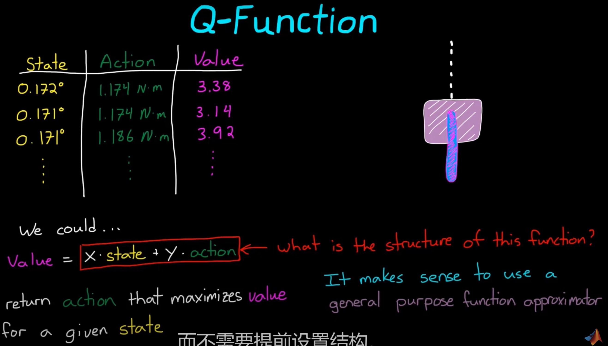

### 策略梯度法
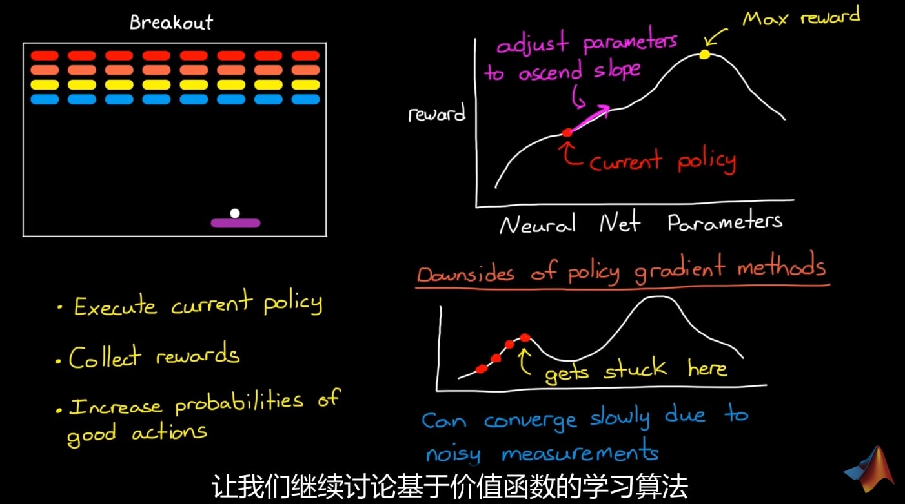

缺点：
1. 对于稀疏奖励问题，梯度小，训练慢
2. 容易陷入区间极值

### Value-function based
crictic评价网络
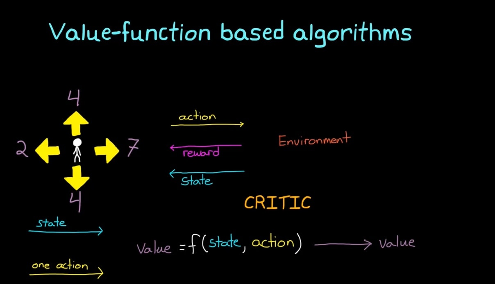
* 贝尔曼方程：
R:reward
Q:当前Q
maxQ'：未来最大的Q
γ：折扣率discount factor[0,1]
α：学习率learning rate
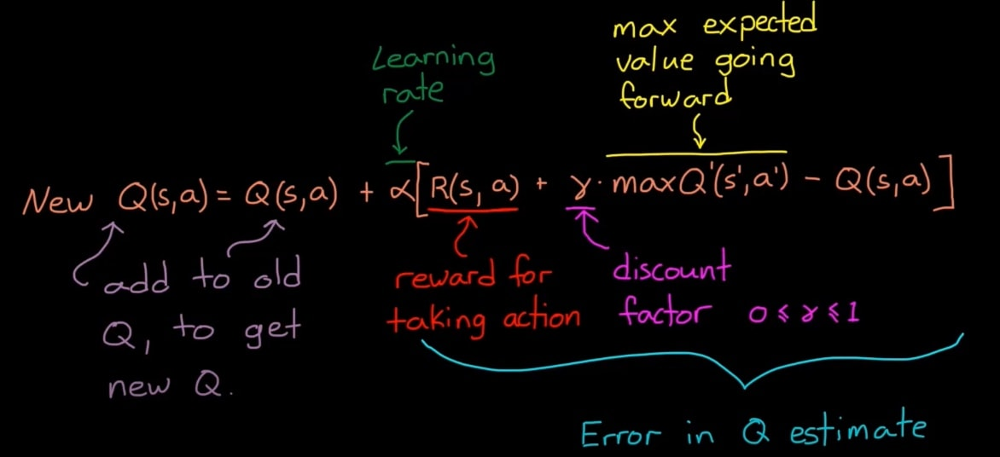


### AC算法
图中有两个网络：actor、critic
actor：根据policy给出最大概率下的action
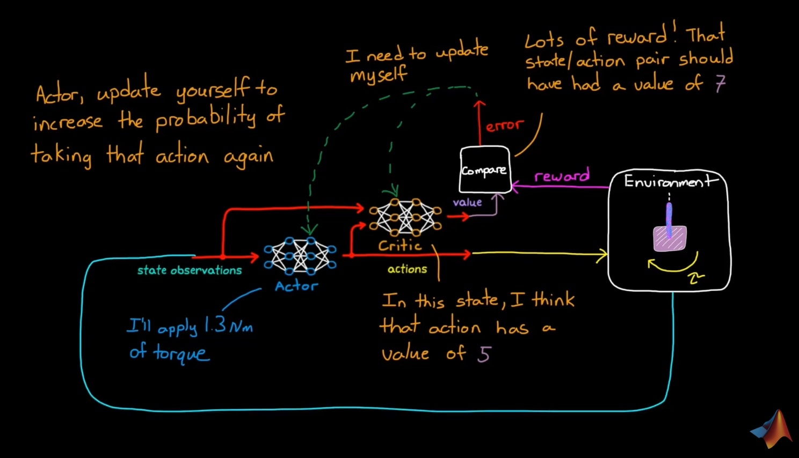

完成离线仿真和学习之后，将policy部署到硬件
RL algorithm学习能力对于适应不确定干扰和缓变环境尤为重要
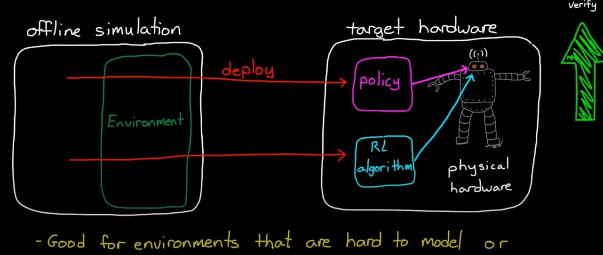

#### AC网络的执行逻辑

```
while True:  a = actor.choose_action(s)
s_,r,done,info = env.step(a)
td_error = critic.learn(s,r,s_)
actor.learn(s,a,td_error)
s = s_
```

### DDPG——deep deterministic policy gradient
#### 特点：
* 连续空间与环境学习
* 确定策略比随机快


加入视觉、雷达等传感器后，观测量维数暴增，全连接层不管用
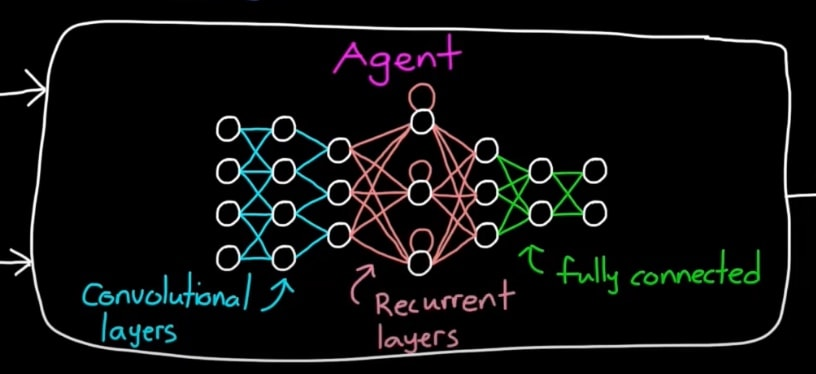


## 改进RL系统需要注意的点
鲁棒性、安全性、可变性、可验证性
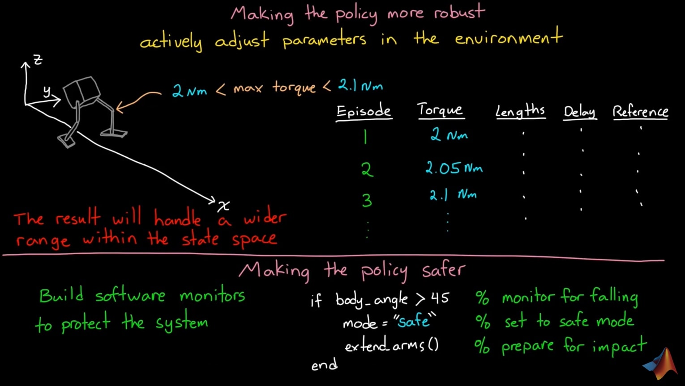

1. Robust：对于实际系统具有不确定性的值：制造装配公差引起的几何参数、力（力矩）、传感器采回的信号，送给agent前作随机处理。
2. Safety：建立monitor，在系统出问题时接管到安全模式

## 与传统控制方式的结合


### 将RL-agent用于高级任务，低级任务交给传统
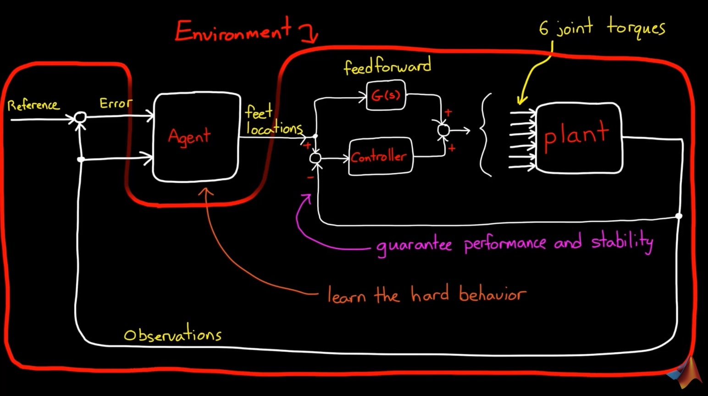


### 以传统架构实现，RL网络负责调参
优点：结构可解释， 验证性强
缺点：结构人为设计，对于复杂输入，性能非最优
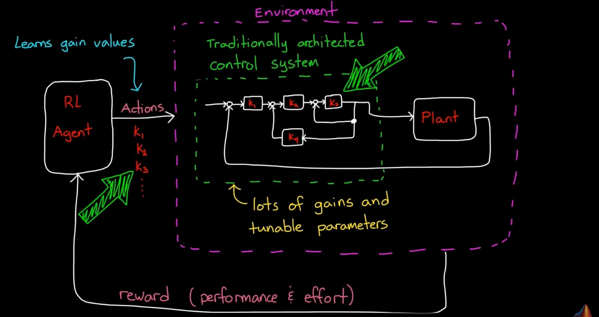


## 几种算法类型
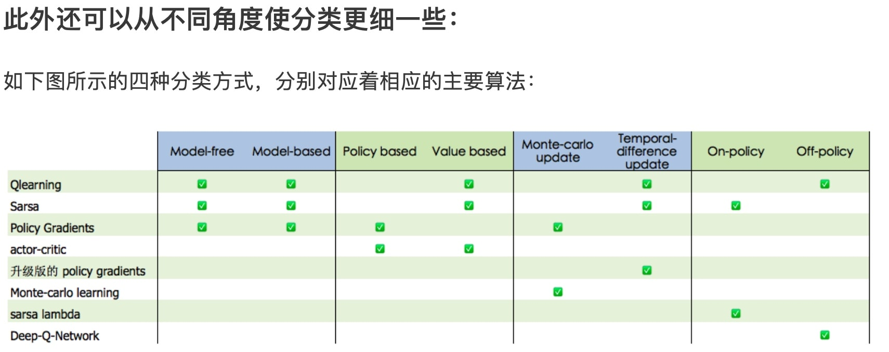

Model-free：不尝试去理解环境, 环境给什么就是什么，一步一步等待真实世界的反馈, 再根据反馈采取下一步行动。

Model-based：先理解真实世界是怎样的, 并建立一个模型来模拟现实世界的反馈，通过想象来预判断接下来将要发生的所有情况，然后选择这些想象情况中最好的那种，并依据这种情况来采取下一步的策略。它比 Model-free 多出了一个虚拟环境，还有想象力。

Policy based：通过感官分析所处的环境, 直接输出下一步要采取的各种动作的概率, 然后根据概率采取行动。

Value based：输出的是所有动作的价值, 根据最高价值来选动作，这类方法不能选取连续的动作。

Monte-carlo update：游戏开始后, 要等待游戏结束, 然后再总结这一回合中的所有转折点, 再更新行为准则。

Temporal-difference update：在游戏进行中每一步都在更新, 不用等待游戏的结束, 这样就能边玩边学习了。

On-policy：必须本人在场, 并且一定是本人边玩边学习。

Off-policy：可以选择自己玩, 也可以选择看着别人玩, 通过看别人玩来学习别人的行为准则。


