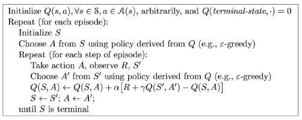
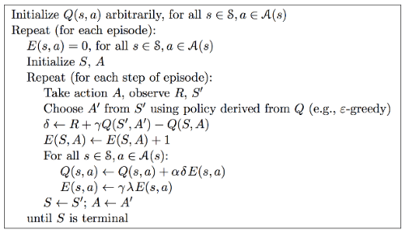

参考自知乎（叶强）
# Introduction
在实践2中，介绍了`gym`环境的定义和使用方法。
在实践1中，介绍了 动态规划DP 求解 价值函数
并没有形成一个策略Policy$\pi$来指导agent的动作选取，本节将利用SARSA（0）的学习方法，帮助agent学习到价值函数(表），指导$\epsilon$-greedy策略选取动作。

# Agent的写法

Agent的三要素是：价值函数、策略、模型

本节以Sarsa（0）为例，介绍为agent添加policy的方法
Sarsa（0）是不基于模型的控制，其动作选择策略是$\epsilon$-greedy，根据价值函数选择动作。

对于一般问题，Agent包括如下功能
- 对环境的引用
- 自身变量：Q值，状态值的记忆
- 策略方法
- 动作执行方法
- 学习方法：改进策略，这部分是关键

```python
class Agent():
    def __init__(self, env: Env):
        self.env = env      # 个体持有环境的引用
        self.Q = {}         # 个体维护一张行为价值表Q
        self.state = None   # 个体当前的观测，最好写成obs.

    def performPolicy(self, state): pass # 执行一个策略

    def act(self, a):       # 执行一个行为
        return self.env.step(a)

    def learning(self): pass   # 学习过程
```

## Agent class

SARSA（0）的伪算法流程如下：


## 核心方法：learning

```python
def learning(self, gamma, alpha, max_episode_num):
    # self.Position_t_name, self.reward_t1 = self.observe(env)
    total_time, time_in_episode, num_episode = 0, 0, 0
    while num_episode < max_episode_num: # 设置终止条件
        self.state = self.env.reset()    # 环境初始化
        s0 = self._get_state_name(self.state) # 获取个体对于观测的命名
        self.env.render()                # 显示UI界面
        a0 = self.performPolicy(s0, num_episode, use_epsilon = True)

        time_in_episode = 0
        is_done = False
        while not is_done:               # 针对一个Episode内部
            # a0 = self.performPolicy(s0, num_episode)
            s1, r1, is_done, info = self.act(a0) # 执行行为
            self.env.render()            # 更新UI界面
            s1 = self._get_state_name(s1)# 获取个体对于新状态的命名
            self._assert_state_in_Q(s1, randomized = True)
            # 获得A'
            a1 = self.performPolicy(s1, num_episode, use_epsilon=True)
            old_q = self._get_Q(s0, a0)  
            q_prime = self._get_Q(s1, a1)
            td_target = r1 + gamma * q_prime  
            #alpha = alpha / num_episode
            new_q = old_q + alpha * (td_target - old_q)
            self._set_Q(s0, a0, new_q)

            if num_episode == max_episode_num: # 终端显示最后Episode的信息
                print("t:{0:>2}: s:{1}, a:{2:2}, s1:{3}".\
                    format(time_in_episode, s0, a0, s1))

            s0, a0 = s1, a1
            time_in_episode += 1

        print("Episode {0} takes {1} steps.".format(
            num_episode, time_in_episode)) # 显示每一个Episode花费了多少步
        total_time += time_in_episode
        num_episode += 1
    return
```

## 策略方法：performPolicy

通过改变`use_epsilon`参数，可以切换SARSA 和 Q-learning
相同在于：
- 都用$\epsilon$-greedy策略进行了探索

区别在于：
- Q-learning：更激进，最优更新
 - update： $greedy$策略，评估过程的A'没有实际执行
 - control：$\epsilon-greedy$策略

- SARSA：更新和执行都用$\epsilon-greedy$策略

```python
def performPolicy(self, s, episode_num, use_epsilon):
    epsilon = 1.00 / (episode_num+1)
    Q_s = self.Q[s]
    str_act = "unknown"
    rand_value = random()
    action = None
    if use_epsilon and rand_value < epsilon:  
        action = self.env.action_space.sample()
    else:
        str_act = max(Q_s, key=Q_s.get)
        action = int(str_act)
    return action    
```

# 将Sarsa（0）升级为 Sarsa（$\lambda$）
Sarsa（$\lambda$）相较于Sarsa（0）来说，引入了视野权重的概念，不是值考虑单步的价值更新，更新方式分为前向视角和后向视角


对于离散问题的Sarsa（$\lambda$）来说，agent不仅需要维护一张Q值表，还需要维护一张E值（迹）表


- 伪算法如下



与上节的Sarsa（0）的主要不同，体现在2个方面
- Agent元素， 增加了E值，在时间尺度内记录（s，a）元组的迹值
- Learning方法中，用后向视角更新，这样可以TD更新，不用MC更新，效率更高些

E值是依附于episode存在的，每个episode初始化时，一并清零。

```python
def learning(self, lambda_, gamma, alpha, max_episode_num):
    total_time = 0
    time_in_episode = 0
    num_episode = 1
    while num_episode <= max_episode_num:
        self._resetEValue()
        s0 = self._name_state(self.env.reset())
        a0 = self.performPolicy(s0, num_episode)
        # self.env.render()

        time_in_episode = 0
        is_done = False

        # episode循环
        while not is_done:
            s1, r1, is_done, info = self.act(a0)
            # self.env.render()
            s1 = self._name_state(s1)
            self._assert_state_in_QE(s1, randomized = True)

            a1= self.performPolicy(s1, num_episode)

            q = self._get_(self.Q, s0, a0)
            q_prime = self._get_(self.Q, s1, a1)
            delta = r1 + gamma * q_prime - q

            e = self._get_(self.E, s0,a0)
            e = e + 1
            self._set_(self.E, s0, a0, e) # set E before update E

            state_action_list = list(zip(self.E.keys(),self.E.values()))
            for s, a_es in state_action_list:
                for a in range(self.env.action_space.n):
                    e_value = a_es[a]
                    old_q = self._get_(self.Q, s, a)
                    new_q = old_q + alpha * delta * e_value
                    new_e = gamma * lambda_ * e_value
                    self._set_(self.Q, s, a, new_q)
                    self._set_(self.E, s, a, new_e)

            if num_episode == max_episode_num:
                print("t:{0:>2}: s:{1}, a:{2:10}, s1:{3}".
                      format(time_in_episode, s0, a0, s1))

            s0, a0 = s1, a1
            time_in_episode += 1

        print("Episode {0} takes {1} steps.".format(
            num_episode, time_in_episode))
        total_time += time_in_episode
        num_episode += 1
    return
```


- 程序解读
    - 在上述程序中，以`dict`的形式存储E、Q值
    `E:dict = {key(s:string),value(a:dict)}` 
    这种数据结构解释了，通过遍历`E.keys()`和`a[i], for in range self.env.action_space.n`，`for s,a_es in state_action_list`即可遍历状态、动作空间组成的元组`(s,a)`，即`E[s_name][a_name]`
    - 在值的更新中，没有的创建更新到E、Q值的dict中，进而创建的list
    赋值的时候，先检测存不存在``_assert()`不存在执行`init`

```python
def _is_state_in_Q(self, s):
        return self.Q.get(s) is not None

    def _init_state_value(self, s_name, randomized = True):
        if not self._is_state_in_Q(s_name):
            self.Q[s_name], self.E[s_name] = {},{}
            for action in range(self.env.action_space.n):
                default_v = random() / 10 if randomized is True else 0.0
                self.Q[s_name][action] = default_v
                self.E[s_name][action] = 0.0

    def _assert_state_in_QE(self, s, randomized=True):
        if not self._is_state_in_Q(s):
            self._init_state_value(s, randomized)

    def _name_state(self, state): 
        '''给个体的一个观测(状态）生成一个不重复的字符串作为Q、E字典里的键
        '''
        return str(state)               

    def _get_(self, QorE, s, a):
        self._assert_state_in_QE(s, randomized=True)
        return QorE[s][a]

    def _set_(self, QorE, s, a, value):
        self._assert_state_in_QE(s, randomized=True)
        QorE[s][a] = value

    def _resetEValue(self):
        for value_dic in self.E.values():
            for action in range(self.env.action_space.n):
                value_dic[action] = 0.00
```

# 给Agent添加记忆功能

以上章节的实现，是基于agent的E、Q值表，对于**离散的、有限个**的状态空间和动作空间，实现没问题。同时没有记忆功能的Agent只能进行单一episode的学习，无法对其他的episode学习，无法进行batch学习，上限较低，对于复杂问题，为了增强学习的鲁棒性，往往需要输入数据的规模扩充，也就是对Agent有了记忆能力的要求。

## 实现方式
### 抽象基类Agent
为了让代码具有较高的复用性和可读性，提现python的集成和多态特性，将Agent抽象为一个基类，在子类中实现记忆功能。


```python
class Agent(object):
    '''Base Class of Agent
    '''
    def __init__(self, env: Env = None, 
                       trans_capacity = 0):
        # 保存一些Agent可以观测到的环境信息以及已经学到的经验
        self.env = env
        self.obs_space = env.observation_space if env is not None else None
        self.action_space = env.action_space if env is not None else None
        self.experience = Experience(capacity = trans_capacity)
        # 有一个变量记录agent当前的state相对来说还是比较方便的。要注意对该变量的维护、更新
        self.state = None   # current observation of an agent

    def performPolicy(self,policy_fun, s):
        if policy_fun is None:
            return self.action_space.sample()
        return policy_fun(s)

    def act(self, a0):
        s0 = self.state
        s1, r1, is_done, info = self.env.step(a0)
        # TODO add extra code here
        trans = Transition(s0, a0, r1, is_done, s1)
        total_reward = self.experience.push(trans)
        self.state = s1
        return s1, r1, is_done, info, total_reward

    def learning(self):
        '''need to be implemented by all subclasses
        '''
        raise NotImplementedError

    def sample(self, batch_size = 64):
        '''随机取样
        '''
        return self.experience.sample(batch_size)

    @property
    def total_trans(self):
        '''得到Experience里记录的总的状态转换数量
        '''
        return self.experience.total_trans
```

可以发现，Agent不仅维护了`env`和`state`，同时增加了一个`experience`，这是一个缓存，将个体其他周期记录的状态转换、奖励等信息记录下来，其作用时，利用这些时间尺度上互相无关联的信息，让Agent学习到更好的价值函数的近似估计。
包含关系如下所示：
- Experience
    - Episode
        - Transition

### Transition类
一个完整的状态转换（Transition）类，包括了当前的状态$s_0$和动作$a_0$，以及个体执行了动作之后的奖励$r$和新状态$s_1$，另外用一个bool变量记录了$s_1$是否是终止状态。
代码来源于：知乎（叶强）

```pyton
class Transition(object):
    def __init__(self, s0, a0, reward:float, is_done:bool, s1):
        self.data = [s0,a0,reward,is_done,s1]

    def __iter__(self):
        return iter(self.data)

    def __str__(self):
        return "s:{0:<3} a:{1:<3} r:{2:<4} is_end:{3:<5} s1:{4:<3}".\
            format(self.data[0], 
                   self.data[1], 
                   self.data[2],  
                   self.data[3], 
                   self.data[4])

    @property
    def s0(self):   return self.data[0]
    @property
    def a0(self):   return self.data[1]
    @property
    def reward(self):   return self.data[2]
    @property
    def is_done(self):   return self.data[3]
    @property
    def s1(self):   return self.data[4]
```
用`@property`函数装饰器的方法，可以快捷的调用类中的元素，将**方法**调用变为**属性**调用
其主要用于类的定义，元素属性（只读、可写）等的定义
例如用`@property`装饰了`myfunc`，则继而可以用`@myfunc.setter`装饰`myfunc`的其他设置方法，方法中，可以写规则判断等，增加`class`中变量的**可控性**。
示例

```python
t1 = Transition(s0,a0,r,False,s1)
t1.s0   #调用t1.s0(self)输出 t1.data[0]
```

### Episode
`Episode`记录了时间序列的`Transition`对象，可以构建为由`Transition`构成的`list`，
- 对于离线学习来说，可以从中抓取随机个数、无序的`Transition`

例子：


```python
class Episode(object):
    def __init__(self, e_id:int = 0) -> None:
        self.total_reward = 0   # 总的获得的奖励
        self.trans_list = []    # 状态转移列表
        self.name = str(e_id)   # 可以给Episode起个名字："成功闯关,黯然失败？"

    def push(self, trans:Transition) -> float:
        self.trans_list.append(trans)
        self.total_reward += trans.reward
        return self.total_reward

    @property
    def len(self):
        return len(self.trans_list)

    def __str__(self):
        return "episode {0:<4} {1:>4} steps,total reward:{2:<8.2f}".\
            format(self.name, self.len,self.total_reward)

    def print_detail(self):
        print("detail of ({0}):".format(self))
        for i,trans in enumerate(self.trans_list):
            print("step{0:<4} ".format(i),end=" ")
            print(trans)

    def pop(self) -> Transition:
        '''normally this method shouldn't be invoked.
        '''
        if self.len > 1:
            trans = self.trans_list.pop()
            self.total_reward -= trans.reward
            return trans
        else:
            return None

    def is_complete(self) -> bool:
        '''check if an episode is an complete episode
        '''
        if self.len == 0: 
            return False 
        return self.trans_list[self.len-1].is_done

    def sample(self,batch_size = 1):   
        '''随即产生一个trans
        '''
        return random.sample(self.trans_list, k = batch_size)

    def __len__(self) -> int:
        return self.len
```


### Experience（Memory）

- 有些模型框架用`Memory`，是乱序的`Episode`，这一步可以跨`episode`进行`Transition`记录和采样
- `Memory`需要设置容量上限`capacity`，超过上限，从早期去除`Transition`

```python
class Experience(object):
    '''this class is used to record the whole experience of an agent organized
    by an episode list. agent can randomly sample transitions or episodes from
    its experience.
'''

    def __init__(self, capacity:int = 20000):
        self.capacity = capacity    # 容量：指的是trans总数量
        self.episodes = []          # episode列表
        self.next_id = 0            # 下一个episode的Id
        self.total_trans = 0        # 总的状态转换数量

    def __str__(self):
        return "exp info:{0:5} episodes, memory usage {1}/{2}".\
                format(self.len, self.total_trans, self.capacity)

    def __len__(self):
        return self.len

    @property
    def len(self):
        return len(self.episodes)

    def _remove(self, index = 0):      
        '''扔掉一个Episode，默认第一个。
           remove an episode, defautly the first one.
           args: 
               the index of the episode to remove
           return:
               if exists return the episode else return None
        '''
        if index > self.len - 1:
            raise(Exception("invalid index"))
        if self.len > 0:
            episode = self.episodes[index]
            self.episodes.remove(episode)
            self.total_trans -= episode.len
            return episode
        else:
            return None

    def _remove_first(self):
        self._remove(index = 0)

    def push(self, trans): 
        '''压入一个状态转换
        '''
        if self.capacity <= 0:
            return
        while self.total_trans >= self.capacity: # 可能会有空episode吗？
            episode = self._remove_first()
        cur_episode = None
        if self.len == 0 or self.episodes[self.len-1].is_complete():
            cur_episode = Episode(self.next_id)
            self.next_id += 1
            self.episodes.append(cur_episode)
        else:
            cur_episode = self.episodes[self.len-1]
        self.total_trans += 1
        return cur_episode.push(trans)      #return  total reward of an episode

    def sample(self, batch_size=1): # sample transition
        '''randomly sample some transitions from agent's experience.abs
        随机获取一定数量的状态转化对象Transition
        args:
            number of transitions need to be sampled
        return:
            list of Transition.
        '''
        sample_trans = []
        for _ in range(batch_size):
            index = int(random.random() * self.len)
            sample_trans += self.episodes[index].sample()
        return sample_trans

    def sample_episode(self, episode_num = 1):  # sample episode
        '''随机获取一定数量完整的Episode
        '''
        return random.sample(self.episodes, k = episode_num)

    @property
    def last(self):
        if self.len > 0:
            return self.episodes[self.len-1]
        return None
```

在这个例子中`Experience`维护了`episode`列表、`Capacity`


# 函数估计器 Approximator

## Introduction
但是对于连续的空间，无法构建这个表，替代的解决方案是选取一个分辨率，将连续空间离散化，但是随着状态、动作的维数增加，表的规模爆炸，带来运算量的激增，这是我们不希望看到的

这里引入函数估计器的概念，利用估计器，设计（学习）映射函数，将输入（状态、动作 等）映射到输出（E、Q值 等），对于不同复杂度的问题，选取不同规模的函数估计器，一般要求函数估计器具有非线性的映射能力。

深度强化学习，是深度学习和强化学习的结合，以深度学习的网络作为工具，嵌入到强化学习的框架之下，形成对复杂问题强有力的解决工具。

## Approximator 类
原理很简单：
- 输入：状态、动作（s,a）
- 输出：价值Q(s,a,w)

对于Actor网络，输入为状态s，输出为动作a
这里的例子是 用 `pytorch`搭建一个简单的BP神经网络 作为 估计器 Approximator

```python
import numpy as np
import torch
from torch.autograd import Variable
import copy

class Approximator(torch.nn.Module):
    '''base class of different function approximator subclasses
    '''
    def __init__(self, dim_input = 1, dim_output = 1, dim_hidden = 16):
        super(Approximator, self).__init__()
        self.dim_input = dim_input
        self.dim_output = dim_output
        self.dim_hidden = dim_hidden

        self.linear1 = torch.nn.Linear(self.dim_input, self.dim_hidden)
        self.linear2 = torch.nn.Linear(self.dim_hidden, self.dim_output)
```

- 实现正向传播方法

```python
 def _forward(self, x):
        h_relu = self.linear1(x).clamp(min=0) # 实现了ReLU
        y_pred = self.linear2(h_relu)
        return y_pred
```

- 实现训练方法`fit`

```python
def fit(self, x, 
              y, 
              criterion=None, 
              optimizer=None, 
              epochs=1,
              learning_rate=1e-4):

        if criterion is None:
            criterion = torch.nn.MSELoss(size_average = False)
        if optimizer is None:
            optimizer = torch.optim.Adam(self.parameters(), lr = learning_rate)
        if epochs < 1:
            epochs = 1

        x = self._prepare_data(x)
        y = self._prepare_data(y, False)

        for t in range(epochs):
            y_pred = self._forward(x)
            loss = criterion(y_pred, y)
            optimizer.zero_grad()
            loss.backward()
            optimizer.step()

        return loss
```

- python数据类型复杂，需要对输入数据进行一定的处理


```python
 def _prepare_data(self, x, requires_grad = True):
        '''将numpy格式的数据转化为Torch的Variable
        '''
        if isinstance(x, np.ndarray):
            x = Variable(torch.from_numpy(x), requires_grad = requires_grad)
        if isinstance(x, int):
            x = Variable(torch.Tensor([[x]]), requires_grad = requires_grad)
        x = x.float()   # 从from_numpy()转换过来的数据是DoubleTensor形式
        if x.data.dim() == 1:
            x = x.unsqueeze(0)
        return x
```

- `__call__`函数可以让类，像函数一样被调用


```python
def __call__(self, x):
        '''return an output given input.
        similar to predict function
        '''
        x=self._prepare_data(x)
        pred = self._forward(x)
        return pred.data.numpy()
```

## ApproxQagent的实现
在本节，需要实现Agent基类的初始化`class ApproxQagent(Agent)`继承
同时，学习的时候从ExperienceReplay中学习，避免了单个Episode内Transition相关性带来的干扰，有利于提升Agent性能。

- ApproxQAgent初始化
ApproxQAgent继承自Agent父类，第二段的初始化过程中，执行了`__init__`方法，`super`调用了父类`Agent`的方法`__init__`进行初始化

```python
class ApproxQAgent(Agent):
    '''使用近似的价值函数实现的Q学习的个体
    '''
    def __init__(self, env: Env = None,
                       trans_capacity = 20000,
                       hidden_dim: int = 16):
        if env is None:
            raise "agent should have an environment"
        super(ApproxQAgent, self).__init__(env, trans_capacity)
        self.input_dim, self.output_dim = 1, 1

        # 适应不同的状态和行为空间类型
        if isinstance(env.observation_space, spaces.Discrete):
            self.input_dim = 1
        elif isinstance(env.observation_space, spaces.Box):
            self.input_dim = env.observation_space.shape[0]

        if isinstance(env.action_space, spaces.Discrete):
            self.output_dim = env.action_space.n
        elif isinstance(env.action_space, spaces.Box):
            self.output_dim = env.action_space.shape[0]

        # print("{},{}".format(self.input_dim, self.output_dim))
        # 隐藏层神经元数目
        self.hidden_dim = hidden_dim
        # 关键在下面两句，声明了两个近似价值函数
        # 变量Q是一个计算价值，产生loss的近似函数（网络），
        # 该网络参数在一定时间段内不更新参数
        self.Q = Approximator(dim_input = self.input_dim,
                              dim_output = self.output_dim,
                              dim_hidden = self.hidden_dim)
        # 变量PQ是一个生成策略的近似函数，该函数（网络）的参数频繁更新
        self.PQ = self.Q.clone() # 更新参数的网络
```

- 从memory中学习
  基本原理为
    - 从经验中采样
    - 构建`s0,a0,r,is_done,s1`的array
    - 创建网络训练集，`x_batch, y_batch`
    - 利用训练集训练网络，并更新网络参数

```python
def _learn_from_memory(self, gamma, batch_size, learning_rate, epochs):
    trans_pieces = self.sample(batch_size)  # 随机获取记忆里的Transmition
    states_0 = np.vstack([x.s0 for x in trans_pieces])
    actions_0 = np.array([x.a0 for x in trans_pieces])
    reward_1 = np.array([x.reward for x in trans_pieces])
    is_done = np.array([x.is_done for x in trans_pieces])
    states_1 = np.vstack([x.s1 for x in trans_pieces])

    X_batch = states_0
    y_batch = self.Q(states_0)  # 得到numpy格式的结果

    # 使用了Batch，代码是矩阵运算，有点难理解，多通过观察输出来理解
    Q_target = reward_1 + gamma * np.max(self.Q(states_1), axis=1)*\
        (~ is_done) # is_done则Q_target==reward_1
    y_batch[np.arange(len(X_batch)), actions_0] = Q_target
    # loss is a torch Variable with size of 1
    loss = self.PQ.fit(x = X_batch, 
                       y = y_batch, 
                       learning_rate = learning_rate,
                       epochs = epochs)
    mean_loss = loss.sum().data[0] / batch_size
    self._update_Q_net()
    return mean_loss
```

- `learning`方法，包含了`learn from experience`方法

基本原理：
    - 输入网络训练超参，训练episode数，奖励衰减率等参数
    - 在每个episode的生命周期，调用环境env交互，并进行学习（当Transitions数大于网络学习所需batch超参）

```python
def learning(self, gamma = 0.99,
                       learning_rate=1e-5, 
                       max_episodes=1000, 
                       batch_size = 64,
                       min_epsilon = 0.2,
                       epsilon_factor = 0.1,
                       epochs = 1):
        """learning的主要工作是构建经历，当构建的经历足够时，同时启动基于经历的学习
        """
        total_steps, step_in_episode, num_episode = 0, 0, 0
        target_episode = max_episodes * epsilon_factor
        while num_episode < max_episodes:
            epsilon = self._decayed_epsilon(cur_episode = num_episode,
                                            min_epsilon = min_epsilon, 
                                            max_epsilon = 1,
                                            target_episode = target_episode)
            self.state = self.env.reset()
            # self.env.render()
            step_in_episode = 0
            loss, mean_loss = 0.00, 0.00
            is_done = False
            while not is_done:
                s0 = self.state
                a0  = self.performPolicy(s0, epsilon)
                # act方法封装了将Transition记录至Experience中的过程，还记得吗？
                s1, r1, is_done, info, total_reward = self.act(a0)
                # self.env.render()
                step_in_episode += 1
                # 当经历里有足够大小的Transition时，开始启用基于经历的学习
                if self.total_trans > batch_size:
                    loss += self._learn_from_memory(gamma, 
                                                    batch_size, 
                                                    learning_rate,
                                                    epochs)
            mean_loss = loss / step_in_episode
            print("{0} epsilon:{1:3.2f}, loss:{2:.3f}".
                format(self.experience.last, epsilon, mean_loss))
            # print(self.experience)
            total_steps += step_in_episode
            num_episode += 1
        return   
```

- `learning`辅助代码

由于使用了Actor、Q值网络，无法使用表搜索的方法，根据Q值获取最佳的action，所以对`curpolicy`等方法进行了重写

    - 衰减的$\epsilon$-greedy方法
```python
def _decayed_epsilon(self,cur_episode: int, 
                          min_epsilon: float, 
                          max_epsilon: float, 
                          target_episode: int) -> float:
    '''获得一个在一定范围内的epsilon
    '''
    slope = (min_epsilon - max_epsilon) / (target_episode)
    intercept = max_epsilon
    return max(min_epsilon, slope * cur_episode + intercept)
```
    - 选择动作方法
```python
def _curPolicy(self, s, epsilon = None):
    '''依据更新策略的价值函数(网络)产生一个行为
    '''
    Q_s = self.PQ(s)
    rand_value = random()
    if epsilon is not None and rand_value < epsilon:
        return self.env.action_space.sample()
    else:
        return int(np.argmax(Q_s))
```
    - 执行策略方法
```python
def performPolicy(self, s, epsilon = None):
    return self._curPolicy(s, epsilon)
```
    - 将训练的权重参数赋值给正在执行价值估计的网络
```python
def _update_Q_net(self):
    '''将更新策略的Q网络(连带其参数)复制给输出目标Q值的网络
    '''
    self.Q = self.PQ.clone()
```


### 主函数
- 调用了`gym`调用了环境
- 调用`wrappers`监控变量
- 创建了基于Q值估计的Agent
- 初始化环境、开始学习

```python
from random import random, choice
from gym import Env
import gym
from gridworld import *
from core import Transition, Experience, Agent
from approximator import Approximator
from agents import ApproxQAgent
import torch


def testApproxQAgent():
    env = gym.make("MountainCar-v0")
    #env = SimpleGridWorld()
    directory = "/home/qiang/workspace/reinforce/monitor"

    env = gym.wrappers.Monitor(env, directory, force=True)
    agent = ApproxQAgent(env,
                         trans_capacity = 10000,    # 记忆容量（按状态转换数计）
                         hidden_dim = 16)           # 隐藏神经元数量
    env.reset()
    print("Learning...")  
    agent.learning(gamma=0.99,          # 衰减引子
                   learning_rate = 1e-3,# 学习率
                   batch_size = 64,     # 集中学习的规模
                   max_episodes=2000,   # 最大训练Episode数量
                   min_epsilon = 0.01,   # 最小Epsilon
                   epsilon_factor = 0.3,# 开始使用最小Epsilon时Episode的序号占最大
                                        # Episodes序号之比，该比值越小，表示使用
                                        # min_epsilon的episode越多
                   epochs = 2           # 每个batch_size训练的次数
                   )


if __name__ == "__main__":
    testApproxQAgent()
```


