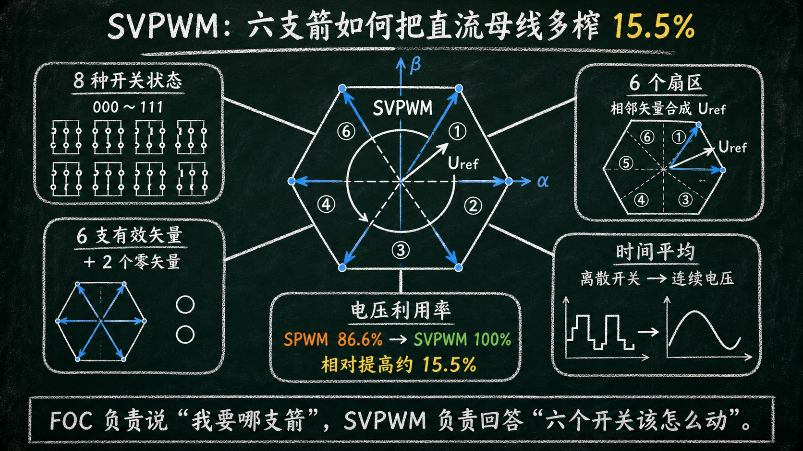
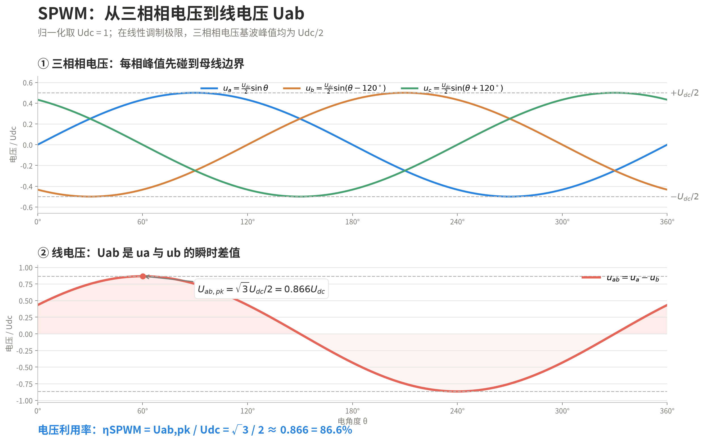
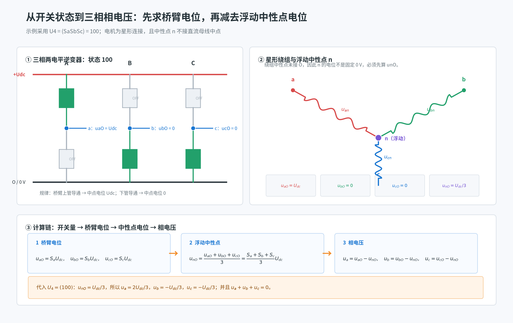
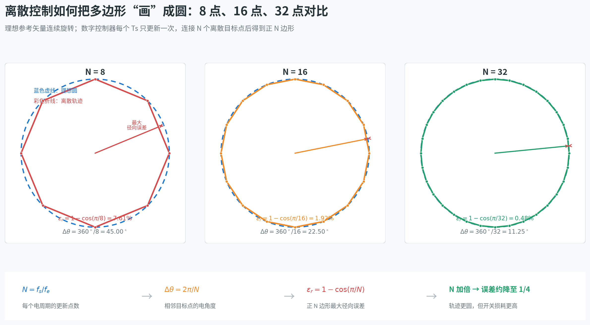
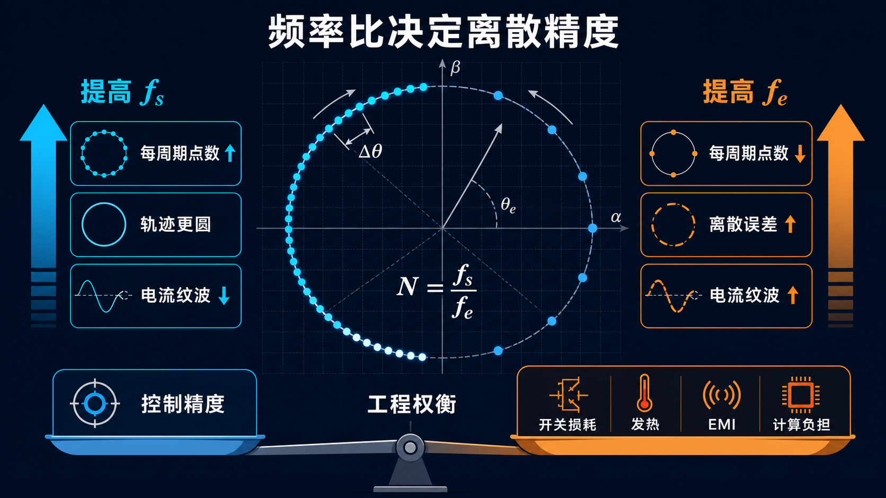
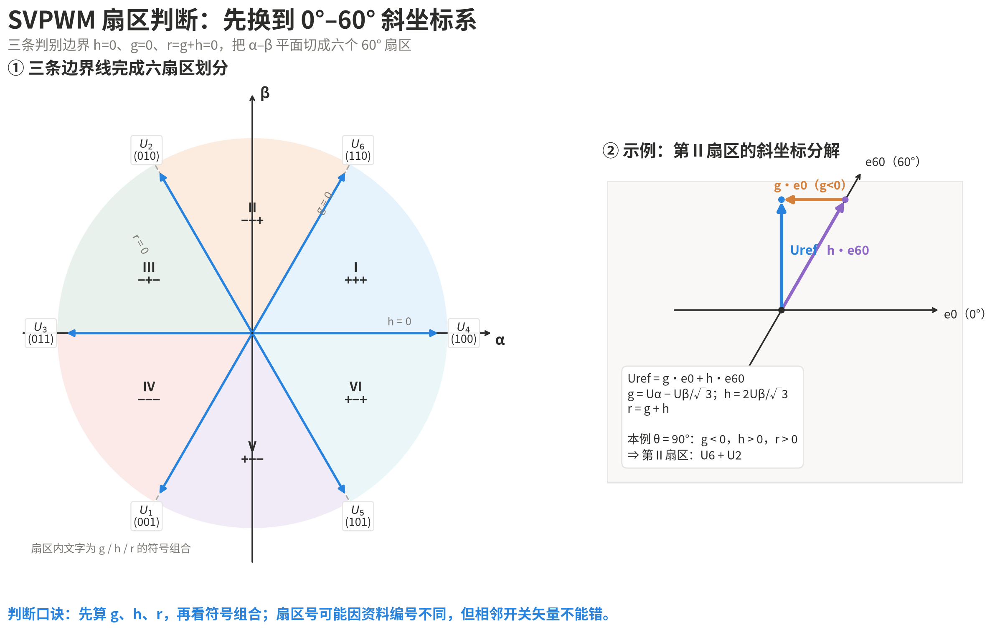
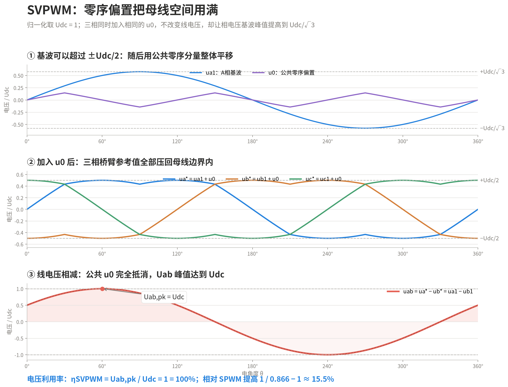
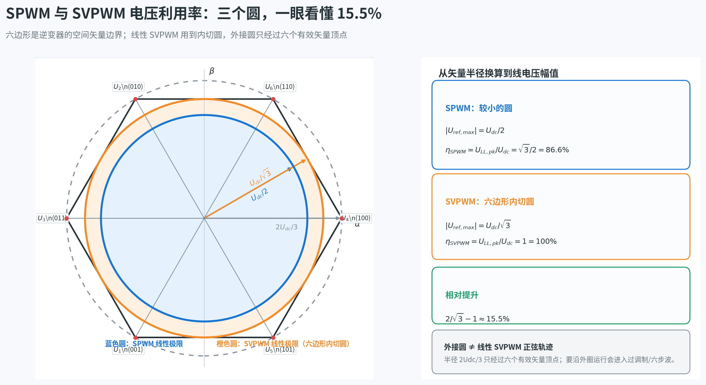

你好，我是老列 👋

上一篇讲 FOC，咱们说到最后，控制器算出目标电压，转手交给调制器；调制器再指挥六个功率管，把直流电变成电机需要的三相交流电。

最早也最直观的办法，是 **SPWM（Sinusoidal Pulse Width Modulation，正弦脉宽调制）**。

它的思路非常朴素：准备三条相差 120° 的正弦调制波，分别与同一条高频三角载波比较。正弦波高于三角波时开上管，低于三角波时开下管。改变正弦波的频率，就能改变输出频率；改变正弦波的幅值，就能改变基波电压。

这套“正弦波＋三角波＋比较器”的方案诞生于模拟控制时代，直观、通用、容易实现，直到今天仍被广泛使用。

但 SPWM 有一个不太划算的地方：**直流母线没有被充分利用。**

SPWM 分别盯着 A、B、C 三相，努力把每一相都调成正弦。在线性调制区，正弦调制波的峰值一旦碰到三角载波的上下边界，就不能再继续增大。

先看三相相电压。在线性调制极限，三相基波可以写成：

$$
u_a=\frac{U_{dc}}{2}\sin\theta
$$

$$
u_b=\frac{U_{dc}}{2}\sin\left(\theta-\frac{2\pi}{3}\right)
$$

$$
u_c=\frac{U_{dc}}{2}\sin\left(\theta+\frac{2\pi}{3}\right)
$$

三条正弦波的峰值都是 Udc/2，只是彼此错开 120°。电机绕组实际承受的是线电压。以 Uab 为例：

$$
u_{ab}=u_a-u_b
$$

把两条相电压相减：

$$
\begin{aligned}
u_{ab}
&=\frac{U_{dc}}{2}\left[\sin\theta-\sin\left(\theta-\frac{2\pi}{3}\right)\right]\\
&=\frac{\sqrt3}{2}U_{dc}\sin\left(\theta+\frac{\pi}{6}\right)
\end{aligned}
$$

所以，SPWM 在线性区能够得到的线电压基波峰值为：

$$
U_{LL,pk}=\frac{\sqrt3}{2}U_{dc}\approx0.866U_{dc}
$$

本文统一将**电压利用率定义为线电压基波幅值与直流母线电压之比**：

$$
\eta=\frac{U_{LL,pk}}{U_{dc}}
$$

因此，SPWM 的电压利用率为：

$$
\eta_{SPWM}=\frac{\sqrt3}{2}\approx0.866=86.6\%
$$

这意味着，一条 600 V 的直流母线，普通 SPWM 在线性区最多只能合成约 $600\times0.866=520\text{ V}$ 的线电压基波幅值；换算成有效值约为 367 V。

可三相电机真正关心的是**线电压**。如果把三相电压同时抬高或同时压低一截，这部分共同变化的零序电压会在线电压相减时消失，并不会改变电机看到的三相线电压。

这就暴露出一个机会：**能不能不再把三相各管各的，而是把整个逆变器当成一个整体，通过重新安排六个开关的状态和作用时间，把 SPWM 没用上的母线空间也吃干榨净？**

答案就是 SVPWM——Space Vector Pulse Width Modulation，空间矢量脉宽调制。

它把逆变器的八种开关状态看成 α-β 平面里的六支有效箭和两个零矢量，再用相邻两支箭的作用时间合成目标电压。这样一来，相电压基波峰值可以从 Udc/2 提高到 Udc/√3，线电压基波幅值可以从约 0.866Udc 提高到 Udc——**电压利用率由 86.6% 提高到 100%，线电压能力相对提高约 15.5%。**

所以，SVPWM 不是为了把简单问题故意讲复杂。它要解决的核心矛盾是：**SPWM 好用，但母线电压没用满；SVPWM 换一个观察角度，把剩下的 15% 找了回来。**

别被名字吓住。它的核心办法很朴素：**手里只有六支固定方向的箭，就让相邻两支箭轮流出现；只要时间分配得合适，它们的平均效果就等于任意方向的一支新箭。**

本篇先从逆变器的八种姿势出发，认清六支箭、旋转圆和六个扇区；下篇再把最关键的作用时间、开关顺序、15% 的来源和代码实现一次讲完。

---

## 第一步：三相逆变器其实只有八种姿势

一台两电平三相逆变器，有 A、B、C 三个桥臂。每个桥臂的上管和下管必须互补：上管开，输出点接直流母线正极；下管开，输出点接负极。

如果把上管导通记作 1、下管导通记作 0，那么三相一共只有：

> **2³ = 8 种合法开关状态**
> 

分别是 000、001、010、011、100、101、110、111。

本文按二进制开关状态的十进制值给电压矢量编号：$k=4S_a+2S_b+S_c$，状态 SaSbSc 对应 Uₖ。例如，$100_2=4$，因此记作 U₄；$011_2=3$，因此记作 U₃。

000 和 111 很特殊，分别记作 U₀ 和 U₇：三个相端同时接到同一条母线，三相线电压全为零，所以叫**零矢量**。剩下六种状态会在电机端建立非零线电压，叫**有效矢量**。

### 从开关状态怎么算到三相相电压？

约定 Sa、Sb、Sc 表示三个桥臂上管的开关状态：1 表示上管导通、桥臂中点接直流母线正极；0 表示下管导通、桥臂中点接直流母线负极。

再约定直流母线负极为参考点 O。桥臂中点 a、b、c 接到星形电机的三相绕组，绕组另一端汇合于浮动中性点 n。这里的 ua、ub、uc 指各相相对于 n 点的相电压，而不是桥臂中点相对于 O 点的电位。

**第一步：由开关状态得到三个桥臂中点电位。**

**第二步：计算浮动中性点 n 的电位。**

**第三步：用桥臂中点电位减去中性点电位。**

写成矩阵形式就是：

$$
\begin{bmatrix}
u_a\\u_b\\u_c
\end{bmatrix}
=
\frac{U_{dc}}{3}
\begin{bmatrix}
2&-1&-1\\
-1&2&-1\\
-1&-1&2
\end{bmatrix}
\begin{bmatrix}
S_a\\S_b\\S_c
\end{bmatrix}
$$

因此，八种开关状态、矢量符号与相电压的对应关系如下：

| 开关状态 SaSbSc | 矢量符号 | ua | ub | uc | 矢量方向 | 类型 |
| --- | --- | --- | --- | --- | --- | --- |
| 000 | U₀ | 0 | 0 | 0 | 原点 | 零矢量 |
| 100 | U₄ | ＋2Udc/3 | －Udc/3 | －Udc/3 | 0° | 有效矢量 |
| 110 | U₆ | ＋Udc/3 | ＋Udc/3 | －2Udc/3 | 60° | 有效矢量 |
| 010 | U₂ | －Udc/3 | ＋2Udc/3 | －Udc/3 | 120° | 有效矢量 |
| 011 | U₃ | －2Udc/3 | ＋Udc/3 | ＋Udc/3 | 180° | 有效矢量 |
| 001 | U₁ | －Udc/3 | －Udc/3 | ＋2Udc/3 | 240° | 有效矢量 |
| 101 | U₅ | ＋Udc/3 | －2Udc/3 | ＋Udc/3 | 300° | 有效矢量 |
| 111 | U₇ | 0 | 0 | 0 | 原点 | 零矢量 |

表里能直接看出两个规律：第一，任意状态下都有 ua + ub + uc = 0；第二，六个有效矢量的三相电压只是循环换位，因此它们幅值相同、方向依次相差 60°。U₀ 和 U₇ 虽然开关状态完全相反，但对应的三相相电压都为零，所以在 α-β 平面上都位于原点。

把六个有效矢量画到 α-β 平面上，会看到一个规规矩矩的正六边形：六支箭等长，相邻相差 60°；两个零矢量则趴在原点不动。

这里最值得记住的不是编号，而是物理图景：

- **开关状态是离散的**：逆变器瞬间只能输出八种结果；
- **电机需要连续的电压**：FOC 给出的参考矢量可以指向任意角度；
- **SVPWM 用时间平均，把离散开关“伪装”成连续电压。**

这就像像素只有有限种颜色，但离远看能拼出平滑渐变。电机绕组本身又是电感，天然会把高频脉冲滤成相对平滑的电流。

## 第二步：控制目标——六边形为什么最后看起来像一个圆？

参考电压矢量沿 α-β 平面匀速旋转时，会依次穿过六个扇区。每进入一个新扇区，SVPWM 就换用新的一对相邻有效矢量进行合成。

如果只看逆变器端，输出是一串硬邦邦的方波脉冲；如果看一个开关周期的平均值，参考矢量却在平滑旋转；如果再看电机电流，由于绕组电感把高频成分挡掉，留下的主要就是接近正弦的基波。

### 控制目标的提升，本质上是把这个圆画得更圆

SVPWM 要做的，是在每个控制周期里，从六个有效矢量和两个零矢量中挑选合适的成员并分配作用时间，使一个周期内的**等效电压矢量**落在参考矢量上。随着参考矢量旋转，这些等效矢量的顶点应当沿着理想的圆周前进。

但数字控制器不可能连续更新。DSP 或 MCU 只能每隔一个控制周期 Ts 计算一次，并更新一次 PWM。于是，理想的连续圆周会先被离散成 N 个目标点，再由这些点近似出一个圆。

这就像请一位手有点抖的老大爷徒手画圆：我们不能替老大爷连续控制每一笔，但可以提前在圆周上钉下一圈必须经过的点。只给 8 个点，画出来很像八边形；给 16 个点，圆味就浓了；给 32 个点，肉眼已经很难挑出毛病。**点越密，等效矢量轨迹越接近理想圆，三相电压和电流也越接近理想正弦。**

设控制或 PWM 更新频率为 fs，电机电压的基波电频率为 fe，则：

$$
f_s=\frac{1}{T_s}
$$

一个电周期内的更新点数为：

$$
N=\frac{f_s}{f_e}=\frac{1}{f_eT_s}
$$

相邻两个参考点之间的电角度步长为：

$$
\Delta\theta=\frac{2\pi}{N}=2\pi\frac{f_e}{f_s}
$$

所以，提高轨迹圆度的直接方法，就是增大 N：要么缩短控制周期、提高控制和 PWM 更新频率 fs；要么在同样的 fs 下，降低基波电频率 fe。

如果把相邻采样点用弦连接，正 N 边形相对理想圆的最大径向误差可以近似写成：

$$
\varepsilon_r=1-\cos\left(\frac{\pi}{N}\right)\approx\frac{\pi^2}{2N^2}
$$

N 增大一倍，单纯由离散点数造成的几何误差大约降到原来的四分之一。

举个例子，若 Ts = 0.1 ms，也就是 fs = 10 kHz；参考基波频率 fe = 50 Hz，则：

$$
N=\frac{10000}{50}=200
$$

$$
\Delta\theta=\frac{360°}{200}=1.8°
$$

也就是说，一个电周期被切成 200 个小扇形。只要每个 Ts 内的平均矢量准确落在对应参考点上，连接起来的轨迹就已经非常接近圆。

<aside>
⚖️

这里必须区分两个“频率”：**提高控制/PWM 更新频率 fs**，在相同电频率 fe 下会增加每个电周期的离散点数，通常有利于轨迹圆度、电流纹波和控制精度；但**提高电机基波电频率 fe**，若 fs 不变，反而会减少每周期点数。真正决定离散精度的是频率比 fs/fe，而不是单独看某一个频率。

当然，fs 也不是越高越好。开关频率提高后，功率器件单位时间内开通、关断的次数增加，开关损耗和发热通常随之上升；同时还会加重驱动损耗、死区影响、EMI 压力和处理器计算负担。因此工程设计追求的不是“无限提高频率”，而是在**轨迹圆度、控制带宽、电流纹波、器件损耗和热设计**之间找到平衡点。

</aside>

这里必须纠正一个常见说法：**SVPWM 的直接目标不是“输出正弦电流”，而是尽可能准确地合成控制器要求的三相电压。**电流是否正弦，还取决于电机模型、电流环、反电动势和采样控制。SVPWM 是调制器，不是整个电流控制系统。

这和 FOC 的分工刚好对上：

1. 速度环决定需要多少转矩；
2. 电流环算出 d、q 轴所需电压；
3. 坐标反变换得到 α-β 参考电压矢量；
4. SVPWM 把这支箭翻译成六路功率管能听懂的开关脉冲。

**FOC 负责说“我要哪支箭”，SVPWM 负责回答“六个开关该怎么动”。**

## 第三步：参考电压落在哪个扇区，就找哪两支邻箭

六个有效矢量把平面分成六个 60° 扇区。

假设参考电压矢量 **Uref** 落在第Ⅰ扇区，也就是夹在 U₄ 和 U₆ 之间。

直接调用 atan2 当然能算出角度，但实时控制里还有一种更“几何”的办法：先把 α-β 正交坐标改写成 **0°、60° 两条斜轴组成的非正交坐标系**，再根据坐标分量的符号判断扇区。

定义两条基轴：

$$
\boldsymbol e_0=\begin{bmatrix}1\\0\end{bmatrix},\qquad
\boldsymbol e_{60}=\begin{bmatrix}\frac12\\\frac{\sqrt3}{2}\end{bmatrix}
$$

其中 e0 （V4）指向 α 轴正方向，e60（V6） 相对 α 轴逆时针旋转 60°。本文统一约定：**e0 所在的 0° 斜轴为 g 轴，e60 所在的 60° 斜轴为 h 轴**。参考电压矢量沿两条基轴分解为：

$$
\boldsymbol U_{ref}=U_g\boldsymbol e_0+U_h\boldsymbol e_{60}
$$

展开并反解：

$$
U_g=U_\alpha-\frac{U_\beta}{\sqrt3}
$$

$$
U_h=\frac{2U_\beta}{\sqrt3}
$$

再定义第三条扇区边界对应的判别电压：

$$
U_r=U_g+U_h=U_\alpha+\frac{U_\beta}{\sqrt3}
$$

若采用**等幅值 Clarke 变换**：

$$
\begin{bmatrix}U_\alpha\\U_\beta\end{bmatrix}
=
\frac{2}{3}
\begin{bmatrix}
1&-\frac{1}{2}&-\frac{1}{2}\\
0&\frac{\sqrt3}{2}&-\frac{\sqrt3}{2}
\end{bmatrix}
\begin{bmatrix}U_a\\U_b\\U_c\end{bmatrix}
$$

则可直接由三相相电压得到：

$$
\begin{bmatrix}U_g\\U_h\\U_r\end{bmatrix}
=
\frac{2}{3}
\begin{bmatrix}
1&-1&0\\
0&1&-1\\
1&0&-1
\end{bmatrix}
\begin{bmatrix}U_a\\U_b\\U_c\end{bmatrix},
\qquad U_r=U_g+U_h
$$

为什么只看 Ug、Uh、Ur 的正负号就够了？因为：

- Uh = 0 对应 0°—180° 边界线，也就是 g 轴所在直线；
- Ug = 0 对应 60°—240° 边界线，也就是 h 轴所在直线；
- Ur = 0 对应 120°—300° 边界线。

三条过原点的直线正好把 α-β 平面切成六个 60° 扇区。参考矢量每跨过一条边界，就会有一个投影电压改变符号。因此，不需要求反正切，只要计算 Ug、Uh、Ur 并检查正负号，就能确定扇区。

六个扇区的判断规则如下。表中的符号组合针对扇区内部；落在边界上的零值按统一的边界规则处理。

| 扇区 | 角度范围 θ | Ug / Uh / Ur | 相邻有效矢量 | 开关状态 |
| --- | --- | --- | --- | --- |
| Ⅰ | 0° ≤ θ &lt; 60° | ＋ / ＋ / ＋ | U₄、U₆ | 100、110 |
| Ⅱ | 60° ≤ θ &lt; 120° | － / ＋ / ＋ | U₆、U₂ | 110、010 |
| Ⅲ | 120° ≤ θ &lt; 180° | － / ＋ / － | U₂、U₃ | 010、011 |
| Ⅳ | 180° ≤ θ &lt; 240° | － / － / － | U₃、U₁ | 011、001 |
| Ⅴ | 240° ≤ θ &lt; 300° | ＋ / － / － | U₁、U₅ | 001、101 |
| Ⅵ | 300° ≤ θ &lt; 360° | ＋ / － / ＋ | U₅、U₄ | 101、100 |

例如，若 Ug &lt; 0、Uh &gt; 0、Ur &gt; 0，参考矢量就在第Ⅱ扇区，应由 U₆ = 110 和 U₂ = 010 合成；若 Ug &gt; 0、Uh &lt; 0、Ur &lt; 0，则位于第Ⅴ扇区，应选 U₁ = 001 和 U₅ = 101。

工程上仍需统一边界归属。本文沿用左闭右开规则：0° 归第Ⅰ扇区，60° 归第Ⅱ扇区，依此类推；360° 按 0° 处理。边界归入前一个还是后一个扇区并没有本质区别，关键是作用时间和开关序列在边界处连续。

---

## 多出来的 15%，到底藏在哪里？

传统 SPWM 要求三相调制波各自保持标准正弦。当任意一相的调制波碰到载波峰值时，线性调制就到头了。

SVPWM 则直接从逆变器的六个有效矢量出发，并利用零矢量重新分配三相桥臂的导通时间。等效到三相调制波上，就是同时加入一个合适的零序偏置，把三条波形一起上移或下移。这个共同偏移在线电压中会抵消，却能让基波在不越过母线边界的前提下继续增大。

在 SVPWM 线性调制极限，三相**基波分量**的峰值可以提高到 Udc/√3：

$$
u_{a1}=\frac{U_{dc}}{\sqrt3}\sin\theta
$$

$$
u_{b1}=\frac{U_{dc}}{\sqrt3}\sin\left(\theta-\frac{2\pi}{3}\right)
$$

$$
u_{c1}=\frac{U_{dc}}{\sqrt3}\sin\left(\theta+\frac{2\pi}{3}\right)
$$

这三条基波的峰值约为 0.577Udc，已经超过单个桥臂允许的 ±Udc/2。SVPWM 的办法不是硬顶过去，而是给三相同时加入一个公共零序偏置 u0。采用常见的 min-max 注入方式：

$$
u_0=-\frac{\max(u_{a1},u_{b1},u_{c1})+\min(u_{a1},u_{b1},u_{c1})}{2}
$$

三个桥臂实际使用的参考电压变成：

$$
u_a^*=u_{a1}+u_0,\qquad u_b^*=u_{b1}+u_0,\qquad u_c^*=u_{c1}+u_0
$$

加入 u0 后，三相参考波不再是标准正弦，而是带有“削平”特征，但它们都被压回 ±Udc/2 的母线边界内。

再看线电压 Uab。由于 u0 同时加在 A、B 两相上，相减时会完全消失：

$$
\begin{aligned}
u_{ab}
&=u_a^*-u_b^*\\
&=(u_{a1}+u_0)-(u_{b1}+u_0)\\
&=u_{a1}-u_{b1}
\end{aligned}
$$

继续代入三相基波：

$$
\begin{aligned}
u_{ab}
&=\frac{U_{dc}}{\sqrt3}\left[\sin\theta-\sin\left(\theta-\frac{2\pi}{3}\right)\right]\\
&=U_{dc}\sin\left(\theta+\frac{\pi}{6}\right)
\end{aligned}
$$

因此，SVPWM 在线性区能够得到的线电压基波峰值为：

$$
U_{LL,pk}=U_{dc}
$$

按照“线电压基波幅值与直流母线电压之比”的统一定义：

$$
\eta_{SVPWM}=\frac{U_{LL,pk}}{U_{dc}}=1=100\%
$$

SPWM 的电压利用率为 86.6%，SVPWM 为 100%，绝对增加了 13.4 个百分点。通常所说的“多榨 15%”，指相对于 SPWM 的提升比例：

$$
\begin{aligned}
\Delta\eta
&=\frac{\eta_{SVPWM}}{\eta_{SPWM}}-1\\
&=\frac{1}{\sqrt3/2}-1\\
&=\frac{2}{\sqrt3}-1\\
&\approx0.1547=15.5\%
\end{aligned}
$$

同样使用 600 V 直流母线，SVPWM 在线性区的线电压基波幅值可达到 600 V，SPWM 约为 $600\times0.866=520\text{ V}$，多出约 80 V；若换算成有效值，则分别约为 424 V 和 367 V。

SVPWM 并没有把母线电压放大，而是利用公共零序偏置，把 SPWM 没有使用到的调制空间利用起来了。

再深入一步：**SVPWM 可以看成在三相正弦调制波中注入合适的零序分量；在特定条件下，也常被解释为注入三次谐波。**三次谐波在三相里同相，在线电压相减时会消失，因此不会直接出现在电机的三相线电压中，却能帮基波争取更多幅值空间。

所以，SPWM 和 SVPWM 并不是互不相干的两派武功：一个从“三相波形”出发，一个从“开关矢量”出发；SVPWM 的关键进步，是把三相逆变器作为一个整体来使用。

## 最后用三个圆看懂 SPWM 与 SVPWM 的电压利用率

把六个有效电压矢量的端点连起来，就得到逆变器的空间矢量六边形。这个六边形既能解释 SPWM 为什么只用到 86.6%，也能解释 SVPWM 多出来的 15.5% 到底来自哪里。

为什么能力边界恰好是六边形？两电平三相逆变器共有八种开关状态，其中 000 和 111 都落在原点，其余六种状态产生六支等长、相隔 60° 的有效电压矢量。一个 PWM 周期内，通过分配相邻有效矢量和零矢量的作用时间，可以得到这些离散矢量的加权平均值。所有非负时间组合构成六支有效矢量的凸包，凸包的边界自然就是正六边形。

FOC 的情况又不同。稳态时，d-q 坐标系中的恒定电压矢量变换到静止 α-β 坐标系后，会形成一支幅值近似恒定、方向连续旋转的参考矢量，因此它的轨迹是圆。为了让这支矢量转到任意角度都不越过逆变器的六边形能力边界，线性区允许的最大轨迹只能是六边形的内切圆。换个参照关系说，**六边形是 FOC 最大线性参考圆的外切六边形**；不能把经过六个顶点的外接圆当成 FOC 的连续线性运行边界。

在本文采用的 Clarke 变换幅值定义下，六个有效矢量的长度相同，等于六边形的外接圆半径：

$$
R=\frac{2}{3}U_{dc}
$$

但要注意：**外接圆只经过六个有效矢量的顶点，并不是线性 SVPWM 能够连续旋转的正弦参考轨迹。**如果参考矢量试图沿外接圆旋转，在六边形边中间就会越出逆变器能力边界，只能进入过调制或六步波运行。

线性 SVPWM 能够保持任意角度连续旋转的最大圆，是六边形的内切圆。其半径为：

$$
\begin{aligned}
r_{SVPWM}
&=R\cos30^\circ\\
&=\frac{2}{3}U_{dc}\cdot\frac{\sqrt3}{2}\\
&=\frac{U_{dc}}{\sqrt3}
\end{aligned}
$$

对应的线电压基波幅值为：

$$
U_{LL,pk}=\sqrt3r_{SVPWM}=U_{dc}
$$

所以：

$$
\eta_{SVPWM}=1=100\%
$$

SPWM 的参考矢量圆更小，其半径为：

$$
r_{SPWM}=\frac{U_{dc}}{2}
$$

对应的线电压基波幅值为：

$$
U_{LL,pk}=\sqrt3r_{SPWM}=\frac{\sqrt3}{2}U_{dc}
$$

因此：

$$
\eta_{SPWM}=\frac{\sqrt3}{2}\approx86.6\%
$$

两种调制策略的相对提升为：

$$
\frac{\eta_{SVPWM}}{\eta_{SPWM}}-1
=\frac{2}{\sqrt3}-1
\approx15.5\%
$$

一句话总结这三个圆：**SPWM 只画出了半径为 Udc/2 的小圆；SVPWM 通过零序注入把圆扩大到六边形内切圆 Udc/√3；六边形外接圆 2Udc/3 则只是六个有效矢量顶点所在的圆，不属于完整的线性正弦调制范围。**

---

## 下篇预告：知道用哪两支箭，还要算清它们各站多久

下篇已整理为：[SVPWM凭啥能把直流母线多榨15%？（下篇）作用时间、开关顺序与完整实现](https://app.notion.com/p/SVPWM-15-5764aded395e4776ba10fee5c4cec3a5?pvs=21)

到这里，我们已经解决了三个问题：

1. 逆变器瞬间只能输出八种开关状态；
2. 六支有效矢量为什么能围成空间矢量六边形；
3. 参考矢量落入任意扇区后，如何不用 atan2，仅凭 Ug、Uh、Ur 的符号找到相邻两支箭。

但真正落到 PWM 定时器，还差最关键的两步：

- **第四步：根据伏秒平衡，计算两支有效矢量和零矢量的作用时间；**
- **第五步：安排七段式开关顺序，把纹波、损耗和 EMI 一起压住。**

下篇会继续回答工程实现最关键的问题：两支相邻有效矢量和零矢量在一个周期内各作用多久？T0 = 0 以后又会发生什么？最后再把扇区判断、时间计算、过调制限制和定时器比较值串成一套完整实现。

> **上篇认箭、认方向；下篇算时间、排顺序。空间上没有的方向，下一篇用时间补上。**
> 

---

### 💬 老列碎碎念

SVPWM 最容易把人绕进去的地方，不是公式多，而是脑子里还在把它当成“三个 PWM 一起算”。换个视角就简单了：逆变器每个采样周期只能站在八个固定位置，控制器要做的，是在有限的时间里挑出合适的几支矢量，把平均效果凑成想要的方向和大小。

所以，八种状态、六支有效矢量、六个扇区，并不是为了把问题讲复杂，而是在给 PWM 定时器建立一张地图。至于那多出来的直流母线利用率，也不是凭空“榨”出来的——它来自三相一起协同后，参考电压可以在六边形里走得更远。

你在看 SVPWM 时，最容易卡在“空间矢量”这个名字，还是扇区判断、作用时间这些实现细节？评论区聊聊。觉得有收获的话，老规矩，**点赞、在看、转发**三连伺候，老列给你比个心。

  <strong>如果觉得这篇文章对你有帮助，</strong> 
  <strong>别忘了点赞、在看、分享三连哦！</strong>  
  👇👇👇

---

> 推荐关注公众号「探物及理」，探万物之然，及万理之源。
>
> 
