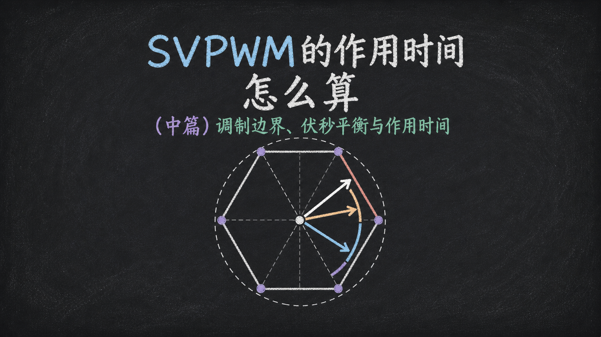
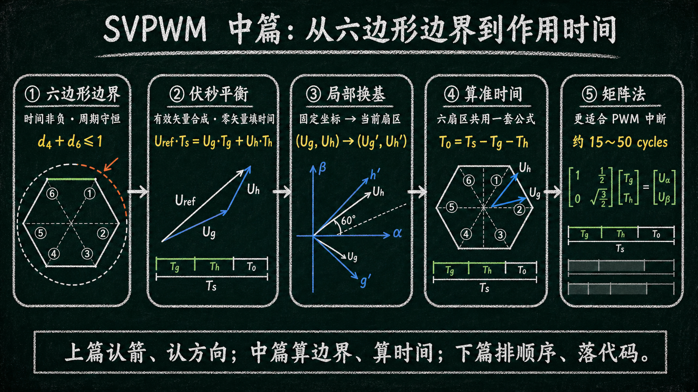
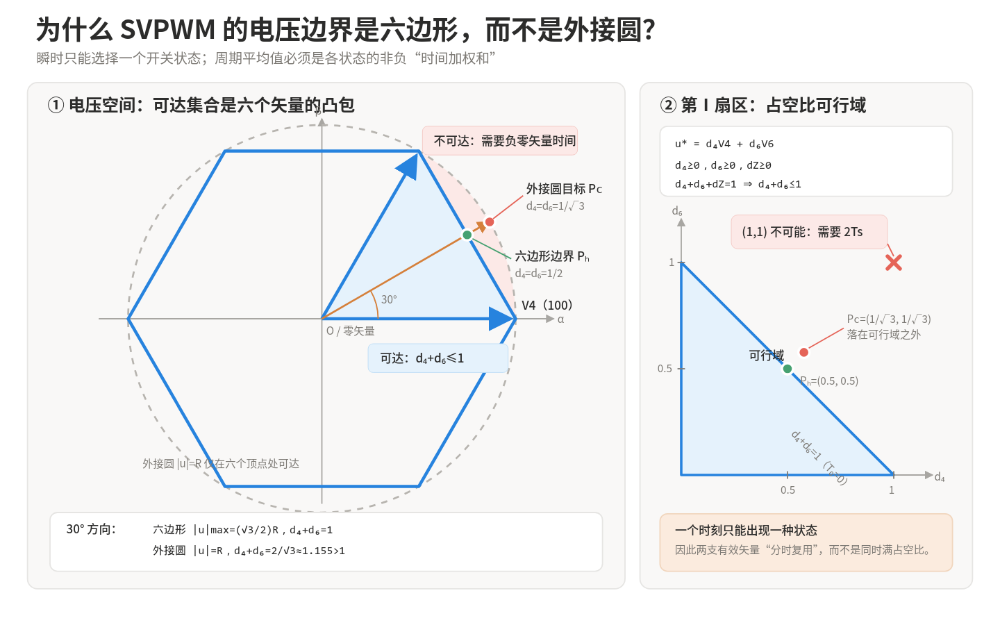
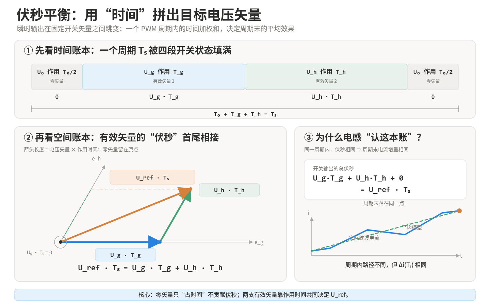
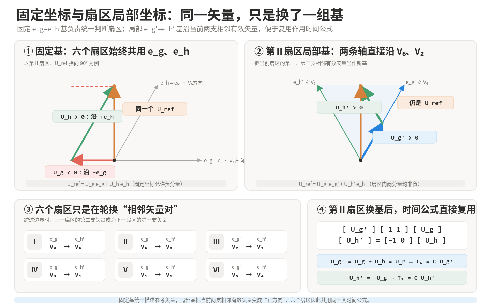
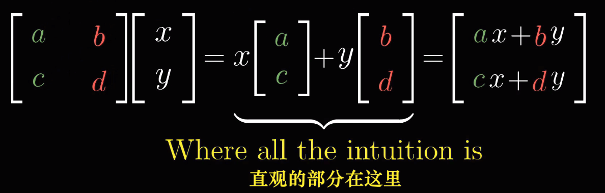
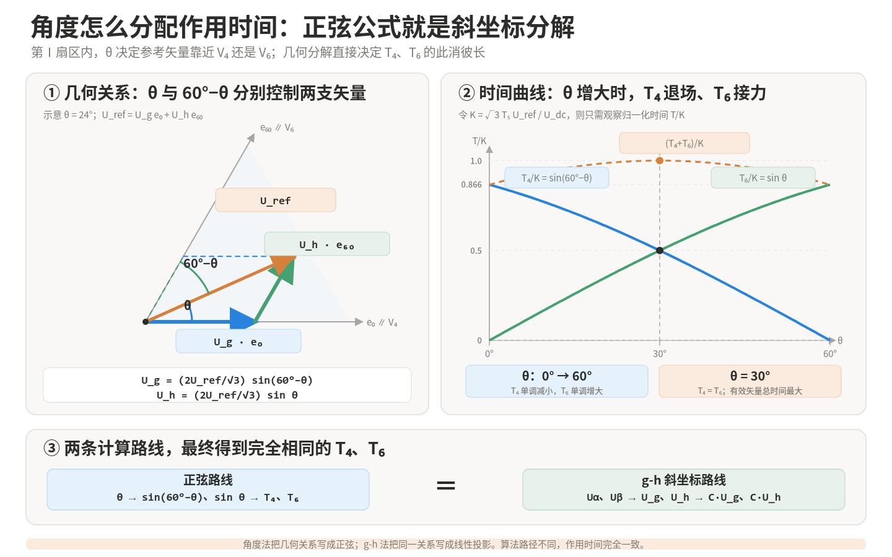

你好，我是老列 👋

在[SVPWM凭啥能把直流母线多榨15%？（上篇）六支箭、八种状态与六个扇区](/article/81722)里，我们把三相逆变器的八种开关状态翻译成了 α-β 平面里的六支有效箭和两个零矢量，并用 $U_g$ 、 $U_h$ 、 $U_r$ 的符号找到了参考电压所在的扇区。

但找对箭，只完成了一半。真正让电机在一个 PWM 周期里“看到”目标电压，还要回答： **两支相邻有效矢量各作用多久，零矢量还剩多久** ？

本篇先从“为什么调制边界是六边形，而不是外接圆”讲起，再用伏秒平衡和局部坐标变换推导六个扇区的作用时间，最后比较直接三角函数、查表法与矩阵法的工程代价。至于矢量该按什么顺序切换、五段式和七段式怎么选，将在下篇收口。

🧭**系列导航** 

｜ [SVPWM凭啥能把直流母线多榨15%？（上篇）六支箭、八种状态与六个扇区](/article/81722)

｜本篇：算边界、算时间 

｜ [SVPWM怎么落到PWM定时器？（下篇）开关顺序、过调制与完整实现](/article/81724)

---

## 01｜计算前先看边界：为什么是六边形，而不是外接圆？

有读者看完上篇后提出了一个很自然的问题： **六支有效矢量的幅值相同，端点都落在同一个圆上，为什么 SVPWM 的电压调制边界不是这条外接圆，而是把六个端点连起来的六边形** ？

这个疑问的关键，是把两件事混在了一起： **单个开关状态瞬间能输出多大的电压** ，与**一个 PWM 周期内能够合成哪些平均电压** 。外接圆回答的是前者；真正的调制边界回答的是后者，而后者必须先服从一组严格的时间约束。

先把控制器必须遵守的“时间账本”列出来：

- **作用时间非负** ：任何开关状态的作用时间都必须满足 $T_k\ge0$ ；
- **周期时间守恒** ：所有开关状态的作用时间之和必须恰好等于 $T_s$ ，既不能少，也不能多；
- **占空比总和受限** ：各状态占空比均非负且总和等于 1，因此参与合成的有效矢量占空比之和不可能超过 1，剩余时间只能由零矢量填充。

换句话说，V4 可以独占一个完整周期，V6 也可以独占一个完整周期，但它们不能在**同一个周期里各占 100%** 。一旦把这本“时间账”列出来，边界就不再由“矢量尖端能否落在圆上”决定，而由“所有允许的非负时间配比能够覆盖到哪里”决定。这个可达集合正是六个有效矢量的凸包，也就是正六边形。

任意一个瞬间，三相逆变器只能处于八种开关状态中的一种。设各状态在一个 PWM 周期内的占空比为 $d_0\sim d_7$ ，则平均输出电压满足：

$$
\boldsymbol U_{ref}=\sum_{k=1}^{6}d_k\boldsymbol V_k
$$

$$
d_k\ge 0,\qquad \sum_{k=0}^{7}d_k=1
$$

V0、V7 都是零矢量，因此不改变平均电压的方向和幅值，只占用剩余时间。上面三条约束意味着： **参考电压 $\boldsymbol U_{ref}$ 必须是八个开关矢量的非负时间加权平均，也就是这些矢量的凸组合** 。六个有效矢量的凸包恰好是正六边形；位于中心的两个零矢量不会把这个凸包向外扩张。

### 01.1｜以第Ⅰ扇区为例：V4、V6 不能同时等于 1

第Ⅰ扇区只需使用相邻有效矢量 V4、V6 和零矢量。定义：

$$
\begin{aligned}
d_4&=\frac{T_4}{T_s}\\
d_6&=\frac{T_6}{T_s}\\
d_Z&=\frac{T_0+T_7}{T_s}
\end{aligned}
$$

于是：

$$
\begin{aligned}
\boldsymbol U_{ref}&=d_4\boldsymbol V_4+d_6\boldsymbol V_6\\
d_4&\ge0,\qquad d_6\ge0,\qquad d_Z\ge0\\
d_4+d_6+d_Z&=1\\
\therefore\quad d_4+d_6&\le1
\end{aligned}
$$

这里的 `d₄` 、 `d₆` 是两种开关状态对**同一个 PWM 周期**的时间份额，不是两个可以独立拉满的增益。 `d₄ = 1` 表示整个周期都输出 V4，已经没有时间再输出 V6；同理， `d₆ = 1` 时也没有时间留给 V4。若令二者同时为 1，就需要 `T₄ + T₆ = 2Ts` ，相当于在一个周期里塞进两个周期，物理上不可能。

当 `d₄ + d₆ = 1` 时，零矢量时间恰好为零，参考矢量落在 V4、V6 两个端点之间的直线段上。这条线段就是正六边形在第Ⅰ扇区的一条边。若再向外走，就会得到 `dZ &lt; 0` ，也就是要求“负的零矢量时间”。

### 01.2｜30° 方向上的直接验证

设 $|\boldsymbol V_4|=|\boldsymbol V_6|=R$ 。在第Ⅰ扇区正中间， $\boldsymbol V_4$ 、 $\boldsymbol V_6$ 的时间必须相等：

$$
\begin{aligned}
d_4=d_6&=\frac12\\
d_4+d_6&=1,\qquad d_Z=0\\
\left|\boldsymbol U_{ref}\right|_{max}
&=\left|\frac{\boldsymbol V_4+\boldsymbol V_6}{2}\right|
=\frac{\sqrt3}{2}R
=\frac{U_{dc}}{\sqrt3}
\end{aligned}
$$

如果想让 $30^\circ$ 方向的参考矢量也到达外接圆，令 $|\boldsymbol U_{ref}|=R$ ，则必须有：

$$
\begin{aligned}
d_4=d_6&=\frac{1}{\sqrt3}\\
d_4+d_6&=\frac{2}{\sqrt3}\approx1.1547>1\\
d_Z&=1-\frac{2}{\sqrt3}\approx-0.1547
\end{aligned}
$$

这说明外接圆在两顶点之间的圆弧需要超过 100% 的有效矢量时间，因此不可达；只有 V4、V6 这类六个顶点同时属于六边形和外接圆。

更一般地，设参考矢量在第Ⅰ扇区内与 $\boldsymbol V_4$ 的夹角为 $\gamma$ ，则：

$$
\begin{aligned}
d_4&=\frac{2\left|\boldsymbol U_{ref}\right|}{\sqrt3R}\sin\left(\frac{\pi}{3}-\gamma\right)\\
d_6&=\frac{2\left|\boldsymbol U_{ref}\right|}{\sqrt3R}\sin\gamma\\
d_4+d_6&\le1
\end{aligned}
$$

由此得到该方向上的最大可达幅值：

$$
\left|\boldsymbol U_{ref}\right|_{max}
=\frac{\sqrt3R}{2\cos\left(\frac{\pi}{6}-\gamma\right)}
$$

当 $\gamma$ 从 $0^\circ$ 走到 $60^\circ$ 时，这个边界描出的正是 $\boldsymbol V_4$ 、 $\boldsymbol V_6$ 之间的直线段，而不是外接圆弧。

🎯**三个边界不要混淆** ：六边形是逆变器所有可合成平均电压的能力边界；六边形内切圆是参考矢量保持恒幅、连续旋转时的最大线性轨迹；外接圆只经过六个离散有效矢量的顶点，不是连续可用的调制边界。

## 02｜第四步：六个扇区分别该给哪支矢量多少时间？

上篇已经通过投影得到参考电压在 g、h 轴上的电压分量 $U_g$ 、 $U_h$ ，并定义 $U_r=U_g+U_h$ 。这里继续统一约定： **其中 $\boldsymbol e_0$ 对应 g 轴， $\boldsymbol e_{60}$ 对应 h 轴** ，因此：

$$
\boldsymbol U_{ref}=U_g\boldsymbol e_0+U_h\boldsymbol e_{60}
$$

这一步不再求全局角度 $\theta$ ，也不再计算正弦函数，而是直接把 **投影电压 $U_g$ 、 $U_h$ 、 $U_r$ 换算成相邻有效矢量的作用时间** 。

### 02.1｜先从伏秒平衡开始

设一个 PWM 周期为 $T_s$ 。将两支相邻有效矢量按斜坐标方向分别记为 $\boldsymbol U_g$ 、 $\boldsymbol U_h$ ，对应作用时间记为 $T_g$ 、 $T_h$ ；零矢量总共作用 $T_0$ 。一个周期内必须满足：

$$
\boldsymbol U_{ref}T_s=\boldsymbol U_gT_g+\boldsymbol U_hT_h
$$

$$
T_0=T_s-T_g-T_h
$$

零矢量 U0、U7 的幅值为 0，因此不出现在第一条等式右侧；它们只负责填满剩余的 $T_0$ 。

把这两条式子放进同一张“时间账本”和“空间账本”里，就能直观看出：零矢量只占时间，两支有效矢量的伏秒首尾相接，合成整周期的目标伏秒。

六支有效矢量的长度相同。记：

$$
U_s=\frac{2}{3}U_{dc}
$$

再定义时间换算系数：

$$
C=\frac{T_s}{U_s}=\frac{3T_s}{2U_{dc}}
$$

于是，“某个方向上的斜坐标分量”除以有效矢量长度 $U_s$ ，再乘以 $T_s$ ，就得到该方向矢量的作用时间。

### 02.2｜第Ⅰ扇区：直接比较 g、h 轴分量

第Ⅰ扇区夹在 U4 和 U6 之间，其中：

$$
\boldsymbol U_4=U_s\boldsymbol e_0,\qquad
\boldsymbol U_6=U_s\boldsymbol e_{60}
$$

伏秒平衡写成：

$$
\left(U_g\boldsymbol e_0+U_h\boldsymbol e_{60}\right)T_s
=U_s\boldsymbol e_0T_4+U_s\boldsymbol e_{60}T_6
$$

分别比较 $\boldsymbol e_0$ 、 $\boldsymbol e_{60}$ 两个方向：

$$
U_gT_s=U_sT_4,\qquad U_hT_s=U_sT_6
$$

因此：

$$
T_4=CU_g=\frac{3T_s}{2U_{dc}}U_g
$$

$$
T_6=CU_h=\frac{3T_s}{2U_{dc}}U_h
$$

$$
T_0=T_s-T_4-T_6
$$

这就是 60° 斜坐标法的关键： **坐标分量本身就对应两支相邻矢量应承担的伏秒份额，不必先计算参考矢量角度** 。

六支有效矢量在同一组斜坐标中的表达如下：

| 有效矢量 | $\boldsymbol e_0$ 轴分量 | $\boldsymbol e_{60}$ 轴分量 | 斜坐标表达式 |
| --- | --- | --- | --- |
| $\boldsymbol U_4\,(100)$ | $U_s$ | $0$ | $U_s\boldsymbol e_0$ |
| $\boldsymbol U_6\,(110)$ | $0$ | $U_s$ | $U_s\boldsymbol e_{60}$ |
| $\boldsymbol U_2\,(010)$ | $-U_s$ | $U_s$ | $U_s(-\boldsymbol e_0+\boldsymbol e_{60})$ |
| $\boldsymbol U_3\,(011)$ | $-U_s$ | $0$ | $-U_s\boldsymbol e_0$ |
| $\boldsymbol U_1\,(001)$ | $0$ | $-U_s$ | $-U_s\boldsymbol e_{60}$ |
| $\boldsymbol U_5\,(101)$ | $U_s$ | $-U_s$ | $U_s(\boldsymbol e_0-\boldsymbol e_{60})$ |

### 02.3｜从固定 $\boldsymbol e_g$-$\boldsymbol e_h$ 基到各扇区的局部 $\boldsymbol e_g'$-$\boldsymbol e_h'$ 基

先统一符号：后文不再把电压分量简写为 g、h、r。固定斜坐标系中的两个电压分量统一写作 $U_g$ 、 $U_h$ ，并定义 $U_r=U_g+U_h$ ；当前扇区局部坐标系中的两个电压分量则写作 $U_g'$ 、 $U_h'$ 。

前面定义的 $U_g$ 、 $U_h$ ，是参考矢量在一组**固定的 60° 斜坐标基**上的两个标量分量： $\boldsymbol e_g=\boldsymbol e_0$ ，沿 V4 方向； $\boldsymbol e_h=\boldsymbol e_{60}$ ，沿 V6 方向。这组固定基不会随着扇区切换而旋转。

因此，在第Ⅰ扇区中，当前使用的两支相邻有效矢量恰好就是 V4、V6，固定基与扇区局部基重合：

$$
\begin{aligned}
U_g'&=U_g,\qquad U_h'=U_h\\
T_4&=CU_g,\qquad T_6=CU_h
\end{aligned}
$$

进入其它扇区后，参与合成的相邻有效矢量已经改变，但参考矢量原来的 $U_g$ 、 $U_h$ 坐标并没有改变。为了继续复用第Ⅰ扇区的时间公式，应当为当前扇区建立一组局部坐标：

- $\boldsymbol e_g'$ ：沿该扇区第一支相邻有效矢量；
- $\boldsymbol e_h'$ ：沿该扇区第二支相邻有效矢量；
- $U_g',U_h'$ ：参考矢量在这两条局部轴上的电压分量。

于是同一个参考矢量可以写成：

$$
\boldsymbol U_{ref}
=U_g\boldsymbol e_g+U_h\boldsymbol e_h
=U_g'\boldsymbol e_g'+U_h'\boldsymbol e_h'
$$

当前扇区两支有效矢量的幅值都等于 $U_s$ ，因此伏秒平衡为：

$$
\boldsymbol U_{ref}T_s
=U_s\boldsymbol e_g'T_g'+U_s\boldsymbol e_h'T_h'
$$

在同一组局部基下直接比较系数，就得到统一的时间公式：

$$
\begin{aligned}
T_g'&=CU_g'\\
T_h'&=CU_h'\\
C&=\frac{T_s}{U_s}=\frac{3T_s}{2U_{dc}}
\end{aligned}
$$

所以，六个扇区的时间计算并不需要各推一遍伏秒平衡。 **真正随扇区变化的，只有从固定坐标** $(U_g,U_h)$ **到当前扇区局部坐标** $(U_g',U_h')$ **的变换关系** 。先完成坐标映射，再直接套用第Ⅰ扇区公式即可。

下面仍以第Ⅱ扇区为例，把“固定坐标中允许出现负分量”“局部坐标中两分量均为正”“六扇区如何轮换相邻矢量对”以及“换基后怎样直接得到作用时间”放在同一张图里。

#### 02.3.1｜第一步：写出各扇区的局部基矢

参考下图的矩阵乘法，先明确局部基 $\boldsymbol e_g',\boldsymbol e_h'$ 与固定基 $\boldsymbol e_g,\boldsymbol e_h$ 的关系。

同一个参考电压矢量在两组基下满足：

$$
\begin{bmatrix}\boldsymbol e_g & \boldsymbol e_h\end{bmatrix}
\begin{bmatrix}U_g\\U_h\end{bmatrix}
=
\begin{bmatrix}1&0\\0&1\end{bmatrix}
\begin{bmatrix}U_g\\U_h\end{bmatrix}
=
\begin{bmatrix}\boldsymbol e_g' & \boldsymbol e_h'\end{bmatrix}
\begin{bmatrix}U_g'\\U_h'\end{bmatrix}
$$

六个扇区分别把当前两支相邻有效矢量作为 $\boldsymbol e_g'$ 、 $\boldsymbol e_h'$ 。将它们写成固定 g-h 坐标，得到：

**表：各扇区局部基矢在固定 g-h 坐标中的表示**

| 扇区 | $\boldsymbol e_{g'}$ | $(g,h)$ 坐标 | $\boldsymbol e_{h'}$ | $(g,h)$ 坐标 |
| --- | --- | --- | --- | --- |
| Ⅰ | $\boldsymbol V_4$ | $(1,0)$ | $\boldsymbol V_6$ | $(0,1)$ |
| Ⅱ | $\boldsymbol V_6$ | $(0,1)$ | $\boldsymbol V_2$ | $(-1,1)$ |
| Ⅲ | $\boldsymbol V_2$ | $(-1,1)$ | $\boldsymbol V_3$ | $(-1,0)$ |
| Ⅳ | $\boldsymbol V_3$ | $(-1,0)$ | $\boldsymbol V_1$ | $(0,-1)$ |
| Ⅴ | $\boldsymbol V_1$ | $(0,-1)$ | $\boldsymbol V_5$ | $(1,-1)$ |
| Ⅵ | $\boldsymbol V_5$ | $(1,-1)$ | $\boldsymbol V_4$ | $(1,0)$ |

#### 02.3.2｜第二步：由基矩阵求 $U_g'$ 、 $U_h'$

$$
\begin{bmatrix}U_g'\\U_h'\end{bmatrix}
=
\left(\begin{bmatrix}\boldsymbol e_g' & \boldsymbol e_h'\end{bmatrix}\right)^{-1}
\begin{bmatrix}U_g\\U_h\end{bmatrix}
$$

因此，把固定坐标 $(U_g,U_h)$ 变换到当前扇区的局部坐标 $(U_g',U_h')$ ，等效为对局部基矩阵求逆，再左乘原坐标列向量。

由此得到六个扇区的直接换算关系：

**表：由固定坐标计算局部坐标**

| 扇区 | $\left[\boldsymbol e_g'\ \boldsymbol e_h'\right]^{-1}$ | $U_g'$ | $U_h'$ |
| --- | --- | --- | --- |
| Ⅰ | $\begin{bmatrix}1&0\\0&1\end{bmatrix}$ | $U_g$ | $U_h$ |
| Ⅱ | $\begin{bmatrix}1&1\\-1&0\end{bmatrix}$ | $U_g+U_h=U_r$ | $-U_g$ |
| Ⅲ | $\begin{bmatrix}0&1\\-1&-1\end{bmatrix}$ | $U_h$ | $-U_g-U_h=-U_r$ |
| Ⅳ | $\begin{bmatrix}-1&0\\0&-1\end{bmatrix}$ | $-U_g$ | $-U_h$ |
| Ⅴ | $\begin{bmatrix}-1&-1\\1&0\end{bmatrix}$ | $-U_g-U_h=-U_r$ | $U_g$ |
| Ⅵ | $\begin{bmatrix}0&-1\\1&1\end{bmatrix}$ | $-U_h$ | $U_g+U_h=U_r$ |

### 02.4｜以第Ⅱ扇区为例：先换基，再计算 V6、V2 的时间

第Ⅱ扇区的两支相邻有效矢量是 V6、V2，因此定义局部基 $\boldsymbol e_g'$ 沿 V6， $\boldsymbol e_h'$ 沿 V2。在固定 $\boldsymbol e_g$-$\boldsymbol e_h$ 基中：

$$
\boldsymbol e_g'=\frac{\boldsymbol V_6}{U_s}=\begin{bmatrix}0\\1\end{bmatrix}_{(\boldsymbol e_g,\boldsymbol e_h)},\qquad
\boldsymbol e_h'=\frac{\boldsymbol V_2}{U_s}=\begin{bmatrix}-1\\1\end{bmatrix}_{(\boldsymbol e_g,\boldsymbol e_h)}
$$

也就是说，固定电压分量与局部电压分量满足：

$$
\begin{bmatrix}U_g\\U_h\end{bmatrix}
=
\begin{bmatrix}0&-1\\1&1\end{bmatrix}
\begin{bmatrix}U_g'\\U_h'\end{bmatrix}
$$

对基矩阵求逆，或者直接查上面的变换表，可得：

$$
\begin{aligned}
U_g'&=U_g+U_h=U_r\\
U_h'&=-U_g
\end{aligned}
$$

现在不必再次展开伏秒平衡，只需把局部电压分量直接乘以时间换算系数 $C$ 。由于 $U_g'$ 对应 V6、 $U_h'$ 对应 V2，所以：

$$
\begin{aligned}
T_6&=CU_g'=C(U_g+U_h)=CU_r\\
T_2&=CU_h'=-CU_g\\
T_0&=T_s-T_6-T_2
\end{aligned}
$$

第Ⅱ扇区内 $U_g<0$ 、 $U_r=U_g+U_h>0$ ，因此 $U_g'=U_r>0$ 、 $U_h'=-U_g>0$ ，两支有效矢量的作用时间自然都是非负值。

💡**$U_r$ 为什么会出现** ？ 它不是额外引入的一条独立投影，而是第Ⅱ扇区局部电压分量 $U_g'$ 的数值： $U_g'=U_g+U_h=U_r$ 。换句话说， $T_6=CU_r$ 的根源是坐标基从固定的 $\boldsymbol e_0$-$\boldsymbol e_{60}$ ，切换成了沿 $\boldsymbol V_6$-$\boldsymbol V_2$ 的局部基。

### 02.5｜六个扇区的作用时间总表

| 扇区 | 投影电压符号 | $\boldsymbol V_{g'}$ | $\boldsymbol V_{h'}$ | 第一支矢量时间 | 第二支矢量时间 |
| --- | --- | --- | --- | --- | --- |
| Ⅰ | $U_g>0,\ U_h>0,\ U_r>0$ | $\boldsymbol V_4$ | $\boldsymbol V_6$ | $T_4=CU_g$ | $T_6=CU_h$ |
| Ⅱ | $U_g<0,\ U_h>0,\ U_r>0$ | $\boldsymbol V_6$ | $\boldsymbol V_2$ | $T_6=CU_r$ | $T_2=-CU_g$ |
| Ⅲ | $U_g<0,\ U_h>0,\ U_r<0$ | $\boldsymbol V_2$ | $\boldsymbol V_3$ | $T_2=CU_h$ | $T_3=-CU_r$ |
| Ⅳ | $U_g<0,\ U_h<0,\ U_r<0$ | $\boldsymbol V_3$ | $\boldsymbol V_1$ | $T_3=-CU_g$ | $T_1=-CU_h$ |
| Ⅴ | $U_g>0,\ U_h<0,\ U_r<0$ | $\boldsymbol U_1$ | $\boldsymbol V_5$ | $T_1=-CU_r$ | $T_5=CU_g$ |
| Ⅵ | $U_g>0,\ U_h<0,\ U_r>0$ | $\boldsymbol V_5$ | $\boldsymbol V_4$ | $T_5=-CU_h$ | $T_4=CU_r$ |

其中：

$$
U_g=U_\alpha-\frac{U_\beta}{\sqrt3},\qquad
U_h=\frac{2U_\beta}{\sqrt3},\qquad
U_r=U_g+U_h
$$

$$
C=\frac{3T_s}{2U_{dc}}
$$

无论在哪个扇区，最后都统一计算：

$$
T_0=T_s-T_g-T_h
$$

### 02.6｜与正弦公式是同一回事

在第Ⅰ扇区，若参考矢量与 0° 轴的夹角为 $\theta$ ，则根据正弦定理，有：

$$
\frac{U_{ref}}{\sin(120^\circ)}=\frac{U_g}{\sin\theta}=\frac{U_h}{\sin(60^\circ-\theta)}
$$

$$
U_g=\frac{2U_{ref}}{\sqrt3}\sin\left(\frac{\pi}{3}-\theta\right)
$$

$$
U_h=\frac{2U_{ref}}{\sqrt3}\sin\theta
$$

代入 $T_4=CU_g$ 、 $T_6=CU_h$ ，恰好得到传统正弦形式：

$$
T_4=\sqrt3T_s\frac{U_{ref}}{U_{dc}}\sin\left(\frac{\pi}{3}-\theta\right)
$$

$$
T_6=\sqrt3T_s\frac{U_{ref}}{U_{dc}}\sin\theta
$$

下图把几何分解与作用时间曲线放在一起：随着 $\theta$ 从 $0^\circ$ 增大到 $60^\circ$ ， $T_4$ 逐渐减小、 $T_6$ 逐渐增大；在扇区中线 $\theta=30^\circ$ 处，两支有效矢量的作用时间相等。

所以 g-h 轴法并没有改变 SVPWM 原理，只是把“求角度＋算三角函数”改写成了“线性变换＋查扇区表”，更适合实时控制器实现。

**代码实现顺序** ：由 $U_\alpha$ 、 $U_\beta$ 计算 $U_g$ 、 $U_h$ 、 $U_r$ → 根据符号判断扇区 → 按表计算两支有效矢量时间 → 计算 $T_0$ → 生成对称开关序列。整个作用时间计算只需要乘法、加减法和符号判断。

在浮点误差或定点量化下，扇区边界附近可能出现极小的负时间，写入定时器前应钳位到 0。若两支有效矢量的时间之和大于 $T_s$ ，使 $T_0<0$ ，则参考电压已经超出线性调制区，应先做矢量限幅或进入过调制处理。

### 02.7｜角度法这么直观，为什么还要学矩阵法？

**角度法适合讲原理，矩阵法更适合在每个 PWM 中断里重复执行** 。 三种方法算出的 $T_g'$ 、 $T_h'$ 完全相同，区别主要在运算时间和存储占用。

**查表法** 用“取数组值”代替实时计算正弦。只存 $0^\circ$ ～ $60^\circ$ 的表即可， $\sin(60^\circ-\gamma)$ 可反向索引同一张表：256 点 Q15 表约占 512 B，float32 表约占 1 KB。优点是速度稳定；代价是占用 Flash、存在量化误差，线性插值虽能提高精度，却会增加乘加运算。还要注意： **正弦查表只省掉 $\sin$ 的计算** ；若局部角 $\gamma$ 尚未得到， **仍然需要计算 $\operatorname{atan2}$ 或查询角度表** 。

下面给一个量级估算。 **统一假设为 100 MHz Cortex-M4F、float32、-O2 优化、无 CORDIC/三角函数硬件加速，输入为 $U_\alpha,U_\beta$ ，任务是计算扇区及两支非零矢量时间** 。不同数学库、编译器和 Flash 等待周期会使结果上下浮动约 2～5 倍，最终仍应以目标芯片实测为准。

| 方案 | 存储估算 | 每周期主要运算 | 周期数估算 | 100 MHz 时延 |
| --- | --- | --- | --- | --- |
| 直接三角函数 | 查表数据 0 B；若数学库尚未链接， $\operatorname{atan2f}$ 、 $\operatorname{sinf}$ 、 $\operatorname{sqrtf}$ 通常新增约 3～10 KB Flash | 1 次求幅值＋1 次 $\operatorname{atan2}$ ＋2 次 $\sin$ ＋扇区处理 | 约 500～2000 cycles | 约 5～20 μs |
| 三角函数查表 | 256 点 Q15 正弦表约 512 B，float32 约 1 KB；若增加反正切表，再增加约 0.5～2 KB Flash | 已知 $\theta$ ：2 次索引＋可选线性插值＋缩放；未知 $\theta$ ：还需软件 $\operatorname{atan2}$ | 已知 $\theta$ ：约 30～100 cycles；仍算 $\operatorname{atan2}$ ：约 250～900 cycles | 约 0.3～1 μs；或 2.5～9 μs |
| 矩阵法 | 数据表约 0～24 B；展开为 `switch-case` 时可不存矩阵，相关代码通常小于 1 KB | 约 2～4 次乘法、6～12 次加减/比较/符号变换 | 约 15～50 cycles | 约 0.15～0.5 μs |

⚙️**换算成 20 kHz PWM 的时间预算** ： $T_s=50\,\mu s$ 。仅“判区＋计算两支非零矢量时间”这一项，直接三角函数约占周期的 10%～40%；已知 $\gamma$ 的查表法约占 0.6%～2%；矩阵法约占 0.3%～1%。若查表法仍需软件计算 $\operatorname{atan2}$ ，占用会回升到约 5%～18%。所以变频器工程实现都选**矩阵法** 。

## 03｜本篇小结：先找对箭，再算准时间

1. **六边形来自时间约束** ：参考电压只能是各开关矢量的非负时间加权平均，外接圆两顶点之间的圆弧需要超过 100% 的有效矢量时间，因此不可达。
2. **作用时间来自伏秒平衡** ：在当前扇区的局部 60° 坐标系中， $U_g'$ 、 $U_h'$ 直接对应两支相邻有效矢量的伏秒份额。
3. **六扇区可以共用一套公式** ：先由固定坐标换到局部坐标，再统一计算 $T_g'=CU_g'$ 、 $T_h'=CU_h'$ 。
4. **矩阵法更适合实时实现** ：已有 $U_g$ 、 $U_h$ 、 $U_r$ 时，只需符号判断、加减法和常数乘法，不必再求角和三角函数。

## 04｜下篇预告：时间算完了，还要把顺序排好

下篇已整理为：[SVPWM凭啥能把直流母线多榨15%？（下篇）开关顺序、过调制与完整实现](/article/81724)

下一篇将继续回答三个工程问题：

- 为什么作用时间相同，开关顺序不同，纹波、损耗和 EMI 会明显不同？
- 五段式与七段式分别牺牲什么、换来什么？
- 扇区切换、过调制、比较值生成和定时器更新怎样串成一套完整实现？

> **上篇认箭、认方向；中篇算边界、算时间；下篇排顺序、落代码** 。
> 

### 💬 老列碎碎念

这一篇最容易把人绕进去的地方，是看见六支有效矢量的端点都落在同一个圆上，就下意识地把那条外接圆当成了 SVPWM 的调制边界。其实逆变器不是拿着一支可以随意伸缩、旋转的箭，而是在一个 PWM 周期里轮流使用几支固定的箭。时间只有一份，两支有效矢量多占一点，留给零矢量的时间就少一点；当零矢量时间减到零，也就走到了六边形的边上。

所以，伏秒平衡和矩阵换基看起来是在推公式，真正做的却是一件很朴素的事：先把参考电压搬到当前扇区的局部坐标里，再把两个坐标分量换算成两支相邻矢量各自该“站岗”多久。这样一来，原本像几何题的空间矢量问题，就变成了 PWM 定时器能直接执行的时间表。矩阵法也不是什么新魔法，只是把每次求角度、算三角函数，改成了更适合控制器重复执行的加减和乘法。

你在算 SVPWM 作用时间时，更容易卡在“为什么边界是六边形”，还是六个扇区的换基和时间公式？评论区聊聊。觉得这篇把时间账算明白了，老规矩， **点赞、在看、转发**三连伺候，老列给你比个心。

  <strong>如果觉得这篇文章对你有帮助，</strong> 
  <strong>别忘了点赞、在看、分享三连哦！</strong>  
  👇👇👇

---

> 推荐关注公众号「探物及理」，探万物之然，及万理之源。
>
> 
