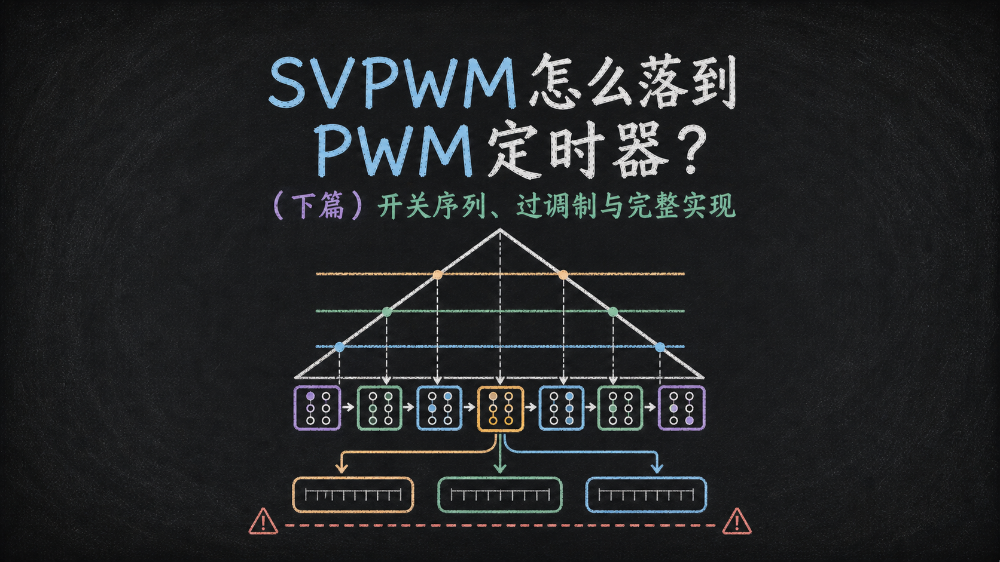
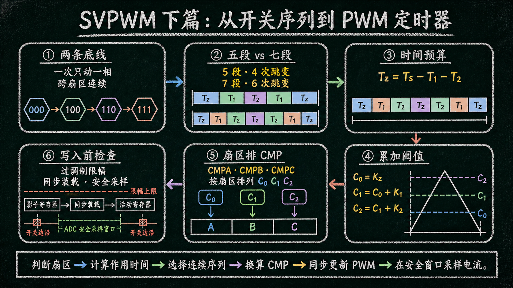
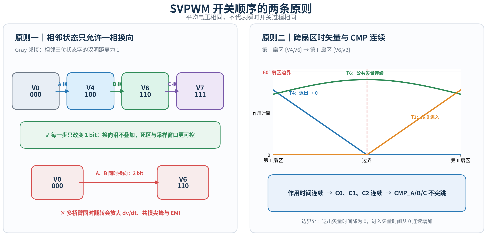
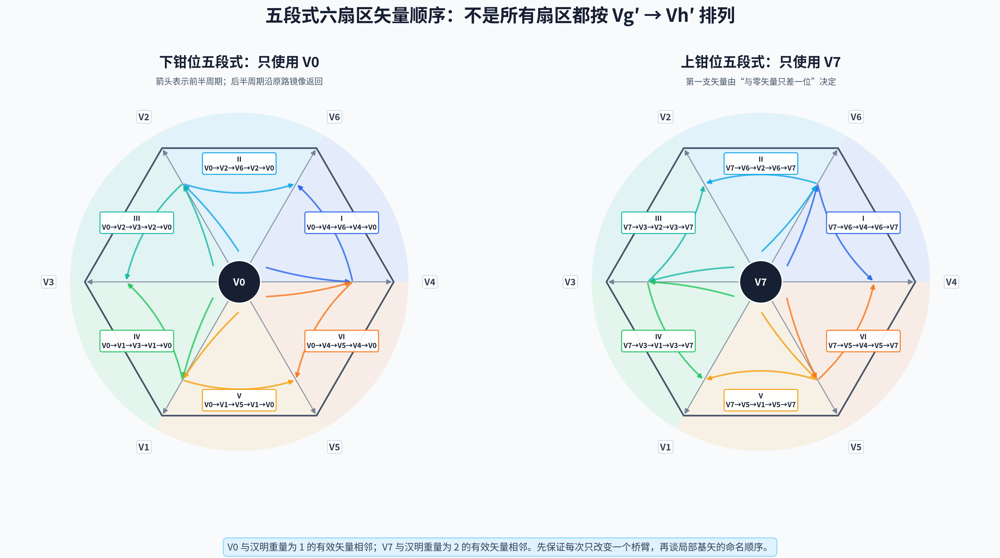
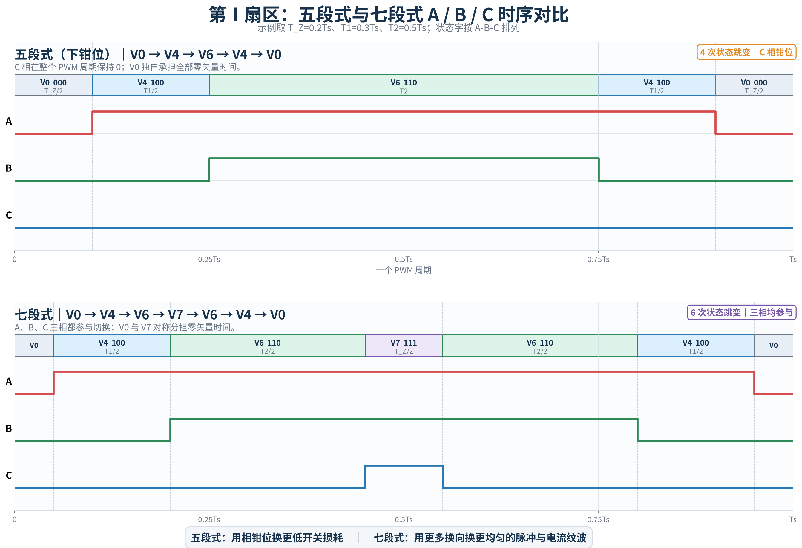
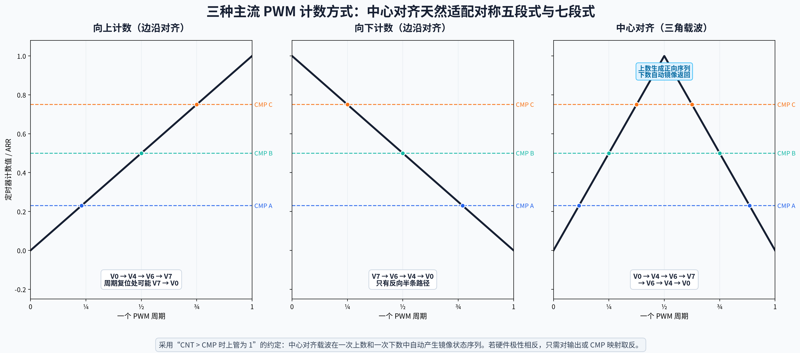
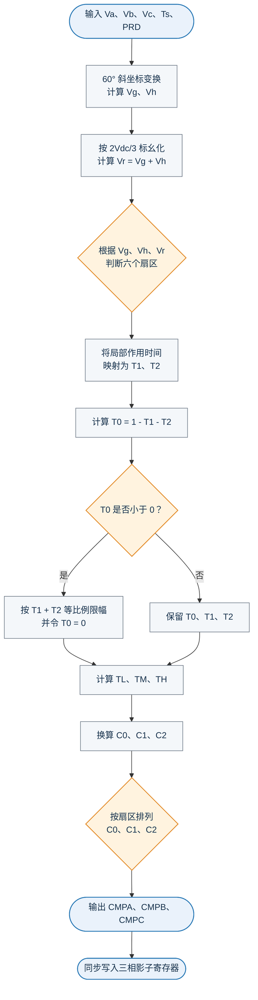

你好，我是老列 👋

在[SVPWM凭啥能把直流母线多榨15%？（上篇）六支箭、八种状态与六个扇区](/article/81722)里，我们认清了八种开关状态和六个扇区；在[SVPWM的作用时间怎么算（中篇）调制边界、伏秒平衡与作用时间](/article/81723)里，我们又算出了两支相邻有效矢量各自该站多久。

现在只剩最后一公里： **把这些时间排成不会乱跳的开关序列，再翻译成 PWM 定时器能够识别的 CMP 比较值** 。

🧭**系列导航** ｜ [SVPWM凭啥能把直流母线多榨15%？（上篇）六支箭、八种状态与六个扇区](/article/81722) ｜ [SVPWM的作用时间怎么算（中篇）调制边界、伏秒平衡与作用时间](/article/81723) ｜ 本篇：排顺序、算 CMP ｜ [SVPWM如何兼顾损耗与寿命？（番外篇）钳位策略、零矢量与IGBT热平衡](https://app.notion.com/p/SVPWM-IGBT-7bda1f55a054442992942d7e2dec2334?pvs=21)




---

## 01｜为什么作用时间算对了，还要讲究开关顺序？

$T_g$ 、 $T_h$ 、 $T_Z$ 只回答“每支矢量一共作用多久”。只要三者总时间不变，一个 PWM 周期内的平均电压就相同；但真实逆变器还必须在这些开关状态之间逐个走过去。

走法不同，会直接改变：

- 一次有几个桥臂同时换向；
- 电压矢量跳变有多大；
- 电流纹波的峰值和频谱；
- 死区误差、窄脉冲与共模电压；
- EMI、轴承电流与器件开关损耗；
- ADC 能否落在稳定、可观测的采样窗口内。

### 01.1｜第一条原则：相邻状态只允许 A、B、C 中的一相换向

把三相上管状态写成二进制 $S_AS_BS_C$ 。两状态之间若只有一位不同，就称为 Gray 邻接。例如：

$$
000\rightarrow100\rightarrow110\rightarrow111
$$

每一步分别只改变 A、B、C 中的一相。反过来，若直接从 $000$ 跳到 $110$ ，A、B 两个桥臂同时换向；若从 $000$ 跳到 $111$ ，三个桥臂同时换向。

一次只动一个桥臂的好处是：

1. 避免多个桥臂的开关沿在同一时刻叠加；
2. 减小空间电压矢量的单次跳跃；
3. 降低共模电压尖峰、寄生电容电流和 EMI；
4. 让死区、最小脉宽和故障互锁更容易管理；
5. 给电流采样留下更可预测的稳定区间。

这里说的“一相换向”，是指三相状态字一次只改变一位；同一桥臂的上下管仍由硬件互补、死区和互锁保证，绝不能同时导通。

### 01.2｜第二条原则：跨扇区时，矢量和比较值都要连续

第Ⅰ扇区使用 $V_4$ 、 $V_6$ ，第Ⅱ扇区使用 $V_6$ 、 $V_2$ 。参考矢量越过 $60^\circ$ 边界时：

- $T_4$ 应连续减小到 0；
- $T_2$ 应从 0 连续增加；
- 两区共享的 $T_6$ 保持连续；
- 三相 CMP 不应因为扇区编号变化而突然跳变。

因此，扇区切换不是把两张表硬切，而是让“退出矢量”消失、“进入矢量”出现，并把公共矢量保留下来。边界处若两个比较事件重合，应删除零宽度片段或按固定优先级合并，不能让量化误差制造一个极窄脉冲。

🔄**顺序设计的两条底线** ：扇区内部按 Gray 邻接逐相换向；扇区之间让作用时间、序列端点和三相 CMP 连续衔接。


下图把两条原则放在一起：左侧对比 Gray 邻接与多桥臂同时换向，右侧展示参考矢量跨越第Ⅰ、Ⅱ扇区边界时，退出矢量、公共矢量和进入矢量的作用时间如何连续交接。



## 02｜五段式：满足对称与逐相换向的最少段数

### 02.1｜为什么最少需要五段？

一个扇区至少要出现三种状态：一个零矢量 $Z=V_0(V_7)$ 和两支相邻有效矢量 $V_{g'}$ $V_{h'}$ 。若还要求：

- 前后关于周期中心镜像；
- 周期结束回到起始零矢量；
- 相邻状态只改变一个桥臂；

那么最短的回文路径只能是：

$$
Z\rightarrow V_{g'}\rightarrow V_{h'}\rightarrow V_{g'}\rightarrow Z
$$

这正好是五段。少于五段，无法满足01章的2个原则。

五段式每周期只有 4 次状态跳变；七段式则有 6 次。理想计数下，五段式少掉了一个桥臂的一次通断。

### 02.2｜为什么并非每个扇区都是“零矢量→$V_{g'}$→$V_{h'}$”？

局部坐标中的 $V_{g'}$ 、 $V_{h'}$ 只说明哪两支矢量参与合成，并不规定谁先出现。真正决定顺序的是二进制状态的邻接关系：

- $V_0=000$ 只能与2相下桥臂导通矢量相邻，如$V_4=100$ 、 $V_2=010$ 、 $V_1=001$ ；
- $V_7=111$ 只能与2相上桥臂导通矢量相邻，如$V_6=110$ 、 $V_3=011$ 、 $V_5=101$ 。

所以第Ⅱ扇区的相邻有效矢量虽然常按 $V_6$ 、 $V_2$ 书写，下钳位时却必须从 $V_0$ 先走到 $V_2$ ，再走到 $V_6$ ：

$$
V_0\rightarrow V_2\rightarrow V_6\rightarrow V_2\rightarrow V_0
$$

### 02.3｜六个扇区的五段式序列表

| 扇区 | 下钳位：只用 $V_0$ | 钳位相 | 上钳位：只用 $V_7$ | 钳位相 |
| --- | --- | --- | --- | --- |
| Ⅰ | $V_0\to V_4\to V_6\to V_4\to V_0$ | C=0 | $V_7\to V_6\to V_4\to V_6\to V_7$ | A=1 |
| Ⅱ | $V_0\to V_2\to V_6\to V_2\to V_0$ | C=0 | $V_7\to V_6\to V_2\to V_6\to V_7$ | B=1 |
| Ⅲ | $V_0\to V_2\to V_3\to V_2\to V_0$ | A=0 | $V_7\to V_3\to V_2\to V_3\to V_7$ | B=1 |
| Ⅳ | $V_0\to V_1\to V_3\to V_1\to V_0$ | A=0 | $V_7\to V_3\to V_1\to V_3\to V_7$ | C=1 |
| Ⅴ | $V_0\to V_1\to V_5\to V_1\to V_0$ | B=0 | $V_7\to V_5\to V_1\to V_5\to V_7$ | C=1 |
| Ⅵ | $V_0\to V_4\to V_5\to V_4\to V_0$ | B=0 | $V_7\to V_5\to V_4\to V_5\to V_7$ | A=1 |



图中箭头画的是前半周期，后半周期沿原路径镜像返回。它直观说明： **先保证相邻状态只差一位，再决定局部两支矢量谁先谁后** 。

### 02.4｜钳位相怎样跨扇区轮换？

若始终采用下钳位：

- 第Ⅰ、Ⅱ扇区钳位 C 相；
- 第Ⅲ、Ⅳ扇区钳位 A 相；
- 第Ⅴ、Ⅵ扇区钳位 B 相。

若始终采用上钳位：

- 第Ⅵ、Ⅰ扇区钳位 A 相；
- 第Ⅱ、Ⅲ扇区钳位 B 相；
- 第Ⅳ、Ⅴ扇区钳位 C 相。

每相连续钳位约 $120^\circ$ 电角度，三相在完整电周期内能够轮换；但上、下器件的损耗、共模电压与 ADC 采样窗口仍会随钳位策略改变。

五段式真正麻烦的地方就在这里：跨扇区时不仅要换有效矢量，还要管理钳位相；若运行中再切换上、下钳位，还要管理 $V_0$ 、 $V_7$ 的交接。直接从 $000$ 跳到 $111$ 会让三个桥臂同时翻转，必须用状态机、过渡序列或短暂的七段式周期衔接。

## 03｜为什么还要引入七段式？

五段式已经能正确合成平均电压，也可以做成时间轴上的镜像序列。它所谓的“不对称”，主要是：

- 每周期只使用 $V_0$ 、 $V_7$ 中的一个；
- 三相中有一个桥臂完全不切换，另外两个承担全部换向；
- 钳位相在扇区边界轮换；
- 差模脉冲、共模电压和采样窗口更依赖所选钳位策略。

这能降低开关损耗，却会让三相桥臂的活动分布和扇区衔接变得更复杂。在相同 PWM 频率下，常规五段式的部分工况还可能出现更大的峰值电流纹波或载波边带。

### 03.1｜标准七段式：把另一种零矢量放回周期中心

以 $V_0$ 首尾闭合的第Ⅰ扇区为例：

$$
V_0\rightarrow V_4\rightarrow V_6\rightarrow V_7
\rightarrow V_6\rightarrow V_4\rightarrow V_0
$$

为避免跨扇区后继续使用 $T_4$ 、 $T_6$ 这类物理矢量下标，先按开关状态中上桥臂置 1 的数量定义两类有效矢量时间：

- $T_1$ ：当前扇区中，只有 1 相上桥臂状态为 1 的有效矢量总作用时间；
- $T_2$ ：当前扇区中，有 2 相上桥臂状态为 1 的有效矢量总作用时间。

这里的下标 1、2 表示“有几相上桥臂置 1”， **不是**物理矢量 $V_1$ 、 $V_2$ 的编号。第Ⅰ扇区中， $V_4=100$ 对应 $T_1$ ， $V_6=110$ 对应 $T_2$ ，所以总零矢量时间为：

$$
T_Z=T_s-T_1(V_4)-T_2(V_6)
$$

标准对称分配为：

$$
T_{V0}=T_{V7}=\frac{T_Z}{2}
$$

因为 $V_0$ 在首尾各出现一次， $V_7$ 在中心出现一次，各段时间为：

$$
\frac{T_Z}{4},\quad
\frac{T_1}{2},\quad
\frac{T_2}{2},\quad
\frac{T_Z}{2},\quad
\frac{T_2}{2},\quad
\frac{T_1}{2},\quad
\frac{T_Z}{4}
$$

### 03.2｜六个扇区的七段式序列

| 扇区 | $V_0$ 首尾的七段式序列 |
| --- | --- |
| Ⅰ | $V_0\to V_4\to V_6\to V_7\to V_6\to V_4\to V_0$ |
| Ⅱ | $V_0\to V_2\to V_6\to V_7\to V_6\to V_2\to V_0$ |
| Ⅲ | $V_0\to V_2\to V_3\to V_7\to V_3\to V_2\to V_0$ |
| Ⅳ | $V_0\to V_1\to V_3\to V_7\to V_3\to V_1\to V_0$ |
| Ⅴ | $V_0\to V_1\to V_5\to V_7\to V_5\to V_1\to V_0$ |
| Ⅵ | $V_0\to V_4\to V_5\to V_7\to V_5\to V_4\to V_0$ |

下面仍以第Ⅰ扇区为例，把下钳位五段式和标准七段式的 A、B、C 三相开关状态画在同一时间轴上。五段式中 C 相全周期钳位为 0；七段式则让三相都参与切换，并由中央的 $V_7$ 脉冲补回另一半零矢量时间。



### 03.3｜七段式通常怎样改善电流纹波和谐波？

电流纹波来自瞬时输出矢量与参考平均矢量之间的误差：

$$
\Delta\boldsymbol i
\approx
\frac{1}{L}
\int
\left(\boldsymbol V_k-\boldsymbol U_{ref}\right)dt
$$

七段式并没有改变一周期的伏秒总量，而是改变误差电压在周期内走过的路径：

1. 三个桥臂都在每个周期内参与规则换向，等效换向分布更均匀；
2. 两支有效矢量被平分到周期前后，电压误差通常形成更小、更规则的闭合轨迹；
3. 序列结构在六个扇区中统一，不需要每周期额外决定钳位相；
4. 差模谐波更多集中在载波及其边带，电机电感更容易衰减。

但“七段式一定更好”也不严谨：它增加了开关次数，并且 $V_0\leftrightarrow V_7$ 的使用会改变共模电压。若五段式省下的损耗允许提高 PWM 频率，最终电流纹波也可能追平甚至反超。两者的损耗与寿命取舍，放在番外篇单独展开：[SVPWM如何兼顾损耗与寿命？（番外篇）钳位策略、零矢量与IGBT热平衡](https://app.notion.com/p/SVPWM-IGBT-7bda1f55a054442992942d7e2dec2334?pvs=21)。

### 03.4｜五段式与七段式放在一起看

| 比较项 | 五段式 | 七段式 |
| --- | --- | --- |
| 每周期状态段 | 5 | 7 |
| 状态跳变 | 4 次 | 6 次 |
| 零矢量 | 只用 $V_0$ 或 $V_7$ | 同时使用 $V_0$ 、 $V_7$ |
| 桥臂活动 | 一相钳位，另两相切换 | 三相均参与切换 |
| 同频率差模纹波 | 部分工况较大 | 通常更低、更均匀 |
| 开关损耗 | 通常较低 | 通常较高 |
| 扇区切换 | 还要管理钳位相与零矢量 | 规则统一，较容易连续 |
| 推荐起点 | 热设计或效率受限后再引入 | 通用高性能控制默认方案 |

## 04｜从七段式序列到 PWM 定时器 CMP

概念讲到这里，读者最容易卡住的是：序列表里的 $V_0$ 、 $V_4$ 、 $V_6$ 、 $V_7$ ，到底怎样变成 MCU 的三个比较寄存器？

这里继续沿用[SVPWM的作用时间怎么算（中篇）调制边界、伏秒平衡与作用时间](/article/81723)的输出：先得到当前扇区局部两支矢量的作用时间 $T_{g'}$ 、 $T_{h'}$ ，再根据开关状态中上桥臂置 1 的数量，把它们映射为 $T_1$ 、 $T_2$ 。完成这一步后，CMP 计算统一只使用 $T_Z$ 、 $T_1$ 、 $T_2$ 。

### 04.1｜为什么中心对齐三角载波天然适配？

常见 PWM 计数方式有三种：

- **向上计数** ：计数器从 0 增加到 ARR 后复位，生成边沿对齐 PWM；
- **向下计数** ：从 ARR 减小到 0，是向上计数的镜像；
- **中心对齐** ：计数器按 $0\to ARR\to0$ 往返，形成三角载波。



中心对齐的关键优势是： **同一组 CMP 在上数阶段生成正向序列，在下数阶段自动按相反顺序返回** 。因此，一个比较寄存器既给出上升沿，也给出镜像下降沿，天然适合五段式和七段式的回文结构。

### 04.2｜先规定定时器输出逻辑

设定时器计数：

$$
CNT:0\rightarrow N\rightarrow0,\qquad N=ARR
$$

一个完整 PWM 周期为 $T_s$ 。这里约定三相上管状态满足：

$$
S_x=
\begin{cases}
1,&CNT>CMP_x\\
0,&CNT\le CMP_x
\end{cases}
$$

这样在计数器谷值附近三相都是 0，对应 $V_0$ ；接近峰值时三相都是 1，对应 $V_7$ 。若具体 MCU 使用“$CNT < CMP$ 时输出高电平”，只需反转输出极性或把比较值映射为 $N - CMP_x$ 。

沿用中篇的局部时间定义：

- $V_{g'}$ ：当前扇区局部 g′ 轴对应的有效矢量，作用时间为 $T_{g'}$ ；
- $V_{h'}$ ：当前扇区局部 h′ 轴对应的有效矢量，作用时间为 $T_{h'}$ 。

进入开关序列生成后，再按状态字的汉明重量统一定义：

- $T_1$ ：状态字中只有 1 个“1”的有效矢量时间，即 $V_4=100$ 、 $V_2=010$ 、 $V_1=001$ 三者之一；
- $T_2$ ：状态字中有 2 个“1”的有效矢量时间，即 $V_6=110$ 、 $V_3=011$ 、 $V_5=101$ 三者之一；
- $T_Z=T_s-T_1-T_2$ ：两个零矢量合计的作用时间。

🔢**其中 $T_1$ 、 $T_2$ 不是 $V_1$ 、 $V_2$ 的作用时间** 。下标只表示当前有效矢量的三位状态字中有 1 个还是 2 个“1”。


六个扇区中， $T_1$ 、 $T_2$ 与中篇 $T_{g'}$ 、 $T_{h'}$ 的关系如下：

| 扇区 | $V_{g'}$ ，作用 $T_{g'}$ | $V_{h'}$ ，作用 $T_{h'}$ | $T_1$ 对应 | $T_2$ 对应 | 时间关系 |
| --- | --- | --- | --- | --- | --- |
| Ⅰ | $V_4=100$ | $V_6=110$ | $V_4$ | $V_6$ | $T_1=T_{g'},\ T_2=T_{h'}$ |
| Ⅱ | $V_6=110$ | $V_2=010$ | $V_2$ | $V_6$ | $T_1=T_{h'},\ T_2=T_{g'}$ |
| Ⅲ | $V_2=010$ | $V_3=011$ | $V_2$ | $V_3$ | $T_1=T_{g'},\ T_2=T_{h'}$ |
| Ⅳ | $V_3=011$ | $V_1=001$ | $V_1$ | $V_3$ | $T_1=T_{h'},\ T_2=T_{g'}$ |
| Ⅴ | $V_1=001$ | $V_5=101$ | $V_1$ | $V_5$ | $T_1=T_{g'},\ T_2=T_{h'}$ |
| Ⅵ | $V_5=101$ | $V_4=100$ | $V_4$ | $V_5$ | $T_1=T_{h'},\ T_2=T_{g'}$ |

因此，奇数扇区有 $T_1=T_{g'}$ 、 $T_2=T_{h'}$ ；偶数扇区有 $T_1=T_{h'}$ 、 $T_2=T_{g'}$ 。无论在哪个扇区， $V_0$ 首尾七段式都先经过“1 相上桥臂置 1”的有效矢量，再经过“2 相上桥臂置 1”的有效矢量，完整时间序列统一为：

$$
\frac{T_Z}{4},\quad
\frac{T_1}{2},\quad
\frac{T_2}{2},\quad
\frac{T_Z}{2},\quad
\frac{T_2}{2},\quad
\frac{T_1}{2},\quad
\frac{T_Z}{4}
$$

定义从作用时间到计数增量的统一换算：

$$
K_Z=\frac{N T_Z}{2T_s}
$$

$$
K_1=\frac{N T_1}{T_s},\qquad
K_2=\frac{N T_2}{T_s}
$$

为什么 $K_Z$ 带 $1/2$ ？因为首端的 $V_0$ 只占 $T_Z/4$ ，而计数器上数半周期只有 $T_s/2$ ：

$$
K_Z=N\frac{T_Z/4}{T_s/2}=\frac{NT_Z}{2T_s}
$$

两支有效矢量在上数阶段分别作用 $T_1/2$ 、 $T_2/2$ ，对应计数增量为：

$$
N\frac{T_1/2}{T_s/2}=\frac{NT_1}{T_s}=K_1
$$

$$
N\frac{T_2/2}{T_s/2}=\frac{NT_2}{T_s}=K_2
$$

为了避免在六扇区 CMP 表中反复书写累加式，再定义三个按时间先后排列的比较阈值：

$$
C_0=K_Z
$$

$$
C_1=C_0+K_1=K_Z+K_1
$$

$$
C_2=C_1+K_2=K_Z+K_1+K_2
$$

其中 $C_0\le C_1\le C_2$ 。它们分别表示上数阶段的第一次、第二次和第三次桥臂翻转时刻， **并不固定属于 A、B、C 中的某一相** ；具体分配由扇区决定。

### 04.3｜第Ⅰ扇区：三个比较值如何出现？

第Ⅰ扇区中：

$$
V_{g'}=V_4=100,\qquad V_{h'}=V_6=110
$$

因此：

$$
T_1=T_{g'}\;(V_4),\qquad T_2=T_{h'}\;(V_6)
$$

完整七段式及其时间序列分别为：

$$
V_0\rightarrow V_4\rightarrow V_6\rightarrow V_7
\rightarrow V_6\rightarrow V_4\rightarrow V_0
$$

$$
\frac{T_Z}{4},\quad
\frac{T_1}{2},\quad
\frac{T_2}{2},\quad
\frac{T_Z}{2},\quad
\frac{T_2}{2},\quad
\frac{T_1}{2},\quad
\frac{T_Z}{4}
$$

上数阶段对应：

$$
000\rightarrow100\rightarrow110\rightarrow111
$$

于是：

- 计数到 $C_0=K_Z$ ， $V_0$ 的首段结束，A 相翻为 1；
- 计数到 $C_1=C_0+K_1$ ， $V_4$ 的 $T_1/2$ 结束，B 相翻为 1；
- 计数到 $C_2=C_1+K_2$ ， $V_6$ 的 $T_2/2$ 结束，C 相翻为 1；
- 到达峰值前后连续保持 $V_7$ ，两侧合计形成中央的 $T_Z/2$ 。

因此第Ⅰ扇区只需把三个有序阈值依次分配给 A、B、C：

$$
CMP_A=C_0
$$

$$
CMP_B=C_1
$$

$$
CMP_C=C_2
$$

计数器越过峰值后自动按 $111\to110\to100\to000$ 返回，完整七段式无需软件逐段切换 GPIO。换到其它扇区后， $C_0$ 、 $C_1$ 、 $C_2$ 的数值定义保持不变，只改变它们与 A、B、C 三相的对应关系。

### 04.4｜六个扇区只需排列 $C_0$ 、 $C_1$ 、 $C_2$

| 扇区 | 上数阶段 | $CMP_A$ | $CMP_B$ | $CMP_C$ |
| --- | --- | --- | --- | --- |
| Ⅰ | $V_0\to V_4(T_1)\cdot\cdot\cdot V_6(T_2)\to V_7$ | $C_0$ | $C_1$ | $C_2$ |
| Ⅱ | $V_0\to V_2(T_1)\cdot\cdot\cdot V_6(T_2)\to V_7$ | $C_1$ | $C_0$ | $C_2$ |
| Ⅲ | $V_0\to V_2(T_1)\cdot\cdot\cdot V_3(T_2)\to V_7$ | $C_2$ | $C_0$ | $C_1$ |
| Ⅳ | $V_0\to V_1(T_1)\cdot\cdot\cdot V_3(T_2)\to V_7$ | $C_2$ | $C_1$ | $C_0$ |
| Ⅴ | $V_0\to V_1(T_1)\cdot\cdot\cdot V_5(T_2)\to V_7$ | $C_1$ | $C_2$ | $C_0$ |
| Ⅵ | $V_0\to V_4(T_1)\cdot\cdot\cdot V_5(T_2)\to V_7$ | $C_0$ | $C_2$ | $C_1$ |

对应上管占空比为：

$$
d_x=1-\frac{CMP_x}{N}
$$

例如第Ⅰ扇区若：

$$
T_s=100\,\mu s,\quad T_1=30\,\mu s,\quad T_2=50\,\mu s,\quad T_Z=20\,\mu s
$$

且 $N=5000$ ，则：

$$
K_Z=500,\qquad K_1=1500,\qquad K_2=2500
$$

先计算三个有序阈值：

$$
C_0=500,\qquad C_1=2000,\qquad C_2=4500
$$

第Ⅰ扇区映射为：

$$
CMP_A=C_0=500,\qquad CMP_B=C_1=2000,\qquad CMP_C=C_2=4500
$$

因此：

$$
d_A=0.9,\qquad d_B=0.6,\qquad d_C=0.1
$$

六个扇区都复用同一组 $C_0$ 、 $C_1$ 、 $C_2$ ：最先置 1 的桥臂取 $C_0$ ，第二个置 1 的桥臂取 $C_1$ ，最后置 1 的桥臂取 $C_2$ 。

🧮**统一接口** ：中篇输出扇区号、 $T_{g'}$ 、 $T_{h'}$ → 映射为 $T_1$ 、 $T_2$ → 计算 $K_Z$ 、 $K_1$ 、 $K_2$ → 累加得到 $C_0$ 、 $C_1$ 、 $C_2$ → 按扇区排列为 $CMP_A$ 、 $CMP_B$ 、 $CMP_C$ 。


### 04.5｜硬件更新与采样的三个落点

1. **中断触发** ：固定在计数器谷值、峰值或指定更新事件，给扇区判断与 CMP 计算留下确定预算；
2. **影子寄存器** ：A、B、C 三相先写 shadow，再在同一更新事件中同步装载，不能分批生效；
3. **ADC 同步** ：采样点放在远离开关沿和死区的稳定片段中。若从七段式切到五段式，稳定窗口也会移动，ADC 触发时刻必须同步重算。

更深入的钳位切换、温度平衡与 ADC 窗口变化见番外篇：[SVPWM如何兼顾损耗与寿命？（番外篇）钳位策略、零矢量与IGBT热平衡](https://app.notion.com/p/SVPWM-IGBT-7bda1f55a054442992942d7e2dec2334?pvs=21)。

## 05｜写 CMP 前还要过最后一道关： $T_Z$ 不能为负

只要：

$$
T_Z=T_s-T_1-T_2\ge0
$$

参考矢量就在当前线性调制范围内。若 $T_1+T_2>T_s$ ，现实中不存在负的零矢量时间，此时不能把负数直接换算成 CMP。

最简单的边界限幅是按比例压缩两支有效矢量：

$$
k=\frac{T_s}{T_1+T_2}
$$

$$
T_1\leftarrow kT_1,\qquad
T_2\leftarrow kT_2,\qquad
T_Z\leftarrow0
$$

这会把参考矢量压回六边形边界。若要继续提高基波电压，则进入过调制：参考轨迹逐渐从圆变成六边形，最终走向六步方波；可用电压继续增加，但低次谐波、转矩纹波和控制非线性也随之增加。

高速弱磁区尤其要同时处理：

- 实时母线电压 $U_{dc}$ ；
- 参考电压矢量限幅；
- 电流 PI 抗积分饱和；
- 最小脉宽与死区；
- $T_Z=0$ 时的 ADC 采样窗口。

## 06｜C 语言完整实现

下面将前面的 60° 坐标变换、扇区判断、过调制限幅、 $C_0/C_1/C_2$ 计算和三相 CMP 映射合并为一个 C 函数。输入数组依次为 `Va` 、 `Vb` 、 `Vc` 、 `Ts` 、 `PRD` ；输出参数可直接用于三相 PWM 比较寄存器。

代码中的 $T_0$ 、 $T_1$ 、 $T_2$ 均为相对于 $T_s$ 的标幺时间，因此计算 CMP 时 $T_s$ 可以约去。 `PRD` 表示中心对齐计数器的峰值。

### 06.1｜伪代码流程



### 06.2｜C 语言函数

```c
#include <stdint.h>

void SVPWM(const float u[5],
           uint32_t *CMPA,
           uint32_t *CMPB,
           uint32_t *CMPC)
{
    const float Va  = u[0];
    const float Vb  = u[1];
    const float Vc  = u[2];
    const float Ts  = u[3];
    const float PRD = u[4];

    /* 示例直流母线电压；工程中应替换为实时采样值或函数参数。 */
    const float Vdc = 700.0f;

    float Vg;
    float Vh;
    float Vr;
    float T0;
    float T1;
    float T2;
    float Tsum;
    float TL;
    float TM;
    float TH;
    float C0;
    float C1;
    float C2;
    float cmpA;
    float cmpB;
    float cmpC;
    uint8_t sec;

    if ((Ts <= 0.0f) || (PRD <= 0.0f)) {
        *CMPA = 0U;
        *CMPB = 0U;
        *CMPC = 0U;
        return;
    }

    /* 60°斜坐标变换。 */
    Vg = (2.0f / 3.0f) * (Va - Vb);
    Vh = (2.0f / 3.0f) * (Vb - Vc);

    /* 按有效矢量幅值 2Vdc/3 进行标幺化。 */
    Vg /= (2.0f * Vdc / 3.0f);
    Vh /= (2.0f * Vdc / 3.0f);
    Vr = Vg + Vh;

    /*
     * 判断扇区，并把局部两矢量时间统一映射为：
     * T1：状态字中只有 1 个“1”的有效矢量时间；
     * T2：状态字中有 2 个“1”的有效矢量时间。
     */
    if ((Vh >= 0.0f) && (Vg >= 0.0f)) {
        sec = 1U;
        T1 = Vg;
        T2 = Vh;
    } else if ((Vh >= 0.0f) && (Vr >= 0.0f)) {
        sec = 2U;
        T1 = -Vg;
        T2 = Vr;
    } else if ((Vh >= 0.0f) && (Vr <= 0.0f)) {
        sec = 3U;
        T1 = Vh;
        T2 = -Vr;
    } else if ((Vg <= 0.0f) && (Vh <= 0.0f)) {
        sec = 4U;
        T1 = -Vh;
        T2 = -Vg;
    } else if ((Vg >= 0.0f) && (Vr <= 0.0f)) {
        sec = 5U;
        T1 = -Vr;
        T2 = Vg;
    } else {
        sec = 6U;
        T1 = Vr;
        T2 = -Vh;
    }

    /* 计算标幺化的零矢量时间。 */
    T0 = 1.0f - T1 - T2;

    /* 超出线性调制区时，将 T1、T2 等比例压回六边形边界。 */
    if (T0 < 0.0f) {
        Tsum = T1 + T2;
        T1 /= Tsum;
        T2 /= Tsum;
        T0 = 0.0f;
    }

    /* 七段式上数阶段的三个累计时刻。 */
    TL = 0.25f * T0;
    TM = TL + 0.5f * T1;
    TH = TM + 0.5f * T2;

    /* 中心对齐计数：完整周期对应 2 × PRD。 */
    C0 = TL * PRD * 2.0f;
    C1 = TM * PRD * 2.0f;
    C2 = TH * PRD * 2.0f;

    /* 根据扇区排列 C0、C1、C2，得到三相 CMP。 */
    switch (sec) {
    case 1U:
        cmpA = C0;
        cmpB = C1;
        cmpC = C2;
        break;

    case 2U:
        cmpA = C1;
        cmpB = C0;
        cmpC = C2;
        break;

    case 3U:
        cmpA = C2;
        cmpB = C0;
        cmpC = C1;
        break;

    case 4U:
        cmpA = C2;
        cmpB = C1;
        cmpC = C0;
        break;

    case 5U:
        cmpA = C1;
        cmpB = C2;
        cmpC = C0;
        break;

    case 6U:
    default:
        cmpA = C0;
        cmpB = C2;
        cmpC = C1;
        break;
    }

    /* 四舍五入为定时器寄存器计数值。 */
    *CMPA = (uint32_t)(cmpA + 0.5f);
    *CMPB = (uint32_t)(cmpB + 0.5f);
    *CMPC = (uint32_t)(cmpC + 0.5f);
}
```

⚙️**落到真实 MCU 时还要处理三点** ：把固定的 `Vdc = 700 V` 改成实时母线电压；按定时器位宽选择 `uint16_t` 或 `uint32_t` ；在同一个更新事件中把三个结果同步写入影子寄存器。


## 07｜本篇小结：从两支箭到三个比较寄存器

1. **作用时间决定平均值，状态顺序决定瞬态品质** ；
2. **五段式是“零矢量—两支有效矢量—镜像返回”的最短对称路径** ；
3. **六扇区的先后顺序由二进制 Gray 邻接决定，不由 $V_{g'}$ 、 $V_{h'}$ 的命名决定** ；
4. **七段式把另一零矢量放回周期中心，用更多换向换取更均匀的差模脉冲和更统一的扇区逻辑** ；
5. **中心对齐三角载波在上数、下数过程中天然生成正向与镜像序列** ；
6. **六扇区 CMP 表，就是把矢量停留时间累加成三个比较阈值** ；
7. **在 CMP 写入前必须处理过调制、最小脉宽、shadow 锁存和 ADC 同步** 。

至此，SVPWM 的完整链条终于闭合：

> **判断扇区 → 计算作用时间 → 选择连续序列 → 换算 CMP → 同步更新 PWM → 在安全窗口采样电流** 。
> 

至于“五段式上下钳位怎么选”“七段式 $V_0$ 、 $V_7$ 怎么分”“如何根据 IGBT 手册、扭矩和转速降低损耗并延长寿命”，继续看：[SVPWM如何兼顾损耗与寿命？（番外篇）钳位策略、零矢量与IGBT热平衡](https://app.notion.com/p/SVPWM-IGBT-7bda1f55a054442992942d7e2dec2334?pvs=21)。

### 💬 老列碎碎念

这一篇最容易让人卡住的地方，不是五段式、七段式的箭头怎么画，而是“作用时间已经算出来了，为什么还不能直接写进 PWM 定时器”。换个视角就顺了： $T_1$ 、 $T_2$ 、 $T_Z$ 是每种状态在一个周期里的总预算，开关序列负责安排它们按什么顺序出场，而 CMP 则是把这份时间表翻译成计数器上的三个事件位置。三者说的是同一件事，却处在不同层级。

中心对齐计数器也没有真的替软件逐段切换七次。控制器只需算好 $C_0$ 、 $C_1$ 、 $C_2$ ，再按扇区分配给 A、B、C 三相；计数器上数时把序列正着走一遍，下数时自然镜像返回。真正需要工程师盯紧的，是扇区边界、最小脉宽、影子寄存器和 ADC 采样窗口——这些地方一旦处理不好，纸面上完全正确的伏秒平衡也可能在硬件上变成窄脉冲、错采样甚至桥臂误动作。

你把 SVPWM 落到 MCU 时，最容易卡在五段式和七段式的顺序，还是 CMP 极性、中心对齐模式和同步更新这些定时器细节？评论区聊聊。觉得这套“从箭头到寄存器”的链条终于接上了，老规矩， **点赞、在看、转发**三连伺候，老列给你比个心。

<p align="center">
  <strong>如果觉得这篇文章对你有帮助，</strong><br>
  <strong>别忘了点赞、在看、分享三连哦！</strong><br><br>
  👇👇👇
</p>

---

> 推荐关注公众号「探物及理」，探万物之然，及万理之源。
>
> 
