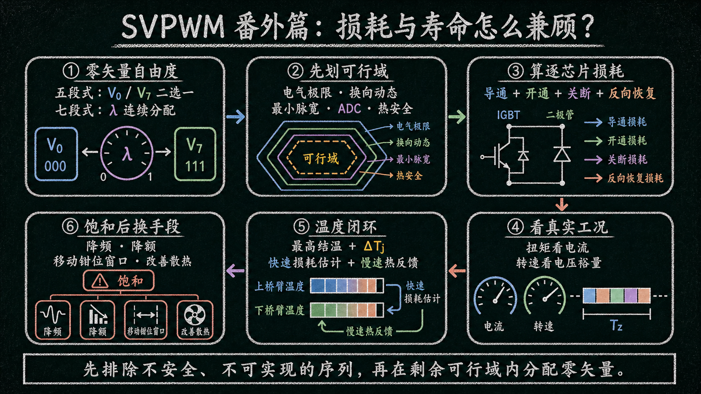
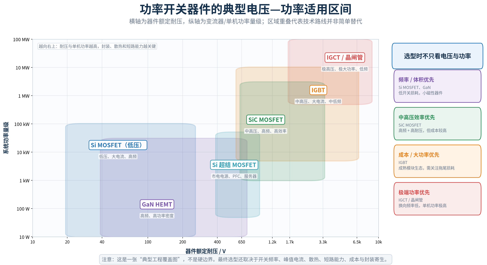
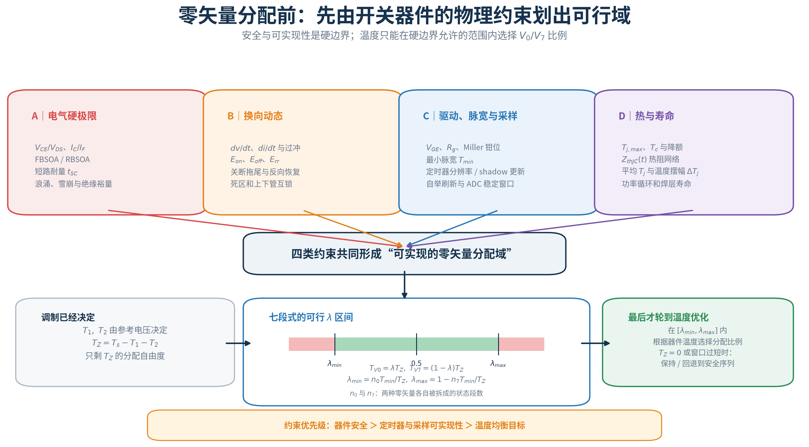
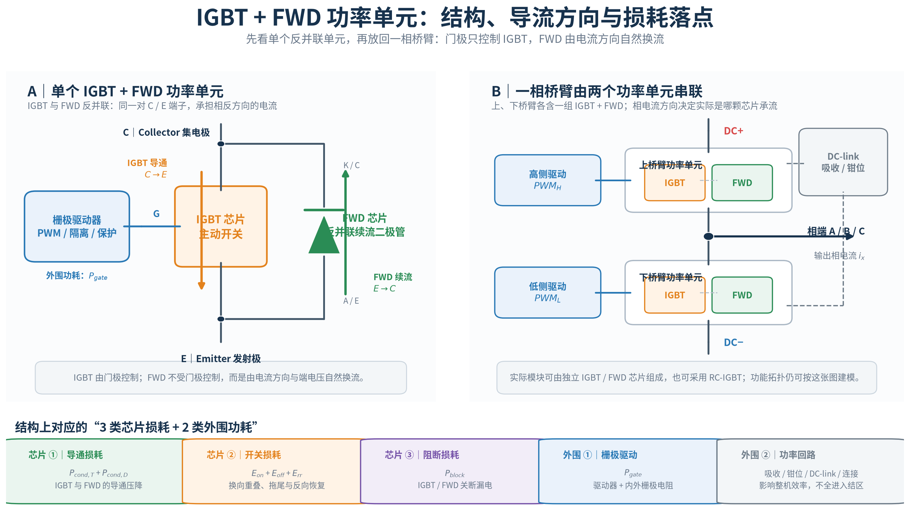
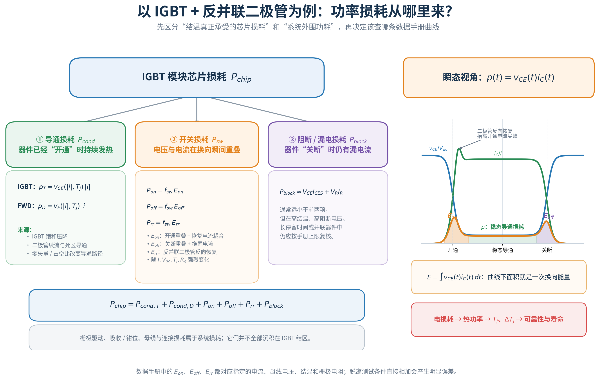
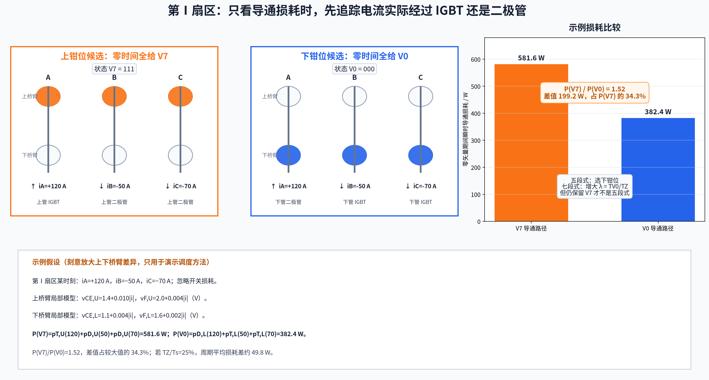
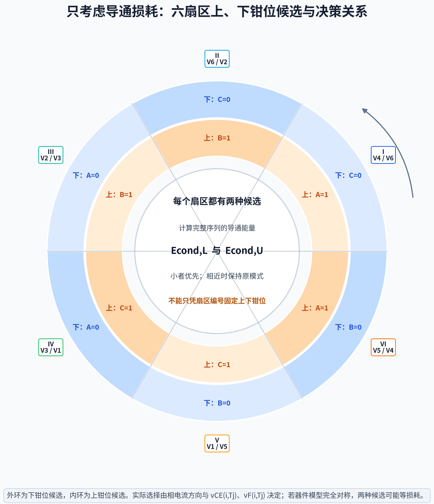
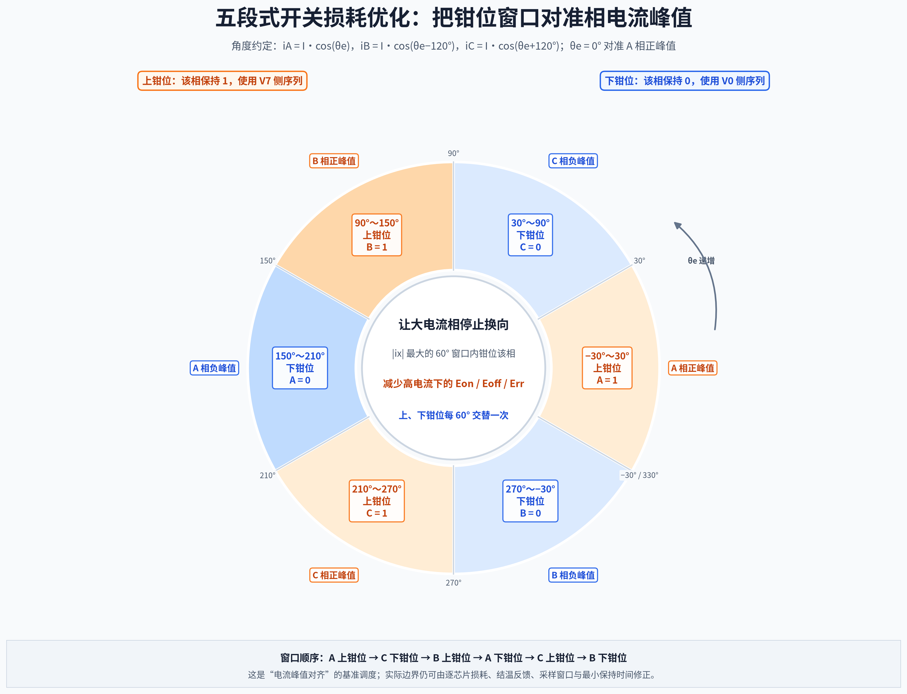
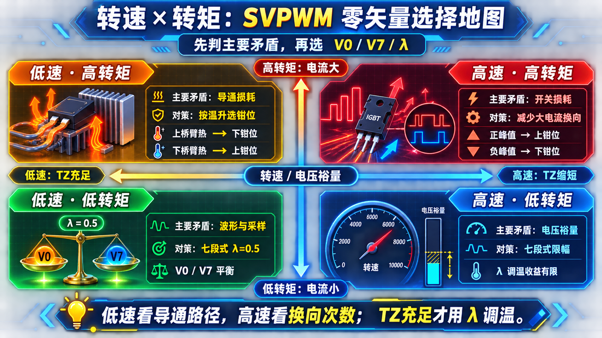
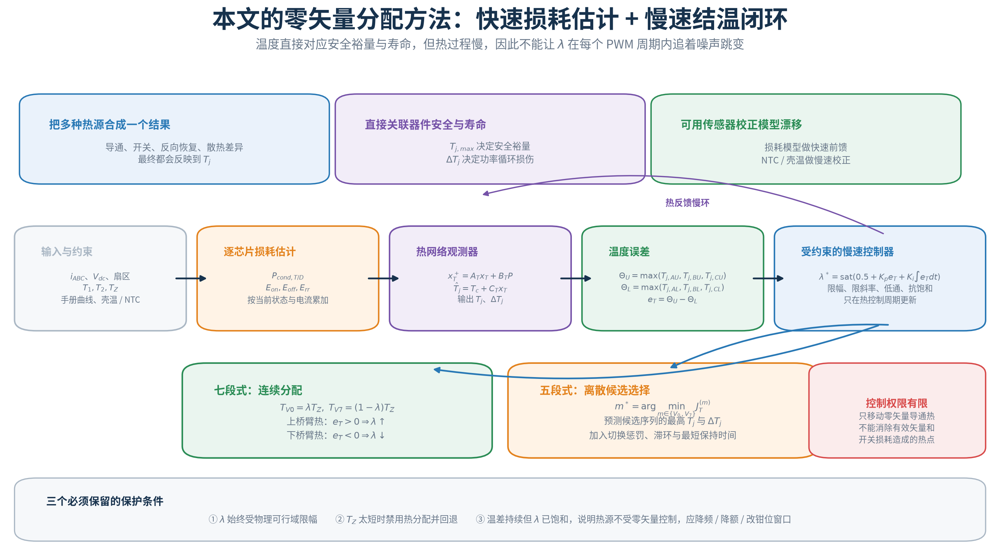

你好，我是老列 👋

在[SVPWM怎么落到PWM定时器？（下篇）开关序列、过调制与完整实现](/article/81724)里，我们已经把五段式、七段式和定时器比较值串了起来。但真正把算法放进变频器后，还会冒出两个不能靠“固定答案”解决的问题：

1. 五段式每个周期只用一个零矢量，究竟选上钳位还是下钳位？
2. 七段式同时使用 $\boldsymbol V_0$ 、 $\boldsymbol V_7$ ，总零矢量时间应该怎样分？

这两个问题表面上是在选序列，背后其实是在决定： **哪只 IGBT 或二极管承担导通，哪只器件在多大电流下完成开通与关断，以及这些损耗如何变成结温和寿命消耗** 。

🎯**先给结论** ：不存在脱离器件物理边界和温度状态的固定“最优钳位表”。本文先用电气安全、换向动态、驱动/最小脉宽、采样以及热安全约束划出零矢量分配的可行域，再把**结温与温度摆幅**选作分配目标：七段式在可行域内连续调节 $V_0/V_7$ 比例，五段式在上、下钳位候选之间离散选择。

---

## 00｜先把两个“不确定参数”摆上桌面

沿用下篇的统一符号： $T_1$ 表示当前扇区中状态字只有 1 个“1”的有效矢量总作用时间， $T_2$ 表示状态字有 2 个“1”的有效矢量总作用时间；下标 1、2 不对应物理矢量 $V_1$ 、 $V_2$ 的编号。

因此，总零矢量时间为：

$$
T_Z=T_s-T_1-T_2
$$

五段式在单个 PWM 周期内只能二选一：

$$
\begin{cases}
T_{V0}=T_Z,\quad T_{V7}=0 & \text{下钳位}\\
T_{V0}=0,\quad T_{V7}=T_Z & \text{上钳位}
\end{cases}
$$

七段式则可以引入零矢量分配系数 $\lambda$ ：

$$
T_{V0}=\lambda T_Z,\qquad T_{V7}=(1-\lambda)T_Z
$$

标准对称七段式取 $\lambda=0.5$ 。当 $\lambda\to1$ 时， $V_7$ 消失并退化为下钳位五段式；当 $\lambda\to0$ 时，则退化为上钳位五段式。

从平均电压看，这些选择完全等价，因为 $\boldsymbol V_0=\boldsymbol V_7=\boldsymbol 0$ ；但从器件看，它们却把电流送进了不同的 IGBT 和反并联二极管，带来了不同的损耗和温升。

## 01｜先认器件，再谈分配：技术版图与物理约束

第 00 章给出的只是数学自由度： $T_1$ 、 $T_2$ 决定 $T_Z$ ，而 $\lambda$ 或 $V_0/V_7$ 的选择决定零矢量怎样分。真正写进控制器前，还要依次回答两件事： **这只开关器件能不能安全完成该状态？这个序列能不能被驱动器、定时器和采样链路可靠实现** ？

### 01.1｜电压—功率版图只回答“器件能不能用”

同一套两电平 SVPWM 可以驱动不同的功率开关，但器件技术会决定损耗模型中哪一项最敏感。下图横轴使用**器件额定耐压** ，纵轴使用**变流器或单机的功率量级** ，给出几类常见功率开关的典型工程覆盖区间。

- **低压 Si MOSFET** ：适合低压、大电流和高频开关；导通损耗主要由 $I^2R_{DS(on)}$ 决定；
- **Si 超结 MOSFET 与 GaN HEMT** ：更偏向数百伏、高频、高功率密度电源，其中 GaN 对布局寄生和驱动回路尤其敏感；
- **SiC MOSFET** ：覆盖 650 V、1200 V、1700 V 等主流耐压等级，并已延伸到 3.3 kV，适合中高压、高频和高效率场景；
- **IGBT** ：600 V 至 6.5 kV 的模块生态成熟，在中高压、大电流和中低开关频率下仍很有竞争力，但要重点处理关断拖尾与二极管恢复损耗；
- **IGCT / 晶闸管** ：用于极高电压、极大功率且允许较低换向频率的场合。

🧩**这不是硬边界，也不是“新器件一定替代旧器件”的路线图** 。区域重叠处必须同时比较开关频率、峰值电流、散热、短路能力、成本、封装寄生和供应链。本文后续以 IGBT + 反并联二极管为例；若换成 Si/SiC MOSFET，还要把导通模型改为 $R_{DS(on)}$ 模型，并重新处理体二极管或第三象限导通。

### 01.2｜零矢量分配不能越过哪些物理约束？

器件版图只回答“选哪类器件”，并不等于任意 $V_0/V_7$ 比例都可执行。一个候选序列至少要同时通过下面四层约束。

1. **电气硬极限** ： $V_{CE}/V_{DS}$ 、 $I_C/I_F$ 、FBSOA/RBSOA、短路耐量、浪涌与绝缘裕量决定器件是否会立即进入危险区；这类条件具有否决权。
2. **换向动态** ： $dv/dt$ 、 $di/dt$ 、母线寄生引起的过冲、IGBT 关断拖尾、二极管反向恢复以及死区互锁，决定某次状态跳变是否安全，不能只看稳态导通压降。
3. **驱动、脉宽与采样** ： $V_{GE}$ 、 $R_g$ 、Miller 钳位、自举刷新、定时器分辨率、影子寄存器更新时间和 ADC 稳定窗口，共同给出最小合法状态片段 $T_{\min}$ 。
4. **热与寿命** ： $T_{j,\max}$ 、 $Z_{thJC}(t)$ 、平均结温、 $\Delta T_j$ 和功率循环寿命决定候选序列还能保留多少热裕量；越过上限时必须降额或停机，而不是继续调分配系数。

前三层先筛掉不安全或不可实现的序列；温度不能推翻它们，只能在剩余可行域中优化。

### 01.3｜物理约束怎样压缩 $\lambda$ 的可行区间？

七段式的数学分配仍写成：

$$
T_{V0}=\lambda T_Z,\qquad T_{V7}=(1-\lambda)T_Z
$$

但一个零矢量若在序列中被拆成多个片段，每个片段都必须不短于 $T_{\min}$ 。设 $V_0$ 、 $V_7$ 分别被拆成 $n_0$ 、 $n_7$ 段，则保留两种零矢量时：

$$
\lambda_{\min}=\frac{n_0T_{\min}}{T_Z},\qquad
\lambda_{\max}=1-\frac{n_7T_{\min}}{T_Z}
$$

因此控制器真正能使用的是：

$$
\lambda_{\min}\le\lambda\le\lambda_{\max},\qquad 0\le\lambda\le1
$$

这里的 $T_{\min}$ 应取驱动传播、死区、定时器量化、ADC 建立与自举刷新等要求综合后的最严格值；若还要约束共模电压或电流采样窗口，可继续收紧上下限。

⚠️

当 $T_Z=0$ 、 $\lambda_{\min}>\lambda_{\max}$ ，或任一候选违反安全工作区时，温度控制没有分配权限。此时应合并零宽度片段、保持上一安全模式，或退回经过验证的合法序列；不能为了“温度均衡”制造窄脉冲。

## 02｜IGBT 的损耗总账：先看全貌，再做第一层简化

一个常规 IGBT 功率单元通常由 IGBT 芯片与反并联快恢复二极管（FWD）共同完成换向。真正沉积在模块结区并形成温升的损耗，可以先分成**导通损耗、开关损耗和阻断漏电损耗**三类；栅极驱动、吸收钳位和母线连接损耗则属于系统外围功耗，不能全部算进 IGBT 结温。

### 02.0｜三类芯片损耗与两类外围功耗

在进入损耗公式前，先把 IGBT + FWD 功率单元的结构画清楚：IGBT 与 FWD 共用集电极 C、发射极 E 两个功率端子并反并联；门极 G 只控制 IGBT。IGBT 开通时承接 $C\rightarrow E$ 的主动电流，FWD 则在电流反向或换向续流时承接 $E\rightarrow C$ 的电流。

一相桥臂由上、下两个这样的功率单元串联。具体是哪颗 IGBT 或 FWD 承流，不只由门极状态决定，还取决于桥臂位置、相电流方向和换向过程。图中底部同时标出了三类芯片损耗与两类外围功耗在结构上的实际落点。

在此结构基础上，再把各项损耗按来源展开：

对一个 IGBT（绝缘栅双极晶体管） + FWD（**Free-Wheeling Diode，反并联续流二极管**） 功率单元，可先建立总账：

$$
P_{\mathrm{chip}}
=
P_{\mathrm{cond,T}}
+P_{\mathrm{cond,D}}
+P_{\mathrm{on}}
+P_{\mathrm{off}}
+P_{\mathrm{rr}}
+P_{\mathrm{block}}
$$

工程计算中，阻断漏电损耗往往较小，因此常简化为：

$$
P_{\mathrm{chip}}\approx P_{\mathrm{cond}}+P_{\mathrm{sw}}
$$

#### ① 导通损耗：器件已经开通，压降仍在持续发热

IGBT 和二极管的周期平均导通损耗分别为：

$$
P_{\mathrm{cond,T}}
=
\frac{1}{T_{\mathrm{obs}}}
\int_{\Omega_T}
v_{CE}(|i|,T_j)|i|\,dt
$$

$$
P_{\mathrm{cond,D}}
=
\frac{1}{T_{\mathrm{obs}}}
\int_{\Omega_D}
v_F(|i|,T_j)|i|\,dt
$$

其中， $\Omega_T$ 、 $\Omega_D$ 分别是观察时间内 IGBT 与二极管实际导通的区间。损耗来源不只是有效矢量期间的负载电流，还包括零矢量路径、死区续流和换向后的二极管导通。它主要受以下因素影响：

- 电流波形及其方向；
- $V_{CE(sat)}$ 、 $V_F$ 随电流和结温的变化；
- 调制度、功率因数以及每个状态的作用时间；
- 五段式的钳位选择，或七段式的 $V_0/V_7$ 分配。

#### ② 开关损耗：电压和电流在有限换向时间内重叠

每次开关事件的能量来自瞬时功率曲线下面积：

$$
E=\int v_{CE}(t)i_C(t)\,dt
$$

若一个观察窗口内存在多次不同电流下的换向，更通用的写法是：

$$
P_{\mathrm{sw}}
=
\frac{1}{T_{\mathrm{obs}}}
\sum_k
\left(E_{\mathrm{on},k}+E_{\mathrm{off},k}+E_{\mathrm{rr},k}\right)
$$

只有在每次换向条件近似相同时，才可简写为：

$$
P_{\mathrm{sw}}\approx f_{\mathrm{sw}}
\left(E_{\mathrm{on}}+E_{\mathrm{off}}+E_{\mathrm{rr}}\right)
$$

三项能量的物理来源不同：

- $E_{\mathrm{on}}$ ：IGBT 开通过程中 $v_{CE}$ 尚未完全下降而 $i_C$ 已经上升，两者重叠；对感性负载，配对二极管的反向恢复电流还会抬高开通电流尖峰；
- $E_{\mathrm{off}}$ ：IGBT 关断时电压上升、电流下降，并存在少数载流子造成的**拖尾电流** ，这是 IGBT 难以像 MOSFET 那样无限提高开关频率的重要原因；
- $E_{\mathrm{rr}}$ ：反并联二极管从正向导通转入反向阻断时，必须清除存储电荷，反向恢复电流在二极管内部产生损耗，也会反过来影响对侧 IGBT 的 $E_{\mathrm{on}}$ 。

数据手册中的 $E_{\mathrm{on}}$ 、 $E_{\mathrm{off}}$ 、 $E_{\mathrm{rr}}$ 都对应指定的 $I_C$ 、 $V_{dc}$ 、 $T_j$ 、 $R_g$ 和驱动电压。不能把某个测试点的 mJ 数值直接乘频率后用于所有工况，而应根据曲线、比例模型或双脉冲实测修正。

⚠️**反向恢复不要重复计数** 。数据手册的 $E_{\mathrm{on}}$ 通常已包含指定配对二极管恢复电流对 IGBT 开通波形的影响； $E_{\mathrm{rr}}$ 则表示二极管自身耗散。模块总损耗可以同时包含二者，但不能再额外叠加一次同一恢复电流造成的“修正损耗”。

#### ③ 阻断与漏电损耗：通常很小，但不等于永远可以忽略

关断期间仍存在 IGBT 漏电流 $I_{CES}$ 和二极管反向漏电流 $I_R$ ：

$$
P_{\mathrm{block}}
\approx
\left\langle V_{CE}I_{CES}\right\rangle
+
\left\langle V_RI_R\right\rangle
$$

在常规 PWM 逆变器中，这一项通常远小于导通和开关损耗；但高结温、高阻断电压、长关断停留时间或大量器件串并联时，仍应按数据手册上限复核。

#### ④ 栅极驱动与吸收回路：影响系统效率，但不全落在 IGBT 结区

栅极每次充放电所需的驱动功率可粗略估算为：

$$
P_{\mathrm{gate}}
\approx
Q_g\,\Delta V_{GE}\,f_{\mathrm{sw}}
$$

这部分能量主要耗散在驱动器输出级、外部栅极电阻和器件内部栅极电阻中；吸收电阻、钳位回路、母线电容 ESR 与连接电阻也会发热。它们必须计入整机效率与热设计，但不能不加区分地全部放进 $P_{\mathrm{chip}}$ ，否则会高估 IGBT 结温。

最终，电损耗通过瞬态热阻 $Z_{thJC}(t)$ 变成平均结温 $T_j$ 与温度摆幅 $\Delta T_j$ 。平均功耗接近，并不代表寿命相同：更集中的损耗脉冲、更频繁的模式切换，可能产生更大的 $\Delta T_j$ 和更快的功率循环损伤。

下面的 02.1～02.3 先只保留导通损耗，建立“第一层模型”；第 04 章再把 $E_{\mathrm{on}}$ 、 $E_{\mathrm{off}}$ 、 $E_{\mathrm{rr}}$ 加回来。

### 02.1｜零矢量相同，电流路径不同

约定 $i_x>0$ 表示电流从逆变器流向电机。对于常规 IGBT 加反并联二极管，零矢量期间的导通路径为：

| 零矢量 | $i_x>0$ | $i_x<0$ | 主要受热器件组 |
| --- | --- | --- | --- |
| $V_7=111$ | 上桥臂 IGBT | 上桥臂二极管 | 上桥臂器件 |
| $V_0=000$ | 下桥臂二极管 | 下桥臂 IGBT | 下桥臂器件 |

IGBT 和二极管的瞬时导通损耗可分别写成：

$$
p_T(i,T_j)=v_{CE}(|i|,T_j)|i|
$$

$$
p_D(i,T_j)=v_F(|i|,T_j)|i|
$$

这里不能把“门极状态为 1”等同于“IGBT 一定导通”。相电流为负时，即使桥臂被置为 1，电流也可能流过上桥臂反并联二极管。

### 02.2｜第Ⅰ扇区示例：先算 $P_{V0}$ 、 $P_{V7}$ ，再做选择

第Ⅰ扇区的上、下钳位五段式都包含相同总时长的 $V_4$ 、 $V_6$ ，因此只考虑导通损耗时，两种候选的有效矢量导通能量相同；真正需要比较的是剩余 $T_Z$ 全部分给 $V_0$ 还是 $V_7$ 。

下面仍只演示计算方法。为了让 $V_0/V_7$ 分配的作用足够直观，这里刻意设置一个上下桥臂导通特性差异较明显的工况；可把它理解为结温、器件参数离散与散热不对称共同作用后，在当前工作点附近得到的等效线性化模型。

假设第Ⅰ扇区某时刻：

$$
i_A=120\text{ A},\qquad i_B=-50\text{ A},\qquad i_C=-70\text{ A}
$$

上、下桥臂分别采用下面的演示模型：

$$
v_{CE,U}=1.4+0.010|i|,\qquad v_{F,U}=2.0+0.004|i|\quad(\text{V})
$$

$$
v_{CE,L}=1.1+0.004|i|,\qquad v_{F,L}=1.6+0.002|i|\quad(\text{V})
$$

其中下标 $U$ 、 $L$ 分别表示上、下桥臂器件组。于是：

$$
\begin{aligned}
P_{V7}
&=p_{T,U}(120)+p_{D,U}(50)+p_{D,U}(70)\\
&=(2.60)(120)+(2.20)(50)+(2.28)(70)\\
&=581.6\text{ W}
\end{aligned}
$$

$$
\begin{aligned}
P_{V0}
&=p_{D,L}(120)+p_{T,L}(50)+p_{T,L}(70)\\
&=(1.84)(120)+(1.30)(50)+(1.38)(70)\\
&=382.4\text{ W}
\end{aligned}
$$

这个演示工况中：

$$
\frac{P_{V7}}{P_{V0}}=1.52,\qquad
\frac{P_{V7}-P_{V0}}{P_{V7}}=34.3\%,\qquad
\frac{P_{V7}-P_{V0}}{P_{V0}}=52.1\%
$$

也就是说，即使以较大的 $P_{V7}$ 为基准，两者差值也超过 $1/3$ 。因此：

- 五段式若只看导通损耗，应选择下钳位，把全部 $T_Z$ 分给 $V_0$ ；
- 七段式可以令 $\lambda>0.5$ ，增加 $V_0$ 的比例，但仍需满足第 01.3 节给出的可行区间；
- 若 $T_Z/T_s=25\%$ ，两种极端分配造成的周期平均导通损耗差约为 $0.25\times(581.6-382.4)=49.8\text{ W}$ 。

⚠️

这组参数是为了清楚展示调度效果而刻意构造的强不对称 demo，不代表常规模块天然就会相差 $1/3$ 。实际项目必须换成目标 IGBT/FWD 在对应 $I$ 、 $T_j$ 下的数据手册曲线或实测查表，并在第 04 章的完整模型中重新计入有效矢量与开关损耗。

### 02.3｜六个扇区：每区都有两个候选，而不是一张固定答案表

| 扇区 | 下钳位候选 | 钳位相 | 上钳位候选 | 钳位相 |
| --- | --- | --- | --- | --- |
| Ⅰ | $V_0\to V_4\to V_6\to V_4\to V_0$ | C=0 | $V_7\to V_6\to V_4\to V_6\to V_7$ | A=1 |
| Ⅱ | $V_0\to V_2\to V_6\to V_2\to V_0$ | C=0 | $V_7\to V_6\to V_2\to V_6\to V_7$ | B=1 |
| Ⅲ | $V_0\to V_2\to V_3\to V_2\to V_0$ | A=0 | $V_7\to V_3\to V_2\to V_3\to V_7$ | B=1 |
| Ⅳ | $V_0\to V_1\to V_3\to V_1\to V_0$ | A=0 | $V_7\to V_3\to V_1\to V_3\to V_7$ | C=1 |
| Ⅴ | $V_0\to V_1\to V_5\to V_1\to V_0$ | B=0 | $V_7\to V_5\to V_1\to V_5\to V_7$ | C=1 |
| Ⅵ | $V_0\to V_4\to V_5\to V_4\to V_0$ | B=0 | $V_7\to V_5\to V_4\to V_5\to V_7$ | A=1 |

对任意候选序列 $m\in\{L,U\}$ ，应按实际作用时间积分完整导通能量：

$$
E_{cond}^{(m)}
=
\sum_k T_k
\sum_{x\in\{A,B,C\}}
p_x\!\left(V_k,i_x,T_j\right)
$$

然后选择较小者；若差值落在滞环内，则保持上一种模式，避免在边界附近来回抖动。

## 03｜只看导通损耗，已经能解释五段式与七段式的一部分差别

五段式把全部零矢量时间交给一侧，导通路径选择能力最强；七段式保留两种零矢量，三相开关动作和共模分布更均衡，但零矢量损耗只能在两侧之间做有限偏置。

| 比较项 | 五段式 | 七段式 |
| --- | --- | --- |
| 零矢量自由度 | 每周期二选一 | $0<\lambda<1$ 连续分配 |
| 导通损耗调节能力 | 强，但变化离散 | 可平滑偏置，但能力有限 |
| 开关次数 | 4 次状态跳变 | 6 次状态跳变 |
| 相钳位 | 一个桥臂整周期不切换 | 通常没有整周期钳位相 |
| 差模电流纹波 | 同频率下部分工况较大 | 通常更均匀 |
| 模式切换 | 必须管理钳位相和零矢量 | 标准序列表更统一 |

需要澄清：“五段式不对称”主要指**三相桥臂活动次数和两个零矢量的使用不对称** 。五段式本身仍然可以做成时间轴上的镜像序列，并不是说它一定前后不对称。

## 04｜第二层模型：把 IGBT 开关损耗加回来

实际 IGBT 的总损耗至少包括：

$$
P_{loss}=P_{cond}+P_{on}+P_{off}+P_{rr}
$$

开关损耗可按每次事件累加：

$$
P_{sw}
=f_{sw}\sum
\left[
E_{on}(I,V_{dc},T_j,R_g)
+E_{off}(I,V_{dc},T_j,R_g)
+E_{rr}(I,V_{dc},T_j,R_g)
\right]
$$

### 04.1｜五段式：关键变成“钳位哪一相”

第Ⅰ扇区下钳位时 C 相不切换，上钳位时 A 相不切换。因此，如果开关损耗占主导：

- $|i_C|$ 较大时，下钳位通常更能节省开关能量；
- $|i_A|$ 较大时，上钳位通常更有利；
- 若某只 A 相上管因为开关损耗过热，上钳位让 A 桥臂停止换向，反而可能比“多用下钳位”更有效；
- 若 A 相上管主要因为持续导通而热，上钳位又可能使问题加重。

若以 A 相正电流峰值为 $\theta_e=0^\circ$ ，并采用

$$
i_A=I\cos\theta_e,\qquad
i_B=I\cos(\theta_e-120^\circ),\qquad
i_C=I\cos(\theta_e+120^\circ)
$$

则可以把每个 60° 钳位窗口对准三相电流的正、负峰值：正峰值附近采用上钳位，使对应相保持 1；负峰值附近采用下钳位，使对应相保持 0。这样能让当前 $|i_x|$ 最大的桥臂停止换向，优先减少高电流下的 $E_{\mathrm{on}}$ 、 $E_{\mathrm{off}}$ 与 $E_{\mathrm{rr}}$ 。

图中的窗口顺序为： $-30^\circ\!\sim30^\circ$ 上钳位 A 相， $30^\circ\!\sim90^\circ$ 下钳位 C 相， $90^\circ\!\sim150^\circ$ 上钳位 B 相， $150^\circ\!\sim210^\circ$ 下钳位 A 相， $210^\circ\!\sim270^\circ$ 上钳位 C 相， $270^\circ\!\sim-30^\circ$ 下钳位 B 相。

🧭这是一张以“电流峰值对齐”为目标的基准调度图，不是脱离器件状态的固定最优表。实际边界仍可由逐芯片损耗、结温反馈、ADC 采样窗口、滞环与最短保持时间修正。

所以，“上桥臂热，多用下钳位”只适用于**上桥臂整体温升主要由零矢量导通损耗造成**的情况。考虑开关损耗后，必须比较：

$$
\Delta P_{total}
=-\Delta P_{sw}+\Delta P_{cond}
$$

### 04.2｜七段式： $\lambda$ 主要移动导通损耗，不会凭空省掉开关事件

只要 $0<\lambda<1$ ，标准七段式的状态路径没有改变，每个桥臂仍完成一次开通和一次关断。调整 $\lambda$ 会改变 $V_0$ 、 $V_7$ 的停留时间，却基本不改变换向次数；由于一个 PWM 周期内相电流变化很小，开关损耗的一阶变化通常也很小。

因此，七段式可以根据相电流方向与器件温度调节 $\lambda$ ，但主要目的是：

- 移动零矢量导通损耗；
- 平衡上、下桥臂结温；
- 调整共模电压和采样窗口。

若为了省开关损耗把 $\lambda$ 推到 0 或 1，使某一零矢量消失，那已经进入五段式。

### 04.3｜IGBT 不平衡时，不同热源对应不同动作

| 观察到的问题 | 更可能的热源 | 优先动作 |
| --- | --- | --- |
| 三个上桥臂整体偏热 | 零矢量导通分配或散热偏差 | 七段式增加 $V_0$ ；五段式提高下钳位使用比例，并用损耗模型复核 |
| 某一相桥臂在大电流区偏热 | 开关损耗 | 把该相的钳位窗口移到电流峰值附近 |
| 某只上管因开关损耗偏热 | $E_{on}/E_{off}/E_{rr}$ 较大 | 优先让该桥臂停止换向；不应机械地排斥上钳位 |
| 某组二极管偏热 | 续流与反向恢复 | 结合电流符号改变零矢量路径，并复核死区和同步导通策略 |
| 平均温度不高但寿命消耗快 | $\Delta T_j$ 与热循环过大 | 降低模式切换频率、平滑损耗分配，优先减小温度摆幅 |

## 05｜把损耗策略放回真实工况：扭矩看电流，转速看电压裕量

对永磁同步电机，转矩主要与 $q$ 轴电流相关：

$$
T_e\propto i_q
$$

电流增大后，导通损耗与开关能量都会上升。粗略地说：

$$
P_{cond}\sim v_{CE}(I)I
$$

$$
P_{sw}\sim f_{sw}E_{sw}(I,V_{dc},T_j)
$$

转速升高时，反电动势增大，电流环需要更高电压，调制度上升， $T_Z$ 逐渐缩短。于是：

- **低速、大转矩** ：电流大、 $T_Z$ 往往较充足，零矢量导通路径和器件压降值得精算；
- **高速、大转矩** ：电流和换向能量都高，开关损耗常成为主导，五段式或混合 DPWM 更有价值；
- **高速、弱磁** ： $T_Z$ 很短甚至为 0，靠分配 $V_0/V_7$ 调温的余地本来就很小，重点转向过调制、限幅和开关频率；
- **低转矩** ：电流较小，损耗差异可能不足以抵消复杂策略带来的共模、采样和切换代价，标准七段式通常更稳妥。

| 工况 | 主要矛盾 | 推荐起点 |
| --- | --- | --- |
| 低速、低转矩 | 波形质量、噪声、采样稳定 | 七段式， $\lambda=0.5$ |
| 低速、高转矩 | 导通损耗、二极管路径、温升 | 按数据手册比较 $V_0/V_7$ 路径，谨慎偏置或钳位 |
| 高速、低转矩 | 电压裕量、过调制 | 七段式或常规限幅，收益不足时不做复杂热优化 |
| 高速、高转矩 | 开关损耗、结温峰值 | 考虑五段式/混合 DPWM，并把钳位窗口对准大电流区 |

🧭转速本身不会直接产生开关损耗；它通过反电动势、所需电压和调制度改变矢量时间。真正决定单次开关能量的仍是换向电流、母线电压、结温、门极电阻与器件特性。

## 06｜怎样从 IGBT 数据手册得到分配规则？

至少要读取以下曲线或参数：

1. $V_{CE(sat)}$ 与 $I_C$ 、 $T_j$ 的关系；
2. 二极管 $V_F$ 与 $I_F$ 、 $T_j$ 的关系；
3. $E_{on}$ 、 $E_{off}$ 、 $E_{rr}$ 与电流、母线电压、结温、门极电阻的关系；
4. $R_{thJC}$ 与瞬态热阻 $Z_{thJC}(t)$ ；
5. 最大允许结温、短路能力与安全工作区；
6. 若厂家提供，读取功率循环寿命曲线或 $\Delta T_j$—循环次数数据。

计算流程可以统一为：

1. 根据 $U_\alpha,U_\beta$ 和三相电流得到当前扇区，将局部两矢量作用时间映射为 $T_1,T_2$ ，再计算 $T_Z$ ；
2. 枚举上钳位、下钳位或不同 $\lambda$ ；
3. 对每个状态按电流方向判断实际导通的 IGBT/二极管；
4. 对导通区间积分 $v(i,T)i$ ，对每次换向累加 $E_{on},E_{off},E_{rr}$ ；
5. 通过热网络估算每只芯片的 $T_j$ 与 $\Delta T_j$ ；
6. 选择最高结温、温度摆幅和累计寿命损伤更小的候选。

第 01～06 章已经建立了“物理可行域 → 逐芯片损耗 → 热网络”的链条。下一步不是再找一张固定序列表，而是明确本文的优化变量与闭环目标。

## 07｜本文的方法：用结温闭环分配零矢量

### 07.1｜为什么本文选温度，而不是只看瞬时损耗？

零矢量分配可以服务于损耗、共模电压、电流纹波、采样窗口等不同目标。本文把**结温与温度摆幅**作为主目标，同时把其他指标保留为约束，原因如下。

| 指标 | 优点 | 不适合单独作为本文目标的原因 |
| --- | --- | --- |
| 瞬时/周期损耗 | 响应快，适合前馈比较 | 对手册插值和参数误差敏感，不能直接反映热惯性、散热不一致与历史累积 |
| 共模电压、电流纹波 | 直接描述波形质量 | 不等价于某只 IGBT/FWD 的热点与寿命消耗 |
| ADC 采样窗口、最小脉宽 | 能保证控制链可实现 | 属于必须满足的边界，而不是热优化目标 |
| $T_j$ 、 $\Delta T_j$ | 汇总导通、开关、恢复与散热差异，直接对应安全裕量和功率循环 | 热过程慢，必须依赖观测器、滤波与较慢的闭环 |

因此，本文采用**快速损耗估计 + 慢速结温反馈** ：损耗模型负责预测候选动作的短期后果，热模型与温度传感器负责纠偏和积累历史。

### 07.2｜先估每只芯片的损耗，再通过热网络得到结温

对六只 IGBT 与六只 FWD 分别累加导通、开通、关断和反向恢复损耗，得到逐芯片功率向量 $P(k)$ 。一个离散热网络可写成：

$$
x_T(k+1)=A_Tx_T(k)+B_TP(k)
$$

$$
\hat T_j(k)=T_c(k)+C_Tx_T(k)
$$

其中， $T_c$ 可由壳温、底板温度或 NTC 测量提供， $x_T$ 描述多时间常数热阻—热容网络。损耗查表给出快速前馈，温度传感器缓慢修正模型偏差。

为先平衡上、下桥臂的最热点，定义：

$$
\Theta_U=\max\!\left(T_{j,AU},T_{j,BU},T_{j,CU}\right)
$$

$$
\Theta_L=\max\!\left(T_{j,AL},T_{j,BL},T_{j,CL}\right)
$$

$$
e_T=\Theta_U-\Theta_L
$$

用最大值而不是平均值，是为了避免“其余器件很凉”掩盖一只已经逼近 $T_{j,\max}$ 的热点。

### 07.3｜七段式：在物理可行域内连续调节 $\lambda$

温度控制器可以写成：

$$
\lambda^*
=
\operatorname{sat}
\!\left(
0.5+K_pe_T+K_i\int e_Tdt,
\lambda_{\min},\lambda_{\max}
\right)
$$

在本文的符号约定下：

- $e_T>0$ ：上桥臂最热点更高，令 $\lambda\uparrow$ ，增加 $V_0$ ，把更多零矢量导通热移向下桥臂器件组；
- $e_T<0$ ：下桥臂最热点更高，令 $\lambda\downarrow$ ，增加 $V_7$ ，把更多零矢量导通热移向上桥臂器件组。

$\lambda$ 不能每个 PWM 周期追随温度噪声。实现时必须加入低通、限斜率、抗积分饱和和远慢于载波的热控制更新周期；快速电流与损耗估计只作为前馈。

### 07.4｜五段式：在 $V_0/V_7$ 两个候选间做离散热决策

五段式没有连续 $\lambda$ ，可预测两条完整候选序列的热代价：

$$
J_T^{(m)}
=
w_T\max_j\hat T_j^{(m)}
+w_{\Delta}\max_j\Delta\hat T_j^{(m)}
$$

$$
m^*
=
\arg\min_{m\in\{V_0,V_7\}}
\left[
J_T^{(m)}+\rho_{\mathrm{chg}}\mathbf 1\!\left(m\ne m_{k-1}\right)
\right]
$$

这里必须预测**完整序列** ：既包括 $T_Z$ 期间的零矢量导通热，也包括有效矢量导通和各次 $E_{\mathrm{on/off/rr}}$ 。切换惩罚、滞环和最短保持时间用于防止上、下钳位在边界附近来回跳变。

### 07.5｜温度闭环的权限有限，饱和后必须换手段

🛡️

调节 $\lambda$ 主要移动**零矢量导通热** ，不能消除有效矢量导通与开关损耗造成的热点。若温差持续存在而 $\lambda$ 已饱和，控制器应停止积分，并转向降开关频率、降额、移动五段式钳位窗口或改善散热；独立的过流、短路和过温保护始终拥有更高优先级。

当 $T_Z$ 太短、可行区间为空、ADC 窗口不足或驱动供电需要刷新时，应冻结热分配并回退到安全序列。这样，温度是可行域内的优化目标，而不是覆盖器件安全逻辑的第二套保护。

## 08｜五段式切换上、下钳位时，软件和外设要一起换挡

### 08.1｜中断触发时机

中心对齐 PWM 可以在计数器谷值、峰值或两者之一触发控制中断。选定后应固定计算预算，确保扇区、作用时间、钳位模式和 ADC 触发点在锁存前全部计算完成。

### 08.2｜影子寄存器更新点

三相 CMP 必须先写入影子寄存器，再在同一个定时器更新事件中同步装载。若 A、B、C 三相分批生效，会短暂形成未定义矢量。

### 08.3｜ADC 同步采样时序

上、下钳位切换会改变有效矢量位置、稳定采样窗口和母线单电阻可观测区间。ADC 触发点不能固定照搬，应根据新序列重新放到：

- 远离开关沿与死区；
- 持续时间大于采样保持时间；
- 三相电流能够可靠重构的矢量片段中。

### 08.4｜避免 $000\leftrightarrow111$ 直接跳变

下钳位序列常以 $V_0$ 首尾闭合，上钳位则以 $V_7$ 首尾闭合。直接换模式可能让三个桥臂同时翻转。常用办法包括：

- 把模式锁定一个扇区、一个电周期或若干电周期；
- 通过共同有效矢量完成衔接；
- 在切换期间短暂插入一至数个七段式周期，让 $\lambda$ 从 1 平滑过渡到 0；
- 合并零宽度片段，并设置最小导通/关断时间；
- 对钳位判据加入滞环，避免边界抖动。

### 08.5｜别忘了驱动器约束

若高侧采用自举供电，长时间上钳位必须确认自举电容有刷新机会；还要统一考虑死区、互锁、故障封锁与过流关断。所谓“相钳位”始终是让一个桥臂保持合法的 0 或 1，绝不是让上下管同时导通。

## 09｜番外篇小结：先划可行域，再用温度闭环做分配

1. **先找数学自由度** ： $T_1$ 、 $T_2$ 决定 $T_Z$ ；七段式用 $\lambda$ 连续分配，五段式在 $V_0/V_7$ 间二选一。
2. **再划物理可行域** ：电压、电流、安全工作区、换向动态、最小脉宽、采样与驱动供电都比温度均衡优先。
3. **本文选择温度作为主目标** ：快速损耗模型预测短期后果，慢速热观测器以最高结温和 $\Delta T_j$ 修正分配。
4. **七段式连续调节** ：只在 $\lambda_{\min}\le\lambda\le\lambda_{\max}$ 且 $0\le\lambda\le1$ 的可行区间内移动零矢量导通热，并保留限斜率和抗积分饱和。
5. **五段式离散选择** ：比较两条完整序列的热代价，同时加入切换惩罚、滞环与最短保持时间。
6. **承认控制权限有限** ：若 $T_Z$ 太短或 $\lambda$ 饱和后热点仍存在，应降频、降额、移动钳位窗口或改善散热，并同步复核 CMP、ADC、死区和驱动供电。

> **本文的主线可以压缩成一句话：先用开关器件的物理约束排除“不安全、不可实现”的序列，再用逐芯片损耗与慢速结温闭环，在剩余可行域内分配零矢量** 。
>
> 关联阅读：[SVPWM怎么落到PWM定时器？（下篇）开关序列、过调制与完整实现](/article/81724)

### 💬 老列碎碎念

这一篇最容易让人误会的地方，是把“上桥臂热”直接等同于“多用下钳位”，或者看到五段式少两次跳变，就认定它在所有工况下都更省损耗。真正需要比较的不是一个孤立的零矢量，而是完整序列里每只 IGBT 和二极管的导通路径、换向电流以及热历史。先划出安全可行域，再谈哪个候选更优，顺序不能反。

从控制器的视角看，零矢量分配更像是在有限权限里搬运热量：七段式用 $\lambda$ 在上下桥臂之间连续挪动零矢量导通热，五段式则通过钳位某一相，直接避开大电流区的部分开关事件。但它们都不能凭空消灭损耗；当 $T_Z$ 太短、温度控制饱和或者采样窗口不够时，就该把接力棒交给降频、降额、钳位窗口调整和散热设计。

你在实际项目里遇到过哪一种更棘手：六只 IGBT 的平均温度不均，还是平均温度不高、某只器件的 $\Delta T_j$ 却特别大？评论区聊聊。觉得这篇把“序列—损耗—结温—寿命”的链条接起来了，老规矩， **点赞、在看、转发** 三连伺候，老列给你比个心。

  <strong>如果觉得这篇文章对你有帮助，</strong> 
  <strong>别忘了点赞、在看、分享三连哦！</strong>  
  👇👇👇

---

> 推荐关注公众号「探物及理」，探万物之然，及万理之源。
>
> 
